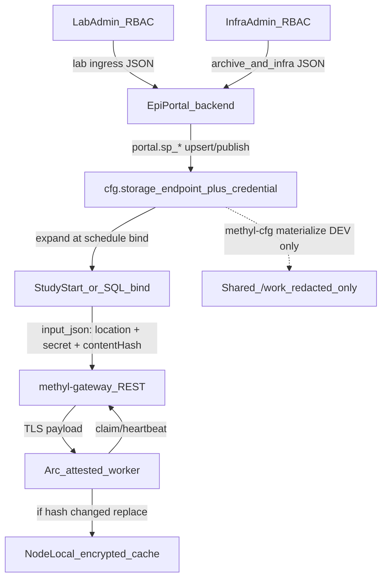

# Storage accounts: DB source of truth, dumb workers

## Problem (current inversion)

Today production docs prefer Key Vault refs + `methyl-cfg upsert credential`, workers never see DB as SoT, and [`storage_expand.py`](../../workflow_engine/cfg/storage_expand.py) may embed plaintext or vault refs into tasks. Shared `/work` must not hold long-lived cloud keys. Gateway is SQL-free on the **worker** side but instance planning already uses DB ([`component-boundaries.md`](../architecture/component-boundaries.md)).

Your constraints lock the design:

| Constraint | Implication |
|------------|-------------|
| **All storage information** is admin-managed (lab admins and/or infrastructure admins; RBAC assigns which) | No non-admin authoring of storage locations or credentials—including lab ingress, long-term archive, and shared-storage accounts |
| Production write path = EpiPortal → DB only | `portal.sp_*` upsert/publish; CLI = CI/dev/bootstrap only |
| Portal lives in another repo; edits JSON validated by schemas | MethylPipeline ships **schemas + `portal.sp_*` contracts**, not UI |
| Workers never touch SQL | Credential delivery only via gateway claim/`input_json` |
| Prefer dumb workers without Azure | No worker Key Vault / MI dependency |
| Shared storage secret cache is hard | **Do not** store decryptable secrets on `/work`; use **node-local** encrypted cache |
| Dev needs DB ↔ JSON ↔ repo sync | Keep `methyl-cfg` / materialize for **dev/bootstrap only** |
| Arc limits gateway clients | Make Arc attestation required in prod docs + default for worker auth |

**RBAC (EpiPortal, documented for the other repo):**

| Role | Storage rights |
|------|----------------|
| **Lab admin** | Lab ingress endpoints/credentials for that lab’s sample sources |
| **Infrastructure admin** | Platform long-term retention / archive endpoints, site-wide shared storage, and cross-lab infrastructure storage |
| **Other portal users** | Select among **already published** endpoints when starting studies (redacted list); **no** create/update/delete of storage accounts or secrets |

HPC cluster definition (compute registration) remains separate from storage SoT; any storage mounts or cloud accounts attached to a cluster are still written only by the admin roles above.

## Target architecture

**Production SoT:** `cfg.storage_endpoint` + `cfg.credential` (versioned, published). All of lab ingress, long-term archive, and shared/infra storage accounts live in this model—authored only by lab or infrastructure admins. Fold archive defaults today in [`portal.resource_profile`](../../workflow_engine/sql_mssql/portal_resource_profile.sql) into the same `cfg` kinds so one admin model covers every storage kind.

**Key Vault:** demote to optional site-specific escape hatch (not the default dumb-worker path). Worker-default = secrets arriving in task JSON over TLS + node-local Fernet cache.

## 1. Contracts for EpiPortal (this repo)

- Treat [`schemas/domain/storage_location.schema.json`](../../schemas/domain/storage_location.schema.json) as the **write/validate** schema portal uses for location + credentials. Optional endpoint metadata fields (e.g. `scope`: `lab_ingress` | `archive` | `shared`) help portal RBAC filter which admin role may mutate which rows—enforcement remains in EpiPortal/DB roles.
- Add portal-facing docs: full admin CRUD for **all** storage kinds; non-admin users get **read/select of published redacted endpoints** only.
- New SQL procs (MSSQL + PG parity), e.g.:
  - `portal.sp_list_storage_endpoints` — locations + `credentialName` + status; **never** return secret bodies
  - `portal.sp_get_storage_endpoint`
  - `portal.sp_upsert_storage_endpoint` / `portal.sp_publish_storage_endpoint`
  - `portal.sp_upsert_credential` / `portal.sp_publish_credential` — accept full `secret_json` write; get/list return redacted `{authMode, provider, contentHash, version}` only
  - `portal.sp_list_credentials` redacted
- RBAC contract for EpiPortal: **lab admin** and **infrastructure admin** are the only principals that may upsert/publish endpoints and credentials (scoped by role); study operators may list/select published redacted endpoints when binding a study—never invent or edit storage accounts.
- Deprecate production use of CLI upsert in [`docs/usage/19-config-registry.qmd`](../usage/19-config-registry.qmd) and [`docs/deployment/portal_resource_profile.md`](../deployment/portal_resource_profile.md): **CLI = CI/dev/bootstrap**; production = portal procs.

## 2. Schedule-time expansion (still not workers)

Keep workers SQL-free. Credential expansion stays on the **privileged path** that already touches DB (study start / instance finalize / SQL template bind), not on worker claim enrichment:

- Extend expand result so every cloud location in task `input_json` includes stable change tokens: `credentialName`, `credentialVersion`, `contentHash` (from [`cfg.credential.content_hash`](../../workflow_engine/sql_pg/cfg_registry_tables.sql)).
- Production expand embeds concrete auth fields for transfer (`explicit_keys`, `account_key`, …) **only** in task payloads over TLS—not into `/work` materialize files.
- [`materialize`](../../workflow_engine/cfg/store.py) → `/work/site/storage_endpoints/*.json` remains **redacted** (authMode / endpoint metadata only)—already tested in [`test_cfg_registry.py`](../../workflow_engine/tests/test_cfg_registry.py).
- Unify archive: study start resolves `sampleStorage` from published `cfg` endpoints (or storage_profile) rather than plaintext-only `portal.resource_profile` updates; migrate seed profile to reference named endpoints.

## 3. Dumb worker: receive, compare, cache (no Azure, no SQL)

In [`cloud_transfer.py`](../../workers/methyl_worker/cloud_transfer.py) / [`storage_secrets.py`](../../packages/methyldomain/methyl_domain/storage_secrets.py):

- On transfer: read credentials from task payload.
- Compare `contentHash` (or version) to node-local cache under `/var/lib/methyl/storage-credentials/` (or `/etc/methyl/…`), **not** under `/work`.
- If hash differs → replace Fernet-encrypted cache (existing [`encrypted_file`](../../packages/methyldomain/methyl_domain/storage_secrets.py) machinery + host wrap key from `/etc/methyl/storage-credential.key` mode 600, analogous to [`worker-token`](../../workers/WORKER_PROTOCOL.md)).
- If hash matches → may use cache or payload (prefer payload for simplicity; cache is for restart/offline reuse and audit of “last known”).
- Remove dumb-worker dependency on `azure_key_vault` as the **primary** production mode; keep code path for sites that deliberately use Azure, but document it as non-default.

**Why not shared `/work` for secrets:** any lab/worker mount can read peer secrets. Shared storage holds only redacted endpoint JSON + sample science data.

## 4. Gateway / Arc boundary

- Workers continue: poll/claim/submit only ([`WorkflowRestClient`](../../workers/methyl_worker/client.py) + `X-Arc-Resource-Id`).
- Production runbook: `GATEWAY_REQUIRE_ARC_ATTEST=1`; Arc enrolled VMs only ([`docs/deployment/arc_worker_runbook.md`](../deployment/arc_worker_runbook.md)).
- No new worker SQL or “sync secrets from DB” OpenAPI—change detection is **payload hash vs local cache**, as you specified.
- Optionally add gateway middleware audit: do not log credential bodies from `input_json`.

## 5. Dev vs production dual path

| Mode | Authoring | Sync | Workers |
|------|-----------|------|---------|
| **Development** | `methyl-cfg import-fs` / upsert + repo schemas | materialize redacted endpoints + profiles to `/work`; Python in git | Local/stub; may use `encrypted_file` or explicit keys in fixtures |
| **Production** | EpiPortal → `portal.sp_*` → `cfg.*` | No secret materialize; DB is SoT | Arc → gateway → task JSON + node-local cache |

Bootstrap once may seed DB from JSON; after cutover, reverse sync (DB → filesystem secrets) is **forbidden**.

## 6. Docs / regulatory touchpoints

Update architecture + controls language so it matches this model (without regulatory overclaim):

- [`docs/architecture/config-registry.md`](../architecture/config-registry.md) — invert “prefer Key Vault as SoT”; DB + portal Admin authoring; vault optional
- [`docs/deployment/portal_resource_profile.md`](../deployment/portal_resource_profile.md) — portal procs, migrate to cfg endpoints
- [`workflow_engine/contract/sample_prep_capabilities.md`](../../workflow_engine/contract/sample_prep_capabilities.md)
- [`docs/regulatory/methylpipeline-product-and-operational-controls.md`](../regulatory/methylpipeline-product-and-operational-controls.md) — configuration layer for storage SoT + Arc worker boundary
- Promote plan to [`docs/plans/`](../plans/) under Feature AB#413 when approved

## 7. Tests

- Portal proc / store tests: upsert secret, list redacts, publish version bumps `content_hash`
- Expand includes hash/version; materialize still redacts
- Worker unit tests: hash change updates node-local cache; same hash no rewrite; never write under `/work`
- Gateway/client: Arc header still sent; no secret logging helpers

## Explicit non-goals (this Feature)

- Building EpiPortal UI (other repo) — schemas + procs + docs only
- Workers accessing Azure Key Vault or SQL
- Storing decryptable cloud keys on shared `/work`
- Changing science action topology
