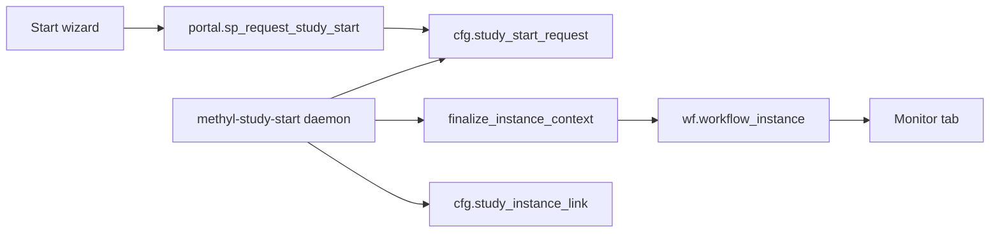

# Redesign Study Control Start

Monitor stays as it is. Start stops talking to `portal.sp_create_and_start_instance` and stops building SamplePrep JSON by hand.

## Contract

Portal never bakes. Portal writes a **request**. Python ops (`methyl-study-start drain-requests`) claims, merges layers, bakes `resolvedConfig__*`, creates the instance and links it to the Study.

Merge order at bake (unchanged): site → profile → procedure → `cfg.study.document_json.actionConfig` (Guardrails overlay) → instance overlay if any.

SQL does **not** reimplement `resolve_action_config`. Site/profile/procedure JSON is loaded from materialized `/work` (`methyl-cfg materialize` must have run).

## Start UI (first slice)

Rewrite `StudyControlStartFrame` / orchestration in `StudyControlFrame.pas`. Drop Disease/Group, FASTQ memo, hardcoded FASTA, `Build context JSON` as a stale cache, and direct Start-SQL.

Operator sees:

1. **Study** (`cfg.study`, published) - combo, source of `study_row_id`.
2. **Next stage** - SamplePrep or StudyValidationLifecycle, filtered by published defs + what that study already has. No arbitrary workflow picker.
3. **Published version** of that stage (active + has root).
4. **Process pack** prefilled from `portal.sp_get_study_process_defaults`. Overrides among published rows.
5. **Cohort** from `cfg.study_group` / members.
6. **Storage / reference** as captions.
7. **Guardrails** caption: inherited vs pinned (`sp_get_study_guardrails_editor`, no editor here).
8. **Preview of intent** (the request JSON). Baked `resolvedConfig` exists only after the daemon finishes.
9. **Queue start** → poll request status → jump to Monitor with the new `workflow_instance_id`.

Always rebuild the request from current controls at submit.

## SQL queue

Canonical twins: `workflow_engine/sql_mssql/cfg_study_start_request.sql` and `sql_pg/cfg_study_start_request.sql` (deployed after `portal_study_ops_api.sql`). Cloud: `Scripts/Deploy_StudyStartRequest.sql`.

- `portal.sp_preview_study_start`
- `portal.sp_request_study_start`
- `portal.sp_claim_study_start_request` / complete / fail
- `portal.sp_get_study_start_request`
- `portal.sp_list_study_start_stages`

`portal.sp_create_and_start_instance` is the daemon's last step (baked context + `@study_row_id`). Portal Delphi must not call it.

## Python daemon

`methyl-study-start drain-requests` in `workflow_engine/admin/study_start.py` / `ops/study_start_queue.py`.

`db_client.create_workflow_instance` skips a second finalize when `resolvedConfig__*` is already present.

## Out of scope (this slice)

- Monitor tab changes
- Prediction / hold-out stage
- Contract quota UI (NULL `@scope_id` unless the session already has it)
- Editing Guardrails on Start
- Reimplementing bake in SQL or Delphi
