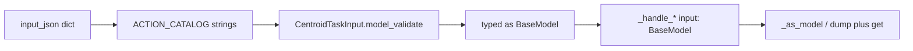

# Why handlers re-validate abstract `BaseModel`

Pydantic **does** validate action I/O. The extra checks are not a second schema layer for correctness — they exist because the **in-process handler protocol erases the concrete type** after that validation.

## What is already strict

The Action Catalog maps each `action_name` to a concrete Pydantic class (`input_module` / `input_class`). On claim/execute, the worker loads that class and calls `model_validate`:

```37:38:workers/methyl_worker/action_execution.py
def validate_input(entry: ActionCatalogEntry, payload: Mapping[str, Any]) -> BaseModel:
    return load_input_model(entry).model_validate(dict(payload))
```

That return type is already a **concrete instance** (`CentroidTaskInput`, `DownloadFastqTaskInput`, …). The annotation `-> BaseModel` is only the common supertype so `execute_task` / `InProcessAction` can stay action-agnostic.

JSON Schema in `schemas/tasks/` and `wf.data_type` are **exports** of those same models. The database and the code share one type system; they do not need a second validator for the same fields.



## Why the signature is `input: BaseModel`

The engine, gateway, and `call_in_process_handler` are **catalog-driven**. They only know `action_name` + JSON. All in-process handlers share one positional contract:

```125:127:workers/methyl_worker/depends.py
    Always binds the first three parameters positionally as
    ``(capability, action_name, input_model)``.
```

That contract was locked in by [optional-observability-follow-ups](optional-observability-follow-ups.plan.md) (todo `handler-input-model`): migrate from `Dict[str, Any]` to `BaseModel`, keep one registry. Scaffolding still emits the same shape ([`workflow_engine/cfg/scaffold.py`](../../workflow_engine/cfg/scaffold.py)).

Static typing cannot connect `action_name == "pipeline.centroid"` to `CentroidTaskInput` through a `Dict[str, Callable]`. So every handler (~50) is annotated `input: BaseModel` even though the object was already validated as the catalog class.

## What the extra validation is doing

Three patterns, all compensating for that erasure:

1. **Re-coerce to the type the catalog already used** — [`_as_model`](../../workers/methyl_worker/handlers/workflow_compute.py), `isinstance` + `model_validate` in [`context.py`](../../workers/methyl_worker/handlers/context.py) and [`sample_prep.py`](../../workers/methyl_worker/handlers/sample_prep.py) (`download_fastq`). If the catalog and handler stay in sync, this is a no-op. If they drift, you get a second `ValidationError` — or a silent dump/re-parse that can change aliases/defaults.

2. **Dump to dict, then `RuntimeError` on `.get()`** — most of [`sample_prep.py`](../../workers/methyl_worker/handlers/sample_prep.py), [`validation.py`](../../workers/methyl_worker/handlers/validation.py), RNA/proteomics handlers. Example:

```27:32:workers/methyl_worker/handlers/sample_prep.py
def _handle_methyl_qc(..., input: BaseModel) -> MethylQcTaskOutput:
    input_json: Dict[str, Any] = input.model_dump(mode="json")
    sample_dir = input_json.get("sampleDir")
    if not sample_dir:
        raise RuntimeError("methyl-qc task requires sampleDir in input_json")
```

`sampleDir` is already required (or optional) on the task model. This check **throws away** Pydantic’s field path and replaces it with a generic `RuntimeError`. That is the unclear error the question is pointing at.

3. **A different model than the catalog input** — validation handlers dump the task model, filter keys, and `ValidationPlanRequest.model_validate(...)`. That second model is real (planner vs aggregation task I/O), but it is reached through dict filtering so failures look like ad-hoc validation instead of “task input vs plan request mismatch.”

A **separate** channel is `resolvedConfig`: merge stays `Dict[str, Any]` ([`resolve_action_config`](../../packages/methylutils/methyl_utils/action_config_resolver.py)); `*StepConfig` validation happens later (CLI `--resolved-config`, `parse_validation_profile`). That is config-not-code, not the handler `BaseModel` problem. Do not fold science knobs onto task I/O to “fix” this.

## Why this is not a Pydantic limitation

Pydantic only validates against a **specific** model class. `BaseModel` as a parameter type means “any model,” so the type checker and runtime cannot apply `CentroidTaskInput` rules again. The catalog already picked the class; the handler forgot it.

Error quality is worse **after** dump: `.get("sampleDir")` cannot say `sampleDir: Field required` the way `MethylQcTaskInput.model_validate` would.

## Recommended fix (if we change code)

Keep the engine JSON-only. Tighten **only** the worker handler boundary.

1. **Annotate each handler’s third parameter with the catalog input class** (and return the catalog output class). Example: `_handle_workflow_const_bool(..., input: ConstBoolTaskInput) -> ConstBoolTaskOutput`.

2. **Coerce once in [`call_in_process_handler`](../../workers/methyl_worker/depends.py)** from the annotation:
   - If the 3rd param is a `BaseModel` subclass and `input_model` is not an instance of it, `ann.model_validate(input_model.model_dump(mode="json"))`.
   - If the catalog model and the annotation disagree, the operator sees a normal `ValidationError` at the dispatcher — not a handler `RuntimeError`.
   - Remove [`_as_model`](../../workers/methyl_worker/handlers/workflow_compute.py) and per-handler `isinstance` / `model_validate` copies.

3. **Prefer typed field access** in handlers we touch (`input.sampleDir`) instead of `model_dump` + `.get()` + `RuntimeError` for fields the task model already declares. Keep a single dump only where a helper still requires `Mapping` (e.g. `run_fastp_trim`).

4. **Leave `resolvedConfig` as a dict at merge time.** Validate `*StepConfig` at the existing consume sites; do not add another generic `BaseModel` wrapper.

5. **Update the scaffold** so new actions emit `input: {InputClass}` not `input: BaseModel`.

Out of scope unless requested: codegen of a `Handler[InT, OutT]` registry, typing every `resolvedConfig: Optional[dict]` as a step-config model, or changing gateway/SQL.

## Verification

- `source .venv/bin/activate && pytest workers/tests/ -q`
- Existing handler tests plus one assertion that a mismatched catalog/handler annotation raises `ValidationError` from the dispatcher
- `methyl-export-task-schemas --check` (no schema change expected)
