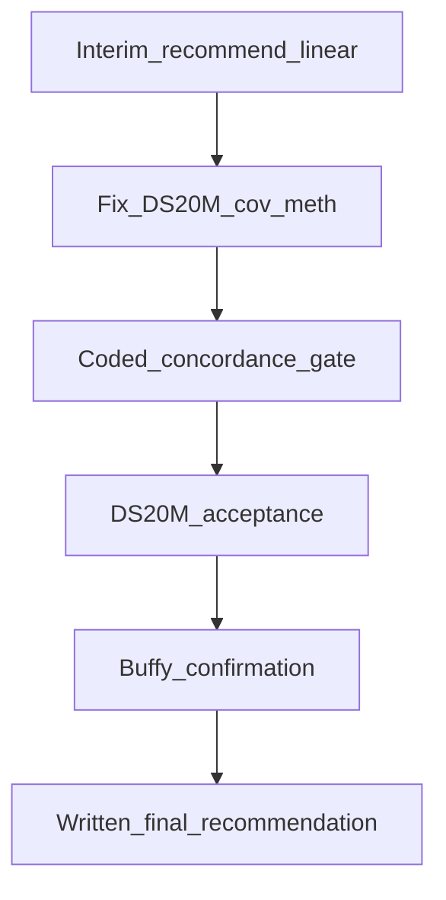

# WGBS alignment decision (1C)

## Why DS20M was inconclusive

The bottleneck is not depth. Dual-graph MethylCall **runs**, but projected MergeCpG coverage/meth on shared CpGs disagree with linear BAM pileup (~100× cov inflation). The automated compare in [`packages/methylutils/methyl_utils/testing/sample_prep_canary.py`](../../packages/methylutils/methyl_utils/testing/sample_prep_canary.py) also never checks site-overlap concordance, and site yield is mis-keyed (`cpg_sites_passing_min_cov` vs `cpg_sites`), so `overall_pass` cannot decide science.

Meanwhile production risk was live: [`buffy_wgbs_pangenome_gene_fc`](../../workflow_engine/domain/profiles/procedures/buffy_wgbs_pangenome_gene_fc.procedure.json) was documented as the **default** buffy research procedure → `alignmentMode: pangenome_wgbs` without a passing acceptance report.

## Phase 0 — Interim recommendation (do first)

**Decision now:** SamplePrep / buffy WGBS production default is **linear** (`buffy_wgbs_linear_gene_fc`). Keep `buffy_wgbs_pangenome_gene_fc` as an **experimental** opt-in until Phase 4 passes.

Concrete doc/procedure flips (no science code yet):

- [`workflow_engine/domain/profiles/procedures/README.md`](../../workflow_engine/domain/profiles/procedures/README.md): default buffy = linear; pangenome = experimental / pending acceptance.
- [`docs/usage/24-methylation-application-packs.qmd`](../usage/24-methylation-application-packs.qmd), [`docs/usage/03-sample-prep-and-qc.qmd`](../usage/03-sample-prep-and-qc.qmd), [`workflow_engine/sql_mssql/SamplePrepFlow.md`](../../workflow_engine/sql_mssql/SamplePrepFlow.md), [`docs/deployment/production_runbook.md`](../deployment/production_runbook.md): same wording; point operators at `buffy_wgbs_linear_gene_fc`.
- Decision memo: `/work/samples/_comparisons/20260728Tinterim/interim_alignment_recommendation.md` (mirrored in [`linear-vs-wgbs-sampleprep-compare.plan.md`](linear-vs-wgbs-sampleprep-compare.plan.md)).

Do **not** delete the pangenome procedure or SamplePrep branch — only demote its “default” status.

## Phase 1 — Make DS20M dual-graph scientifically comparable

On existing plasma DS20M artifacts (`DPLST-051425-111148-DS20M`):

1. Pick ~10 shared CG positions (chr1) present in both linear H5/`linear/` and projected `linear_cpg_calls.tsv`.
2. For each: linear BAM pileup (`samtools mpileup` / MethylExtractor row) vs raw `graph.methyl` vs `graph.cpg.tsv` vs projected TSV.
3. Classify root cause and fix in [`workers/methyl_worker/methylgrapher_wgbs_runner.py`](../../workers/methyl_worker/methylgrapher_wgbs_runner.py) (`project_graph_cpg_to_linear_tsv` and/or MergeCpG→H5 encoding of `mC`/`uC`/`cov`).
4. Re-project + rewrite pangenome H5s/manifest; unit-test the projector with a tiny fixture where expected linear pos/cov/meth are known.
5. Re-check chr1 overlap: median `pg_cov/linear_cov` near 1 (order-of-magnitude), and meth not systematically anti-correlated.

Exit for Phase 1: overlap diagnostics look sane; no promotion yet.

## Phase 2 — Code the acceptance gate (replace hand-written gono)

Extend [`SamplePrepCanaryThresholds`](../../packages/methylutils/methyl_utils/test_data_registry.py) + `compare_linear_vs_wgbs` / report builders with **operator-set** knobs (defaults `None`; values only in thresholds JSON / site/profile — no Python magic numbers):

- Shared-site fraction / precision-recall style: sites in both arms at cov≥1 (and optionally ≥5).
- Median coverage ratio on overlaps (pass band, e.g. within configured factor).
- Methylation concordance on overlaps (Pearson or mean |Δmeth| ceiling).
- Fix metric wiring so real site counts (`cpg_sites_passing_min_cov` / explicit `cpg_sites`) feed the gate — stop using `n_h5_files` as a science proxy when summary fields exist.

Commit an acceptance thresholds file under `tests/real_data/sample_prep_mode_compare/` (e.g. `thresholds.acceptance.json`) used by the DS20M and buffy runs.

Hypothesis for promote remains: **usable CpG support vs linear, with concordant meth on shared sites**, and alignment time as a **cost** metric (not a hard veto if science wins within `alignment_time_ratio_max`).

## Phase 3 — DS20M acceptance (cheap gate)

Re-run report-only compare on DS20M after Phase 1 fix with `thresholds.acceptance.json`.

**Pass:** concordance + site/coverage checks green → proceed to buffy.  
**Fail:** stop; keep interim linear; open a focused fix loop (no full-depth, no multi-worker).

## Phase 4 — Buffy confirmation (analyte that owns the procedure)

Run linear vs `pangenome_wgbs` for buffy `DBCST-051425-111148` through extract (+ extraction QC when available), using the same acceptance thresholds.

Depth policy: start with a **depth-matched subset** sized like DS20M if full-depth wall time would block the decision; only escalate to full-depth if the subset passes and cost/runtime for production still needs a final check. Reuse existing compare runner layout (`linear/` + `pangenome_wgbs/` mode trees, no archive).

## Phase 5 — Final written recommendation

Produce `/work/samples/_comparisons/<stamp>/alignment_recommendation.md` (+ update plans/docs):

| Outcome | Production default | Notes |
|---------|-------------------|-------|
| DS20M fail | Keep **linear** | Pangenome remains experimental; document failure mode |
| DS20M pass, buffy fail | Keep **linear** | Plasma win is insufficient for buffy procedure |
| Both pass | Promote **`buffy_wgbs_pangenome_gene_fc`** again | Document cost (CPU wall time) and required assets (`wl.gfa`) |

Only after both pass: reverse Phase 0 wording so pangenome is again the named default buffy research pack.

## Out of scope until both gates pass

- Full-depth multi-worker MethylCall sharding
- Archiving either arm to QNAP as the production winner
- Changing plasma procedure (`cfdna_wgbs_plasma` stays linear)
