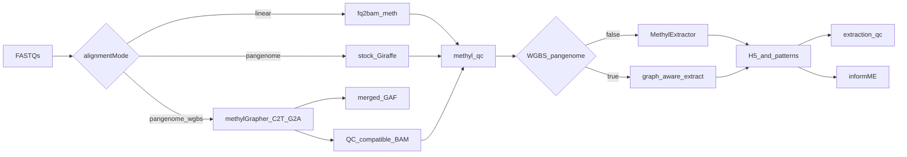

# WGBS Pangenome SamplePrep

## Chosen architecture
Use a dedicated worker capability and two typed actions: `sample.methylgrapher_wgbs_align` for dual C2T/G2A alignment plus QC-compatible BAM production, and `sample.methylgrapher_wgbs_extract` for graph-aware methylation extraction into the existing marginal/pattern HDF5 contracts. This avoids feeding an unvalidated converted-read BAM into MethylExtractor while preserving downstream extraction QC and informME.

## Typed configuration and immutable assets
- `alignmentMode: "pangenome_wgbs"` and derived `useWgbsPangenome` in [`workflow_engine/domain/pipeline_profiles.py`](../../workflow_engine/domain/pipeline_profiles.py). `usePangenome=true` for shared lifecycle semantics.
- Pydantic step/task models in [`workers/methyl_worker/task_models/sample_prep_models.py`](../../workers/methyl_worker/task_models/sample_prep_models.py).
- QNAP-backed `pangenome-grch38-d9-bs-1.70` reference asset; site `actionConfig.methylgrapher_wgbs` / `pangenome_wgbs_genome`.
- [`buffy_wgbs_pangenome_gene_fc.procedure.json`](../../workflow_engine/domain/profiles/procedures/buffy_wgbs_pangenome_gene_fc.procedure.json) selects `pangenome_wgbs`; no silent stock Giraffe fallback when BS assets are absent.

## Worker-side alignment and QC
- Image: [`workers/docker/methylgrapher/`](../../workers/docker/methylgrapher/) + [`smoke_64k.sh`](../../workers/docker/methylgrapher/smoke_64k.sh).
- Runner: [`workers/methyl_worker/methylgrapher_wgbs_runner.py`](../../workers/methyl_worker/methylgrapher_wgbs_runner.py).
- Catalog actions registered; QC BAM / dedup metrics / qc-metrics.tar keep `sample.methyl_qc` unchanged.

## Graph-aware extraction and workflow routing
- `sample.methylgrapher_wgbs_extract` emits `{chrom}-{context}.h5` and `{chrom}-{context}.patterns.h5`.
- [`sample_prep.program.json`](../../workflow_engine/domain/fixtures/sample_prep.program.json) and remediate program use three-way align + extract branches.

## Idempotency, validation, and rollout
- CAAS fingerprints include FASTQ + C2T/G2A asset digests + tool/image pins; `forceRealign` clears align + extract outputs.
- Unit tests under `workers/tests/test_methylgrapher_wgbs.py`; canary checklist in `workers/tests/test_methylgrapher_wgbs_canary.md`.
- Promote runtime-bundle with new actions/procedure/schemas and pin `METHYL_METHYLGRAPHER_IMAGE` after canary acceptance.
