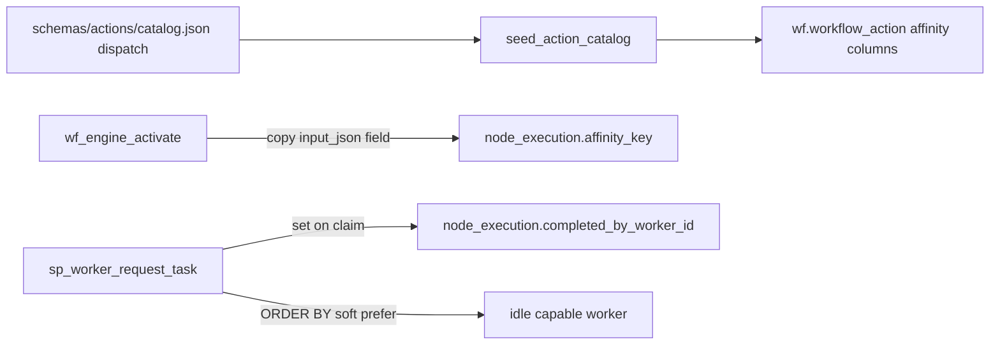

# Worker affinity dispatch (catalog → wf)

> **Status: IMPLEMENTED.** Soft preference + affinity-group continuation; no hard pin. Deployed to Azure SQL (`wf_action_dispatch_affinity.sql`) and seeded via action catalog.

## Defaults (from your intent)

- Soft preference: prefer the previous worker when it is idle and capable; otherwise any capable worker may claim.
- Affinity-group continuation: prefer continuing an existing `affinity_key` (QC / remediate / extract) over starting a new group (fresh align).
- Process-specific binding (`sampleId`) lives in the **action catalog** / DomainProgram consumers; `wf` only interprets opaque keys and generic flags.

## Principle

`wf` stays process-agnostic. It already enforces catalog `dispatch.max_per_worker` / `exclusive_worker` ([`docs/architecture/action-provider-registry.md`](docs/architecture/action-provider-registry.md)). Affinity extends that same contract — **not** a global `ORDER BY` rewrite and **not** SamplePrep node names in SQL.



## Design

### Catalog `dispatch` (cfg / action SoT)

Extend [`ActionDispatch`](workers/methyl_worker/action_catalog.py) and catalog JSON:

| Field | Meaning |
|-------|---------|
| `affinity_key_field` | Optional name of a field in resolved `input_json` (e.g. `"sampleId"`). Opaque to the engine. |
| `prefer_previous_worker` | Soft stickiness: prefer the worker that last completed a task with the same `(workflow_instance_id, affinity_key)`. |
| `prefer_continue_group` | Soft continuation: prefer READY rows whose `affinity_key` already has ≥1 `SUCCEEDED` row in the same instance over keys with none. |

Existing `max_per_worker` / `exclusive_worker` unchanged.

SamplePrep wiring (process pack, not engine): set `affinity_key_field: "sampleId"` and both prefer flags on sample-scoped actions in [`schemas/actions/catalog.json`](schemas/actions/catalog.json) / [`action_catalog.py`](workers/methyl_worker/action_catalog.py) — at least `sample.download_fastq`, `sample.methylgrapher_wgbs_align` (and other align arms used by SamplePrep), `sample.methyl_qc`, `sample.methylgrapher_wgbs_extract`, trim/remediate, archive siblings as needed. Actions without `affinity_key_field` keep today’s pure FIFO.

### Engine storage (generic)

Additive MSSQL + PG:

- `wf.workflow_action`: `affinity_key_field nvarchar(128) NULL`, `prefer_previous_worker bit NOT NULL DEFAULT 0`, `prefer_continue_group bit NOT NULL DEFAULT 0`
- `wf.node_execution`: `affinity_key nvarchar(256) NULL`, `completed_by_worker_id bigint NULL` (FK → `wf.worker`, set on claim, **retained** after lease delete)

New migration script beside [`wf_action_dispatch_concurrency.sql`](workflow_engine/sql_mssql/wf_action_dispatch_concurrency.sql); widen `wf.wf_repo_upsert_workflow_action` (9-arg → 12-arg) and [`seed_action_catalog.py`](workflow_engine/sql_mssql/seed_action_catalog.py).

### Activation

In `wf.wf_engine_activate` (after `input_json` is built): if the action’s `affinity_key_field` is set, copy `JSON_VALUE(input_json, '$.' + field)` into `node_execution.affinity_key`. No sample/process names in the SP.

### Claim (`wf.sp_worker_request_task`)

1. On successful pick: `SET completed_by_worker_id = @worker_id` (survives submit/lease delete).
2. Keep capability / exclusive_worker / max_per_worker gates.
3. Soft ranking (only when columns imply it; otherwise identical to today):

```sql
ORDER BY
  -- continue group: 0 if this key already has SUCCEEDED work in the instance
  CASE WHEN wa.prefer_continue_group = 1
        AND ne.affinity_key IS NOT NULL
        AND EXISTS (
          SELECT 1 FROM wf.node_execution x
          WHERE x.workflow_instance_id = ne.workflow_instance_id
            AND x.affinity_key = ne.affinity_key
            AND x.status = N'SUCCEEDED')
       THEN 0 ELSE 1 END,
  -- sticky worker: 0 if this worker completed the latest SUCCEEDED row for that key
  CASE WHEN wa.prefer_previous_worker = 1
        AND ne.affinity_key IS NOT NULL
        AND EXISTS (
          SELECT 1 FROM wf.node_execution prev
          WHERE prev.workflow_instance_id = ne.workflow_instance_id
            AND prev.affinity_key = ne.affinity_key
            AND prev.status = N'SUCCEEDED'
            AND prev.completed_by_worker_id = @worker_id
            AND prev.ended_at_utc = (
              SELECT MAX(p2.ended_at_utc) FROM wf.node_execution p2
              WHERE p2.workflow_instance_id = ne.workflow_instance_id
                AND p2.affinity_key = ne.affinity_key
                AND p2.status = N'SUCCEEDED'))
       THEN 0 ELSE 1 END,
  ne.available_at_utc ASC,
  ne.id ASC
```

Fallback is automatic: if the preferred worker is busy, another idle worker still sees the second `CASE` as `1` and may claim. No wait/timeout pin.

### What this deliberately does **not** do

- No global progress-rank for every workflow (the reverted `6efe5609` approach).
- No DomainProgram IR change in v1 (catalog already owns claim `dispatch`; programs stay topology-only).
- No hard same-VM lock; shared `/work` remains the correctness path.

## Validation

- Unit/SQL tests: two affinity keys READY; worker A completed key1; worker A claims key1’s next step before key2’s first step; worker B (idle) can claim key1 if A is busy.
- Regression: actions without affinity columns claim exactly as FIFO today.
- Deploy checklist: apply MSSQL migration → seed catalog → verify `OBJECT_DEFINITION` of claim SP → PG parity for CI.

## Docs / plan home

- Extend [`docs/architecture/action-provider-registry.md`](docs/architecture/action-provider-registry.md) dispatch table.
- Note in [`workflow_engine/sql_mssql/SamplePrepFlow.md`](workflow_engine/sql_mssql/SamplePrepFlow.md) that sample stickiness is catalog affinity, not engine SamplePrep knowledge.
- After approval: promote this plan to [`docs/plans/worker-affinity-dispatch.plan.md`](docs/plans/worker-affinity-dispatch.plan.md) under Epic AB#413 (Feature) and update [`docs/plans/README.md`](docs/plans/README.md).

## Rollout for instance 59

After deploy + seed, new activations get `affinity_key`. Existing READY QC rows lack `affinity_key` / `completed_by_worker_id` — either leave the temporary `available_at` backdate until those seven drain, or a one-shot backfill from `input_json.sampleId` + prior SUCCEEDED align `completed_by_worker_id` (once the column exists and is populated going forward; historical aligns need a one-time lease-history gap acceptance or leave backdate until extract completes).
