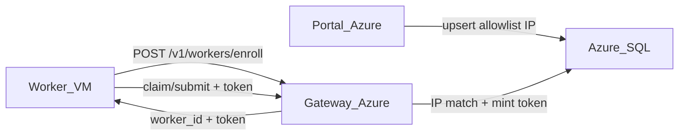

# Dumb-worker enroll via IP preregistration

## Goal

Workers on Lambda/Nebius never receive Azure SQL credentials. Portal (Azure) preregisters each VM’s **public IP**; the VM later **requests registration** over gateway OpenAPI; gateway allows enroll only when the **client IP matches** a preregistered row, then issues the token.

## Design locked

- **Allowlist unit:** per-VM row `(cluster_key, public_ip, external_worker_key)` in `wf.worker_enrollment`. Cluster `allowed_source_cidrs` remains for day-2 `GATEWAY_WORKER_IP_BIND`.
- **Enroll gate:** `extract_client_ip` must equal allowlist `public_ip` (or that host’s `/32` / `/128`). Mismatch → 403.
- **Request body:** `cluster_key`, `external_worker_key`, optional `capabilities`, optional Arc id.
- **Token mint:** upsert `wf.worker` `REGISTERED`, replace `wf.worker_token`, return plaintext token **once**.
- **Re-enroll:** same IP + same `external_worker_key` → rotate token. Revoked/unknown → 403.
- **Deprecate for prod:** `register_worker.py` direct-DB path is **dev/bootstrap only**.

## Artifacts

| Layer | Path |
|-------|------|
| SQL MSSQL | `workflow_engine/sql_mssql/wf_worker_enrollment.sql`, `portal_worker_enrollment_api.sql` |
| SQL PG | `workflow_engine/sql_pg/wf_worker_enrollment.sql`, `portal_worker_enrollment_api.sql` |
| OpenAPI | `contracts/openapi.yaml` `POST /workers/enroll` |
| Gateway | `rest/auth.py`, `gateway.py`, `asgi.py`, `db/*` |
| Worker | `methyl_worker/client.py`, `methyl_worker enroll` CLI |
| Provision | `scripts/provision_worker_node.sh --enroll-worker`, `register_worker.py` enroll fallback |

## Explicit non-goals

- EpiPortal React screens
- Changing claim/submit science
- Requiring Arc on enroll (Arc remains post-enroll attest)

## Verification

- Worker VM with **no** `AZURE_SQL_*`: enroll succeeds only when portal listed its public IP.
- Wrong IP or unknown key → 403.
- After enroll, claim works with issued token + `GATEWAY_WORKER_IP_BIND=1`.
