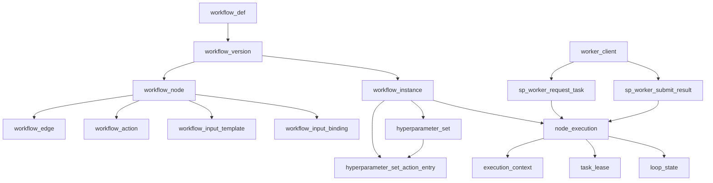

# SQL Server Workflow Engine Design Plan

## Goals
- Model workflow templates as a tree of nodes where each node can be an action or control-flow operator.
- Support runtime execution state for each workflow instance, including branching, loops, retries, and history.
- Expose a SQL Server stored-procedure API so remote workers can safely request runnable tasks and return execution results.
- Support generic JSON input/output per task while allowing runtime substitution from execution context (indexes, iteration, prior outputs).
- Enforce structural integrity with foreign keys, check constraints, and ordering/indexing rules.

## Core Design
- Use a **single node table** with a `node_type` discriminator for: `ACTION`, `SEQUENCE`, `PARALLEL`, `IF`, `SWITCH`, `REPEAT`, `WHILE`.
- Represent tree structure with an adjacency model (`parent_node_id`) plus `child_order` for deterministic sequencing.
- Store edge-level metadata for branching (`branch_kind`, `condition_expr`, `switch_case_value`) in a dedicated children/edge table.
- Separate **definition layer** (templates) from **runtime layer** (instances + node executions).

## Proposed SQL Artifacts
- `[sql/workflow_definition.sql](sql/workflow_definition.sql)`
  - `workflow_def`, `workflow_version`
  - `workflow_node`
  - `workflow_edge` (parent-child + branch metadata)
  - `workflow_action` (action handler + payload schema reference)
  - `workflow_input_template` (JSON template payload per `ACTION` or control-flow node)
  - `workflow_input_binding` (optional explicit bindings: target_json_path, source_expr)
- `[sql/workflow_runtime.sql](sql/workflow_runtime.sql)`
  - `workflow_instance`
  - `node_execution` (status, attempt, started/ended, input_json, output_json, result_code)
  - `execution_context` (resolved key/value runtime variables for each node execution)
  - `instance_cursor` (optional accelerator for schedulers)
  - `task_lease` (worker lease/lock ownership, timeout, heartbeat)
  - `loop_state` (repeat/while iteration counters)
- `[sql/workflow_worker_api.sql](sql/workflow_worker_api.sql)`
  - `sp_worker_request_task` (atomically claim one runnable action for a worker)
  - `sp_worker_submit_result` (submit output JSON + integer result and advance workflow)
  - optional `sp_worker_heartbeat` / `sp_worker_fail_task` for long-running tasks and explicit failure reporting
- `[sql/workflow_constraints_indexes.sql](sql/workflow_constraints_indexes.sql)`
  - check constraints per `node_type`
  - unique constraints for branch validity (e.g., one ELSE edge, unique SWITCH case per parent)
  - indexes for scheduler polling and child traversal
- `[sql/workflow_seed_examples.sql](sql/workflow_seed_examples.sql)`
  - one end-to-end sample workflow using sequence + parallel + if/switch + while/repeat

## Control-Flow Semantics Mapping
- **SEQUENCE**: execute children by `child_order` ascending.
- **PARALLEL**: eligible children can be scheduled concurrently; parent completes when all required children complete.
- **IF**: evaluate reference result/condition, then follow exactly one branch (`THEN` or `ELSE`).
- **SWITCH**: evaluate selector value, choose matching case edge; optionally fallback `DEFAULT`.
- **REPEAT**: execute target child exactly `repeat_count` iterations.
- **WHILE**: execute target child while condition is true (per your rule: while referenced result != 0).

## Runtime State Model
- Instance-level status lifecycle: `CREATED -> RUNNING -> COMPLETED/FAILED/CANCELLED`.
- Node execution lifecycle per attempt: `PENDING -> READY -> RUNNING -> SUCCEEDED/FAILED/SKIPPED`.
- Persist worker contract fields: `input_json` (worker input), `output_json` (worker output), and `result_code` (int for success/failure/control-flow value).
- Track `attempt_no`, `parent_execution_id`, and `iteration_no` for retries and loops.
- Track lease ownership (`worker_id`, `lease_expires_at`) to prevent duplicate execution when multiple workers poll concurrently.
- Resolve and persist a final `input_json` snapshot at claim/start time so workers get deterministic immutable input.

### Hyperparameter sets (result versioning)

An **additive, process-agnostic** extension (implemented in [`workflow_engine/sql_pg/wf_execution_scope.sql`](../../workflow_engine/sql_pg/wf_execution_scope.sql)) links workflow instances to execution-scope identity (formerly "hyperparameter set") and a CAAS action ledger:

| Object | Purpose |
|--------|---------|
| `wf.hyperparameter_set` | Registry of unique config combinations (`set_key` hash, opaque `config_json`, optional `display_name`) |
| `wf.workflow_instance.hyperparameter_set_id` | Nullable FK from instance to its hyperparameter set |
| `wf.hyperparameter_set_action_entry` | Ledger: `(hyperparameter_set_id, action_name, run_key) → content_key` |

No disease/study/process columns — the engine stores opaque keys and JSON only. Instance creation calls `wf_apply_hyperparameter_set` when `hyperparamSetId` is present; successful task submits upsert ledger rows when CAAS is enabled. Full design: [hyperparameter-result-versioning.plan.md](hyperparameter-result-versioning.plan.md).

## JSON Parameterization Strategy
- Treat UI-provided payloads as **JSON templates** with placeholders, not fixed static values.
- Use **one strict placeholder syntax only**: `${...}` (no other macros/functions embedded in JSON).
- Restrict expressions to dot-path references from a fixed runtime context:
  - `${ctx.iterationNo}` repeat/while iteration number
  - `${ctx.sequenceIndex}` sequence child position
  - `${ctx.parallelIndex}` parallel child position
  - `${ctx.parent.resultCode}` parent node result integer
  - `${ctx.task.<node_key>.resultCode}` prior task integer result
  - `${ctx.task.<node_key>.output.<jsonPath>}` prior task output JSON field
- Keep expression language intentionally minimal for v1:
  - allowed: direct references only
  - not allowed: arithmetic, string concatenation, custom functions, nested expressions
- Maintain runtime context values in `execution_context` so substitutions are auditable and replayable.
- On task claim, `sp_worker_request_task` resolves template + bindings into concrete `input_json`:
  1. build context map from instance/node lineage (`iteration_no`, branch/sibling order, selected case)
  2. merge referenced prior outputs via `OPENJSON`
  3. apply path updates with `JSON_MODIFY`
  4. persist resolved JSON into `node_execution.input_json`
- Control-flow nodes can also receive input JSON via the same mechanism, then evaluate conditions/selectors against resolved values.
- Define deterministic substitution/coercion rules:
  - full-value placeholder becomes native JSON type (`number`, `string`, `bool`, `null`, object/array)
  - placeholder embedded inside literal text is treated as string only
  - missing reference defaults to `null` unless binding marks field as `required = 1`
  - if `required = 1` and value is missing/unparseable, mark node as `FAILED` with standardized engine error code

## Worker Stored-Procedure Contract
- **Task request**: worker calls `sp_worker_request_task(@worker_id, @capability, @max_lease_seconds)` and receives one claimed executable `ACTION` node, including `node_execution_id`, `action_name`, and `input_json`.
- **Task completion**: worker calls `sp_worker_submit_result(@node_execution_id, @worker_id, @result_code, @output_json)`; procedure validates lease ownership, marks execution final, persists outputs, and enqueues/evaluates next nodes.
- **Procedure output contract**:
  - `sp_worker_request_task` returns either 0 rows (no task) or 1 row (claimed task) to avoid race-prone two-step polling
  - `sp_worker_submit_result` returns status metadata (`accepted`, `instance_status`, `next_ready_count`) for worker observability
- **Control-flow interpretation**:
  - `IF`/`WHILE` evaluate based on referenced `result_code` (e.g., `WHILE` continues while `result_code <> 0`).
  - `SWITCH` selects child edge where `switch_case_value = result_code`, with optional `DEFAULT` branch.
  - `REPEAT` uses configured count in definition and runtime `loop_state`.

## Integrity + Performance Rules
- Ensure exactly one root node per workflow version.
- Prevent illegal child counts by node type (e.g., `IF` max 2 logical branches; `WHILE/REPEAT` exactly 1 loop body edge).
- Ensure deterministic ordering for `SEQUENCE` via unique `(parent_node_id, child_order)`.
- Add scheduler-focused indexes, e.g. on `node_execution(status, available_at, workflow_instance_id)` and `workflow_edge(parent_node_id, child_order)`.
- Add lease safety constraints/indexes (e.g., one active lease per `node_execution_id`; fast lookup by `worker_id` and `lease_expires_at`).
- Add indexes supporting input resolution lookups, e.g., `execution_context(node_execution_id, context_key)` and prior-output retrieval by `(workflow_instance_id, node_id, status)`.

## Visual Model

## Validation and Handoff
- Provide SQL Server DDL + sample inserts + a small set of verification queries:
  - detect malformed branches
  - list runnable nodes for an instance
  - compute next nodes after completion
- Add JSON resolution tests proving index-aware substitutions:
  - sequence/parallel sibling index substitution
  - repeat iteration substitution
  - while-loop substitution based on latest condition result
- Add contract tests for expression safety and determinism:
  - reject unsupported expressions (arithmetic/function calls)
  - verify required binding failure behavior
  - verify stable resolved `input_json` snapshot across retries of same attempt
- Document orchestrator assumptions and transaction boundaries for safe concurrent scheduling.