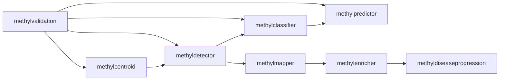

# MethylPipeline Executive Brief
## Theory and Implementation

Audience: scientific + technical leadership

---

## Why this matters

- We need robust methylation signals, not one-off split artifacts.
- MethylPipeline separates discovery, biological interpretation, and deployment.
- The stack is built for reproducibility, auditability, and model governance.

---

## Core method in one view

---

## Statistical contract

- Repeated train/validation splits estimate DMP recurrence stability.
- Stable loci are selected by recurrence threshold (`stability_dmp_freq`).
- Optional quality filtering excludes low-balanced-accuracy runs.
- Blind outputs are uncertainty summaries, not accuracy evidence.

---

## Key 2026 update: adaptive stability stop

- Optional early-stop based on stable-panel convergence:
  - Jaccard overlap
  - relative panel-size drift
  - patience across checkpoints
- Configured by `stability_early_stop_*`.
- Decision trace is auditable in `stability_summary.json -> early_stopping`.

---

## Key 2026 update: observed-hybrid family semantics

- `feature_family_set` defines feature contract:
  - `dmp`, `gene`, `structural`, and combinations.
- Non-`dmp` families require mapper annotation cache from freeze.
- Mapped-family features are generated from observed stable loci only.

---

## Key 2026 update: backend behavior

- `ecdf` now supports aggregated observed-hybrid OvR mode.
- New controls: `ecdf_aggregated_enabled`, `ecdf_aggregated_n_bins`.
- New artifacts: `ecdf_aggregated_ovr.pkl`, `.meta.json`.
- `evidence_class*` columns are diagnostics (not p-values).

---

## Key 2026 update: model feature scale controls

- `tabular_max_dmps` semantics changed:
  - `null`/`0` => no cap (keep all stable loci)
  - positive integer => effect-size-ranked cap
- This affects comparability across tabular/generative runs.

---

## Governance artifacts leadership should track

- `stability/stability_summary.json` (includes adaptive stop diagnostics)
- `stability/stable_dmps_production.csv`
- `production/production_summary.json` (includes mapper annotation cache metadata)
- `production/selected_backend.json`

---

## Executive takeaways

- Methodologically, this is a split-robust feature-selection + frozen deployment pipeline.
- Operationally, artifacts now support stronger audit trails and reproducibility.
- Decision quality improves when backend selection and readiness gates are enforced.
