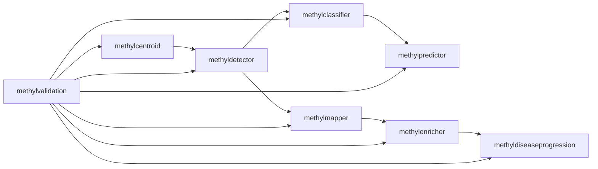

# MethylPipeline
## Theory and Implementation

Mixed scientific + technical briefing

---

## Why this stack exists

- Build reproducible methylation-based class discrimination
- Separate signal discovery from deployment-time inference
- Keep biological interpretation tied to selected loci
- Expose uncertainty and operational artifacts, not just one metric

<!-- speaker-note: Emphasize this is a pipeline-level method, not one monolithic model. -->

---

## Core scientific question

- Which loci (DMPs) robustly separate classes under perturbation?
- How stable is selection across random train/validation partitions?
- Which backend best operationalizes the frozen feature space?
- What can be claimed from labeled holdouts vs blind samples?

---

## Package architecture (high level)

---

## Statistical backbone

- Cohort centroids summarize methylation distributions by locus/context
- Detector computes statistical + biological relevance filters
- Classifier/predictor score samples using trained artifacts
- Validation repeats split-train-evaluate loops to characterize variability

---

## Centroid theory in one slide

- Inputs: per-sample `{chrom}-{context}.h5`
- Outputs: centroid H5 with per-locus summary statistics + histogram bins
- Supports ECDF-style downstream comparison and detector feature derivation
- Coverage thresholds and binning choices affect downstream sensitivity

---

## Detector theory in one slide

- Statistical screening on candidate loci
- Effect-size informed biological prioritization
- Exports discovery panel and classifier-oriented panel
- Produces run-level balanced accuracy diagnostics in validation loops

---

## Predictor and metrics semantics

- Labeled mode: accuracy, balanced accuracy, confusion matrix, class metrics
- Blind mode: probability summaries and entropy only
- Proper-score diagnostics available when probabilities are exported
- Blind predictions are not evidence of discrimination accuracy

---

## Monte Carlo stability idea

For locus `d`, across qualifying runs:

- `f_hat(d) = (1 / R*) * Σ I[d in D_disc,r]`
- Stable set is thresholded by `stability_dmp_freq`
- Optional run-quality filter: `stability_min_balanced_accuracy`

Interpretation:

- High recurrence implies robust selection under split perturbation

---

## Adaptive stability stop (new)

- Optional via `stability_early_stop_enabled`
- Convergence checks compare `S_k` vs `S_(k-w)`
- Criteria include:
  - Jaccard overlap (`stability_convergence_jaccard`)
  - relative size drift (`stability_convergence_max_size_delta`)
  - patience (`stability_convergence_patience`)
- Diagnostics written to `stability_summary.json -> early_stopping`

---

## Freeze as scientific handoff

- Locks panel into fixed detector input (`fixed_dmp_panel`)
- Re-runs production path on all data
- Produces deterministic handoff artifacts for model build + review
- Avoids re-discovering loci during production interpretation

---

## Mapper/enricher/progression rationale

- Mapper links loci to genes/regions
- Enricher contextualizes gene sets/pathways
- Progression aggregates stage-wise trends when disease ordering is defined
- Readiness gate ensures completeness/consistency before model promotion

---

## Observed-hybrid feature families (new semantics)

- `feature_family_set` controls feature contract:
  - `dmp`, `gene`, `structural`
  - `dmp+gene`, `dmp+structural`, `hybrid-all`
- Non-`dmp` features are dynamic and mapper-annotation dependent
- No synthetic feature expansion beyond observed mapped stable loci

---

## Mapped-feature formula

For gene/structural keys:

- `sum(sign(effect_size) * abs(effect_size) * (beta - 0.5)) / sum(abs(effect_size))`

Implications:

- Encodes direction + magnitude weighting
- Anchors features to biologically mapped stable loci

<!-- speaker-note: Mention that this replaces older feature-toggle framing for observed_hybrid narratives. -->

---

## Mapper annotation cache (new)

- Freeze may emit:
  - `production/model_bundle/mapper_dmp_annotations.csv`
- Metadata recorded in:
  - `production/production_summary.json -> mapper_annotation_cache`
- Non-`dmp` family model builds require this mapping contract

---

## Backend choices

- `ecdf`
  - Classic classifier -> predictor path
- Aggregated ECDF OvR (observed-hybrid)
  - package artifacts: `ecdf_aggregated_ovr.pkl`, `.meta.json`
  - predictor exports `evidence_class*` diagnostics
- `tabular_sklearn`
- `generative_hybrid`

---

## Aggregated ECDF specifics

- Auto path when:
  - `model_backend=ecdf`
  - `feature_mode=observed_hybrid`
  - `feature_family_set != dmp`
- Config controls:
  - `ecdf_aggregated_enabled`
  - `ecdf_aggregated_n_bins`
- In this mode, ECDF second-stage refinement is skipped

---

## Tabular/generative DMP cap semantics (updated)

- `tabular_max_dmps = null` or `0`: keep all stable loci from bundle index
- `tabular_max_dmps > 0`: apply effect-size-ranked cap
- Important for reproducibility and fair backend comparison

---

## Model-MC implementation optimization

- `--model-mc --model-mc-all` builds shared split artifacts
- Reusable primary runs can link centroid/detector outputs
- Reduces redundant compute while preserving run structure
- Backend-specific outputs remain isolated under `model_mc/<backend>/`

---

## Key artifacts to interpret

- `all_metrics.csv`, `metrics_summary.json`
- `stability/stable_dmps_production.csv`
- `stability/stability_summary.json` (includes `early_stopping`)
- `production/project.json`, `production_summary.json`
- `production/selected_backend.json`

---

## Limits and caveats

- Internal MC variability is not external transportability proof
- Stability threshold is engineering control, not universal optimum
- Blind-mode outputs measure uncertainty, not ground-truth performance
- Backend comparisons depend on consistent data contracts and settings

---

## Practical interpretation checklist

- Confirm panel is non-empty and biologically coherent
- Validate readiness before final model training
- Use balanced accuracy median as robust backend selection default
- Report key config knobs in manuscripts:
  - `stability_early_stop_*`
  - `feature_family_set`
  - `ecdf_aggregated_*`
  - `tabular_max_dmps`

---

## Recommended references

- `docs/theory/chapters/05-methylpredictor-and-validation.qmd`
- `docs/theory/chapters/12-two-workflows.qmd`
- `docs/reference/configuration-reference.qmd`
- `packages/methylvalidation/docs/IMPLEMENTATION.md`

---

## End

Questions and deep-dive paths:

- statistics and assumptions
- backend trade-offs
- deployment/readiness governance
