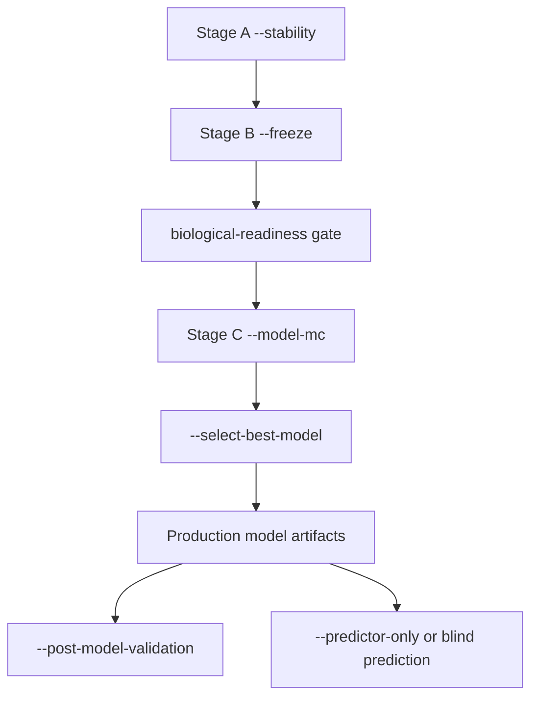

# MethylPipeline Executive Brief
## Workflows: Model Creation and Prediction

Audience: scientific + technical leadership

---

## End-to-end workflow

---

## Stage A: stability discovery

- Purpose: identify robust DMP panel under split perturbation.
- Command: `methyl-validation --project ... --stability`
- Outputs:
  - `stable_dmps_production.csv`
  - `stability_summary.json`
  - `all_metrics.csv`, `metrics_summary.json`

---

## Stage A upgrade: adaptive stop

- Optional early-stop (`stability_early_stop_*`) can reduce compute.
- Convergence checks are logged for auditability.
- Still bounded by `n_iterations` fallback.

---

## Stage B: freeze and biological interpretation

- Purpose: lock panel and run all-data interpretation pipeline.
- Command: `methyl-validation --project ... --freeze`
- Path: centroid -> detector(fixed panel) -> mapper -> enricher -> optional progression
- Critical artifact: `production/project.json`

---

## Stage B upgrade: mapped-family readiness

- Freeze can emit mapper annotation cache:
  - `production/model_bundle/mapper_dmp_annotations.csv`
  - `production_summary.json -> mapper_annotation_cache`
- Required for non-`dmp` observed-hybrid model families.

---

## Stage C: model selection and final build

- Compare backends:
  - `--model-mc --model-mc-all`
  - `--select-best-model`
- Default ranking policy: balanced accuracy median.
- Reuse optimization: shared runs can link reusable centroid/detector artifacts.

---

## Prediction workflow after final model

- `--post-model-validation`
  - labeled frozen-model holdout distributions.
- `--predictor-only` / blind inference
  - operational scoring and uncertainty summaries.
- Guardrail: blind predictions cannot be used as accuracy claims.

---

## Executive controls and checkpoints

- Require readiness gate before final promotion.
- Track these files in release reviews:
  - `stability_summary.json`
  - `production_summary.json`
  - `selected_backend.json`
  - post-model validation summaries
- Record configuration knobs used for each release.

---

## Executive takeaways

- Workflow is now clearer: discover -> freeze -> gate -> select -> deploy.
- Updated semantics improve reproducibility and governance.
- Leadership decisions should anchor on artifact-backed checkpoints, not single-run metrics.
