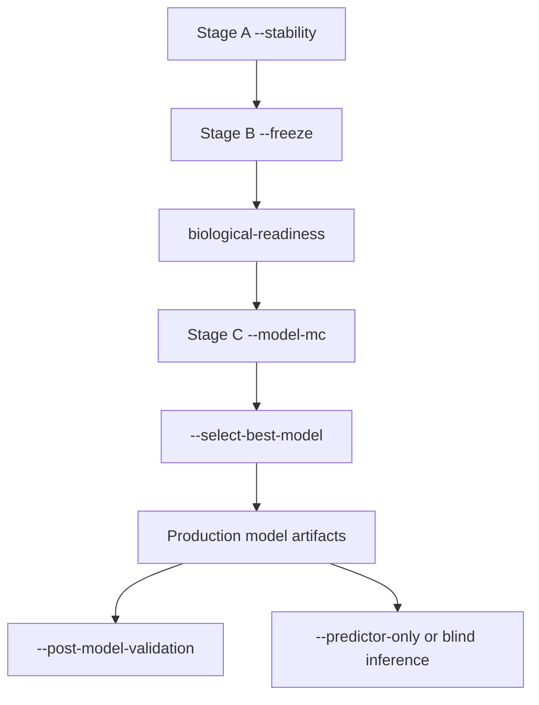

# MethylPipeline
## Workflows for Model Creation and Prediction

Operational runbook deck (mixed audience)

---

## What this deck covers

- End-to-end model creation workflow
- Frozen-model evaluation and prediction workflow
- Key commands, artifacts, and quality gates
- Updated semantics for adaptive stability and backend behavior

---

## Workflow map



---

## Stage A: Stability discovery

Primary command:

```bash
source .venv/bin/activate
methyl-validation --project configs/my_project.json --stability
```

Purpose:

- repeated split discovery to identify robust loci

---

## Stage A internals

Per iteration:

- stratified split
- `methyl-centroid`
- `methyl-detector`

After loop:

- stability aggregation (`run_stability_analysis`)
- writes stable panel + summary

---

## Adaptive early stop in Stage A (new)

- Optional config:
  - `stability_early_stop_enabled`
  - `stability_min_iterations`
  - `stability_convergence_window`
  - `stability_convergence_jaccard`
  - `stability_convergence_max_size_delta`
  - `stability_convergence_patience`
- Decision evidence logged in `stability_summary.json -> early_stopping`

---

## Stage A outputs to inspect

- `monte_carlo_runs/all_metrics.csv`
- `monte_carlo_runs/metrics_summary.json`
- `monte_carlo_runs/stability/stable_dmps_production.csv`
- `monte_carlo_runs/stability/stability_summary.json`

Go/no-go hints:

- stable panel non-empty
- run counts/quality match expectation

---

## Stage B: Freeze

Primary command:

```bash
source .venv/bin/activate
methyl-validation --project configs/my_project.json --freeze
```

Purpose:

- lock stable panel and run full biological interpretation path on all data

---

## Stage B pipeline path

- `methyl-centroid`
- `methyl-detector` (fixed panel)
- `methyl-mapper`
- `methyl-enricher`
- optional `methyl-disease-progression`

Core artifact:

- `production/project.json` with fixed panel wiring

---

## Freeze outputs (updated)

- `production/project.json`
- `production/production_summary.json`
- mapper/enricher/progression outputs
- `production/model_bundle/mapper_dmp_annotations.csv` (when needed)
- `production_summary.json -> mapper_annotation_cache`

---

## Biological readiness gate

Recommended before modeling:

```bash
source .venv/bin/activate
methyl-validation biological-readiness /path/to/project_root
```

Checks chain:

- enricher completeness
- strict progression consistency
- stability/freeze readiness report

---

## Stage C option 1: direct model build

```bash
source .venv/bin/activate
methyl-validation --project configs/my_project.json --model
```

Use when:

- backend already selected
- readiness complete

---

## Stage C option 2: model-MC selection

```bash
source .venv/bin/activate
methyl-validation --project configs/my_project.json --model-mc --model-mc-all
methyl-validation --project configs/my_project.json \
  --select-best-model --model-mc-all \
  --selection-metric balanced_accuracy --selection-stat median
```

Use when:

- backend choice is part of study objective

---

## Backend runtime contracts

- `ecdf`: classifier -> predictor
- observed-hybrid `ecdf` with mapped families: aggregated ECDF OvR
  - writes `ecdf_aggregated_ovr.pkl` and `.meta.json`
  - predictor emits `evidence_class*` diagnostics
- `tabular_sklearn`: bundle -> train -> predict
- `generative_hybrid`: bundle -> train -> predict

---

## Shared model-MC reuse behavior (updated)

With `--model-mc --model-mc-all`:

- shared runs under `model_mc/shared/run_XXXX`
- reusable primary artifacts can be linked into shared/backend roots
- avoids redundant centroid/detector recompute
- backend metrics remain isolated in `model_mc/<backend>/`

---

## Prediction workflows after final model

- `--post-model-validation`
  - labeled frozen-model holdout distributions
- `--predictor-only`
  - lightweight repeated predictor execution
- blind inference
  - uncertainty and class-probability summaries only

---

## Claims you can and cannot make

Can claim:

- internal labeled holdout distributions from frozen or retrained workflows

Cannot claim:

- blind-prediction accuracy without labels
- external generalization without independent cohort evidence

---

## Core artifact map for operations

- `stability_summary.json`
- `all_metrics.csv`
- `metrics_summary.json`
- `production_summary.json`
- `selected_backend.json`
- `prediction_report.json`

Use these as release review checkpoints.

---

## Configuration keys to highlight in reviews

- `stability_early_stop_*`
- `stability_dmp_freq`, `stability_min_balanced_accuracy`
- `feature_family_set`
- `ecdf_aggregated_*`
- `tabular_max_dmps` (`null`/`0` means no cap)

---

## Typical failure patterns

- Empty stable panel
  - lower `stability_dmp_freq` or increase iterations
- Coverage mismatch causing weak discrimination
  - align coverage assumptions across stages
- Class imbalance effects
  - rebalance learned-head settings where applicable

---

## Minimal command sequence (production path)

```bash
source .venv/bin/activate
methyl-validation --project configs/my_project.json --stability
methyl-validation --project configs/my_project.json --freeze
methyl-validation biological-readiness /path/to/project_root
methyl-validation --project configs/my_project.json --model-mc --model-mc-all
methyl-validation --project configs/my_project.json --select-best-model --model-mc-all
```

---

## Example: frozen-model evaluation path

```bash
source .venv/bin/activate
methyl-validation --project configs/my_project.json --post-model-validation
```

Outputs:

- `post_model_validation/all_metrics.csv`
- `post_model_validation/metrics_summary.json`
- `post_model_validation/metrics_distributions_plotly.html`

---

## Suggested reporting template

- Cohort/split protocol
- Stability thresholds + early-stop settings
- Frozen panel size and mapping/enrichment summary
- Backend selection rule (`balanced_accuracy` median recommended)
- Final model artifact identifiers

<!-- speaker-note: Keeps scientific and engineering narratives aligned in one slide. -->

---

## Reference documents

- `docs/user-manual/04-stage-stability.qmd`
- `docs/user-manual/05-stage-freeze.qmd`
- `docs/user-manual/06-stage-model.qmd`
- `packages/methylvalidation/docs/USAGE.md`
- `packages/methylvalidation/docs/STABILITY_FREEZE_READINESS.md`

---

## End

Q&A:

- workflow governance
- backend decision criteria
- deployment checklists
