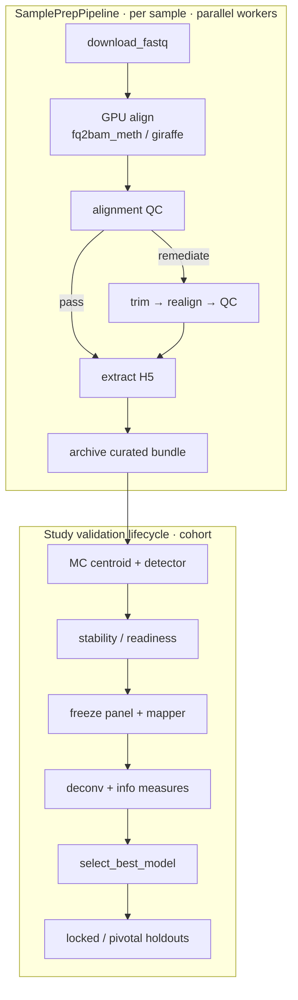
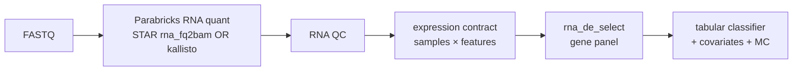
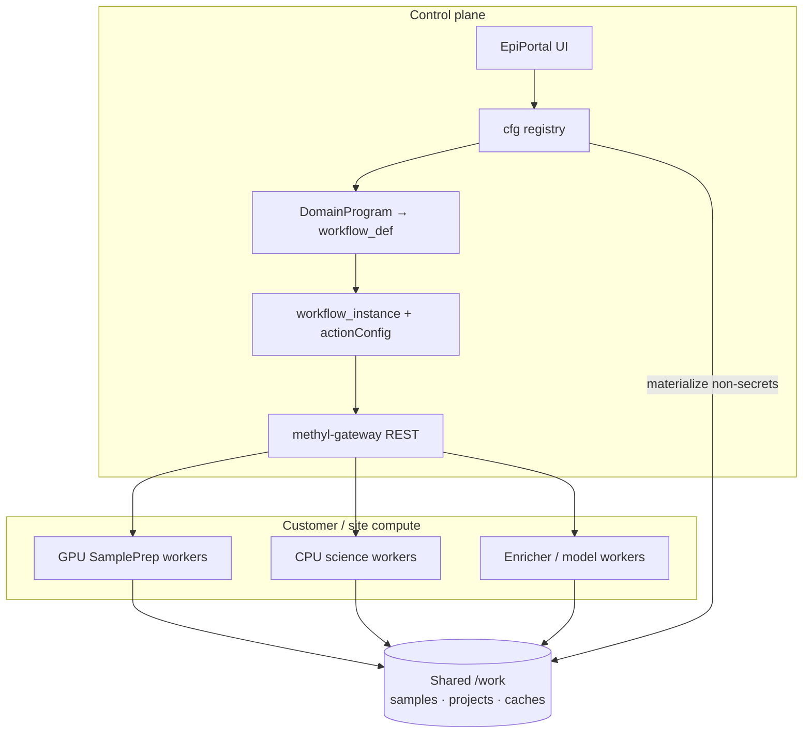
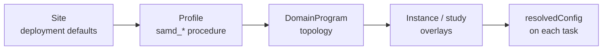
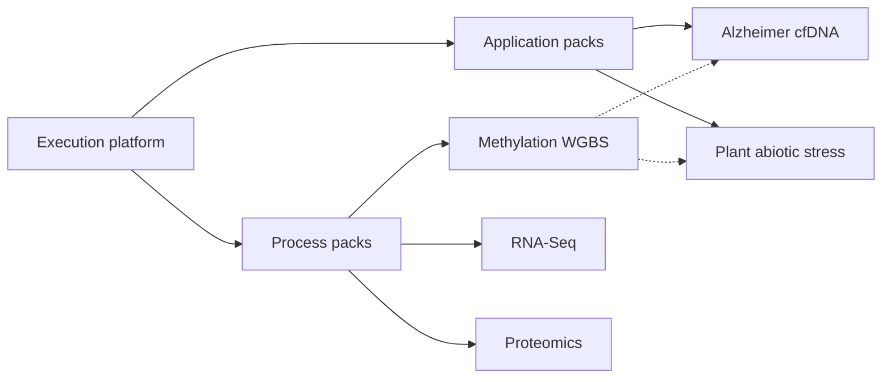
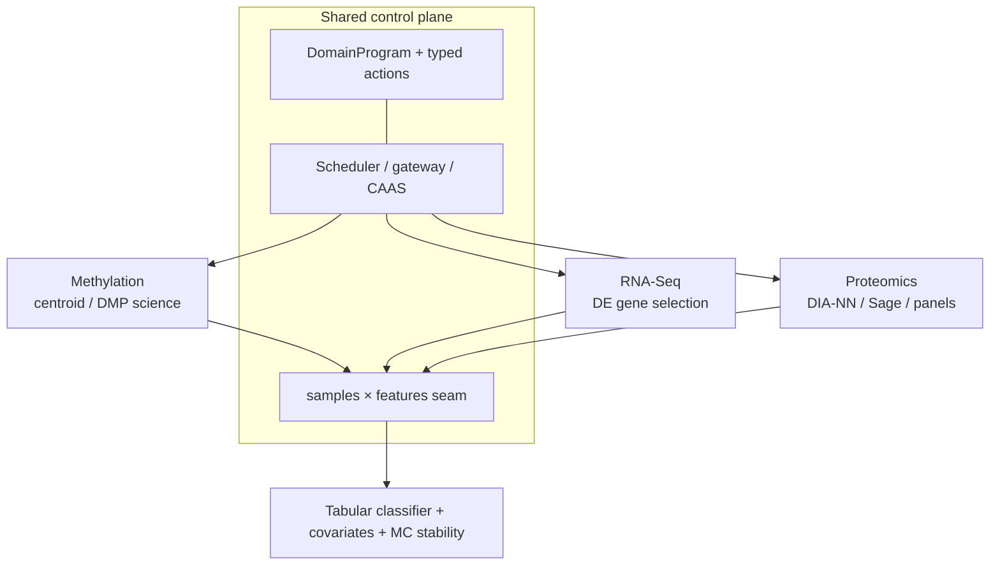
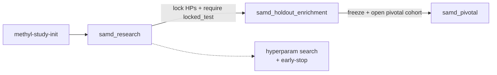
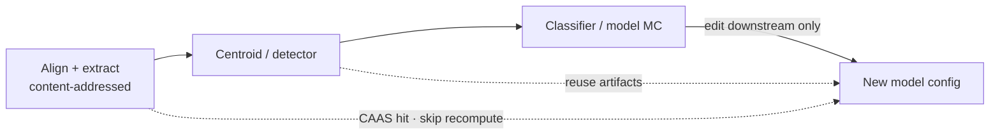
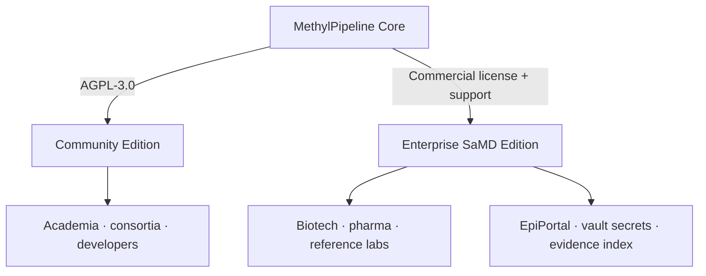
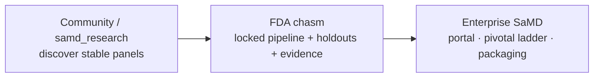

<!-- _class: lead -->

# Regulatory-Ready Platform
## for Multiomics Diagnostics

Commercial briefing

From discovery scripts to auditor-ready evidence — without rebuilding your stack for every assay.

<!-- Open with the pain: FDA path is slow, leaky, and documentation-heavy. -->

---

<!-- _class: invert -->

## The problem buyers already feel

- Biomarker → authorization (**510(k)** / **De Novo** / **PMA**, plus **CLIA**/LDT) is historically **slow**.
- Validation fails quietly: train/holdout **leakage**, ad hoc notebooks, unreproducible “final” runs.
- Audits bottleneck on **documentation**, not just science.
- Every new omics modality or indication tends to become a **new product stack**.

> MethylPipeline is built to shrink those failure modes — with config-first science, partition discipline, and submission scaffolds.

---

## Claim boundary (say this early)

> The platform **enforces process and configuration controls** and **assembles evidence packages**. Architecture, SaMD profiles, and filled feasibility packages are **not** FDA clearance or approval.

- Novel diagnostics may need **De Novo** or **PMA**, not only a predicate **510(k)**.
- Laboratory deployment may also implicate **CLIA**.
- We shorten the **software + validation process** path — we do **not** choose or guarantee the regulatory pathway.

---

<!-- _class: lead -->

# Positioning

## Regulatory-Ready Platform for Multiomics Diagnostics

Bridges **bioinformatics R&D engineering** and **regulatory / quality readiness**.

---

## Three pillars of value

  

    <h3>1. R&amp;D agility</h3>
    
New cohorts, modeling backends (ECDF, tabular sklearn, covariates), and cell-type estimation (Houseman / HiTIMED) via <strong>configuration</strong> — not ad hoc scripts.

  

  

    <h3>2. Cloud efficiency</h3>
    
Cluster-parallel workers + <strong>CAAS</strong> skip redundant alignment/extraction when only downstream science changes — lower VM cost on large cohorts.

  

  

    <h3>3. SaMD controls</h3>
    
Guard against statistical contamination, stage clinical-performance claims, and auto-assemble regulatory <strong>evidence scaffolds</strong>.

  

---

<!-- _class: invert -->

## The product is a control plane — not one assay

Buyers purchase:

1. **Execution platform** — DomainProgram language, typed actions, cfg/wf registry, portal, gateway workers, CAAS
2. **Process packs** — omics modalities (methylation, RNA-Seq, proteomics)
3. **Application packs** — indication/trait overlays as **config** on an existing process

Disease-agnostic Analyte-extensible Operator-configurable

---

## DomainProgram: declare the science once

Language power

- A **DomainProgram** is a versioned, typed workflow IR — not a shell script farm.
- Compiles into schedulable graphs for **local** or **distributed** workers.
- Same language expresses SamplePrep, Monte Carlo stability, freeze, model selection, and holdout gates.
- Operators change **topology and parameters through config layers** — workers execute baked `resolvedConfig`.

> Flexibility without coding chaos: new modalities add programs + typed actions on the **same** scheduler, QC gates, and database structures.

---

## DomainProgram topology (methylation process)

<!-- Emphasize remediation branches and cohort stages are declarative — workers claim tasks. -->

---

## Same language, different modality (RNA-Seq process pack)

- Selects quant mode via `actionConfig.rna_align.quant_mode`.
- Reuses scheduler, cfg/wf, CAAS, and the shared feature seam — **not** a separate product stack.
- Remaining gate: representative cohort data + validation evidence (not aligner R&D).

---

## Distributed execution: portal → gateway → workers

- Workers are **stateless claimants** — capability-matched, TLS task payloads.
- Secrets stay in `cfg.credential`; never plain files under `/work`.

---

## Config layers (highest wins) — tune without redeploying science code

| Layer | Who edits | Examples |
|-------|-----------|----------|
| Site | Operators / cluster | genomes, caches, site action caps |
| Profile | Release / procedure pack | `samd_research`, MC knobs |
| DomainProgram | Platform / pack authors | node graph, typed actions |
| Study / instance | Study team | cohorts, partitions, claim gates |

---

## Process packs vs application packs

**Process pack** = new modality  
DomainPrograms, typed actions, QC, profiles on the shared control plane.

**Application pack** = config overlay  
Study manifest, cohorts, partitions, disease/trait overlay — **no new aligner**.

---

## Analyte & disease-process roadmap

| Process / analyte | Status | What ships |
|-------------------|--------|------------|
| Methylation — buffy / cfDNA (oncology) | **In production** | SamplePrep → MC stability → freeze → model; SaMD ladder |
| RNA-Seq | **Research process pack** | STAR/kallisto, RNA QC, DE panel → tabular classifier |
| Proteomics | **Research process pack** | GPU DIA-NN, Sage DDA, panel ingest; Prosit / Casanovo |
| Alzheimer cfDNA | **Research application pack** | Methylation + disease overlay (`neuro-core`); config only |
| Plant abiotic stress | **Research application pack** | Control vs Drought WGBS; multi-crop sites; `plant-stress-core` |

---

## Multiomics on one plane (why this is flexible)

- **Proteomics** adds GPU mass-spec on the same GH200-class workers.
- **Alzheimer** / **plant** prove application packs: indication or trait without forking the platform.

---

## Application pack pattern (config, not code)

  

    <h3>Alzheimer cfDNA</h3>
    
<code>primary_analyte: cfdna</code>

    
Patient-disjoint partitions; <code>mapper.disease_term</code> = Alzheimer's; <code>neuro-core</code> enrichment; Control → MCI → AD progression.

    
<strong>No new actions or aligners.</strong>

  

  

    <h3>Plant abiotic stress</h3>
    
<code>primary_analyte: plant_tissue</code>

    
Binary Control vs Drought across CG/CHG/CHH; Ensembl Plants sites; optional deconv lifecycle; offline <code>plant_traits</code> prior.

    
epi-GBS isolated via separate SamplePrep program.

  

---

## SaMD profile ladder (research → pivotal)

- **Research:** discover stable panels under partition discipline.
- **Holdout enrichment:** locked hyperparameters + locked test patients.
- **Pivotal:** claim-gated clinical-performance evidence packaging.

---

## CAAS: change the classifier, keep the alignment

- `.action_results` bind input/output hashes, CLI versions, environment signatures.
- Large-cohort VM cost drops when science iteration stays **downstream**.
- Provenance chain is ready for quality review — not a slideware promise.

---

<!-- _class: lead -->

# Packaging & GTM

## Open core that captures R&D — Enterprise that closes the FDA chasm

---

## Open-core packaging

---

## Community vs Enterprise

  

    <h3>Community Edition</h3>
    
AGPL-3.0

    <ul>
      <li>LocalWorkflowEngine</li>
      <li>DNA methylation process pack</li>
      <li>CLI tools + <code>samd_research</code></li>
      <li>Goal: citations, adoption, contributions</li>
    </ul>
  

  

    <h3>Enterprise / SaMD Edition</h3>
    
Annual subscription

    <ul>
      <li>Evidence index + traceability packaging</li>
      <li>Pivotal ladder unlocks</li>
      <li>EpiPortal multi-tenant ops</li>
      <li>Zero-trust credentials + GPU SamplePrep support</li>
    </ul>
  

---

## Hybrid cloud (BYOC) for sensitive genomics

**We host / operate**
- EpiPortal control plane
- DB metadata + scheduler
- Non-secret materialization

**Customer keeps**
- Stateless workers on AWS / Azure / on-prem
- `/work` + samples in their boundary
- HIPAA / GDPR data residency

> Bring Your Own Cloud: regulated data never has to leave the customer’s estate.

---

## Who buys — and why

1. **Biotech / diagnostic startups (primary)** — liquid biopsy & multiomics programs that need QA + regulatory framework without building a platform.
2. **Pharma / trial sponsors** — multi-year locked, reproducible workflows for methylation (and other packs) as endpoints.
3. **Reference labs / CROs** — upsell FASTQs into curated classification + evidence packages (oncology, Alzheimer cfDNA, …).

---

## Customer journey: the “FDA chasm”

- **Hook:** free/low-cost research feasibility.
- **Trigger:** promising marker must survive internal + pivotal validation under audit.
- **Upgrade:** pivotal ladder support, portal operations, regulatory packaging.

---

<!-- _class: invert -->

## Why technical buyers say yes

- **Audit trails with low overhead** — hashes, versions, environment signatures in action results.
- **CAAS economics** — skip alignment/extraction across large cohorts when iterating models.
- **Multiomics extensibility** — process packs add DomainPrograms; application packs are config-only overlays.
- **Partition discipline** — development vs locked holdout patients enforced by profiles, not heroics.

---

<!-- _class: lead -->

# Close

## Regulatory-Ready Platform for Multiomics Diagnostics

**Control plane + packs** — not a single hard-coded assay.

**Next step:** live DomainProgram demo · SaMD ladder walkthrough · evidence-scaffold review

<!-- Offer a 30-min technical deep-dive on one modality the prospect cares about. -->
