<!-- _class: lead -->

# Regulatory-Ready Platform
## for Multiomics Diagnostics

Commercial briefing

From discovery scripts to auditor-ready evidence — without rebuilding your stack for every assay.

---

<!-- _class: invert -->

## The problem buyers already feel

| Failure mode | What happens today |
|--------------|-------------------|
| Slow path to market | Biomarker → **510(k)** / **De Novo** / **PMA** (+ **CLIA**) stalls on process, not only science |
| Quiet validation failure | Train/holdout **leakage**, notebooks, unreproducible “final” runs |
| Audit bottleneck | Documentation debt — not missing compute |
| Modality sprawl | Each omics or indication becomes a **new product stack** |

> MethylPipeline shrinks those modes with config-first science, partition discipline, and submission scaffolds.

---

## Claim boundary

> The platform **enforces process and configuration controls** and **assembles evidence packages**. Architecture and SaMD profiles are **not** FDA clearance or approval.

| We do | We do not |
|-------|-----------|
| Shorten the software + validation process path | Choose or guarantee the regulatory pathway |
| Lock partitions, configs, and provenance | Replace clinical judgment or predicate strategy |
| Stage clinical-performance claim gates | Imply every assay is a simple 510(k) |

---

<!-- _class: lead -->

# Positioning

## Control plane + process packs + application packs

Bridges **bioinformatics R&D engineering** and **regulatory / quality readiness**.

---

## Three pillars of value

  

    <h3>1. R&amp;D agility</h3>
    
Cohorts, ECDF / tabular models, covariates, Houseman / HiTIMED — via <strong>configuration</strong>, not ad hoc scripts.

  

  

    <h3>2. Cloud efficiency</h3>
    
Capability-matched workers + <strong>CAAS</strong> skip alignment when only downstream science changes.

  

  

    <h3>3. SaMD controls</h3>
    
Partition discipline, staged clinical-performance claims, and auto-assembled <strong>evidence scaffolds</strong>.

  

---

<!-- _class: invert -->

## What buyers actually purchase

| Layer | What it is |
|-------|------------|
| **1. Execution platform** | DomainProgram IR, typed actions, cfg/wf registry, portal, gateway, CAAS, fleet control |
| **2. Process packs** | Modality science — methylation WGBS, RNA-Seq, proteomics |
| **3. Application packs** | Indication / trait overlays as **config** on an existing process |

Disease-agnostic
Analyte-extensible
Operator-configurable
Config not code

---

## DomainProgram: declare the science once

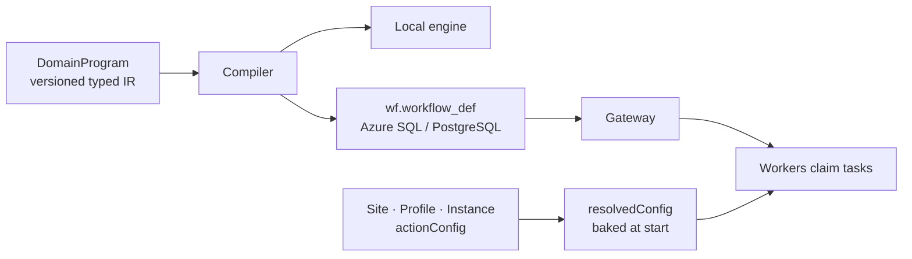

| Strength | Detail |
|----------|--------|
| One language | SamplePrep, MC stability, freeze, model selection, holdouts |
| Config layers | Operators tune parameters without editing Python |
| Worker contract | Tasks carry baked `resolvedConfig` — no profile re-read on the node |

---

## Methylation process pack (production path)

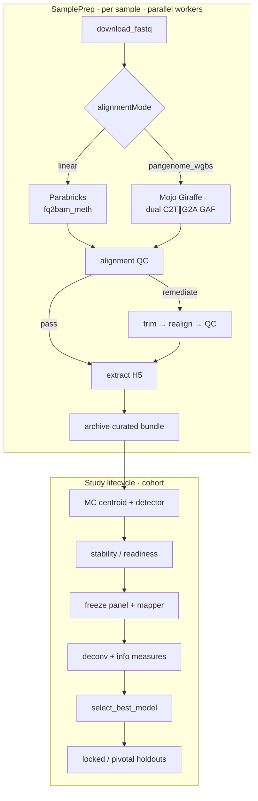

---

## GPU pangenome WGBS (current engineering)

| Capability | Production contract |
|------------|---------------------|
| Dual-graph Align | C2T ∥ G2A → science **GAF** for MethylCall |
| Engine knobs | `actionConfig.methylgrapher_wgbs` → task `resolvedConfig` |
| Backends | `gpu_giraffe` / `mojo_giraffe` / `cpu_vg` (operator-set) |
| Image | `epimethyl/methylgrapher:1.70-mojo` on GH200-class fleet |
| QC path | Mojo QC BAM + conversion-rate sidecars when enabled |

> Linear `fq2bam_meth` remains the comparator; **pangenome_wgbs** is the graph science path — not a separate product.

---

## Same language, RNA-Seq process pack

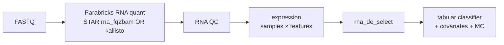

| Shared | Pack-specific |
|--------|---------------|
| Scheduler, cfg/wf, CAAS, feature seam | `actionConfig.rna_align.quant_mode` |
| Portal / gateway / workers | RNA QC thresholds |
| Tabular model MC | STAR vs kallisto branch |

---

## Distributed execution

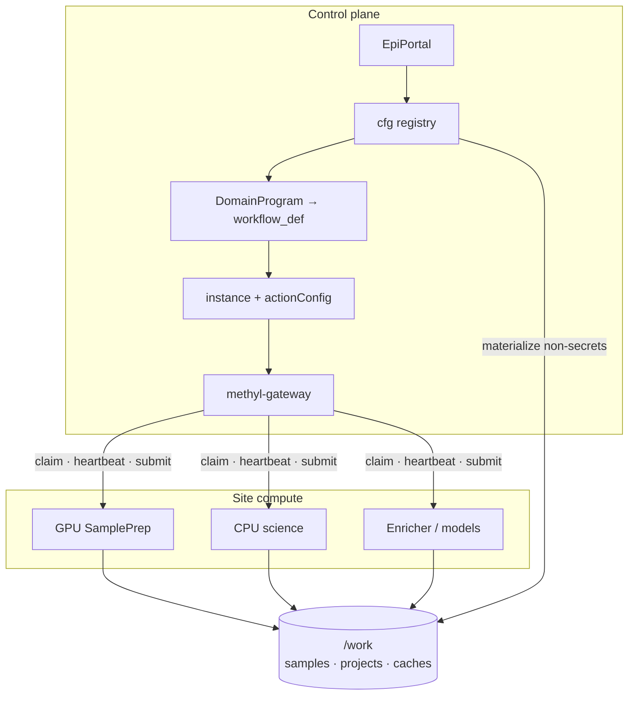

Workers are **stateless claimants**. Credentials stay in `cfg.credential` — never plain files under `/work`.

---

## Config layers — tune without redeploying science code

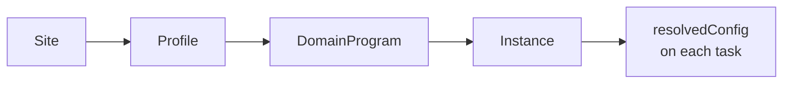

| Layer | Who edits | Examples |
|-------|-----------|----------|
| Site | Operators / cluster | genomes, caches, Align image, fleet caps |
| Profile | Release / procedure | `samd_research`, MC knobs, gene FeatureCuts |
| DomainProgram | Pack authors | topology, typed actions |
| Study / instance | Study team | cohorts, partitions, claim gates |

**Merge:** site → profile → program/instance overlay → analyte fill-missing → *(no Python fallback for tunable knobs)*.

---

## Process packs vs application packs

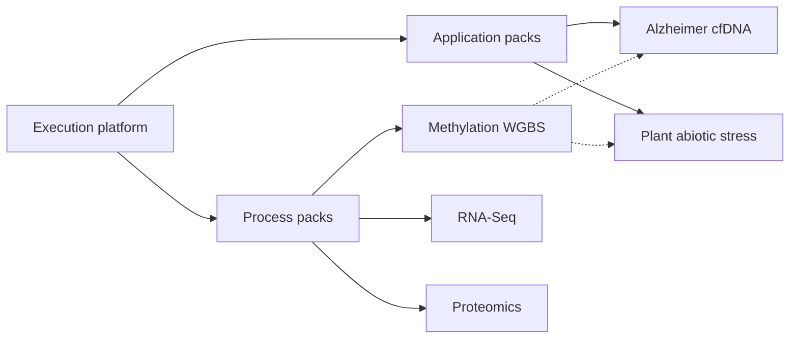

**Process pack** = new modality  
DomainPrograms, typed actions, QC, profiles on the shared control plane.

**Application pack** = config overlay  
Study manifest, cohorts, partitions, disease/trait — **no new aligner**.

---

## Analyte & disease-process roadmap

| Process / analyte | Status | What ships |
|-------------------|--------|------------|
| Methylation — buffy / cfDNA | **Production** | SamplePrep → MC → freeze → model; SaMD ladder; Mojo pangenome_wgbs |
| RNA-Seq | **Research pack** | STAR/kallisto, RNA QC, DE panel → tabular classifier |
| Proteomics | **Research pack** | GPU DIA-NN, Sage DDA, panel ingest; Prosit / Casanovo |
| Alzheimer cfDNA | **Research app pack** | Methylation + `neuro-core` overlay — config only |
| Plant abiotic stress | **Research app pack** | Control vs Drought WGBS; multi-crop sites |

---

## Multiomics on one plane

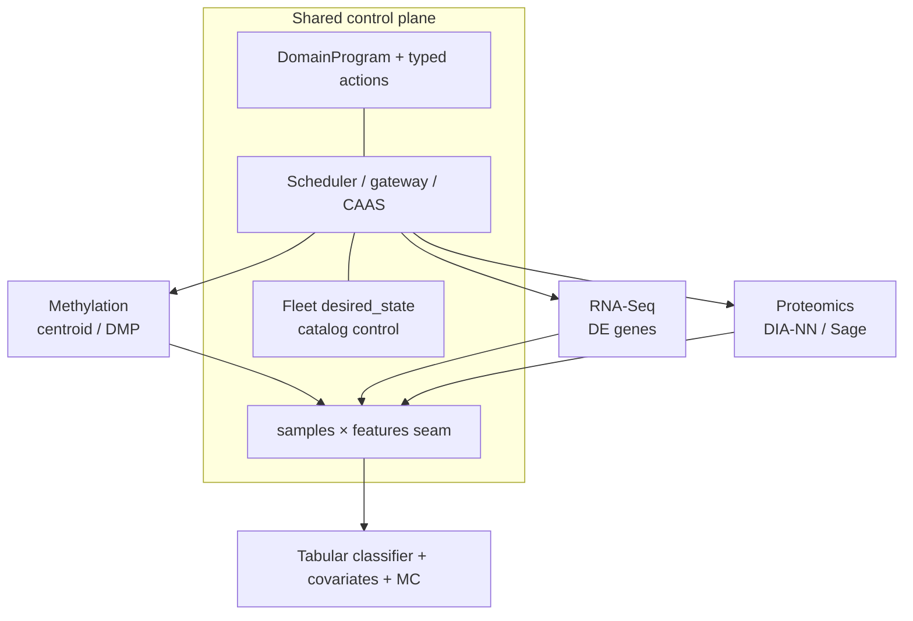

---

## Fleet control without SSH

Operators set worker state from the portal / SQL — workers honor it on claim and heartbeat.

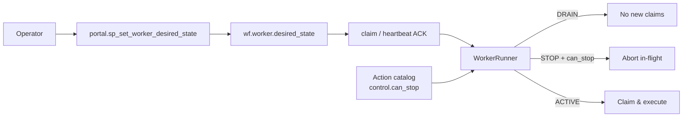

| `desired_state` | Idle | In-flight |
|-----------------|------|-----------|
| **ACTIVE** | Claim | Continue |
| **DRAINING** | Skip claims | Finish current (pause only if `can_pause`) |
| **STOPPING** | Skip claims | Abort if catalog `can_stop` |

Science knobs stay on `actionConfig`. Fleet control stays on worker state + catalog `control`.

---

## Application pack pattern

  

    <h3>Alzheimer cfDNA</h3>
    
<code>primary_analyte: cfdna</code>

    
Patient-disjoint partitions; Alzheimer's disease term; <code>neuro-core</code>; Control → MCI → AD.

    
<strong>No new actions or aligners.</strong>

  

  

    <h3>Plant abiotic stress</h3>
    
<code>primary_analyte: plant_tissue</code>

    
Control vs Drought across CG/CHG/CHH; Ensembl Plants sites; offline trait priors.

    
epi-GBS isolated via separate SamplePrep program.

  

---

## SaMD profile ladder

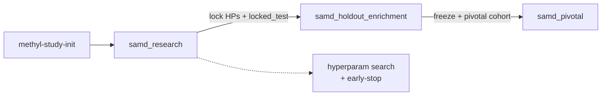

| Profile | Intent |
|---------|--------|
| **samd_research** | Discover stable panels under partition discipline |
| **samd_holdout_enrichment** | Locked hyperparameters + locked test patients |
| **samd_pivotal** | Claim-gated clinical-performance evidence packaging |

---

## CAAS: change the classifier, keep the alignment

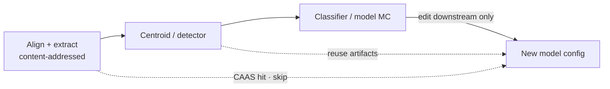

| Mechanism | Why it matters |
|-----------|----------------|
| Input / output signatures | Skip recomputation when science is unchanged |
| CLI + environment binding | Provenance for quality review |
| FOREACH bundle keys | Whole MC iteration short-circuit when safe |

---

<!-- _class: lead -->

# Packaging & GTM

## Open core that captures R&D — Enterprise that closes the FDA chasm

---

## Open-core packaging

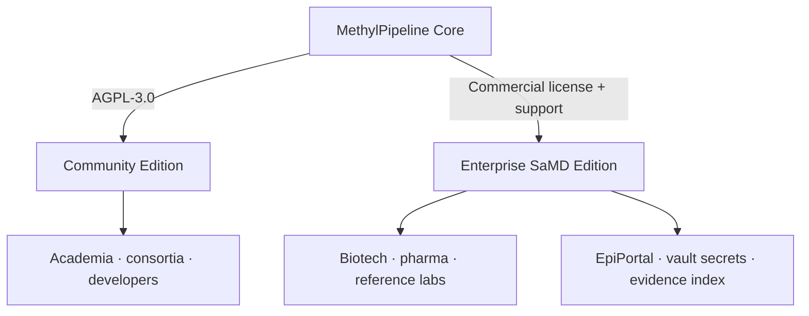

---

## Community vs Enterprise

  

    <h3>Community Edition</h3>
    
AGPL-3.0

    <ul>
      <li>LocalWorkflowEngine</li>
      <li>DNA methylation process pack</li>
      <li>CLI tools + <code>samd_research</code></li>
      <li>Goal: citations, adoption, contributions</li>
    </ul>
  

  

    <h3>Enterprise / SaMD Edition</h3>
    
Annual subscription

    <ul>
      <li>Evidence index + traceability packaging</li>
      <li>Pivotal ladder unlocks</li>
      <li>EpiPortal multi-tenant ops + fleet control</li>
      <li>Zero-trust credentials + GPU SamplePrep support</li>
    </ul>
  

---

## Hybrid cloud (BYOC)

**We host / operate**
- EpiPortal control plane
- DB metadata + scheduler
- Non-secret materialization

**Customer keeps**
- Stateless workers (AWS / Azure / on-prem)
- `/work` + samples in their boundary
- HIPAA / GDPR data residency

> Regulated data never has to leave the customer’s estate.

---

## Who buys — and why

| Buyer | Why MethylPipeline |
|-------|-------------------|
| **Biotech / diagnostic startups** | Liquid biopsy & multiomics without building a platform |
| **Pharma / trial sponsors** | Locked, reproducible workflows as trial endpoints |
| **Reference labs / CROs** | FASTQs → curated classification + evidence packages |

---

## Customer journey: the “FDA chasm”

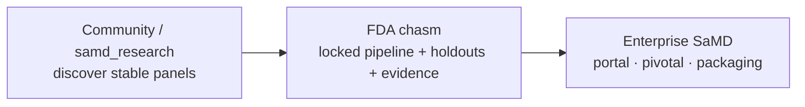

| Stage | Motion |
|-------|--------|
| **Hook** | Research feasibility at low friction |
| **Trigger** | Marker must survive locked + pivotal validation under audit |
| **Upgrade** | Portal ops, pivotal ladder, regulatory packaging |

---

<!-- _class: invert -->

## Why technical buyers say yes

| Capability | Outcome |
|------------|---------|
| Audit trails with low overhead | Hashes, versions, environment signatures in action results |
| CAAS economics | Skip alignment across large cohorts when iterating models |
| Multiomics extensibility | Process packs add programs; application packs are config-only |
| Partition discipline | Development vs locked holdout enforced by profiles |
| Fleet control | Drain / stop workers from portal — no SSH to GPU nodes |
| Config not code | Science knobs in site/profile/instance — never magic numbers in Python |

---

<!-- _class: lead -->

# Close

## Regulatory-Ready Platform for Multiomics Diagnostics

**Control plane + packs** — not a single hard-coded assay.

**Next step:** live DomainProgram demo · SaMD ladder walkthrough · evidence-scaffold review
