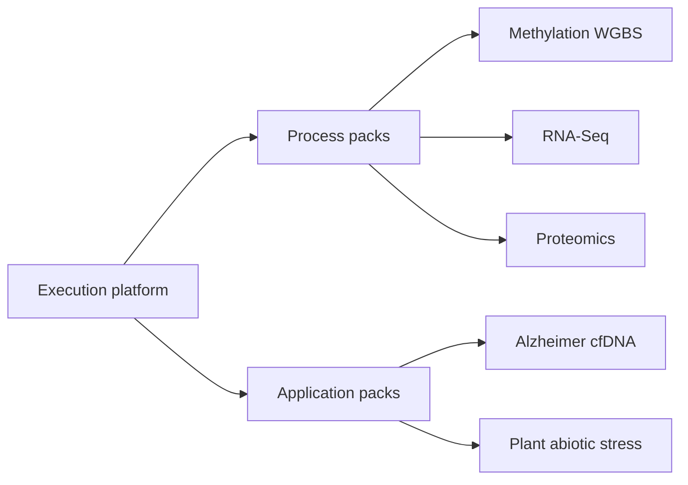
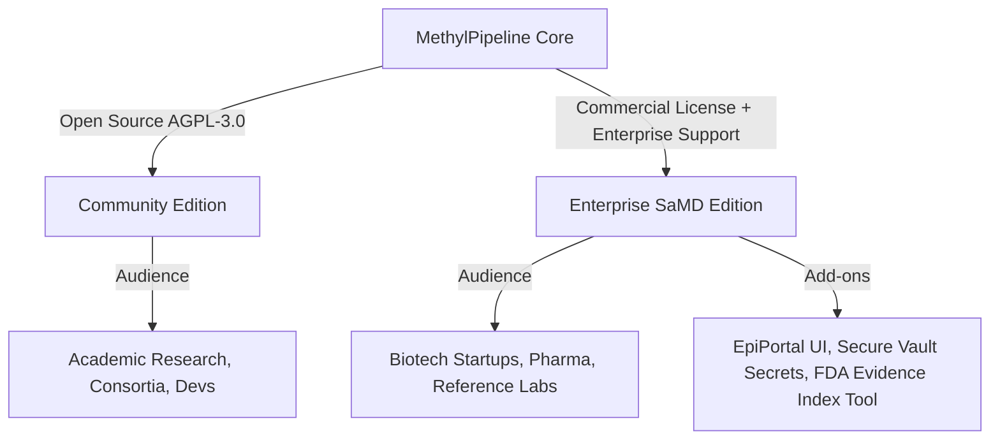
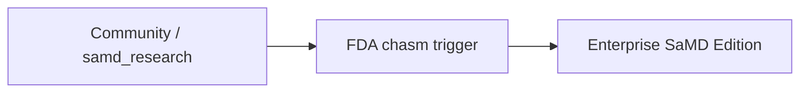

# Regulatory-Ready Platform
## for Multiomics Diagnostics

Audience: biotech / pharma / lab buyers and technical leads

---

## Positioning

- Bridges **bioinformatics R&D engineering** and **regulatory / quality readiness**.
- Reduces failure modes that slow diagnostic development:
  - validation errors (e.g. train/holdout leakage)
  - documentation and audit bottlenecks
- Config-first science, enforced partition discipline, submission-oriented evidence scaffolds.

<!-- speaker-note: Product shortens software + validation process path; it does not choose or guarantee the regulatory pathway. -->

---

## Claim boundary

- Platform **enforces process and configuration controls**.
- Platform **assembles evidence packages**.
- Architecture, SaMD profiles, and filled feasibility packages are **not** FDA clearance or approval.
- Pathway honesty: novel diagnostics may need **De Novo** or **PMA** (not only **510(k)**); labs may also implicate **CLIA**.

---

## Three pillars

1. **R&D agility without coding chaos** — cohorts, modeling backends, cell-type estimation via configuration, not ad hoc scripts.
2. **Production-scale cloud efficiency** — cluster-parallel execution + Content-Addressed Action Store (CAAS) skips redundant work when only downstream steps change.
3. **SaMD-oriented process controls** — guard against statistical contamination; stage clinical-performance claims; auto-assemble regulatory submission scaffolds.

---

## Platform + packs (not a single assay)

- **Process pack** = omics modality (programs, typed actions, QC, profiles).
- **Application pack** = config overlay on an existing process (indication / trait).
- Buyers purchase a **platform** with a growing pack set.

---

## Analyte and disease-process roadmap

| Process / analyte | Status | Notes |
|-------------------|--------|--------|
| Methylation — buffy / cfDNA | **Production** | SamplePrep → MC → freeze → model; SaMD ladder |
| RNA-Seq | **Research pack** | Process pack; STAR / kallisto; DE → tabular classifier |
| Proteomics | **Research pack** | DIA-NN / Sage / panel ingest; shared feature seam |
| Alzheimer cfDNA | **Research app** | Application pack on methylation (config overlay) |
| Plant abiotic stress | **Research app** | Drought WGBS application pack; multi-crop sites |

---

## Open-core packaging

---

## Community Edition

- **Model:** Open source under **AGPL-3.0** (copyleft for network/SaaS use).
- **Included:**
  - Local workflow engine
  - Standard DNA methylation process pack
  - Basic CLI tools
  - Research profiles (e.g. `samd_research`)
- **Goal:** Citations, academic adoption, developer contributions.

---

## Enterprise / SaMD Edition

- **Model:** Annual subscription (per worker node or deployment site) + support.
- **Included:**
  - Regulatory suite (validation evidence index + traceability packaging)
  - Pivotal SaMD ladder (`samd_holdout_enrichment`, `samd_pivotal`)
  - Multi-tenant control plane (EpiPortal UI)
  - Enterprise security (DB credentials → TLS task payloads; never plain files under `/work`)
  - Supported NVIDIA Parabricks GPU SamplePrep paths

---

## Hybrid cloud (BYOC)

- Genomic data is sensitive (**HIPAA**, **GDPR**).
- **Bring Your Own Cloud:**
  - Host control plane (EpiPortal + DB metadata / scheduler)
  - Customer runs workers against their AWS/Azure (or other) cluster
  - `/work` and samples stay in the customer environment

---

## Who is the buyer?

1. **Biotech and diagnostic startups (primary)** — liquid biopsy / multiomics programs needing QA + regulatory framework without building a platform.
2. **Pharma / clinical trial sponsors** — multi-cohort longitudinal endpoints; locked, reproducible workflows over years.
3. **Clinical reference labs / CROs** — upsell FASTQs into curated classification and evidence packages.

---

## Customer journey (“FDA chasm”)

- **Research / feasibility (free or low cost):** discover stable panels under `samd_research`.
- **Commercial trigger:** move to locked pipeline, holdout discipline, auditor-facing evidence package.
- Upgrade for pivotal ladder support, portal ops, and regulatory packaging.

---

## Codebase-backed selling points

- **Audit trails with low overhead** — action results record hashes, CLI versions, environment signatures.
- **Cost savings via CAAS** — change only a downstream step; skip alignment/extraction across large cohorts.
- **Multiomics extensibility** — new process packs reuse scheduler, QC gates, and DB structures; application packs are config-only overlays.

---

## Takeaways

- Position: **Regulatory-Ready Platform for Multiomics Diagnostics**.
- Sell the **control plane + packs**, not a single hard-coded assay.
- Open core captures R&D mindshare; Enterprise closes the validation / evidence gap.
- Next conversation: live demo, SaMD ladder walkthrough, or evidence-scaffold review.
