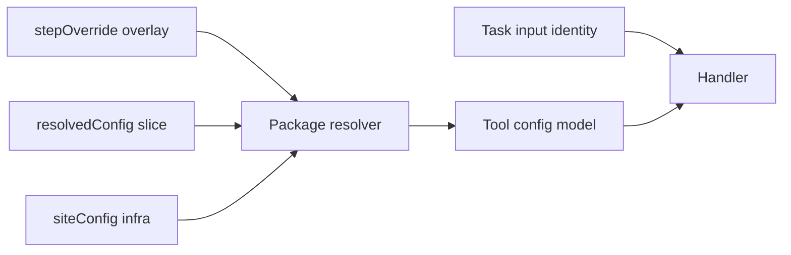

# Workflow action parameter contract

Every catalog action follows the same boundary: **task input models carry workflow-bound identity** (and optional typed `stepOverride`); **operator-tunable science parameters** resolve from profile/site `actionConfig` into task `resolvedConfig`.

Runtime envelope keys (`resolvedConfig`, `siteConfig`, `actionConfig` on instance context) are stripped before Pydantic validation on the worker.

**CI guard:** `python scripts/check_task_input_config_boundary.py` — fails when wire fields overlap package config schema keys (allowlisted identity fields excluded).

**Related:** [config parameter matrix](config-parameter-matrix.md), [domain program language](domain-program-language.md), [`.cursor/rules/config-not-code.mdc`](../../.cursor/rules/config-not-code.mdc).

## Resolution flow



| Layer | Owns | Must NOT own |
|-------|------|--------------|
| Task input | `sampleId`, `projectPath`, `chromosome`, `comparison`, `runDir`, scope-bound trim counts, … | Threads, BA targets, gene/DMP caps, detection thresholds |
| `resolvedConfig` | Merged `actionConfig` slice for `action_config_key` | Scope variables (`qcPass`, `iterations[]`) |
| `stepOverride` | Per-invocation MC/program overlays | Duplicates of profile defaults |
| Study manifest | Cohorts, comparisons, chromosomes, paths | `step_config` (rejected) |

## Sample prep actions

| Action | External input fields | `action_config_key` | `stepOverride` |
|--------|----------------------|---------------------|----------------|
| `sample.download_fastq` | `sampleId`, `sampleDir`, `fastqSource` | — | — |
| `sample.parabricks_fq2bam` | `sampleId`, `sampleDir`, `projectPath` | `parabricks` | — |
| `sample.parabricks_giraffe` | `sampleId`, `sampleDir`, `projectPath` | `parabricks` | — |
| `sample.methylgrapher_wgbs_align` | `sampleId`, `sampleDir`, `projectPath` | `methylgrapher_wgbs` | — |
| `sample.methylgrapher_wgbs_extract` | `sampleId`, `sampleDir`, `projectPath` | `methylgrapher_wgbs` | — |
| `sample.trim_fastq` | `sampleId`, `sampleDir`, `trimFront1/2`, `trimTail1/2`, `remediationReason` | — | — |
| `sample.methyl_qc` | `sampleId`, `sampleDir`, `projectPath` | `alignment_qc` | — |
| `sample.fragmentomics` | `sampleId`, `sampleDir`, `projectPath` | `fragmentomics` | — |
| `sample.methyl_extract` | `sampleId`, `sampleDir`, `projectPath` | `methyl_extract` | — |
| `sample.extraction_qc` | `sampleId`, `sampleDir`, `projectPath` | `extraction_qc` | — |
| `sample.archive_sample` | `sampleId`, `sampleDir`, `sampleDestination`, `h5Destination` (deprecated alias), `mode`, `rejectReason`, `alignmentQcPath`, `qcPath`, `projectPath`, `h5Files` | — | — |
| `sample.delete_fastqs` | `sampleId`, `sampleDir` | — | — |
| `sample.delete_bam` | `sampleId`, `sampleDir` | — | — |
| `sample.qc_failed` | `sampleId`, `sampleDir`, `reason` | — | — |

**Removed:** `sample.upload_h5` — use `sample.archive_sample` with `sampleDestination` (FASTQs, QC JSON, H5, manifests).

**Archive skip output** (when `sampleDestination` is absent): `status=skipped`, `sampleArchived=false`, `archiveSkipped=true`, `skipReason=sample_destination_not_configured`, `missingConfiguration=["sampleDestination"]`.

Parabricks image, BWA threads, and reference FASTA resolve from site `reference_genome` + `actionConfig.parabricks` (not wire). Methyl extract `min_mapq`, `min_phred`, `extract_contexts`, etc. resolve from `actionConfig.methyl_extract`.

**methylGrapher WGBS** (`actionConfig.methylgrapher_wgbs` / site `pangenome_wgbs_genome`): C2T/G2A index paths, `index_prefix`, `ref_paths`, `cpg_tsv`, `linear_ref_fasta`, plus operator knobs `image` (`:1.70-mojo-cuda` / `:1.70-mojo-rocm`), `engine` (`mojo` canonical; `python` dev/parity), `align_engine` (`gpu_giraffe` / `mojo_giraffe` canonical; `cpu_vg` only for unknown GPU vendors), `threads`, `directional`, `gpu_giraffe_fallback`, `giraffe_device` (`auto`/`nvidia`/`amd`), `mojo_giraffe_ready`, `mojo_segments_cache`, `modular_cache_dir`, `qc_bam_engine`, `conversion_rate_enabled`, `conversion_rate_sidecar`, `read_level`. On known NVIDIA/AMD fleets DeviceContext failure is **fail-closed** — not a switch to Clara Parabricks (Clara is an **explicit** `alignmentMode: linear|pangenome` / `actionConfig.parabricks` choice). Workers materialize Mojo/GPU knobs from task `resolvedConfig` into container `-e` — **not** from host `worker.env`. Procedure packs may overlay science knobs; site image/engine must survive merge (guarded by `methyl-cfg verify-workflow` bake check). See [`mojo-multi-gpu-dual-align.md`](../architecture/mojo-multi-gpu-dual-align.md).

**Alignment QC remediation (WGBS):** `actionConfig.alignment_qc.cycle_screening.remediate_without_cycles` + `fallback_trim_front` / `fallback_trim_tail` enable `REALIGN_TRIM` when Picard cycle metrics are absent but conversion/mapped-rate signals fail. Bisulfite sidecar: `actionConfig.alignment_qc.bisulfite_conversion`.

## Pipeline / modeling actions

| Action | External input fields | `action_config_key` | `stepOverride` type |
|--------|----------------------|---------------------|---------------------|
| `pipeline.centroid` | `projectPath`, `group`, `chromosome`, `context`, `comparison`, `outputDir`, `centroid1Dir`, `centroid2Dir` | `centroid` | `CentroidStepOverride` |
| `pipeline.detector` | same + `fixedDmpPanel` | `detection` | `DetectorStepOverride` |
| `pipeline.dmp_select` | `projectPath`, `group`, `chromosome`, `context`, `comparison`, `discoveryCsv`, `outputDir` | `dmp_selection` | `DmpSelectStepOverride` |
| `pipeline.mapper` | `projectPath`, `group`, `stepOverride` | `mapper` | `MapperStepOverride` |
| `pipeline.enricher` | `projectPath`, `comparison`, `outputDir` | `enricher` | `EnricherStepOverride` |
| `pipeline.gene_select` | `projectPath`, `runDir`, `comparison`, `biomarkerFilter` | `gene_selection` | — |
| `pipeline.gene_feature_select` | `mapperDir`, `outputDir` | `gene_selection` | — |
| `pipeline.progression` | `projectPath`, `orderedComparisonLabels`, `outputDir` | `progression` | `ProgressionStepOverride` |
| `pipeline.classifier` | `projectPath`, `group`, `outputDir`, `fixedDmpPanel` | `classifier` | `ClassifierStepOverride` |
| `pipeline.predictor` | `projectPath`, `group`, `outputDir` | `predictor` | `PredictorStepOverride` |

Gene caps (`maxGenes`, `maxDmps`) are **not** on wire for `pipeline.gene_select` / `pipeline.gene_feature_select` — injected at argv build from `resolvedConfig.gene_selection` only.

MC iterations use `mc_config.json` + program `stepOverride`; `mapper_step_override.json` and `detector_step_override.json` sidecars are retired.

## Validation actions

| Action | External input fields | `action_config_key` | Notes |
|--------|----------------------|---------------------|-------|
| `validation.plan_iterations` | `projectPath`, `featureIterations`, `qualityIterations`, `seed`, `trainFraction`, `layout`, `overwrite`, worker tool names, `orderedComparisonLabels` | `validation` | Uses `ValidationPlanRequest` from `methyl_validation` |
| `validation.stability` | `projectPath`, `monteCarloRunsRoot`, `outputDir` | `validation` | |
| `validation.biomarker_filter` | `projectPath`, `runDir` | `validation` | |
| `validation.prepare_freeze_project` | `projectPath`, `sourceRunDir`, `targetRunDir`, `productionOutputDir` | `validation` | |
| `validation.stability_freeze_readiness` | `projectPath`, `outputDir` | `validation` | |
| `validation.model_mc` | `projectPath`, `monteCarloRunsRoot`, `modelMcRoot`, optional `backends` | `validation` | |
| `validation.select_best_model` | `projectPath`, `modelMcRoot`, `selectionMetric` | `validation` | |
| `validation.post_model_validation` | `projectPath`, `outputDir` | `validation` | |
| `validation.link_artifacts` | `projectPath`, `sourceRunDir`, `targetRunDir`, `bundleDir` | — | **internal** |
| `validation.model_bundle` | `projectPath`, `bundleDir`, `bundleH5` | — | **internal** |
| `validation.model_train` | `projectPath`, `modelMcRoot`, `backend` | — | **internal** |
| `validation.model_predict` | `projectPath`, `modelMcRoot`, `backend` | — | **internal** |

Internal validation sub-actions are invoked by `validation.model_mc`; they remain in the catalog with `internal: true` for schema export only.

## Troubleshooting

| Symptom | Fix |
|---------|-----|
| Task validation failed: forbidden field `maxGenes` | Move to profile `actionConfig.gene_selection.max_genes` |
| `methylGrapher image not configured` | Pin `actionConfig.methylgrapher_wgbs.image` on site; re-bake instance context; run `methyl-cfg verify-workflow` |
| Task validation failed: forbidden field `referenceFasta` | Set site `reference_genome.fasta` or profile `actionConfig.parabricks` |
| Task validation failed: `profileActionConfig` | Use `resolvedConfig` only (legacy alias removed) |
| MC iteration missing detector overrides | Ensure `mc_config.json` snapshot + program `stepOverride`; do not rely on sidecar JSON beside `project.json` |

## Regenerate schemas

```bash
source .venv/bin/activate
methyl-export-task-schemas
methyl-export-action-catalog
python scripts/check_task_input_config_boundary.py
```
