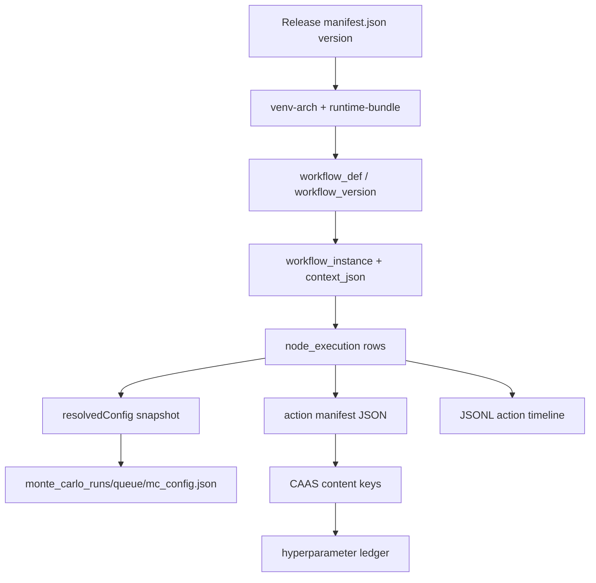

# Traceability and provenance

> **Canonical** map from release identity through workflow execution to science artifacts.

## Identity chain



## Layers

| Layer | Artifact | Location |
|-------|----------|----------|
| **Release** | `manifest.json`, wheels, `runtime-bundle/` | `/work/goliath/releases/<ver>/`, `current` symlink |
| **Workflow definition** | Compiled `WorkflowDefinitionSpec` | `wf.workflow_version.spec_json` |
| **Instance** | `context_json` (projectPath, profile, merged `actionConfig`) | `wf.workflow_instance` |
| **Node execution** | Status, lease, `input_json`, `output_json`, `result_code` | `wf.node_execution` |
| **Resolved config** | Per-action tunables at instance configure time | `context_json.resolvedConfig`, MC `mc_config.json` |
| **Action manifest** | CLI argv, paths, timing | Worker log + `output_json.manifest` |
| **Science outputs** | DMP CSVs, models, QC JSON | `/work/projects/<study>/<project_name>/` |

## Correlation identifiers

| ID | Use |
|----|-----|
| `workflow_instance_id` | Operator status, gateway poll |
| `node_execution_id` | Worker claim/submit |
| `workflow_version_id` | Smoke scripts, preset deploy |
| `iteration_id` / MC run folder | `monte_carlo_runs/run_<n>/` |
| `content_key` (CAAS) | Skip/reuse hyperparameter results |

## Regulatory bridge

Product-control matrix: [`regulatory/traceability-matrix.md`](../regulatory/traceability-matrix.md).

Evidence index: [`regulatory/validation-evidence-index.md`](../regulatory/validation-evidence-index.md) (when present).

## Operator queries

```sql
-- Instance status (PostgreSQL / MSSQL dialect may differ slightly)
SELECT instance_id, status, context_json->>'projectPath' AS project_path
FROM wf.workflow_instance
WHERE instance_id = :id;

SELECT node_id, action_name, status, result_code, started_at, finished_at
FROM wf.node_execution
WHERE instance_id = :id
ORDER BY node_id;
```

## Related

- [Logging and observability](logging-observability.md)
- [Idempotency, retry, lease](../architecture/workflow-idempotency-retry-lease.md)
- [Layer model](../architecture/layer-model.md)
