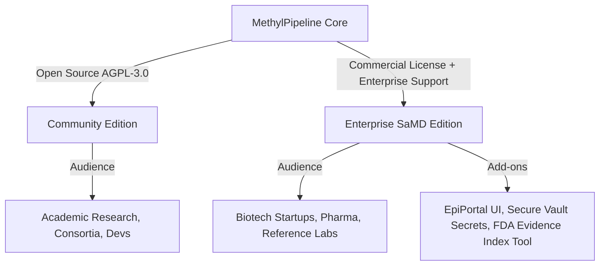

# Regulatory-Ready Platform for Multiomics Diagnostics

If **MethylPipeline** were packaged and sold as a commercial product, its
positioning would bridge **bioinformatics R&D engineering** and **regulatory /
quality system readiness** for diagnostic development.

Moving a biomarker or multiomics discovery from laboratory R&D toward FDA
authorization (commonly **510(k)**, **De Novo**, or—when required—**PMA**, plus
laboratory frameworks such as **CLIA** / LDT practice) is historically slow,
vulnerable to validation errors (for example train/holdout leakage), and
bottlenecked by documentation audits. MethylPipeline is built to reduce those
failure modes with config-first science, enforced partition discipline, and
submission-oriented evidence scaffolds.

> **Claim boundary:** The platform **enforces process and configuration controls**
> and **assembles evidence packages**. Architecture, SaMD profiles, and filled
> feasibility packages are **not** FDA clearance or approval. See
> [samd-submission-scaffold.md](samd-submission-scaffold.md).

---

## 1. Core value proposition

Position MethylPipeline as the **"Regulatory-Ready Platform for Multiomics
Diagnostics."** Messaging rests on three pillars:

* **R&D agility without coding chaos.** Scientists test new cohorts, modeling
  backends (ECDF, tabular scikit-learn, covariates), and cell-type estimation
  (Houseman / HiTIMED) through a configuration-first surface
  ([config-parameter-matrix.md](../reference/config-parameter-matrix.md)), not
  ad hoc scripts.
* **Production-scale cloud efficiency.** Cluster-parallel execution and the
  Content-Addressed Action Store
  ([CAAS](../usage/17-content-addressed-action-store.qmd)) skip redundant work
  when only downstream steps change, reducing VM cost on large cohorts.
* **SaMD-oriented process controls.** Code and profiles guard against statistical
  contamination (for example mixing development and locked holdout patients),
  stage clinical-performance claims, and help auto-assemble regulatory
  submission **scaffolds**
  ([samd-submission-scaffold.md](samd-submission-scaffold.md)).

### Analyte and disease-process roadmap

The **execution platform** (DomainProgram, typed actions, cfg/wf, portal,
gateway workers, CAAS) is disease- and analyte-agnostic. Shipped science packs
today are strongest on **DNA methylation WGBS** (buffy coat and cfDNA), including
oncology cohorts. Near-term process packs use the same control plane:

| Process / analyte | Status | Notes |
|-------------------|--------|--------|
| Methylation — buffy coat / cfDNA (e.g. oncology) | **In production use** | SamplePrep → MC stability → freeze → model; SaMD ladder |
| RNA-Seq (transcriptomics) | **Shipped process pack (research)** | Second omics modality (`regulatory.primary_modality: rnaseq`). Quantify with NVIDIA Clara Parabricks `pbrun rna_fq2bam` (STAR) or `pbrun kallisto`, selectable via `actionConfig.rna_align.quant_mode` — parallel to the methylation `fq2bam_meth` / giraffe SamplePrep path. Ships typed actions, RNA QC, a per-sample expression contract, and DE gene-panel + tabular classification; remaining gate is representative cohort data and validation evidence, not aligner R&D. |
| Methylation — cfDNA Alzheimer detection | **Shipped application pack (research)** | Disease application on the methylation process (`primary_analyte: cfdna`). Ships as config — study manifest, cohorts, patient-disjoint partitions, and a disease overlay (`mapper.disease_term` = Alzheimer's disease, `neuro-core` enrichment preset, progression) — with **no** new actions or aligners. Remaining gate is representative cohort data and validation evidence. Pattern: [application packs](../usage/24-methylation-application-packs.qmd). See [Alzheimer cfDNA pack](../usage/21-alzheimer-cfdna-pack.qmd). |
| Methylation — plant abiotic stress (Arabidopsis + crops) | **Shipped application pack (research)** | Trait application on the methylation process: binary Control vs Drought WGBS (`primary_analyte: plant_tissue`) across CG/CHG/CHH. Reuses methylation science and `samd_research`; plant-specific unblockers are config plus a thin lifecycle fork — `plant_tissue` analyte, Ensembl Plants site recipes (TAIR10, soybean Wm82, maize B73, wheat IWGSC), no blood cell deconvolution, `plant-stress-core` preset, offline `plant_traits` gene↔trait prior (not Open Targets) — with **no** new aligner or workflow action. Grafting / trait-introgression is a planned separate pack. Pattern: [application packs](../usage/24-methylation-application-packs.qmd). See [Plant abiotic stress pack](../usage/23-plant-abiotic-stress-pack.qmd). |
| Proteomics | **Shipped process pack (research)** | Third omics modality (`regulatory.primary_modality: proteomics`). Three ingest modes: GPU DIA-NN on the Lambda/Nebius GH200 VMs (own image + capability, not Parabricks); CPU **DDA via Sage** (Apache-2.0 Rust, the open replacement for MSFragger); and CPU panel-matrix ingest (Olink/SomaScan/open). Plus Prosit rescoring / in-silico libraries and Casanovo de novo (GPU). Shares a generalized `samples x features` seam with RNA-Seq feeding the tabular classifier, covariate stacking, and MC stability. See [Proteomics process pack](../usage/22-proteomics-process-pack.qmd). |

Buyers purchase a **platform** with a growing set of **process packs** (omics
modalities) and **application packs** (config overlays for an indication or
trait)—not a single hard-coded assay. RNA-Seq is the first multiomics *process*
pack to ship on this control plane (its own DomainPrograms, typed actions,
profile, and QC gates reusing the scheduler, cfg/wf, and CAAS); **proteomics** is
the second, adding GPU mass-spec search (DIA-NN, plus Prosit/Casanovo) on the same
NVIDIA GH200 VMs and sharing a common feature seam with RNA-Seq. Alzheimer cfDNA
and plant abiotic stress are *application* packs on the methylation process. See
[RNA-Seq process pack](../usage/20-rnaseq-process-pack.qmd),
[Proteomics process pack](../usage/22-proteomics-process-pack.qmd), and
[Methylation application packs](../usage/24-methylation-application-packs.qmd).

---

## 2. Product packaging and licensing models

To capture early R&D mindshare and high-value commercial contracts, adopt an
**open-core** model with a clear license boundary.

#### A. Community Edition (open core)

* **Model:** Open source under **AGPL-3.0** (copyleft for network/SaaS use;
  drives upgrade when vendors productize without contributing).
* **Included:** Local workflow engine (`LocalWorkflowEngine`), standard DNA
  methylation process pack (alignment, extraction, QC, centroid, ECDF
  classifiers), basic CLI tools, and research-oriented profiles such as
  `samd_research`.
* **Goal:** Citations, academic adoption, and developer contributions.

#### B. Enterprise / SaMD Edition (commercial license)

* **Model:** Annual subscription (per active worker node or named deployment
  site), plus support. Optional per-assay / per-submission packaging for
  regulated buyers.
* **Included:**
  * **Regulatory suite:** Assisted generation and packaging of
    [validation-evidence-index.md](validation-evidence-index.md) and
    [traceability-matrix.md](traceability-matrix.md) for locked studies.
  * **Pivotal SaMD ladder unlocks:** Operator support and tooling around
    `samd_holdout_enrichment` and `samd_pivotal` (locked holdouts, claim gates)
    as described in
    [samd-submission-scaffold.md](samd-submission-scaffold.md#samd-profile-ladder).
  * **Multi-tenant control plane (EpiPortal UI):** Web UI for laboratory
    operators, Gantt-style run supervision, and admin workflows—**not** a
    direct SQL console for day-2 ops (portal UI → Azure SQL; workers → gateway
    REST only; see [production-platform.md](../deployment/production-platform.md)).
  * **Enterprise security:** Zero-trust credential distribution (`cfg.credential`
    in the DB; secrets expanded into task payloads over TLS—never as plain files
    under `/work`).
  * **Hardware acceleration:** Supported NVIDIA Parabricks GPU paths for
    alignment-heavy SamplePrep.

#### C. Hybrid cloud (SaaS control plane + BYOC)

Genomic data is sensitive (HIPAA, GDPR). Offer **Bring Your Own Cloud (BYOC)**:
host the control plane (EpiPortal + DB metadata / scheduler); customers run
stateless workers against their own AWS/Azure (or other) cluster where `/work`
and samples reside.

---

## 3. Go-to-market (GTM) strategy

### Who is the buyer?

1. **Biotech and diagnostic startups (primary).** Early-detection liquid biopsy
   and related methylation (or upcoming multiomics) programs that need a ready
   QA / regulatory framework without building a platform from scratch.
2. **Pharma / clinical trial sponsors.** Multi-cohort longitudinal studies using
   methylation (or additional omics packs) as endpoints; need locked,
   reproducible workflows over multi-year periods.
3. **Clinical reference labs / CROs.** Sequencing-as-a-service providers who want
   to upsell FASTQs into curated classification and evidence packages—including
   oncology and **Alzheimer cfDNA** process packs as they ship.

### Customer journey / “hook”

* **Research and feasibility (free / low cost).** R&D uses Community Edition to
  process samples and discover stable panels under `samd_research`.
* **The “FDA chasm” (commercial trigger).** When a promising marker must move to
  internal and pivotal validation—locked pipeline, holdout discipline, and an
  auditor-facing evidence package—the organization upgrades to Enterprise / SaMD
  for pivotal ladder support, portal operations, and regulatory packaging
  ([samd-submission-scaffold.md](samd-submission-scaffold.md#samd-profile-ladder)).

Pathway messaging should stay honest: novel diagnostics may require **De Novo**
or **PMA** rather than a predicate **510(k)**; laboratory deployment may also
implicate **CLIA**. The product shortens the *software and validation process*
path; it does not choose or guarantee the regulatory pathway.

---

## 4. Codebase-backed selling points

For technical stakeholders (CTOs, lead bioinformatics engineers), point at
architecture that already exists:

* **Audit trails with low overhead.** `.action_results` records input/output
  hashes, CLI versions, and environment signatures—a
  [traceability / provenance](../reference/traceability-provenance.md) chain
  suitable for quality review.
* **Cost savings via CAAS.** Changing only a downstream classification step can
  skip alignment and extraction across large cohorts
  ([CAAS](../usage/17-content-addressed-action-store.qmd)).
* **Multiomics extensibility.** New **process packs** add `DomainProgram`s and typed
  actions on the same scheduler, QC gates, and database structures
  ([domain-program-language.md](../reference/domain-program-language.md))—not a
  separate product stack. New **application packs** reuse an existing process with
  config only (manifest, overlay, partitions, optional preset); see
  [Methylation application packs](../usage/24-methylation-application-packs.qmd).
  The shipped **RNA-Seq** process pack demonstrates the modality path: a second
  `primary_modality` reuses the Parabricks GPU SamplePrep pattern
  (`sample.parabricks_rna_fq2bam` / `sample.kallisto`, selected by
  `quant_mode`), adds RNA QC and an expression contract, and swaps the
  methylation centroid/DMP science for differential-expression gene selection
  (`pipeline.rna_de_select`) feeding the same tabular classifier and covariate
  stacking. The shipped **proteomics** process pack adds GPU mass-spec ingest
  (DIA-NN, Prosit, Casanovo) plus CPU panel ingest on the same clusters, reusing a
  generalized `samples x features` seam shared with RNA-Seq. The shipped
  **Alzheimer cfDNA** and **plant abiotic stress** packs are application-pack
  instances on methylation: Alzheimer is a staged Control → MCI → AD disease
  overlay (`neuro-core`); plant drought is a species-agnostic trait overlay
  (`plant_tissue`, multi-crop Ensembl Plants sites, deconvolution-free lifecycle,
  `plant-stress-core`, offline `plant_traits` prior — Open Targets remains human-only).

---

## Related documents

| Document | Role |
|----------|------|
| [Regulatory folder README](README.md) | Index of regulatory synthesis docs |
| [Product and operational controls](methylpipeline-product-and-operational-controls.md) | Feature inventory and control summary |
| [SaMD submission scaffold](samd-submission-scaffold.md) | 510(k) / De Novo-style content map |
| [Production platform](../deployment/production-platform.md) | Day-2 access: portal UI + worker gateway |
| [SaMD study lifecycle (usage ch.18)](../usage/18-samd-study-lifecycle.qmd) | Operator SOP for the profile ladder |
