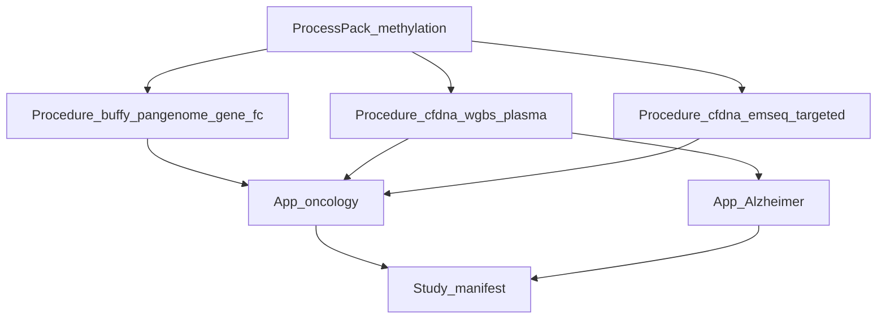
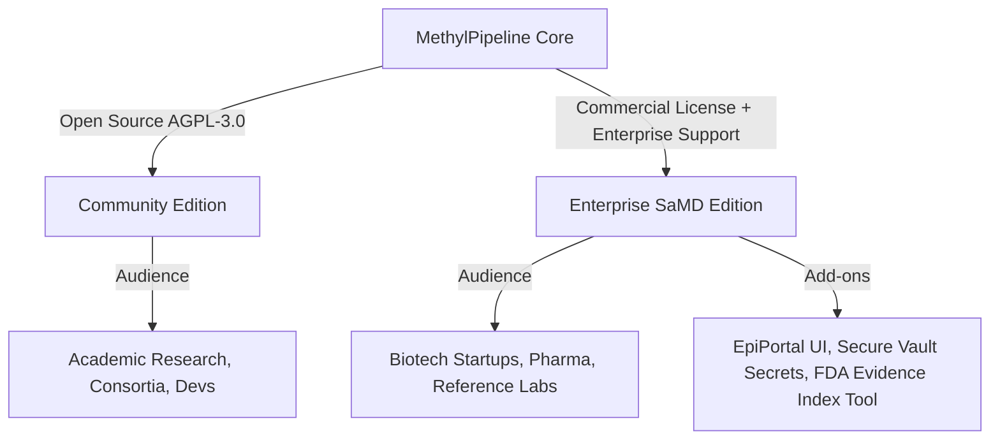

# Regulatory-Ready Platform for Multiomics Diagnostics

If **MethylPipeline** were packaged and sold as a commercial product, its
positioning would bridge **bioinformatics R&D engineering** and **regulatory /
quality system readiness** for diagnostic development.

Moving a biomarker or multiomics discovery from laboratory R&D toward FDA
authorization (commonly **510(k)**, **De Novo**, or—when required—**PMA**, plus
laboratory frameworks such as **CLIA** / LDT practice) is historically slow,
vulnerable to validation errors (for example train/holdout leakage), and
bottlenecked by documentation audits. MethylPipeline is built to reduce those
failure modes with config-first science, enforced partition discipline, and
submission-oriented evidence scaffolds.

> **Claim boundary:** The platform **enforces process and configuration controls**
> and **assembles evidence packages**. Architecture, SaMD profiles, and filled
> feasibility packages are **not** FDA clearance or approval. See
> [samd-submission-scaffold.md](samd-submission-scaffold.md).

---

## 1. Core value proposition

Position MethylPipeline as the **"Regulatory-Ready Platform for Multiomics
Diagnostics."** Messaging rests on three pillars:

* **R&D agility without coding chaos.** Scientists test new cohorts, modeling
  backends (ECDF, tabular scikit-learn, covariates), and cell-type estimation
  (Houseman / HiTIMED) through a configuration-first surface
  ([config-parameter-matrix.md](../reference/config-parameter-matrix.md)), not
  ad hoc scripts. Named **assay procedure packs** (`pipelineProcedure`) give
  one-shot recipes for buffy coat, cfDNA WGBS, and EM-Seq without hand-merging
  aligner, informME, deconvolution, and FeatureCuts knobs.
* **Production-scale cloud efficiency.** Cluster-parallel execution and the
  Content-Addressed Action Store
  ([CAAS](../usage/17-content-addressed-action-store.qmd)) skip redundant work
  when only downstream steps change, reducing VM cost on large cohorts.
* **SaMD-oriented process controls.** Code and profiles guard against statistical
  contamination (for example mixing development and locked holdout patients),
  stage clinical-performance claims, and help auto-assemble regulatory
  submission **scaffolds**
  ([samd-submission-scaffold.md](samd-submission-scaffold.md)).

### Product packaging layers

Buyers purchase a **platform** plus a growing catalog of config packs—not a
single hard-coded assay:

| Layer | Owns | Operator picks |
|-------|------|----------------|
| **Process pack** | Omics modality (actions, DomainPrograms, QC) | `regulatory.primary_modality` (`methylation`, `rnaseq`, `proteomics`) |
| **Assay procedure pack** | How the matrix is sequenced and scored (library protocol, SamplePrep/lifecycle, gene FeatureCuts, covariates) | `pipelineProcedure` (e.g. `buffy_wgbs_pangenome_gene_fc`) |
| **Application pack** | Indication or trait (cohorts, partitions, disease/trait overlay, enrichment preset) | Study manifest + `context_*.json` |

Merge precedence stays config-not-code: **instance → procedure → profile/mode →
analyte → site**. Guide:
[Methylation application packs](../usage/24-methylation-application-packs.qmd)
(procedure JSON under
`workflow_engine/domain/profiles/procedures/`).

### Analyte and disease-process roadmap

The **execution platform** (DomainProgram, typed actions, cfg/wf, portal,
gateway workers, CAAS) is disease- and analyte-agnostic. Shipped science packs
today are strongest on **DNA methylation** (buffy coat and cfDNA), including
oncology cohorts. Near-term packs use the same control plane:

| Pack | Status | Notes |
|------|--------|--------|
| Methylation **process** (WGBS / EM-Seq) | **In production use** | SamplePrep → MC stability → freeze → model; SaMD ladder. |
| Assay procedures — `buffy_wgbs_pangenome_gene_fc` | **In production use** | Default human buffy research: WGBS pangenome (methylGrapher dual C2T/G2A, `alignmentMode: pangenome_wgbs`), read-level informME, Houseman deconv, gene FeatureCuts. Linear alternate: `buffy_wgbs_linear_gene_fc`. Stock Giraffe (`pangenome`) is a separate non-WGBS path. |
| Assay procedures — `cfdna_wgbs_plasma` | **In production use** | Plasma WGBS + fragmentomics, gene FeatureCuts, no cell-deconv lifecycle (`study_validation_lifecycle_no_deconv`). |
| Assay procedures — `cfdna_emseq_targeted` | **Shipped (research)** | Inch-wide / mile-deep: `libraryProtocol: emseq_targeted`, `sample_prep_emseq`, operator panel BED (`methyl_extract.target_panel_bed`), elevated `min_cov`, no deconv. |
| Assay procedures — `plant_wgbs_gene_fc` | **Shipped (research)** | Plant WGBS trait recipe; pairs with `plant_tissue` analyte and plant lifecycle. |
| RNA-Seq **process** | **Shipped (research)** | `primary_modality: rnaseq`. Parabricks `rna_fq2bam` (STAR) or `kallisto` via `actionConfig.rna_align.quant_mode`. Typed actions, RNA QC, expression contract, DE gene-panel + tabular classification. Gate: representative cohorts + validation evidence. |
| Proteomics **process** | **Shipped (research)** | `primary_modality: proteomics`. GPU DIA-NN; CPU DDA via Sage; panel-matrix ingest; Prosit / Casanovo. Shares `samples x features` seam with RNA-Seq. See [ch.22](../usage/22-proteomics-process-pack.qmd). |
| Alzheimer cfDNA **application** | **Shipped (research)** | Disease overlay on `cfdna_wgbs_plasma`: staged Control → MCI → AD, `neuro-core`, progression. No new actions. See [ch.21](../usage/21-alzheimer-cfdna-pack.qmd). |
| Prostate cancer **application** (`App_oncology`) | **Research deep-dive (pack pending)** | Buffy ~30× WGBS, plasma ~30× WGBS, linear vs `pangenome_wgbs` compare gate, and EM-Seq targeted (GRAIL-style chemistry / gatekeeper geometry) on `cfdna_emseq_targeted`. Physician/payer narrative and claim boundaries: [Prostate Cancer Application Deep-Dive](../research/Prostate_Cancer_Application_Deep_Dive.md). Operator pack (`usage/25-*` + `examples/samd/prostate-*`) not yet shipped—follow [ch.24](../usage/24-methylation-application-packs.qmd). |
| Plant abiotic stress **application** | **Shipped (research)** | Trait overlay on `plant_wgbs_gene_fc`: Control vs Drought, multi-crop sites, `plant-stress-core`, offline `plant_traits` prior. See [ch.23](../usage/23-plant-abiotic-stress-pack.qmd). |

See [RNA-Seq process pack](../usage/20-rnaseq-process-pack.qmd),
[Proteomics process pack](../usage/22-proteomics-process-pack.qmd), and
[Methylation application packs](../usage/24-methylation-application-packs.qmd).

---

## 2. Product packaging and licensing models

To capture early R&D mindshare and high-value commercial contracts, adopt an
**open-core** model with a clear license boundary.

#### A. Community Edition (open core)

* **Model:** Open source under **AGPL-3.0** (copyleft for network/SaaS use;
  drives upgrade when vendors productize without contributing).
* **Included:** Local workflow engine (`LocalWorkflowEngine`), DNA methylation
  process pack, shipped **assay procedure packs** (buffy / cfDNA WGBS / EM-Seq
  targeted / plant), basic CLI tools, and research-oriented profiles such as
  `samd_research`.
* **Goal:** Citations, academic adoption, and developer contributions.

#### B. Enterprise / SaMD Edition (commercial license)

* **Model:** Annual subscription (per active worker node or named deployment
  site), plus support. Optional per-assay / per-submission packaging for
  regulated buyers.
* **Included:**
  * **Regulatory suite:** Assisted generation and packaging of
    [validation-evidence-index.md](validation-evidence-index.md) and
    [traceability-matrix.md](traceability-matrix.md) for locked studies.
  * **Pivotal SaMD ladder unlocks:** Operator support and tooling around
    `samd_holdout_enrichment` and `samd_pivotal` (locked holdouts, claim gates)
    as described in
    [samd-submission-scaffold.md](samd-submission-scaffold.md#samd-profile-ladder).
  * **Multi-tenant control plane (EpiPortal UI):** Web UI for laboratory
    operators, Gantt-style run supervision, and admin workflows—**not** a
    direct SQL console for day-2 ops (portal UI → Azure SQL; workers → gateway
    REST only; see [production-platform.md](../deployment/production-platform.md)).
  * **Enterprise security:** Zero-trust credential distribution (`cfg.credential`
    in the DB; secrets expanded into task payloads over TLS—never as plain files
    under `/work`).
  * **Hardware acceleration:** Supported NVIDIA Parabricks GPU paths for
    alignment-heavy SamplePrep (linear fq2bam, stock pangenome Giraffe, and
    methylGrapher WGBS pangenome for buffy procedures).

#### C. Hybrid cloud (SaaS control plane + BYOC)

Genomic data is sensitive (HIPAA, GDPR). Offer **Bring Your Own Cloud (BYOC)**:
host the control plane (EpiPortal + DB metadata / scheduler); customers run
stateless workers against their own AWS/Azure (or other) cluster where `/work`
and samples reside.

---

## 3. Go-to-market (GTM) strategy

### Who is the buyer?

1. **Biotech and diagnostic startups (primary).** Early-detection liquid biopsy
   and related methylation (or upcoming multiomics) programs that need a ready
   QA / regulatory framework without building a platform from scratch—pick a
   procedure (`cfdna_wgbs_plasma` or `cfdna_emseq_targeted`) then an indication
   overlay.
2. **Pharma / clinical trial sponsors.** Multi-cohort longitudinal studies using
   methylation (or additional omics packs) as endpoints; need locked,
   reproducible workflows over multi-year periods.
3. **Clinical reference labs / CROs.** Sequencing-as-a-service providers who want
   to upsell FASTQs into curated classification and evidence packages—including
   oncology procedures and the **Alzheimer cfDNA** application pack as they ship.

### Customer journey / “hook”

* **Research and feasibility (free / low cost).** R&D uses Community Edition to
  process samples under a named procedure + `samd_research` and discover stable
  gene (or panel) features.
* **The “FDA chasm” (commercial trigger).** When a promising marker must move to
  internal and pivotal validation—locked pipeline, holdout discipline, and an
  auditor-facing evidence package—the organization upgrades to Enterprise / SaMD
  for pivotal ladder support, portal operations, and regulatory packaging
  ([samd-submission-scaffold.md](samd-submission-scaffold.md#samd-profile-ladder)).

Pathway messaging should stay honest: novel diagnostics may require **De Novo**
or **PMA** rather than a predicate **510(k)**; laboratory deployment may also
implicate **CLIA**. The product shortens the *software and validation process*
path; it does not choose or guarantee the regulatory pathway.

---

## 4. Codebase-backed selling points

For technical stakeholders (CTOs, lead bioinformatics engineers), point at
architecture that already exists:

* **Audit trails with low overhead.** `.action_results` records input/output
  hashes, CLI versions, and environment signatures—a
  [traceability / provenance](../reference/traceability-provenance.md) chain
  suitable for quality review.
* **Cost savings via CAAS.** Changing only a downstream classification step can
  skip alignment and extraction across large cohorts
  ([CAAS](../usage/17-content-addressed-action-store.qmd)).
* **Three-layer extensibility.** New **process packs** add `DomainProgram`s and
  typed actions on the same scheduler
  ([domain-program-language.md](../reference/domain-program-language.md)). New
  **assay procedure packs** are versioned JSON recipes (`pipelineProcedure`)—
  library protocol, SamplePrep/lifecycle pointers, FeatureCuts axis, covariate
  stack—without disease names in Python. New **application packs** reuse a
  process + procedure with config only (manifest, overlay, partitions, optional
  preset); see
  [Methylation application packs](../usage/24-methylation-application-packs.qmd).
* **Shipped multiomics process packs.** **RNA-Seq** reuses the Parabricks GPU
  SamplePrep pattern (`sample.parabricks_rna_fq2bam` / `sample.kallisto`), adds
  RNA QC and an expression contract, and feeds DE gene selection into the same
  tabular classifier and covariate stacking. **Proteomics** adds GPU mass-spec
  ingest (DIA-NN, Prosit, Casanovo) plus CPU panel ingest, sharing a generalized
  `samples x features` seam with RNA-Seq.
* **Shipped methylation applications.** **Alzheimer cfDNA** declares
  `pipelineProcedure: cfdna_wgbs_plasma` plus a staged Control → MCI → AD
  overlay (`neuro-core`). **Plant abiotic stress** declares
  `plant_wgbs_gene_fc` plus a species-agnostic trait overlay (`plant_tissue`,
  multi-crop Ensembl Plants sites, `plant-stress-core`, offline `plant_traits`
  prior — Open Targets remains human-only).

---

## Related documents

| Document | Role |
|----------|------|
| [Regulatory folder README](README.md) | Index of regulatory synthesis docs |
| [Product and operational controls](methylpipeline-product-and-operational-controls.md) | Feature inventory and control summary |
| [SaMD submission scaffold](samd-submission-scaffold.md) | 510(k) / De Novo-style content map |
| [Production platform](../deployment/production-platform.md) | Day-2 access: portal UI + worker gateway |
| [SaMD study lifecycle (usage ch.18)](../usage/18-samd-study-lifecycle.qmd) | Operator SOP for the profile ladder |
| [Methylation application packs (usage ch.24)](../usage/24-methylation-application-packs.qmd) | Process vs procedure vs application |
| [Assay procedure packs plan](../plans/assay-procedure-packs.plan.md) | Implementation record for `pipelineProcedure` |
