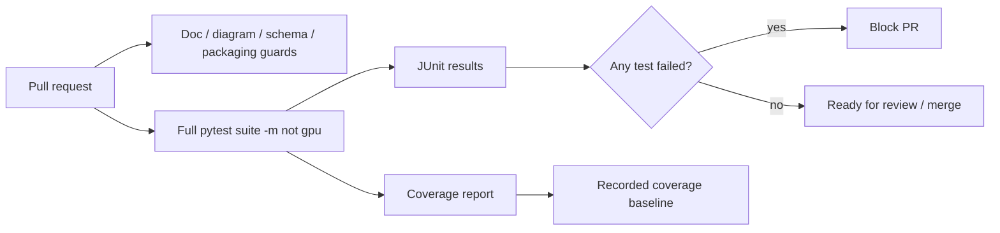

# Continuous Integration and Regression Testing

> Status: proposed product control. Align with the organization's formal quality
> management system before using it as an official SOP.

## Purpose

Every change to MethylPipeline must **add capability, improve performance or
precision, or fix a defect - without regressing existing behavior**. Continuous
Integration (CI) is the control that enforces this. On each pull request the full
automated test suite runs, and a change that breaks a previously passing test is
blocked before it can be released.

This document is the regulatory-facing companion to the other product controls
(traceability, validation evidence, deployment and supervision, change
management). It explains what is tested, how tests run automatically, how test
coverage is measured, and what evidence each run produces.

Canonical operational references:

- Pipeline registration and stages: [`../../ci/README.md`](../../ci/README.md)
- PR pipeline definition: [`../../ci/azure-pipelines-pr.yml`](../../ci/azure-pipelines-pr.yml)
- CI test runner: [`../../scripts/run_tests_ci.sh`](../../scripts/run_tests_ci.sh)
- Test configuration: [`../../pyproject.toml`](../../pyproject.toml) (`[tool.pytest.ini_options]`, `[tool.coverage.*]`)

## Regression Gate

The pull-request pipeline runs the entire pytest suite across the monorepo
(`packages/*`, `workers/`, `workflow_engine/`, `tools/`, and `scripts/tests`) as
a regression gate, in addition to the documentation, diagram, schema-boundary,
and release-packaging guards that already existed.

- A failing test fails the pull request (`PublishTestResults@2` with
  `failTaskOnFailedTests: true`).
- The suite is invoked through
  [`../../scripts/run_tests_ci.sh`](../../scripts/run_tests_ci.sh), which produces
  machine-readable results and coverage artifacts.
- GPU-marked tests are deselected on hosted agents (`-m "not gpu"`); database- and
  `/work`-fixture-dependent tests self-skip when their resources are absent.

## Test Taxonomy

Tests are grouped by intent rather than by directory. Markers `slow`, `gpu`, and
`integration` are declared in [`../../pyproject.toml`](../../pyproject.toml).

| Category | What it protects | Where it lives (examples) |
|----------|------------------|---------------------------|
| Unit | Pure functions, config models, resolvers | `packages/*/tests/` |
| Golden / contract | Action task input/output shapes | `workers/tests/` + `workers/tests/golden/` |
| Integration (DB) | Gateway/workflow behavior against PostgreSQL | `workflow_engine/tests/` (`@pytest.mark.integration`) |
| Parity | PostgreSQL vs Azure SQL behavior parity | `workflow_engine/tests/parity/` |
| Smoke / compile | DomainProgram compile, CLI availability | `workflow_engine/domain/checks/`, `workers/tests/` |
| GPU parity | CPU/GPU numerical equivalence | guarded by `skipif` on CuPy/GPU |
| Script guards | Repo hygiene, release manifest, doc freshness | `scripts/tests/` |

## What Runs Automatically vs. What Self-Skips

Hosted CI agents have no GPU, no production database, and no `/work` study data.
This is acceptable for a regression gate because those tests **skip cleanly**
rather than fail, and the behavior they cover is exercised elsewhere:

- GPU tests: deselected with `-m "not gpu"`; CPU/GPU parity is validated on
  GPU-equipped workers.
- Database tests: skip unless `POSTGRES_*` (and optionally `METHYL_TEST_MSSQL_DSN`)
  are configured; the GitHub Actions `db-parity` workflow runs them against a live
  PostgreSQL service.
- `/work`-fixture tests: skip when the referenced study fixtures are missing.

The regression gate therefore protects the large, resource-independent core of
the product on every change, while resource-bound conformance is covered by
targeted pipelines.

## Coverage Measurement

Coverage is collected with `pytest-cov` using the source roots declared in
[`../../pyproject.toml`](../../pyproject.toml) (`packages/`, `workers/`,
`workflow_engine/`). The CI runner emits a Cobertura report published via
`PublishCodeCoverageResults@2`.

Current posture is **measure-and-report only**: there is no build-failing
`--cov-fail-under` threshold yet. The intent is to:

1. Record a coverage baseline from the first full runs.
2. Prevent silent decreases by reviewing the published trend.
3. Ratchet a minimum threshold upward as coverage gaps are closed.

## Per-Package Coverage Expectation

Each package that is actually used in the pipeline must have automated tests that
cover its **most important classes and features** - not merely exist. Priority is
assigned by how widely a package/class is imported across the repository, so
effort protects frequently-used code first.

Gaps addressed in the initial pass:

| Package | Prior state | Coverage added |
|---------|-------------|----------------|
| `methylcluster` | no tests | `MethylClusterConfig` validation + (de)serialization, distance/summary utilities |
| `methylgenefeatureselect` | no tests | structural feature catalog build, ranked selection, skip/empty behavior |
| `methyldomain` | thin (high import breadth) | tagged-JSON round trips, project/comparison helpers, H5 path resolution |
| `methylgeneselect` | thin (high import breadth) | gene FeatureCuts cap resolution and layer precedence |
| `methyldiseaseprogression` | thin | gene-set config normalization, profile loading, summary payloads |
| `methylderivedmeasures` | thin | entropy, weighted fraction, adjacent-disagreement, PMD-load kernels |
| `methylfragmentomics` | thin | end-motif and WPS summary/writer helpers |

Remaining follow-up: continue raising coverage for the thinnest scientific
packages and enforce the per-package expectation as coverage ratchets up.

New tests must follow [`config-not-code.mdc`](../../.cursor/rules/config-not-code.mdc):
assert behavior and contracts (including that missing tunable caps resolve to
"unset"), not hard-coded operational defaults.

## Regression Gate Mapped to Change Classes

This extends the gate table in
[`change-management-plan.md`](change-management-plan.md).

| Change class | Regression expectation |
|--------------|------------------------|
| Documentation only | Doc link/freshness guards; full suite still runs |
| Python package code | Full pytest suite passes; coverage does not silently drop |
| Scientific method | Full suite plus targeted new/updated tests for the changed behavior |
| Schema / contract | Full suite plus schema export/boundary checks |
| DomainProgram / workflow | Full suite plus compile/deploy smoke |
| Worker protocol | Full suite plus worker and golden-contract tests |
| New feature | New tests demonstrating the feature and guarding against future regression |

## Evidence Retained Per Run

For each regulated change or release, retain from the CI run:

- CI run ID and result status,
- published JUnit test results (`test-results/junit.xml`),
- published coverage report (`coverage/coverage.xml` and HTML),
- the test/coverage snapshot referenced from the relevant evidence package
  (see the `CI run` and `Coverage report` fields in
  [`validation-evidence-index.md`](validation-evidence-index.md)).

## Related Documents

- [`README.md`](README.md)
- [`change-management-plan.md`](change-management-plan.md)
- [`traceability-matrix.md`](traceability-matrix.md)
- [`validation-evidence-index.md`](validation-evidence-index.md)
- [`../../ci/README.md`](../../ci/README.md)
