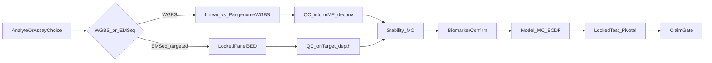

# Prostate Cancer Application Deep-Dive

**Status:** research / application synthesis (not an operator runbook).  
**Audience:** scientists, physicians, and insurance / medical-director readers who need to understand **why** MethylPipeline’s analyte, assay, and validation choices matter for prostate cancer.  
**Follow-on operator surface:** [Methylation application packs](../usage/24-methylation-application-packs.md) (Alzheimer-style pack pattern); a dedicated `docs/usage/25-prostate-cancer-pack.md` is **not** in this note.

**Related notes**

| Document | Role |
|----------|------|
| [BuffyCoat_vs_cfDNA_for_Cancer_Detection.md](BuffyCoat_vs_cfDNA_for_Cancer_Detection.md) | Analyte biology and pairing |
| [Prostate Cancer Detection.md](Prostate Cancer Detection.md) | Gatekeeper clinical framing; EM-Seq + GRAIL contrast; wet-lab SOW |
| [Prostate_Cancer_Detection_MethylPipeline_Fitness.md](Prostate_Cancer_Detection_MethylPipeline_Fitness.md) | What the platform can / cannot claim today |
| [ANALYTE_PROFILES.md](../ANALYTE_PROFILES.md) | Operator analyte config |
| [validation-evidence-index.md](../regulatory/validation-evidence-index.md) | EV-PCA-* feasibility packages |
| [SaMD study lifecycle](../usage/18-samd-study-lifecycle.md) | Research → holdout → pivotal ladder |

---

## Claim boundary (read first)

MethylPipeline **enforces process and configuration controls** and helps assemble evidence scaffolds. Architecture, SaMD profiles, and filled feasibility packages are **not** FDA clearance, CLIA validation, or coverage-ready clinical performance.

Registered prostate evidence packages (`EV-PCA-PLASMA-2026-06`, `EV-PCA-HGOOD-2026-06`, `EV-PCA-BUFFY-2026-07`) are **feasibility / engineering** evidence. They currently lack patient-disjoint `locked_test` / `pivotal_validation` partitions and **must not** be cited for gatekeeper NPV, biopsy deferral, or payer medical-necessity claims. See [samd-submission-scaffold.md](../regulatory/samd-submission-scaffold.md).

This note synthesizes existing research and platform capabilities. It does **not** invent a winner for the unfinished linear vs `pangenome_wgbs` SamplePrep compare, and it does **not** equate an EM-Seq gatekeeper design with GRAIL Galleri claims or clearance.

---

## End-to-end map

---

## 1. Chosen analyte and assay modality

MethylPipeline is **analyte-agnostic**: the same DomainProgram / profile machinery runs for leukocyte DNA and plasma cfDNA. Analyte and chemistry change biology, QC defaults, and clinical interpretation—not which orchestration engine you use.

Present four options as a **decision table**, not a premature single winner.

### Option decision table

| Option | Material / chemistry | Typical role | Physician workflow fit | Depth / design note | Procedure pack |
|--------|----------------------|--------------|------------------------|---------------------|----------------|
| **1. Buffy ~30× WGBS** | Leukocyte DNA, genome-wide | Host-response / systemic epigenome; aggressiveness research | Elevated-PSA **research** into host signatures; **not** preferred alone for tumor-shed rule-out | ~30× often adequate for buffy | `buffy_wgbs_pangenome_gene_fc` (or linear alternate) |
| **2. Plasma ~30× WGBS** | cfDNA, genome-wide + fragmentomics | Tumor-shed discovery; MCED-adjacent research | Early-detection research when TF allows; production only after SaMD ladder | TF-aware design; not “more buffy depth” | `cfdna_wgbs_plasma` |
| **3. Paired buffy + plasma** | Same subject, both tubes | Plasma = tumor-oriented signal; buffy = host / hematopoietic background | Best when logistics allow (CHIP-analogue / leukocyte confounding control) | Separate manifests or matched IDs | Both procedures, matched cohorts |
| **4. Plasma EM-Seq + hybrid capture** | cfDNA, targeted panel | Pre-biopsy **gatekeeper** geometry (inch-wide / mile-deep) | Elevated PSA / secondary markers → defer vs proceed to biopsy *after* pivotal evidence | Locked `target_panel_bed`; extreme on-target depth (~2–5k×), not genome-wide depth | `cfdna_emseq_targeted` |

### Biological roles (options 1–3)

| Analyte | What methylation mainly reflects | Detection role |
|---------|----------------------------------|----------------|
| **cfDNA (plasma)** | Shed DNA including tumor-derived fragments when tumor fraction is high enough; fragmentomic structure | Direct tumor / MCED / monitoring-oriented signal |
| **Buffy coat** | Host immune / systemic epigenome (inflammation, aging, cell-type mix); matched hematopoietic background | Indirect risk / host-response; complementary layer |

Buffy-only shallow WGBS is a poor fit for a **pre-biopsy csPCa (GG≥2) rule-out** claim: localized tumors shed little ctDNA into leukocyte DNA, and host-response signatures do not substitute for tissue anchors (e.g. GSTP1-style tumor panels). Buffy remains valuable for host biology, cell-composition covariates, and paired background control. Details: [BuffyCoat_vs_cfDNA_for_Cancer_Detection.md](BuffyCoat_vs_cfDNA_for_Cancer_Detection.md).

### Option 4 — EM-Seq gatekeeper vs GRAIL (shared biology, different geometry)

The wet-lab and clinical framing in [Prostate Cancer Detection.md](Prostate Cancer Detection.md) recommends **Enzymatic Methyl-Seq (EM-Seq) + custom hybridization capture** for a prostate gatekeeper. The shipped procedure is [`cfdna_emseq_targeted`](../../workflow_engine/domain/profiles/procedures/cfdna_emseq_targeted.procedure.json): operator-supplied panel BED, elevated `min_cov`, SamplePrep via `sample_prep_emseq`, **no** genome-wide DMP hunt, **no** cell deconvolution by default.

| Dimension | GRAIL Galleri (MCED) | Prostate EM-Seq gatekeeper (this option) |
|-----------|----------------------|------------------------------------------|
| Biology | cfDNA methylation | Same |
| Chemistry philosophy | Targeted methylation enrichment | EM-Seq (gentler than bisulfite for low-yield cfDNA) + hybrid capture |
| Geometry | Miles-wide / moderate depth (many cancer types) | Inch-wide / mile-deep (≈50–100 prostate / GG≥2 regions, very high on-target depth) |
| Clinical objective | Asymptomatic multi-cancer screen; ultra-high specificity | Single-cancer **pre-biopsy** rule-out for clinically significant PCa |
| Early localized PCa | Structurally quiet for wide/shallow panels | Design goal: recover signal at very low tumor fraction |

Cite GRAIL only as **shared methylation biology + contrasting width/depth/objective**. Do not imply Galleri-equivalent performance, clearance, or MCED positioning.

### When each option helps (and when it does not)

| Clinical question | Prefer | Avoid claiming from |
|-------------------|--------|---------------------|
| Host / immune correlates of PCa aggression | Buffy WGBS + deconv | Buffy as tumor-shed NPV gatekeeper |
| Genome-wide discovery of plasma methylation features | Plasma WGBS + fragmentomics | Equating discovery BA with biopsy-deferral policy |
| Background control for plasma features | Paired designs | Unpaired buffy trained → plasma deployed without retrain |
| Pre-biopsy rule-out of GG≥2 | EM-Seq targeted (after pivotal evidence) | Feasibility WGBS healthy-vs-pooled-PCa BA alone |

---

## 2. Alignment options (WGBS) and EM-Seq SamplePrep

### WGBS arms (options 1–2)

Three SamplePrep modes are not interchangeable:

| Mode | Mechanism | Role |
|------|-----------|------|
| `linear` | Parabricks `fq2bam_meth` + MethylExtract | Biological baseline |
| `pangenome_wgbs` | methylGrapher C2T/G2A bisulfite-aware pangenome | Candidate production default for buffy research packs |
| Stock `pangenome` / Giraffe | Parabricks Giraffe | **Engineering comparator only** — no WGBS methylation parity |

**How option “best of linear vs pangenome_wgbs” is decided:** run the dual-align harness ([sample_prep_test_bed.md](../../workflow_engine/docs/sample_prep_test_bed.md); `scripts/compare_sample_prep_linear_vs_wgbs.sh`; plan [linear-vs-wgbs-sampleprep-compare.plan.md](../plans/linear-vs-wgbs-sampleprep-compare.plan.md)). Metrics include alignment QC pass, CpG site yield, coverage, extraction QC—not classifier BA alone.

**Status honesty:** live compare runs have been incomplete (e.g. BAMs without full H5 / extraction QC). Until a report shows both arms through extraction with operator-set thresholds, **do not lock a biological winner**. After a passing compare, bake the winner into procedure packs (`buffy_wgbs_*_gene_fc`, plasma WGBS procedures).

### EM-Seq arm (option 4)

EM-Seq uses a **separate** SamplePrep path (`sample_prep_emseq.program.json`, `useEmseqTargeted`). Alignment and extraction are panel-constrained. The linear vs `pangenome_wgbs` harness does **not** choose EM-Seq vs WGBS: that is a **clinical assay-design** choice (gatekeeper depth vs genome-wide discovery), not an aligner bake-off.

---

## 3. Improving read and signal quality

SamplePrep QC gates **eligibility**; informME and cell deconvolution improve **interpretability and confounding control** in modeling.

### Guardrails (eligibility)

- Alignment QC and extraction QC (`overall_pass`, disposition) keep failed samples out of discovery and modeling.
- cfDNA adds fragmentomics QC/features when `primary_analyte: cfdna`.
- EM-Seq emphasizes on-target depth / coverage against the locked panel BED.

### informME (`pipeline.info_measures`)

Read-level patterns (`*.patterns.h5`) feed information-theoretic measures (NME, MML, ESI, MSI, and related confirmation metrics). Outputs land under `info_measures/` and can stack as covariates. See [methylpipeline_informme_integration.md](methylpipeline_informme_integration.md) and architecture covariates in [end-to-end-workflow.md](../architecture/end-to-end-workflow.md).

Physician-facing meaning: methylation **heterogeneity and information content**, not only mean β, so noisy or low-complexity samples are visible.

### Cell-type deconvolution (Houseman / HiTIMED)

| Method | Typical use |
|--------|-------------|
| **Houseman** | Buffy six-cell Ω fractions → ALR covariates |
| **HiTIMED** | Hierarchical / analyte-driven leaves (e.g. cfDNA tumor_fraction leaves when configured) |

Action: `pipeline.cell_deconvolution` → `cell_fractions/cell_fractions.csv`. Buffy research procedures enable Houseman by default; plasma WGBS / EM-Seq gatekeeper procedures often use the **no-deconv** lifecycle (fragmentomics / panel depth carry more of the noise story). Theory: [ch.07a methyldeconv](../theory/chapters/07a-methyldeconv.md).

### Stacking into the model

Default ECDF second-stage can stack:

1. Cell fractions (ALR on Houseman columns when present)
2. `derived_measures` (genome / chromosome entropy, PMD/PDR-style proxies)
3. `info_measures/readlevel_measures.csv`

First-stage ECDF uses methylation features; second-stage logistic stacks class probabilities + covariates. Ablation artifacts (`feature_family_ablation.json`) document whether covariates moved the needle.

Physician-facing meaning: **adjust for immune-cell mix and methylation complexity** so a “cancer” call is less likely to be composition noise.

---

## 4. Benefit to physician and insurance

### Clinical scenario

Elevated PSA (and/or secondary serum markers) → decision to biopsy. A useful molecular gatekeeper:

- Prioritizes **high NPV for clinically significant PCa (GG≥2 / Gleason ≥3+4)**
- Separates indolent GG1 from actionable disease when biology allows
- Complements—not replaces—mpMRI, PHI, 4Kscore

Buffy WGBS research informs host biology; **EM-Seq targeted plasma** is the chemistry geometry aimed at the gatekeeper window; plasma WGBS is the discovery / breadth path. Requirements source: [Prostate Cancer Detection.md](Prostate Cancer Detection.md). Fitness gaps (GG≥2 positive class, NPV LCB gates): [Prostate_Cancer_Detection_MethylPipeline_Fitness.md](Prostate_Cancer_Detection_MethylPipeline_Fitness.md).

### Payer / medical-director lens

| Question | Platform artifact | Status today |
|----------|-------------------|--------------|
| Analytical validity (reproducible pipeline, locked config) | Release manifests, CAAS / `.action_results`, locked model spec | Available as process evidence |
| Clinical validity (holds on patient-disjoint holdout) | `locked_test`, WF3, clinical performance report | Required; **not** present on current EV-PCA packages |
| Clinical utility (biopsies avoided vs csPCa missed) | Intended-use + prevalence-conditioned NPV | Policy + pivotal study design; not a software brochure claim |
| Change control / post-market | SaMD ladder, PCCP / monitoring scaffolds | Scaffolded; study-specific |

Map evidence to analytical → clinical validity → utility. **Do not** claim coverage readiness from feasibility BA.

---

## 5. Detecting cancer versus noise

Translate the platform’s statistical honesty into plain language.

### Stability Monte Carlo (WF1)

Repeated random train/validation splits discover DMPs/genes; **recurrence** across iterations filters features that appear only because of a lucky split. BA-gated FeatureCuts (`dmp_fc`, `gene_fc`, `dual_fc`) further require that panels meet held-out balanced accuracy inside discovery. Operator detail: [usage ch.05](../usage/05-stage-stability.md); theory: [ch.12](../theory/chapters/12-two-workflows.md).

> A locus that survives a high fraction of random splits is more likely biology than noise—still not a clinical claim until holdout and pivotal stages pass.

### Holdouts and partitions

| Role | Meaning |
|------|---------|
| `development_train` | Feature selection and model training |
| `locked_test` | Internal validation; never returns to training |
| `pivotal_validation` | Claim-oriented external cohort |

WF2 evaluates a frozen model under Monte Carlo on the development world; WF3 is the true held-out batch. Current prostate EV packages: **no partitions** — treat metrics as engineering only.

### Claim gates

Code blocks clinical-performance claims until `regulatory.stage` reaches pivotal (or later) and `allow_clinical_performance_claims` is permitted. SaMD ladder: `samd_research` → `samd_holdout_enrichment` → `samd_pivotal` ([usage ch.18](../usage/18-samd-study-lifecycle.md)).

---

## 6. Detecting and confirming biomarkers

Pipeline story (disease-agnostic):

1. **Discover** — centroid + detector → statistical / biological DMPs  
2. **Stabilize** — MC recurrence + optional DMP/gene FeatureCuts  
3. **Freeze** — fixed panel for production  
4. **Map** — DMPs → genes / features  
5. **Confirm biology** — enricher (`cancer-core` / `cancer-extended`) and optional STRING PPI hubs  
6. **Readiness** — freeze-readiness / biological completeness gates before modeling  

Genes improve interpretability for physicians; enricher/PPI supply **independent pathway support**, not circular proof from the same BA. Literature candidates (GSTP1, APC, RASSF1A, PITX2, …) stay **study/profile priors**—never hardcoded disease logic in Python ([fitness analysis](Prostate_Cancer_Detection_MethylPipeline_Fitness.md)).

EM-Seq gatekeeper path: the “biomarker set” is largely the **locked capture panel** refined by MC/stability within sequenced regions—not a genome-wide DMP hunt. Buffy/plasma WGBS paths use genome-wide discovery then freeze.

Honest limitation: some buffy packages show empty gene panels at threshold despite DMP stability—gene-axis readiness must be checked before biological claims.

---

## 7. Finding a good model and validating it

### Model backends

| Backend | Role |
|---------|------|
| **ECDF** (+ optional covariate second stage) | Transparent Bayesian-style methylation classifier; preferred regulated path today |
| **tabular_sklearn** | Feature-matrix alternatives; useful in model-MC comparisons |
| Generative / hybrid | Research backends when enabled |

Model-MC ranks backends on held-out metrics (e.g. median BA); `select_best_model` records the winner. Post-model validation consumes **frozen** artifacts without retraining ([usage ch.07–08](../usage/07-stage-model.md)).

### What “good” means for a gatekeeper vs current runs

| Metric world | Gatekeeper product | Current EV-PCA feasibility |
|--------------|--------------------|----------------------------|
| Positive class | Clinically significant PCa (GG≥2) | Often healthy vs pooled PCa |
| Primary operating characteristic | High **NPV** (prevalence-aware) + sensitivity/specificity CIs | Balanced accuracy / stability panel size |
| Holdout | Locked + pivotal partitions | Missing |
| Acceptance | NPV LCB / operating-point policy (product gaps) | BA gates inside FeatureCuts |

Gleason-staged manifests are already supported ([usage ch.16](../usage/16-tutorial-healthy-vs-cancer-stages.md)); defining GG≥2 as the screening positive class and NPV LCB acceptance gates are called out as small, disease-agnostic extensions in the fitness note—not as present production claims.

### SaMD ladder as the validation program

| Stage | Profile | Allowed narrative |
|-------|---------|-------------------|
| Research / feasibility | `samd_research` | Engineering, panel stability, method development |
| Holdout enrichment | `samd_holdout_enrichment` | Internal locked-test enrichment |
| Pivotal | `samd_pivotal` | Clinical performance claims (when evidence filled) |

Operator SOP: [usage ch.18](../usage/18-samd-study-lifecycle.md). Evidence registry: [validation-evidence-index.md](../regulatory/validation-evidence-index.md).

---

## 8. Current prostate evidence inventory (honesty)

| Package ID | Study tree | Analyte | Status |
|------------|------------|---------|--------|
| `EV-PCA-PLASMA-2026-06` | `Plasma_healthy_vs_PCa` | cfDNA | Draft feasibility |
| `EV-PCA-HGOOD-2026-06` | `H_PCa_good` | Buffy | Draft feasibility; gene-stable-at-threshold gaps reported |
| `EV-PCA-BUFFY-2026-07` | `Buffy_healthy_vs_PCa` | Buffy | Draft; incomplete model chain for gatekeeper claims |

None of these packages alone supports physician biopsy-deferral policy or payer coverage decisions.

---

## Appendix A — Procedure and config quick map

| Intent | Set |
|--------|-----|
| Buffy research WGBS | `regulatory.primary_analyte: buffy_coat` + procedure `buffy_wgbs_pangenome_gene_fc` (or `buffy_wgbs_linear_gene_fc` until compare locks) |
| Plasma WGBS discovery | `primary_analyte: cfdna` + `cfdna_wgbs_plasma` |
| EM-Seq gatekeeper research | `primary_analyte: cfdna` + `cfdna_emseq_targeted` + operator `target_panel_bed` |
| Claims | Only after partitions + pivotal stage + filled evidence package |

Canonical analyte encoding: [ANALYTE_PROFILES.md](../ANALYTE_PROFILES.md). Product roadmap context: [Regulatory-Ready Platform for Multiomics Diagnostics.md](../regulatory/Regulatory-Ready Platform for Multiomics Diagnostics.md).

---

## Appendix B — Further reading

- Stability / freeze / model / post-model: usage ch.05–08  
- Two workflows (WF1–3): [theory ch.12](../theory/chapters/12-two-workflows.md)  
- Model creation: [theory ch.15](../theory/chapters/15-model-creation-and-validation.md)  
- SamplePrep linear vs WGBS compare: [sample_prep_test_bed.md](../../workflow_engine/docs/sample_prep_test_bed.md)  
- Interactive canvases: [analyte-comparison](../canvas/README.md#analyte-comparison), [pca-detection-fitness](../canvas/README.md#pca-detection-fitness)
