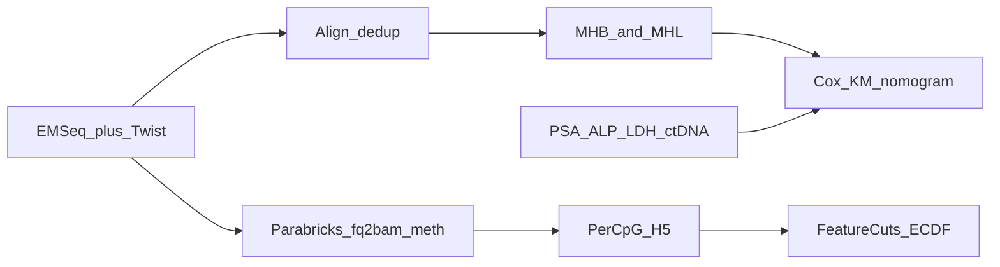

# Wong et al. 2026 EM-Seq mCRPC prognosis — MethylPipeline capability gaps

**Status:** research / design note (not operator runbook).  
**Source:** Wong J. et al. *Plasma cell-free DNA methylation-based prognosis in metastatic castrate-resistant prostate cancer.* npj Precision Oncology (2026) 10:29. [doi:10.1038/s41698-025-01232-w](https://doi.org/10.1038/s41698-025-01232-w). Local copy: [`41698_2025_Article_1232.pdf`](41698_2025_Article_1232.pdf).  
**Related:** [Florida community-access brief](moffitt_partnership_opportunity_brief.md), [usage ch.25](../usage/25-prostate-cancer-pack.md) (EM-Seq procedure), [informME integration](methylpipeline_informme_integration.md), [Prostate Cancer Detection fitness](Prostate_Cancer_Detection_MethylPipeline_Fitness.md) (different paper: pre-biopsy gatekeeper SOW).  
**Date:** 2026-09-07  
**Verdict (updated):** A **parallel** product path now exists: `cfdna_emseq_mhl_survival` + `researchMode: mhl_survival` (native MHB/MHL + Cox). The original `cfdna_emseq_targeted` + FeatureCuts path is unchanged. Remaining gaps are operator assets (panel BED, survival sidecar, control BEDs) and optional GREAT / ctdna.org.

This note is not a clinical critique of Wong et al. It lists **omissions in MethylPipeline** that would make a product run **incapable of reproducing their analysis** on equivalent FASTQs, panel BED, and clinical follow-up.

---

## What the paper actually did

| Stage | What they ran |
|-------|----------------|
| Cohort | 96 plasma cfDNA: localized PC (n=19), mHSPC (n=28), mCRPC (n=49) with OS follow-up (34/49 mCRPC deaths; median 17.5 months) |
| Wet lab | 10–20 ng cfDNA; NEB EM-Seq (E7120S); Twist custom methylome capture, **3.44 Mbp**, 437 regions (literature + TCGA-PRAD + oncogenes/TSGs + 29 pos / 42 neg controls) |
| Align / call | fastqc → cutadapt → **Bismark + bowtie2** (`-L 11 -N 1`) on hg38 → `deduplicate_bismark` → mosdepth on-target coverage |
| Endpoint features | **mHapSuite** mHAP convert → MHBDiscovery (window 3, \(r^2>0.3\), \(p<0.05\)) → **MHL** (consecutive methylation load, lengths 1–10) |
| Filters | ≥3 CpGs; median reads >50; drop missing MHL; drop control-region MHBs; keep MHL ≤0.05 in localized PC for “tumor-like” DMRs |
| Stats | Welch *t*-tests localized↔mHSPC↔mCRPC; 77 persistent DMRs; top 20 → 15 unique-gene MHBs; univariate/multivariable **Cox PH**; KM; LOOCV composite \(\sum\beta_i M_i\) |
| Fusion | PSA, ALP, LDH (log2); **predicted ctDNA fraction** from [ctdna.org](https://www.ctdna.org) (not methylation deconv); nested ANOVA vs ctDNA-only |
| Output | Time-dependent ROC (0.5 / 1 / 2 year); **nomograms**; GREAT on DMR coordinates |

Their claim is **mCRPC overall-survival prognostication**, not healthy-vs-PCa detection and not a pre-biopsy GG≥2 NPV gatekeeper.

---

## Executive verdict

`cfdna_emseq_targeted` + an operator `target_panel_bed` gets counts **inside a capture panel**. Wong et al. refused to stop at mean methylation over windows. Their experiment is **haplotype-block MHL + survival nomogram**. Those two layers are missing. Enabling FeatureCuts / ECDF on panel HDF5 is a **different study**.



*Paper path (top) vs shipped EM-Seq path (bottom).*

---

## Blocking omissions

### 1. No MHB discovery and no MHL

Paper: BAM → mHapSuite → LD-defined MHBs → MHL.

MethylPipeline: per-CpG HDF5 (`pos`, `mC`, `uC`, `tnc`). Joint co-methylation is **not recoverable** from those marginals ([informME note](methylpipeline_informme_integration.md)). There is no mHapSuite wrap, no \(r^2\) block caller, no MHL formula.

`{chr}-{ctx}.patterns.h5` / informME Ising (NME, MML) is a **different** object: fixed tiles and entropy, not LD MHBs and not consecutive-haplotype load. It is not a substitute.

The shipped EM-Seq procedure **turns even that near-miss off**:

```33:39:workflow_engine/domain/profiles/procedures/cfdna_emseq_targeted.procedure.json
      "read_level": {
        "enabled": false
      },
      "target_panel_bed": null
    },
    "cell_deconvolution": null,
    "info_measures": null,
```

Without (a) read-level haplotypes on EM-Seq and (b) an MHB/MHL implementation (or a proven mHapSuite path), you cannot compute the 3525 → 1530 → 1194 → 77 DMR cascade or the 15-MHB composite score.

### 2. No time-to-event product

Paper: OS, censoring, Cox PH, Kaplan–Meier, log-rank, LOOCV median split, time-dependent AUC, nomogram (`rms` / `timeROC`).

MethylPipeline validation is **classification** (healthy vs disease, FeatureCuts BA, ECDF). There is no survival / censoring schema on the study manifest, no Cox action, no KM/nomogram report. `samd_research` cannot emit their HRs or 0.5/1/2-year AUCs.

### 3. No multi-modal survival fusion

Paper nomograms mix MHL score + **PSA, ALP, LDH** + **predicted ctDNA fraction** (clinical calculator: cfDNA yield, labs, ECOG, liver/lung mets). Nested LRT showed MHL added fit beyond ctDNA alone.

We can attach a generic `covariates_path` to ECDF **classification**. We do not ingest EMR labs as first-class study columns, call ctdna.org (or an equivalent), or fit a multi-modal **survival** model.

HiTIMED `tumor_fraction` is not that calculator, and EM-Seq sets `cell_deconvolution: null`.

### 4. BAM dialect vs mHapSuite (likely block)

Paper: Bismark XM-style BAM + `deduplicate_bismark`. mHapSuite is built for that.

EM-Seq SamplePrep aligns with **Parabricks `fq2bam_meth`** (or Mojo). Until mHapSuite (or a native MHL caller) is proven on that BAM, a repeat needs either a **Bismark / Bismark-tag align path** on `sample_prep_emseq` or an in-house MHL on our tags. Neither is shipped.

---

## Gaps that would make a repeat scientifically incomplete

| Paper step | MethylPipeline today | Effect |
|------------|----------------------|--------|
| **On-target QC** (mosdepth): 77.4% map, 60.5% on-target, 1.9% dups, 96× mean, 99.3% of unique on-target >10× | Extraction QC is genome-wide style (`min_cov` on extract; no % on-target / panel-depth report) | Cannot match their mapping table or fail samples the same way |
| **Panel controls** (29 pos / 42 neg; median meth ~84.6% vs 0.3%) | No control-region QC on `target_panel_bed` | Conversion / capture failure is invisible |
| **EM-Seq conversion QC** | Alignment QC assumes **bisulfite** sidecar / deamination proxies | Enzymatic conversion is a different check; their control regions *are* the assay QC |
| **GREAT** on DMR coordinates | Enrichr / OpenTargets / gene FeatureCuts | Different question (cis-regulatory vs gene-set) |
| **MHL >0.05 localized “immune/TME” arm** (203 MHBs; 5 persist; 3-MHB host score) | Buffy/host path is a **separate analyte**, not a high-MHL subset of the same plasma panel | Their second prognostic arm has no counterpart on `cfdna_emseq_targeted` |

`min_cov: 20` on the EM-Seq procedure is compatible with their “>10× on target” floor. Coverage *threshold* is not the gap; **panel-aware reporting** is.

---

## Not a product omission (operator / study assets)

These are required to repeat the experiment but are correctly **outside** Python:

| Asset | How we already accept it |
|-------|--------------------------|
| Twist (or other) BED, ~3.44 Mbp | `actionConfig.methyl_extract.target_panel_bed` |
| NEB EM-Seq + capture FASTQs | Upstream of SamplePrep |
| Labels localized / mHSPC / mCRPC | Study `stages[]` (config; we do not score MHL across them) |
| OS dates, PSA, ALP, LDH, ECOG, viscera, cfDNA yield | Not first-class today — see blocking §2–3 |

Disease-agnostic rule still applies: do **not** hardcode ALOX5 / HIC1 / CDKN2A / their 15-region list. Those stay a study BED + overlay.

---

## What we can already do (so the gap is not “no EM-Seq”)

- Procedure [`cfdna_emseq_targeted`](../../workflow_engine/domain/profiles/procedures/cfdna_emseq_targeted.procedure.json): linear align, `sample_prep_emseq`, `samtools view -L` before extract, elevated `min_cov`, no deconv lifecycle.
- Staged comparisons and `runProgressionAnalysis` (Gleason or clinical-state labels as stages).
- SaMD ladder and classification metrics — a **different** endpoint than OS nomograms.
- Retain BAM under `/work/samples/{id}/` — the right *input* for a future MHL/mHapSuite step (same argument as informME).

---

## Implemented vs remaining

| Item | Status |
|------|--------|
| Native MHB discovery + MHL (`pipeline.mhb_mhl`, `packages/methylmhl`) | **Shipped** — discovery or locked BED; Wong formula lengths 1–`mhl_max_length` |
| Per-read haplotype sidecar (`--mhap` → `{chrom}-CG.mhap.h5`) | **Shipped** — same extract pass; contract in [`mhap_store_contract.md`](../reference/mhap_store_contract.md) |
| Mojo XM/XG tags + extract prefers tags / sequence+XG fallback | **Shipped** — `write_methylation_tags` / `METHYLGRAPHER_WRITE_METH_TAGS` |
| Cox / KM / time-AUC / optional nomogram (`backend_profiles.cox`) | **Shipped** — study `survival_path` sidecar |
| Capture / control-region QC | **Shipped** — optional `extraction_qc` panel BEDs + guardrails |
| Procedure + mode | **Shipped** — `cfdna_emseq_mhl_survival` / `mhl_survival` |
| GREAT as a required node | Remaining (optional later) |
| In-process ctdna.org | Remaining — operator column on the survival sidecar is enough |
| Hardcoded Wong 15-MHB gene list | Intentionally out of scope |

---

## What not to do

- Treat ECDF / gene FeatureCuts BA on panel HDF5 as a “Wong repeat.”
- Equate informME NME/MML with MHL.
- Equate HiTIMED `tumor_fraction` with the ctdna.org clinical predictor.
- Hardcode their 15 MHBs or NPV/AUC numbers as package defaults.
- Confuse this paper with the pre-biopsy gatekeeper SOW ([Prostate Cancer Detection.md](Prostate%20Cancer%20Detection.md)); that is a different intended use.

---

## Open questions (before implementing)

1. Native MHL in-repo vs subprocess mHapSuite (license, BAM tags, GPU)?
2. Is Parabricks/Mojo BAM already mHap-compatible, or is a Bismark-tag writer required?
3. Survival as a first-class validation backend vs a sidecar R/Python report on frozen features?
4. Do we want their “high MHL in localized PC” plasma-host arm, or keep host biology on `buffy_coat` only?
