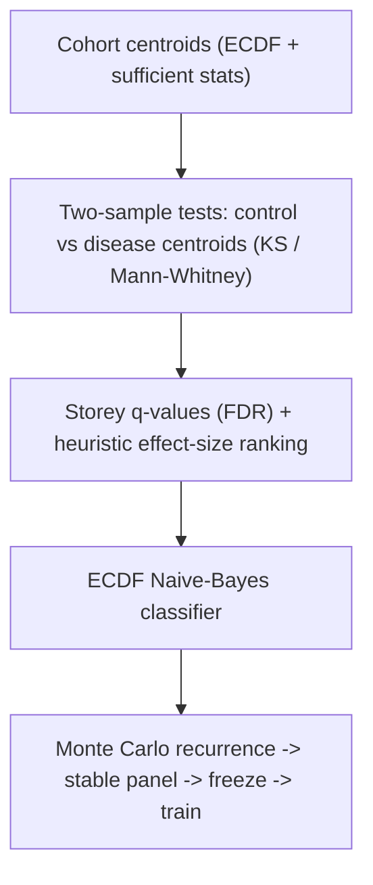
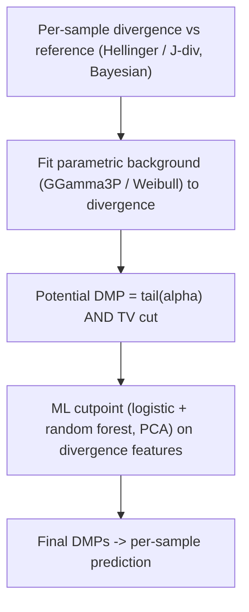

# MethylPipeline vs MethylIT_py 0.4.0 — Approach and Theory Comparison

> Informal design/research note. **Not** canonical user or operator documentation.
> It compares the theoretical foundations and workflows of two products that both
> model healthy-vs-prostate-cancer methylomes and detect DMPs as the basis for
> classification.

## Scope and evidence boundary

- **MethylPipeline** was read from its canonical theory book (`docs/theory/chapters/*.qmd`)
  and per-package `docs/THEORY.md` files. In this repo the code is the source of truth and
  the theory book is written from the implemented behavior.
- **MethylIT_py 0.4.0** ships as an installed wheel (`python -m methylit`). Its estimator
  internals were **not** available on disk during this review. The description below is
  reconstructed from the release bundle that *is* present: the stage configuration
  (`examples/config_test6.yaml`, `config_test5.yaml`, `config_smoke.yaml`,
  `config_example_score_only.yaml`), the sample sheets (`sample_sheet_*.csv/.tsv`), and the
  companion runner scripts (`scripts/g2dmp_m34.py`, `exp_wand.py`, `pred_h5.py`,
  `prediction_tsv_to_cupy_h5.py`). Where intent is inferred from parameter names it is
  flagged as such.

## Executive summary

Both products attack the same problem — separate healthy from prostate-cancer methylomes and
score incoming samples — and share vocabulary (reference/centroid, train, validation/prediction;
per-chromosome; cytosine contexts CG/CHG/CHH; positive/negative class). Their theoretical cores
are nearly opposite:

- **MethylIT_py 0.4.0 = information theory + signal-detection theory.** For each sample it
  measures an *information divergence* of methylation from a common **reference** at every
  cytosine, fits a *parametric* distribution to the background divergence, calls a position a
  potential DMP when its divergence lies in the tail of that fitted noise model (plus a total-
  variation cut), then trains a supervised classifier (logistic + random forest) to set an
  optimal cutpoint.
- **MethylPipeline = nonparametric empirical distributions + resampling stability.** It
  represents each cohort as an ECDF "centroid," detects DMPs by two-sample tests
  (Kolmogorov-Smirnov / Mann-Whitney) *between two cohort centroids* with Storey FDR control,
  ranks survivors by a heuristic biological effect size, classifies via an ECDF Naive-Bayes-style
  density score, and selects a production panel by Monte Carlo recurrence (stability -> freeze ->
  train). It explicitly does **not** fit a parametric methylation model.

The deepest distinction: in MethylIT a DMP is a **per-sample** event (how far *this* sample
diverges from a reference), whereas in MethylPipeline a DMP is a **per-comparison** event (a
locus where the control-cohort distribution differs from the disease-cohort distribution).

## What the two products agree on

- Same biological framing: control/reference group, training set, validation/prediction samples;
  `positive_class` vs `negative_class` (prostate sheets: `cancer` vs `healthy`).
- Organized by chromosome and cytosine context (CG/CHG/CHH).
- Both produce a reusable trained artifact and an apply-only scoring mode for unknowns —
  MethylIT `run mode: score_only` (reusing `centroid_manifest_path` + `model_dir`) mirrors
  MethylPipeline `--predictor-only`.
- Both are engineered for genome-scale WGBS: per-chromosome parallelism, HDF5 outputs, coverage
  handling.

The disagreement is not *what* to model but *how* to define and detect the signal.

## MethylPipeline: the empirical-distribution / two-cohort path

Pipeline: `centroid -> detector -> classifier -> predictor`, wrapped by a validation/stability layer.

- **Centroid (`methylcentroid`).** A cohort is compressed into per-locus sufficient statistics
  (`N`, `Sx`, `Sx2`, count sums) **plus histogram counts** so an ECDF can be reconstructed later.
  Optional coverage capping uses **binomial thinning** (preserves the methylation fraction in
  expectation). The theory doc is explicit that this is a summary constructor for the nonparametric
  path and does **not** fit a parametric methylation model.
- **Detector (`methyldetector`).** Aligns a control centroid and a disease centroid, then per
  locus computes a two-sample test — KS on reconstructed ECDFs (grid supremum, Smirnov p-value with
  harmonic-mean effective n) or a histogram-based Mann-Whitney. All p-values get **Storey q-values**
  (FDR). Significant loci are then *separately* ranked by a heuristic **biological effect size**
  `|dmu|*(1-overlap)*exp(-lambda*(sigma1+sigma2))`, optionally trimmed by **cumulative effect-mass**
  coverage. "Statistically significant" and "biologically large" are kept as distinct axes. Supports
  dual outputs: a broad `dmps-*-discovery.csv` for biology and a smaller `dmps-*-selected.csv`
  prediction panel; a `fixed_dmp_panel` mode bypasses discovery to apply a pre-selected panel.
- **Classifier (`methylclassifier`).** ECDF Naive-Bayes-style scorer: weighted mean log-density
  across DMP loci with explicit class priors and temperature-scaled softmax, plus optional
  Platt/isotonic calibration, learned chromosome-fusion and multiclass one-vs-rest heads, and
  class-imbalance weighting.
- **Model creation as a stability problem (`methylvalidation`, "two workflows").** Repeated Monte
  Carlo train/validation splits rerun `centroid -> detector`; a locus's **recurrence frequency**
  `f_hat(d) = (1/R*) * sum_r 1[d in D_disc,r]` determines a **stable panel** (`f_hat >= tau`,
  `stability_dmp_freq`). The panel is frozen (`fixed_dmp_panel`) and the final classifier trained on
  all data restricted to it. Prostate cancer additionally gets multiclass staging (PCa1-4), gene
  mapping, pathway enrichment, and ordered disease-progression synthesis.

Statistical spirit: frequentist two-sample testing at the cohort level plus resampling-based
feature-selection stability.

## MethylIT_py 0.4.0: the information-thermodynamics / signal-detection path

Stages run as numbered modules (`orca` = modules 1-4); the folder trail is
`06_potential_dimp -> 07_cutpoint -> 08_dmp -> 09_prediction`. The `stages:` block maps to the
classic MethylIT methodology:

- **`cap_coverage`** — coverage normalization/capping (e.g. `target_sum`, `max_sites_per_sample_chrom`).
- **`divergence`** — the theoretical heart. Computes an information divergence between each sample
  and the reference at every cytosine: `HD` (Hellinger) and/or `JD` (J-divergence), coverage-weighted
  (`weight: cov`), with **Bayesian** methylation-level correction (`Bayesian: true`, `idiv_prior`,
  `bayesian_p`). Treats methylation change as information carried relative to a reference state.
- **`gof`** (goodness of fit) — fits a **parametric distribution to the divergence values**:
  `model: GGamma3P` (three-parameter generalized gamma) with alternates `Weibull2P/3P`, `Gamma2P`,
  chosen by cross-validation (`r_cv`). This fitted distribution is the noise/background model.
- **`pDMP`** (potential DMPs) — selects positions in the **tail** of the fitted distribution
  (`alpha: 0.05`) **and** with total variation above a cut (`tv_cut`). Signal-detection: a position
  is a candidate when its divergence is improbable under the fitted distribution.
- **`cutpoint`** — a **supervised ML classifier** estimates the optimal boundary separating treatment
  DMPs from control DMPs, using features `hdiv, TV, jdiv.stat, bay.TV, jdiv, wprob, pos` with
  interactions, PCA (`n_pc: 4`), and two learners (`classifier1: logistic`, `classifier2:
  random_forest`, `ntree: 300`). This is the ROC/optimal-cutpoint step.
- **`dmp`** — final DMP calls applying the cutpoint; **`09_prediction`** classifies samples.

Statistical spirit: model the distribution of a divergence statistic, then apply detection theory
(tail probability + optimal cutpoint) and ML on divergence-derived features.

## Comparison of pipelines

### MethylPipeline: Empirical two-cohort path

### MethylIT_py 0.4.0: Information & signal detection path

## The core theoretical divergence, in depth

1. **Unit of the signal — per-sample vs per-cohort.** MethylIT computes a divergence for every
   individual sample at every cytosine relative to a shared reference; the classifier works in the
   space of these per-sample divergence statistics (well suited to "how abnormal is this one
   patient"). MethylPipeline never scores an individual against a reference during discovery — it
   asks whether the control-cohort ECDF differs from the disease-cohort ECDF at a locus, and defers
   per-sample scoring to the ECDF classifier stage.
2. **Parametric noise model vs distribution-free testing.** MethylIT's validity rests on the
   divergence population following a generalized-gamma/Weibull law (grounded in the information-
   thermodynamics view of methylation, where such laws arise as limiting distributions of the
   divergence). If the fit is good, tail probabilities are principled and powerful. MethylPipeline
   avoids the assumption: it reconstructs ECDFs and applies asymptotic KS/MWU with FDR — but its
   p-values are grid/histogram approximations and its effect-mass trimming is an explicit heuristic.
3. **Where machine learning enters.** MethylIT bakes supervised learning into *detection itself* —
   the DMP-defining cutpoint is learned (logistic / random forest on divergence features, with PCA
   and interactions). MethylPipeline keeps detection statistical (tests + FDR + effect size) and puts
   learning downstream in the classifier. So MethylIT's DMP definition is model-dependent while
   MethylPipeline's is test-derived with a separate, later classifier.
4. **Bayesian methylation estimation vs frequentist moments.** MethylIT applies a Bayesian estimate
   of methylation levels before computing divergence (`idiv_prior`, `bayesian_p`), shrinking noisy
   low-coverage estimates. MethylPipeline uses empirical fractions and sufficient statistics with
   coverage handled by binomial thinning and floors.
5. **Total variation as a second axis (convergent instinct).** Both couple statistical improbability
   with a magnitude guard: MethylIT via a total-variation cut (`tv_cut`) on the methylation-level
   difference; MethylPipeline via the effect-size / delta-mu filter. Same instinct ("significant but
   trivial is not enough"), different formalisms.

## Deeper theoretical analysis (mathematics and statistics)

This section examines two specific complexity choices in MethylIT — the *parametric* Weibull/GGamma
distribution fitted to the divergence values, and the *multivariate ML classifier* at the cutpoint — and
argues, with the supporting mathematics, that under the regimes typical of genome-wide human WGBS
both are largely reducible to simpler, more scalable constructs. The conclusions converge on what
MethylPipeline already does (nonparametric ECDF screen + explicit effect-size gate + simple
aggregation).

### A. Does the Weibull/generalized-gamma distribution matter for the initial tail, or would the ECDF do?

**What MethylIT does.** For each individual sample it fits a cumulative distribution
$F_\theta$ to the per-cytosine Hellinger-divergence values $\{H_i\}$ — `Weibull2P/3P`, `Gamma2P`, or
`GGamma3P/4P` — chosen by cross-validated goodness-of-fit, then takes the critical value
$H_\alpha = F_\theta^{-1}(1-\alpha)$ with $\alpha=0.05$. A cytosine is a *potential* DMP when
$H_i > H_\alpha$ **and** its total-variation of methylation level exceeds a cut,
$\mathrm{TV}_i = |\hat p_{t,i}-\hat p_{c,i}| > \texttt{tv\_cut}$ (0.2 in the 0.4.0 config; the 2019
paper uses the empirical TV95 $\approx 0.28$–$0.35$).

**Why the parametric form is second-order at $\alpha=0.05$.** Reading off $H_\alpha$ is nothing more
than estimating the $0.95$ quantile of the divergence distribution. The nonparametric alternative is
the empirical quantile $\hat H_\alpha = \hat F_n^{-1}(1-\alpha)$ from the ECDF. For a moderate
(non-extreme) quantile like $0.95$ with genome-scale $n$ (covered cytosines per sample per
chromosome, $10^4$–$10^6$), the sample quantile is consistent and asymptotically normal with standard
error
$$
\operatorname{SE}(\hat q_{0.95}) \approx \frac{1}{f(q_{0.95})}\sqrt{\frac{0.95\cdot 0.05}{n}},
$$
which is minute. So the ECDF already estimates the $0.95$ cutpoint precisely; a parametric fit can
only *slightly* reduce variance, and it can *introduce* bias if the chosen family is misspecified.
Parametric tail modeling earns its keep in the **far** tail ($\alpha \to 10^{-4}$ or smaller), where
empirical quantiles are noisy or undefined and extrapolation (extreme-value / parametric) is
mandatory — not at $\alpha = 0.05$. Note also that `GGamma3P` *nests* Weibull and gamma as special
cases (Stacy 1962), so "Weibull as a simpler version" is literally a submodel; but every member of
that family is being used only to read a single $0.95$ quantile that the ECDF returns
assumption-free.

**Why the TV cut is the binding constraint.** The two gates are not independent. For a Bernoulli
methylation level the total-variation distance between control and treatment is exactly
$\mathrm{TV}=|\Delta p|$, and the Hellinger distance is
$H^2 = 1-\sqrt{p_c p_t}-\sqrt{(1-p_c)(1-p_t)}$; both are monotone in $|\Delta p|$ at fixed marginals.
More generally, Hellinger and total variation *sandwich each other* (Gibbs & Su 2002):
$$
H^2(P,Q)\;\le\;\mathrm{TV}(P,Q)\;\le\;\sqrt{2}\,H(P,Q),
$$
so they are topologically equivalent metrics and strongly correlated. Crucially, MethylIT's $H$ is
**coverage-weighted** (`weight: cov`), which is exactly why its divergence distribution looks
Weibull/gamma-like (a scaled sum of confidence-weighted terms), whereas the TV gate is an
**unweighted, bounded** $[0,1]$ effect size. Requiring $\mathrm{TV} > 0.2$ discards the large
population of high-$H$ positions that are statistically confident (deep coverage) but biologically
small ($|\Delta p|$ tiny). The identity and count of surviving pDMPs is therefore governed mostly by
the TV gate; perturbing the $H$-quantile estimator (parametric $\leftrightarrow$ ECDF) only nudges a
threshold on a variable whose gate is looser than TV's. **Net effect on the pDMP set: second-order** —
your intuition is correct.

**Where the parametric model still matters (the honest caveats).** (i) MethylIT computes $H_\alpha$
*per individual*, so the fit provides a per-sample, coverage-aware noise calibration that a single
pooled ECDF would not; (ii) very small $\alpha$; (iii) the paper's headline advantage over Fisher's
exact test / DSS comes from *modeling the signal distribution at all*, not from Weibull-vs-ECDF
specifically (Sanchez et al. 2019). The precise statement is: **the functional form of the fitted
divergence distribution is not the load-bearing choice at $\alpha=0.05$; having an effect-size (TV)
gate is.** This is exactly
why MethylPipeline's nonparametric ECDF/KS screen plus an explicit effect-size filter is a defensible
substitute for the parametric tail — the two products converge here.

### B. Is a Random Forest justified at the cutpoint, or does single-variable Youden suffice?

**What MethylIT does.** `estimateCutPoint` classifies each pDMP as control-like vs treatment-like and
picks the optimal divergence cutpoint. The paper offers three routes: (1) the **Youden index** on a
single divergence; (2) posterior probabilities from an ML classifier (logistic/RF/QDA/kNN); (3) a
gamma-mixture posterior (Sanchez et al. 2019). The 0.4.0 config wires the ML route:
`classifier1: logistic`, `classifier2: random_forest` (`ntree: 300`) over
$\{$`hdiv, TV, jdiv.stat, bay.TV, jdiv, wprob, pos`$\}$ with interactions and `n_pc: 4` PCA.

**If the signal is essentially one monotone variable (e.g. J-divergence), the RF is unnecessary.**
For a single score $s$ with monotone $P(\text{treatment}\mid s)$, the Bayes-optimal decision rule is a
**threshold** $s > c^*$. Maximizing Youden's $J(c)=\mathrm{Se}(c)+\mathrm{Sp}(c)-1$ over $c$ returns
precisely the threshold that minimizes total misclassification under equal error weighting — Youden's
$c_J$ is provably the optimal-misclassification cutpoint for a given weighting
(Youden 1950; Perkins & Schisterman 2006). So Youden on the single variable **is** the optimal classifier for that
variable; a Random Forest cannot beat it and, as a piecewise-constant axis-aligned ensemble, can only
*approximate* the same threshold while adding variance, hyperparameters (`ntree`, `nsplit`), a
serialized version-fragile model, nondeterminism, and calibration burden.

**Scalability.** Youden is "sort the $n$ scores and sweep thresholds", $O(n\log n)$, deterministic,
one output parameter (the cutpoint), trivially portable. A 300-tree forest is
$O(\texttt{ntree}\cdot n\log n\cdot \sqrt{d})$ with bootstrap resampling per tree. On genome-scale
pDMP tables ($10^5$–$10^6$ rows per sample) the difference in constant factors is large — the
single-variable threshold scales far better, exactly as you note.

**Collinearity / effective dimension $\approx 1$.** `hdiv` (Hellinger), `jdiv` (J-divergence),
`bay.TV`, and `TV` are all monotone transforms of the same underlying $(\hat p_c, \hat p_t, \text{coverage})$; the J-divergence and Hellinger divergence are both $f$-divergences of the *same*
Bernoulli pair and are highly correlated. The nominal feature vector therefore has effective
dimension near 1 (perhaps 2 once coverage weighting is included); PCA to 4 components on collinear
inputs mostly repackages a single direction, and RF variable importance would collapse onto one
feature. In that regime a multivariate learner has almost nothing to learn beyond the single
divergence axis, and the parsimonious estimator (a threshold) dominates on bias, variance,
interpretability, and compute. Random forests excel with *many weakly informative, interacting*
features (Breiman 2001) — the opposite of a single dominant monotone score.

**When the RF is actually justified.** Only if `pos`, coverage weighting `wprob`, or genuine
interactions (`wprob:hdiv`, `wprob:jdiv`) carry non-redundant, **non-monotone** signal that materially
improves per-pDMP classification. That is an empirical question: compare held-out AUC / Youden-$J$ of
the single-variable threshold against the full RF; under the collinearity above the delta is likely
negligible. And because the *clinical* decision aggregates thousands of pDMPs per sample, small
per-pDMP gains wash out at the sample level — further favoring the simple threshold. This mirrors
MethylPipeline, which keeps per-locus detection as a nonparametric test plus a scalar effect score and
defers learning to a downstream *aggregate* classifier rather than a heavy per-locus model.

### C. Synthesis

The two most complex pieces of MethylIT — the parametric divergence distribution and the multivariate
per-locus ML cutpoint — are, under the conditions typical of human genome-wide WGBS, largely reducible
to (a) an ECDF/effect-size screen and (b) a single-variable optimal threshold. Their complexity is
defensible only in specific regimes — far-tail $\alpha$, per-individual noise calibration, or
genuinely multivariate non-monotone signal — which should be **measured, not assumed**. MethylPipeline's
new held-out bootstrap (Workflow 3) is the right instrument to settle it empirically: quantify (1) the
Jaccard overlap of pDMP sets selected by the parametric-$\alpha$ vs ECDF-$\alpha$ rule (expected high),
and (2) the held-out balanced-accuracy/AUC gap between a single-variable Youden threshold and the full
Random Forest (expected within bootstrap noise). If those deltas are negligible, the simpler
constructs are not just adequate — they are preferable on reproducibility and scale.

### Additional references

Beyond Sanchez & Mackenzie, the analysis above rests on:

- **E. W. Stacy (1962).** "A Generalization of the Gamma Distribution." *Ann. Math. Statist.*
  33(3):1187–1192. — GGamma nests Weibull and gamma as special cases.
- **A. L. Gibbs & F. E. Su (2002).** "On Choosing and Bounding Probability Metrics." *Int. Stat. Rev.*
  70(3):419–435. doi:10.1111/j.1751-5823.2002.tb00178.x — the Hellinger–total-variation inequalities.
- **W. J. Youden (1950).** "Index for rating diagnostic tests." *Cancer* 3(1):32–35. — the Youden
  index / optimal single-score cutpoint.
- **N. J. Perkins & E. F. Schisterman (2006).** "The inconsistency of 'optimal' cutpoints obtained
  using two criteria based on the receiver operating characteristic curve." *Am. J. Epidemiol.*
  163(7):670–675. — $c_J$ is the optimal-misclassification cutpoint under a given weighting.
- **L. Breiman (2001).** "Random Forests." *Machine Learning* 45:5–32. — where ensembles help (many
  weak, interacting features) versus a single dominant monotone score.
- **D. M. Green & J. A. Swets (1966).** *Signal Detection Theory and Psychophysics.* Wiley. — the
  signal-detection framing shared by both products.

## Independent corroboration and open critiques

The analysis so far took MethylIT's own framing at face value. This section steps back and asks two
harder questions: *how independent is the evidence base?* and *do the specific engineering choices
(count-based modeling forcing downsampling, small low-coverage cohorts, a Random-Forest cutpoint, and
a small training fraction) hold up against the external literature?*

### 1. The evidence base is almost entirely first-party

Every foundational MethylIT reference — the 2016 information-thermodynamics paper, the 2019 clinical
signal-detection paper, the R package, and the 2023 re-analysis of public methylomes — traces to
Sanchez and Mackenzie (and close collaborators). MethylIT_py 0.4.0 is a Python migration of that same
R code, not an independent re-implementation. A literature scan for **independent** groups
reproducing or externally validating the specific Hellinger-divergence → Weibull/GGamma →
signal-detection → ML-cutpoint pipeline returns essentially nothing: adoption outside the originating
lab is not documented in peer-reviewed work. This does not make the method wrong, but it means the
pipeline's performance claims rest on self-reported analyses of a few datasets, which is exactly the
situation independent held-out evaluation (Workflow 3) exists to remedy.

Two clarifications keep this fair:

- The **underlying ideas are not fringe**, and independent groups *do* pursue information-theoretic
  methylation analysis — e.g. the epigenome "potential energy landscape" / `informME` framework of
  Jenkinson, Abante, Feinberg & Goutsias (Nat. Genet. 2017) and methylation-entropy / epipolymorphism
  work (Landan et al., Nat. Genet. 2012). Signal-detection theory in diagnostics is likewise a mature,
  independent field (Green & Swets 1966; Pepe, *The Statistical Evaluation of Medical Tests*, 2003).
  So the *concepts* have external support; the *specific pipeline* does not have independent
  reproduction.
- Independent theoretical support for a concept is not a substitute for independent empirical
  reproduction of a tool. Both matter, and only the first is currently satisfied.

### 2. Counts vs methylation levels, and the forced downsampling to ~10x

The observation that MethylIT "works with counts, not levels" and therefore **caps/downsamples 30x to
~10x** is a real limitation, and the external literature both explains why capping hurts and shows the
standard way to avoid it.

- **Why low depth is costly.** Methylation level is a proportion $m/(m+u)$; at depth 10 it can only
  take values $\{0, 0.1, \dots, 1.0\}$, so it *cannot* be within 5% of a true value like 0.85
  (BoostMe, Zou et al., BMC Genomics 2018; "Characterizing the properties of bisulfite sequencing
  data," BMC Genomics 2021). Downsampling 30x → 10x therefore throws away real precision and injects
  quantization error into exactly the small/moderate $\Delta p$ regime where DMP calling is hardest.
- **The field standard avoids downsampling by modeling coverage in the likelihood.** DSS
  (Feng, Conneely & Wu, *Nucleic Acids Res.* 2014), methylSig (Park et al. 2014), methylKit
  (Akalin et al., *Genome Biol.* 2012), bsseq/BSmooth (Hansen, Langmead & Irizarry, *Genome Biol.*
  2012), and dmrseq (Korthauer et al., *Biostatistics* 2018) all model the methylated/total read
  counts with a **beta-binomial** (a per-site methylation mean plus a dispersion parameter, with
  coverage entering as the binomial denominator). Deeper sites automatically receive more weight;
  no reads are discarded and no coverage equalization by capping is needed. MethylIT does use
  coverage weighting and a Bayesian level estimate, but its need to *cap* coverage to keep the
  weighted Hellinger divergence comparable across samples is precisely the problem the beta-binomial
  likelihood solves without information loss. In other words, downsampling is a symptom of putting
  coverage into a weight on a divergence rather than into the denominator of a count model.
- **Practical consequence.** Capping to 10x is defensible as a crude cross-sample normalization, but
  it is strictly dominated, on statistical-efficiency grounds, by depth-aware count models that the
  rest of the field has used for a decade.

### 3. Few samples at low coverage: replicates, not depth, are the binding constraint

MethylIT's published results use small cohorts. The most-cited WGBS design study — Ziller, Hansen,
Meissner & Aryee, "Coverage recommendations for methylation analysis by whole-genome bisulfite
sequencing" (*Nat. Methods* 2015) — is directly relevant and, notably, **independent** of MethylIT:

- Per-sample coverage of **5–15x is sufficient** for DMR detection; sequencing deeper is "wasted
  resources that would be better spent on an increased number of biological replicates."
- **Biological replicates should be analyzed separately, not pooled**, and adding replicates raises
  power more than adding depth.

This reframes the critique constructively: a design of *many* replicates at *modest* depth is
statistically superior to *few* deep samples that are then downsampled — and it is the opposite of
what the original MethylIT demonstrations used. It also means a pooled-control **reference centroid**
(Section on reference selection) discards the very replicate-level variance Ziller says to preserve.

### 4. Small training fraction, Monte Carlo splits, and Random Forest scalability

Two ML choices deserve external scrutiny.

- **Small training fraction (e.g. ~20% train / ~80% test) driven by RF cost.** There is a narrow
  theoretical defense: for *model selection*, Monte Carlo cross-validation with a large validation
  fraction is asymptotically consistent and guards against over-large models (Shao, *JASA* 1993;
  Picard & Cook 1984). But for estimating the performance of a *fixed predictive* model, shrinking the
  training set raises bias and, in the small-$n$ regime MethylIT operates in, small-sample
  cross-validation estimates are known to be **high-variance and optimistically biased**
  (Braga-Neto & Dougherty, "Is cross-validation valid for small-sample microarray classification?",
  *Bioinformatics* 2004). A 20/80 split chosen because a 300-tree Random Forest over $10^5$–$10^6$
  per-locus rows is too slow at 80/20 is a *computational* concession with *statistical* costs, not a
  principled design.
- **Feature-selection leakage.** Selecting DMPs and then estimating classifier performance is
  vulnerable to selection bias unless selection is redone *inside* each resampling fold
  (Ambroise & McLachlan, *PNAS* 2002). This is the same hazard MethylPipeline documents for its own
  stability workflow, and it is worth checking explicitly for MethylIT's cutpoint step.
- **Random Forest is the wrong tool for a near-1-D, collinear feature set** (see the deeper-analysis
  section above): on a single dominant monotone divergence a Youden-index threshold is Bayes-optimal,
  $O(n\log n)$, and deterministic, whereas the forest adds cost and variance without new signal. The
  small-sample microarray RF literature reaches the same parsimony conclusion (smaller/simpler models
  match or beat large forests on small $n$).

### 5. What this implies

None of the above proves MethylIT is inaccurate; it shows that (a) its evidence is self-generated and
un-reproduced, and (b) several implementation choices — count-driven downsampling, few deep samples,
a heavy per-locus classifier, and a compute-driven small training fraction — run against
well-established, independent methodology (beta-binomial depth modeling; replicates-over-depth; nested
selection; parsimonious thresholds). The productive response is measurement, not rhetoric:
MethylPipeline's true held-out bootstrap (Workflow 3) plus a beta-binomial or ECDF baseline can
quantify, on the same cohort, whether the Weibull/GGamma + Random-Forest machinery buys anything over
a coverage-aware count model with a single-variable Youden cutpoint. The external literature predicts
the gap will be small — and if so, the simpler, depth-preserving, replicate-rich design is the more
defensible one.

### External references (independent of the MethylIT authors)

- **Ziller M. J., Hansen K. D., Meissner A., Aryee M. J. (2015).** "Coverage recommendations for
  methylation analysis by whole-genome bisulfite sequencing." *Nat. Methods* 12(3):230–232. — 5–15x
  is enough; add replicates, not depth; analyze replicates separately.
- **Feng H., Conneely K. N., Wu H. (2014).** "A Bayesian hierarchical model to detect differentially
  methylated loci from single-nucleotide-resolution sequencing data." *Nucleic Acids Res.* 42(8):e69.
  (DSS; beta-binomial with dispersion shrinkage.)
- **Korthauer K., Chakraborty S., Benjamini Y., Irizarry R. A. (2018).** "Detection and accurate false
  discovery rate control of differentially methylated regions from WGBS." *Biostatistics* 19(3):325–343.
  (dmrseq; works with as few as two per group.)
- **Akalin A. et al. (2012).** "methylKit: a comprehensive R package for the analysis of genome-wide
  DNA methylation profiles." *Genome Biol.* 13:R87.
- **Hansen K. D., Langmead B., Irizarry R. A. (2012).** "BSmooth: from whole genome bisulfite
  sequencing reads to differentially methylated regions." *Genome Biol.* 13:R83.
- **Park Y., Figueroa M. E., Rozek L. S., Sartor M. A. (2014).** "MethylSig: a whole genome DNA
  methylation analysis pipeline." *Bioinformatics* 30(17):2414–2422.
- **Zou L. S. et al. (2018).** "BoostMe accurately predicts DNA methylation values in WGBS of multiple
  human tissues." *BMC Genomics* 19:390. — low-depth quantization error.
- **"Characterizing the properties of bisulfite sequencing data…" (2021).** *BMC Genomics*
  22, s12864-021-07721-z. — read depth vs sensitivity; finite proportion values at low depth.
- **Braga-Neto U. M., Dougherty E. R. (2004).** "Is cross-validation valid for small-sample microarray
  classification?" *Bioinformatics* 20(3):374–380.
- **Ambroise C., McLachlan G. J. (2002).** "Selection bias in gene extraction on the basis of
  microarray gene-expression data." *PNAS* 99(10):6562–6566. — feature selection must be inside the
  resampling loop.
- **Shao J. (1993).** "Linear model selection by cross-validation." *J. Am. Stat. Assoc.*
  88(422):486–494. — asymptotics of leave-many-out Monte Carlo cross-validation.
- **Pepe M. S. (2003).** *The Statistical Evaluation of Medical Tests for Classification and
  Prediction.* Oxford University Press. — independent signal-detection/ROC foundation.
- **Jenkinson G., Abante J., Feinberg A. P., Goutsias J. (2017).** "Potential energy landscapes
  identify the information-theoretic nature of the epigenome." *Nat. Genet.* 49:719–729. (`informME`;
  independent information-theoretic methylation modeling.)
- **Landan G. et al. (2012).** "Epigenetic polymorphism and the stochastic formation of differentially
  methylated regions in normal and cancerous tissues." *Nat. Genet.* 44:1207–1214.

## Feature-selection stability and "production" model

- **MethylPipeline** has a first-class, formalized answer: Monte Carlo recurrence -> stable panel ->
  freeze -> train, with an explicit warning that the panel was selected using the full sample set
  (internal validation, not external). Multiclass staging, calibration, and biology (mapper /
  enricher / progression) are part of the model story.
- **MethylIT_py 0.4.0** addresses the same concern through **sidecar experiment scripts**, not a
  built-in workflow:
  - `exp_wand.py` runs a training-set sensitivity study — builds many train subsets at increasing
    "levels," reuses a shared `06_potential_dimp` via symlink, reruns modules 3-4, and reports
    **holdout-only** metrics (accuracy, sensitivity, specificity, PPV, NPV, AUC) aggregated by level.
    Notably it measures performance strictly on samples excluded from training — a genuine holdout.
  - `g2dmp_m34.py` restricts detection to gene coordinates and reruns modules 3-4, with rules to
    exclude under-covered samples and skip chromosomes; it emits SHA256 provenance receipts.
  These are careful investigative harnesses around the core detector, not a codified
  stability -> freeze -> deploy pipeline.

On train/test separation specifically: `exp_wand.py` evaluates on true holdouts, whereas
MethylPipeline's Workflow 2 holdouts overlap the training centroid, so it is not a classical
hold-out. MethylPipeline now also provides **Workflow 3 (`methyl-validation --holdout-eval`)**, a true
held-out batch evaluation: designated batches (declared in `validation_partitions`) are excluded from
production training at `--freeze` and scored once by the frozen model, and the QC-metric distributions
(balanced accuracy, sensitivity, specificity, F1, ROC-AUC) are produced by bootstrap with confidence
intervals — the same bootstrap-CI reporting philosophy MethylIT uses. See
`docs/theory/chapters/12-two-workflows.qmd` (Workflow 3).

## Reference selection (the decision that governs everything in MethylIT)

MethylPipeline does not use a reference at all: the "reference" role is played by the control-cohort
centroid, and the framework diffuses sensitivity to *which controls* by rebuilding centroids on every
Monte Carlo split. Loci that only survive under particular control subsets fall below the stability
threshold. Production freeze then rebuilds the control centroid on all control data. The documented
caveat: Workflow 2 holdouts overlap the training centroid, so this is internal robustness, not
external validity. A related hazard is coverage mismatch — if control/detector `min_coverage`
differs from the classifier's per-locus requirement, DMP loci silently become "missing" in new
samples.

MethylIT_py, by contrast, makes the reference a first-class object — and it is **not** selected
automatically:

- **Who creates it.** The analyst authoring the sample sheet, via the `is_reference` column
  (TRUE/FALSE). Every example sheet flags healthy samples as reference; some are "reference +
  training control" (`analysis_role=train`), others "reference only" (`analysis_role=other`). There
  is no config flag for automatic reference discovery/ranking/medoid selection. The only reference-
  related knobs are guards, not selectors: `role_policy.allow_reference_train_overlap` /
  `warn_reference_train_overlap`, `role_policy.warn_class_imbalance_ratio`, and coverage floors
  `centroid.min_samples_per_site` / `centroid.min_sitecov`.
- **What "it" is.** The flagged samples are pooled into a single reference centroid at the
  `03_centroid` stage and persisted as `03_centroid/centroid_manifest.json`. That pooled centroid —
  not any individual sample — is the common baseline the `divergence` stage compares every sample
  against. `score_only` reuses the same manifest via `centroid_manifest_path`, i.e. the reference is
  frozen and reused.
- **Why it governs all calculations.** The pooled reference feeds (1) the per-sample divergence for
  all samples, (2) the goodness-of-fit distribution fitted to the divergence values, (3) the potential-DMP
  tail test, and (4) the cutpoint classifier and prediction. So the single human decision "which rows
  are `is_reference`" propagates into every downstream number.

Practical recipe (grounded in the artifacts; MethylIT provides levers but no algorithm):

- Use control/healthy samples only — the reference defines "normal."
- Pool several, not one — the `centroid` stage exists to build a stable per-position baseline;
  `min_sitecov: 4` sets the usable-position floor.
- Make it representative and batch-balanced — any systematic reference-vs-rest difference (depth,
  batch, age/sex, prep) becomes spurious divergence and biases the fitted divergence distribution.
- Keep it fixed and reuse it (`centroid_manifest_path`) for comparability; `exp_wand.py` holds the
  reference constant and forbids reference/training overlap in experiments.
- Decide on overlap deliberately — overlap is allowed (reference is used to compute a divergence, not
  as a label) but warned, since reusing healthy samples as reference and as evaluation controls
  introduces optimism. Mark reference-only samples `analysis_role=other` for cleaner separation.

The key implication: MethylIT's reference is manual, pooled, and upstream of the fitted divergence
distribution, and the tool validates it only via coverage floors and overlap warnings. If the pool is
unrepresentative or too small, nothing automatic will catch or correct it. A **reference-swap
sensitivity study** (build several reference pools from different healthy subsets; rerun
`03_centroid -> divergence -> gof -> pDMP`; compare potential-DMP sets and fitted distribution
parameters) would convert this unmeasured
assumption into a quantified one.

## Engineering and interpretation differences

- **Discovery vs prediction outputs.** MethylPipeline emits a broad `discovery` list and a smaller
  BA-optimized `selected` panel, and warns against using discovery-on-all-samples for performance
  claims. MethylIT emits detection/prediction TSVs per sample x chromosome; gene/pathway
  interpretation is not part of the 0.4.0 core the way it is in MethylPipeline (mapper, enricher,
  disease progression).
- **Configuration philosophy.** MethylPipeline is aggressively config-not-code: four layers
  (site/profile/study/program), no tunable defaults in Python, schema-validated. MethylIT_py uses a
  single self-contained YAML per run with all stage knobs inline.
- **Compute.** Both parallelize per chromosome and use HDF5. MethylIT_py exposes explicit GPU parity
  checks in the divergence stage and a cuPyNumeric-friendly HDF5 export, reflecting a heavy
  vectorizable divergence computation. MethylPipeline emphasizes distributed workers and gateway/DB
  orchestration.

## Bottom line

- **MethylIT_py 0.4.0** = information-thermodynamics + signal detection: per-sample Hellinger/J
  divergence from a designated reference, a fitted GGamma/Weibull noise model, tail-based potential
  DMPs gated by total variation, and an ML-learned cutpoint. Statistically principled *if* the
  parametric divergence law holds, individual-centric, and critically dependent on a **manually
  chosen reference** that is not auto-selected or auto-validated.
- **MethylPipeline** = nonparametric empirical distributions + resampling stability: cohort-vs-cohort
  ECDF two-sample tests with FDR, heuristic biological ranking, ECDF Naive-Bayes classification, and
  a formalized Monte-Carlo-stability -> freeze -> train workflow with rich biological interpretation.
  Fewer distributional assumptions, more engineering scaffolding, group-comparison-centric, no
  reference to choose.

Watch-items when comparing their DMPs directly: results need not agree, because (a) MethylIT DMPs are
per-sample tail events against a reference while MethylPipeline DMPs are per-comparison distributional
differences, and (b) MethylIT's DMP set depends on a learned classifier/cutpoint whereas
MethylPipeline's depends on FDR-controlled tests plus a heuristic effect filter.

## References supporting the MethylIT_py theory

> **First-party caveat.** References 1–3 below share the same authors (Sanchez & Mackenzie and close
> collaborators) and describe the *same* method and codebase (MethylIT_py 0.4.0 is a Python migration
> of the R package). They establish what the method *is*, not that it has been independently
> reproduced. For independent literature bearing on the underlying ideas and on the specific
> engineering choices, see "Independent corroboration and open critiques" above.

The 0.4.0 `stages` config maps one-to-one onto the published MethylIT methodology:

1. Sanchez R, Mackenzie SA. "Information Thermodynamics of Cytosine DNA Methylation." *PLoS ONE*
   2016;11(3):e0150427. doi:10.1371/journal.pone.0150427 (PMID 26963711). Foundational premise:
   methylation change is information separable from a thermal-noise background (Landauer's principle,
   statistical-mechanical model) — the basis for treating a divergence value as signal vs noise.
2. Sanchez R, Yang X, Maher T, Mackenzie SA. "Discrimination of DNA Methylation Signal from
   Background Variation for Clinical Diagnostics." *Int J Mol Sci* 2019;20(21):5343.
   doi:10.3390/ijms20215343 (PMID 31717838). The methodology paper. Maps directly to the config:
   Hellinger divergence `H` computed against a **pooled control (healthy) reference**; Weibull /
   generalized-gamma fit to `H` (`gof: GGamma3P/Weibull`); potential DMPs at `H > H_alpha=0.05` plus a
   total-variation cut (`pDMP: alpha, tv_cut`); optimal cutpoint by Youden index or ML classifier
   (`cutpoint: logistic/random_forest`). It also confirms the reference is the pooled control group,
   and reports classifier performance via Monte Carlo resampling (default 999) with **bootstrap
   confidence intervals** — the precedent for MethylPipeline's Workflow 3 hold-out metric
   distributions.
3. Sanchez R. *MethylIT: Methylation Analysis Based on Signal Detection.* R package,
   github.com/genomaths/MethylIT (2018). The 0.4.0 stage/function fingerprints
   (`nonlinearFitDist`, `Weibull2P/3P`, `fitGGammaDist`, `estimateCutPoint`, `selectDIMP`) mirror this
   package's API.

## Key sources reviewed

- MethylPipeline: `docs/theory/chapters/01-methylutils.qmd`, `02-methylcentroid.qmd`,
  `03-methyldetector.qmd`, `04-methylclassifier.qmd`, `05-methylpredictor-and-validation.qmd`,
  `12-two-workflows.qmd`, `15-model-creation-and-validation.qmd`; package `docs/THEORY.md` files.
- MethylIT_py 0.4.0 release bundle: `examples/config_test6.yaml`, `config_test5.yaml`,
  `config_smoke.yaml`, `config_example_score_only.yaml`; `examples/sample_sheet_*.{csv,tsv}`;
  `scripts/g2dmp_m34.py`, `exp_wand.py`, `pred_h5.py`, `prediction_tsv_to_cupy_h5.py`;
  `README_INSTALL.txt`.
