# MethylPipeline vs MethylIT_py 0.4.0 — Approach and Theory Comparison

> Informal design/research note. **Not** canonical user or operator documentation.
> It compares the theoretical foundations and workflows of two products that both
> model healthy-vs-prostate-cancer methylomes and detect DMPs as the basis for
> classification.

## Scope and evidence boundary

- **MethylPipeline** was read from its canonical theory book (`docs/theory/chapters/*.qmd`)
  and per-package `docs/THEORY.md` files. In this repo the code is the source of truth and
  the theory book is written from the implemented behavior.
- **MethylIT_py 0.4.0** ships as an installed wheel (`python -m methylit`). Its estimator
  internals were **not** available on disk during this review. The description below is
  reconstructed from the release bundle that *is* present: the stage configuration
  (`examples/config_test6.yaml`, `config_test5.yaml`, `config_smoke.yaml`,
  `config_example_score_only.yaml`), the sample sheets (`sample_sheet_*.csv/.tsv`), and the
  companion runner scripts (`scripts/g2dmp_m34.py`, `exp_wand.py`, `pred_h5.py`,
  `prediction_tsv_to_cupy_h5.py`). Where intent is inferred from parameter names it is
  flagged as such.

## Executive summary

Both products attack the same problem — separate healthy from prostate-cancer methylomes and
score incoming samples — and share vocabulary (reference/centroid, train, validation/prediction;
per-chromosome; cytosine contexts CG/CHG/CHH; positive/negative class). Their theoretical cores
are nearly opposite:

- **MethylIT_py 0.4.0 = information theory + signal-detection theory.** For each sample it
  measures an *information divergence* of methylation from a common **reference** at every
  cytosine, fits a *parametric* distribution to the background divergence, calls a position a
  potential DMP when its divergence lies in the tail of that fitted noise model (plus a total-
  variation cut), then trains a supervised classifier (logistic + random forest) to set an
  optimal cutpoint.
- **MethylPipeline = nonparametric empirical distributions + resampling stability.** It
  represents each cohort as an ECDF "centroid," detects DMPs by two-sample tests
  (Kolmogorov-Smirnov / Mann-Whitney) *between two cohort centroids* with Storey FDR control,
  ranks survivors by a heuristic biological effect size, classifies via an ECDF Naive-Bayes-style
  density score, and selects a production panel by Monte Carlo recurrence (stability -> freeze ->
  train). It explicitly does **not** fit a parametric methylation model.

The deepest distinction: in MethylIT a DMP is a **per-sample** event (how far *this* sample
diverges from a reference), whereas in MethylPipeline a DMP is a **per-comparison** event (a
locus where the control-cohort distribution differs from the disease-cohort distribution).

## What the two products agree on

- Same biological framing: control/reference group, training set, validation/prediction samples;
  `positive_class` vs `negative_class` (prostate sheets: `cancer` vs `healthy`).
- Organized by chromosome and cytosine context (CG/CHG/CHH).
- Both produce a reusable trained artifact and an apply-only scoring mode for unknowns —
  MethylIT `run mode: score_only` (reusing `centroid_manifest_path` + `model_dir`) mirrors
  MethylPipeline `--predictor-only`.
- Both are engineered for genome-scale WGBS: per-chromosome parallelism, HDF5 outputs, coverage
  handling.

The disagreement is not *what* to model but *how* to define and detect the signal.

## MethylPipeline: the empirical-distribution / two-cohort path

Pipeline: `centroid -> detector -> classifier -> predictor`, wrapped by a validation/stability layer.

- **Centroid (`methylcentroid`).** A cohort is compressed into per-locus sufficient statistics
  (`N`, `Sx`, `Sx2`, count sums) **plus histogram counts** so an ECDF can be reconstructed later.
  Optional coverage capping uses **binomial thinning** (preserves the methylation fraction in
  expectation). The theory doc is explicit that this is a summary constructor for the nonparametric
  path and does **not** fit a parametric methylation model.
- **Detector (`methyldetector`).** Aligns a control centroid and a disease centroid, then per
  locus computes a two-sample test — KS on reconstructed ECDFs (grid supremum, Smirnov p-value with
  harmonic-mean effective n) or a histogram-based Mann-Whitney. All p-values get **Storey q-values**
  (FDR). Significant loci are then *separately* ranked by a heuristic **biological effect size**
  `|dmu|*(1-overlap)*exp(-lambda*(sigma1+sigma2))`, optionally trimmed by **cumulative effect-mass**
  coverage. "Statistically significant" and "biologically large" are kept as distinct axes. Supports
  dual outputs: a broad `dmps-*-discovery.csv` for biology and a smaller `dmps-*-selected.csv`
  prediction panel; a `fixed_dmp_panel` mode bypasses discovery to apply a pre-selected panel.
- **Classifier (`methylclassifier`).** ECDF Naive-Bayes-style scorer: weighted mean log-density
  across DMP loci with explicit class priors and temperature-scaled softmax, plus optional
  Platt/isotonic calibration, learned chromosome-fusion and multiclass one-vs-rest heads, and
  class-imbalance weighting.
- **Model creation as a stability problem (`methylvalidation`, "two workflows").** Repeated Monte
  Carlo train/validation splits rerun `centroid -> detector`; a locus's **recurrence frequency**
  `f_hat(d) = (1/R*) * sum_r 1[d in D_disc,r]` determines a **stable panel** (`f_hat >= tau`,
  `stability_dmp_freq`). The panel is frozen (`fixed_dmp_panel`) and the final classifier trained on
  all data restricted to it. Prostate cancer additionally gets multiclass staging (PCa1-4), gene
  mapping, pathway enrichment, and ordered disease-progression synthesis.

Statistical spirit: frequentist two-sample testing at the cohort level plus resampling-based
feature-selection stability.

## MethylIT_py 0.4.0: the information-thermodynamics / signal-detection path

Stages run as numbered modules (`orca` = modules 1-4); the folder trail is
`06_potential_dimp -> 07_cutpoint -> 08_dmp -> 09_prediction`. The `stages:` block maps to the
classic MethylIT methodology:

- **`cap_coverage`** — coverage normalization/capping (e.g. `target_sum`, `max_sites_per_sample_chrom`).
- **`divergence`** — the theoretical heart. Computes an information divergence between each sample
  and the reference at every cytosine: `HD` (Hellinger) and/or `JD` (J-divergence), coverage-weighted
  (`weight: cov`), with **Bayesian** methylation-level correction (`Bayesian: true`, `idiv_prior`,
  `bayesian_p`). Treats methylation change as information carried relative to a reference state.
- **`gof`** (goodness of fit) — fits a **parametric distribution to the divergence values**:
  `model: GGamma3P` (three-parameter generalized gamma) with alternates `Weibull2P/3P`, `Gamma2P`,
  chosen by cross-validation (`r_cv`). This fitted distribution is the noise/background model.
- **`pDMP`** (potential DMPs) — selects positions in the **tail** of the fitted distribution
  (`alpha: 0.05`) **and** with total variation above a cut (`tv_cut`). Signal-detection: a position
  is a candidate when its divergence is improbable under the fitted null.
- **`cutpoint`** — a **supervised ML classifier** estimates the optimal boundary separating treatment
  DMPs from control DMPs, using features `hdiv, TV, jdiv.stat, bay.TV, jdiv, wprob, pos` with
  interactions, PCA (`n_pc: 4`), and two learners (`classifier1: logistic`, `classifier2:
  random_forest`, `ntree: 300`). This is the ROC/optimal-cutpoint step.
- **`dmp`** — final DMP calls applying the cutpoint; **`09_prediction`** classifies samples.

Statistical spirit: model the distribution of a divergence statistic, then apply detection theory
(tail probability + optimal cutpoint) and ML on divergence-derived features.

## Side-by-side pipelines

```mermaid
flowchart TD
  subgraph MP [MethylPipeline: empirical two-cohort]
    MP1["Cohort centroids (ECDF + sufficient stats)"]
    MP2["Two-sample tests: control vs disease centroids (KS / Mann-Whitney)"]
    MP3["Storey q-values (FDR) + heuristic effect-size ranking"]
    MP4["ECDF Naive-Bayes classifier"]
    MP5["Monte Carlo recurrence -> stable panel -> freeze -> train"]
    MP1 --> MP2 --> MP3 --> MP4 --> MP5
  end
  subgraph MI [MethylIT_py: information + signal detection]
    MI1["Per-sample divergence vs reference (Hellinger / J-div, Bayesian)"]
    MI2["Fit parametric background (GGamma3P / Weibull) to divergence"]
    MI3["Potential DMP = tail(alpha) AND TV cut"]
    MI4["ML cutpoint (logistic + random forest, PCA) on divergence features"]
    MI5["Final DMPs -> per-sample prediction"]
    MI1 --> MI2 --> MI3 --> MI4 --> MI5
  end
```

## The core theoretical divergence, in depth

1. **Unit of the signal — per-sample vs per-cohort.** MethylIT computes a divergence for every
   individual sample at every cytosine relative to a shared reference; the classifier works in the
   space of these per-sample divergence statistics (well suited to "how abnormal is this one
   patient"). MethylPipeline never scores an individual against a reference during discovery — it
   asks whether the control-cohort ECDF differs from the disease-cohort ECDF at a locus, and defers
   per-sample scoring to the ECDF classifier stage.
2. **Parametric noise model vs distribution-free testing.** MethylIT's validity rests on the
   divergence population following a generalized-gamma/Weibull law (grounded in the information-
   thermodynamics view of methylation, where such laws arise as limiting distributions of the
   divergence). If the fit is good, tail probabilities are principled and powerful. MethylPipeline
   avoids the assumption: it reconstructs ECDFs and applies asymptotic KS/MWU with FDR — but its
   p-values are grid/histogram approximations and its effect-mass trimming is an explicit heuristic.
3. **Where machine learning enters.** MethylIT bakes supervised learning into *detection itself* —
   the DMP-defining cutpoint is learned (logistic / random forest on divergence features, with PCA
   and interactions). MethylPipeline keeps detection statistical (tests + FDR + effect size) and puts
   learning downstream in the classifier. So MethylIT's DMP definition is model-dependent while
   MethylPipeline's is test-derived with a separate, later classifier.
4. **Bayesian methylation estimation vs frequentist moments.** MethylIT applies a Bayesian estimate
   of methylation levels before computing divergence (`idiv_prior`, `bayesian_p`), shrinking noisy
   low-coverage estimates. MethylPipeline uses empirical fractions and sufficient statistics with
   coverage handled by binomial thinning and floors.
5. **Total variation as a second axis (convergent instinct).** Both couple statistical improbability
   with a magnitude guard: MethylIT via a total-variation cut (`tv_cut`) on the methylation-level
   difference; MethylPipeline via the effect-size / delta-mu filter. Same instinct ("significant but
   trivial is not enough"), different formalisms.

## Feature-selection stability and "production" model

- **MethylPipeline** has a first-class, formalized answer: Monte Carlo recurrence -> stable panel ->
  freeze -> train, with an explicit warning that the panel was selected using the full sample set
  (internal validation, not external). Multiclass staging, calibration, and biology (mapper /
  enricher / progression) are part of the model story.
- **MethylIT_py 0.4.0** addresses the same concern through **sidecar experiment scripts**, not a
  built-in workflow:
  - `exp_wand.py` runs a training-set sensitivity study — builds many train subsets at increasing
    "levels," reuses a shared `06_potential_dimp` via symlink, reruns modules 3-4, and reports
    **holdout-only** metrics (accuracy, sensitivity, specificity, PPV, NPV, AUC) aggregated by level.
    Notably it measures performance strictly on samples excluded from training — a genuine holdout.
  - `g2dmp_m34.py` restricts detection to gene coordinates and reruns modules 3-4, with rules to
    exclude under-covered samples and skip chromosomes; it emits SHA256 provenance receipts.
  These are careful investigative harnesses around the core detector, not a codified
  stability -> freeze -> deploy pipeline.

On train/test separation specifically: `exp_wand.py` evaluates on true holdouts, whereas
MethylPipeline's Workflow 2 holdouts overlap the training centroid, so it is not a classical
hold-out. MethylPipeline now also provides **Workflow 3 (`methyl-validation --holdout-eval`)**, a true
held-out batch evaluation: designated batches (declared in `validation_partitions`) are excluded from
production training at `--freeze` and scored once by the frozen model, and the QC-metric distributions
(balanced accuracy, sensitivity, specificity, F1, ROC-AUC) are produced by bootstrap with confidence
intervals — the same bootstrap-CI reporting philosophy MethylIT uses. See
`docs/theory/chapters/12-two-workflows.qmd` (Workflow 3).

## Reference selection (the decision that governs everything in MethylIT)

MethylPipeline does not use a reference at all: the "reference" role is played by the control-cohort
centroid, and the framework diffuses sensitivity to *which controls* by rebuilding centroids on every
Monte Carlo split. Loci that only survive under particular control subsets fall below the stability
threshold. Production freeze then rebuilds the control centroid on all control data. The documented
caveat: Workflow 2 holdouts overlap the training centroid, so this is internal robustness, not
external validity. A related hazard is coverage mismatch — if control/detector `min_coverage`
differs from the classifier's per-locus requirement, DMP loci silently become "missing" in new
samples.

MethylIT_py, by contrast, makes the reference a first-class object — and it is **not** selected
automatically:

- **Who creates it.** The analyst authoring the sample sheet, via the `is_reference` column
  (TRUE/FALSE). Every example sheet flags healthy samples as reference; some are "reference +
  training control" (`analysis_role=train`), others "reference only" (`analysis_role=other`). There
  is no config flag for automatic reference discovery/ranking/medoid selection. The only reference-
  related knobs are guards, not selectors: `role_policy.allow_reference_train_overlap` /
  `warn_reference_train_overlap`, `role_policy.warn_class_imbalance_ratio`, and coverage floors
  `centroid.min_samples_per_site` / `centroid.min_sitecov`.
- **What "it" is.** The flagged samples are pooled into a single reference centroid at the
  `03_centroid` stage and persisted as `03_centroid/centroid_manifest.json`. That pooled centroid —
  not any individual sample — is the common baseline the `divergence` stage compares every sample
  against. `score_only` reuses the same manifest via `centroid_manifest_path`, i.e. the reference is
  frozen and reused.
- **Why it governs all calculations.** The pooled reference feeds (1) the per-sample divergence for
  all samples, (2) the goodness-of-fit null fit to the divergence background, (3) the potential-DMP
  tail test, and (4) the cutpoint classifier and prediction. So the single human decision "which rows
  are `is_reference`" propagates into every downstream number.

Practical recipe (grounded in the artifacts; MethylIT provides levers but no algorithm):

- Use control/healthy samples only — the reference defines "normal."
- Pool several, not one — the `centroid` stage exists to build a stable per-position baseline;
  `min_sitecov: 4` sets the usable-position floor.
- Make it representative and batch-balanced — any systematic reference-vs-rest difference (depth,
  batch, age/sex, prep) becomes spurious divergence and biases the fitted null.
- Keep it fixed and reuse it (`centroid_manifest_path`) for comparability; `exp_wand.py` holds the
  reference constant and forbids reference/training overlap in experiments.
- Decide on overlap deliberately — overlap is allowed (reference is used to compute a divergence, not
  as a label) but warned, since reusing healthy samples as reference and as evaluation controls
  introduces optimism. Mark reference-only samples `analysis_role=other` for cleaner separation.

The key implication: MethylIT's reference is manual, pooled, and upstream of the null model, and the
tool validates it only via coverage floors and overlap warnings. If the pool is unrepresentative or
too small, nothing automatic will catch or correct it. A **reference-swap sensitivity study** (build
several reference pools from different healthy subsets; rerun `03_centroid -> divergence -> gof ->
pDMP`; compare potential-DMP sets and fitted null parameters) would convert this unmeasured
assumption into a quantified one.

## Engineering and interpretation differences

- **Discovery vs prediction outputs.** MethylPipeline emits a broad `discovery` list and a smaller
  BA-optimized `selected` panel, and warns against using discovery-on-all-samples for performance
  claims. MethylIT emits detection/prediction TSVs per sample x chromosome; gene/pathway
  interpretation is not part of the 0.4.0 core the way it is in MethylPipeline (mapper, enricher,
  disease progression).
- **Configuration philosophy.** MethylPipeline is aggressively config-not-code: four layers
  (site/profile/study/program), no tunable defaults in Python, schema-validated. MethylIT_py uses a
  single self-contained YAML per run with all stage knobs inline.
- **Compute.** Both parallelize per chromosome and use HDF5. MethylIT_py exposes explicit GPU parity
  checks in the divergence stage and a cuPyNumeric-friendly HDF5 export, reflecting a heavy
  vectorizable divergence computation. MethylPipeline emphasizes distributed workers and gateway/DB
  orchestration.

## Bottom line

- **MethylIT_py 0.4.0** = information-thermodynamics + signal detection: per-sample Hellinger/J
  divergence from a designated reference, a fitted GGamma/Weibull noise model, tail-based potential
  DMPs gated by total variation, and an ML-learned cutpoint. Statistically principled *if* the
  parametric divergence law holds, individual-centric, and critically dependent on a **manually
  chosen reference** that is not auto-selected or auto-validated.
- **MethylPipeline** = nonparametric empirical distributions + resampling stability: cohort-vs-cohort
  ECDF two-sample tests with FDR, heuristic biological ranking, ECDF Naive-Bayes classification, and
  a formalized Monte-Carlo-stability -> freeze -> train workflow with rich biological interpretation.
  Fewer distributional assumptions, more engineering scaffolding, group-comparison-centric, no
  reference to choose.

Watch-items when comparing their DMPs directly: results need not agree, because (a) MethylIT DMPs are
per-sample tail events against a reference while MethylPipeline DMPs are per-comparison distributional
differences, and (b) MethylIT's DMP set depends on a learned classifier/cutpoint whereas
MethylPipeline's depends on FDR-controlled tests plus a heuristic effect filter.

## References supporting the MethylIT_py theory

The 0.4.0 `stages` config maps one-to-one onto the published MethylIT methodology:

1. Sanchez R, Mackenzie SA. "Information Thermodynamics of Cytosine DNA Methylation." *PLoS ONE*
   2016;11(3):e0150427. doi:10.1371/journal.pone.0150427 (PMID 26963711). Foundational premise:
   methylation change is information separable from a thermal-noise background (Landauer's principle,
   statistical-mechanical model) — the basis for treating a divergence value as signal vs noise.
2. Sanchez R, Yang X, Maher T, Mackenzie SA. "Discrimination of DNA Methylation Signal from
   Background Variation for Clinical Diagnostics." *Int J Mol Sci* 2019;20(21):5343.
   doi:10.3390/ijms20215343 (PMID 31717838). The methodology paper. Maps directly to the config:
   Hellinger divergence `H` computed against a **pooled control (healthy) reference**; Weibull /
   generalized-gamma fit to `H` (`gof: GGamma3P/Weibull`); potential DMPs at `H > H_alpha=0.05` plus a
   total-variation cut (`pDMP: alpha, tv_cut`); optimal cutpoint by Youden index or ML classifier
   (`cutpoint: logistic/random_forest`). It also confirms the reference is the pooled control group,
   and reports classifier performance via Monte Carlo resampling (default 999) with **bootstrap
   confidence intervals** — the precedent for MethylPipeline's Workflow 3 hold-out metric
   distributions.
3. Sanchez R. *MethylIT: Methylation Analysis Based on Signal Detection.* R package,
   github.com/genomaths/MethylIT (2018). The 0.4.0 stage/function fingerprints
   (`nonlinearFitDist`, `Weibull2P/3P`, `fitGGammaDist`, `estimateCutPoint`, `selectDIMP`) mirror this
   package's API.

## Key sources reviewed

- MethylPipeline: `docs/theory/chapters/01-methylutils.qmd`, `02-methylcentroid.qmd`,
  `03-methyldetector.qmd`, `04-methylclassifier.qmd`, `05-methylpredictor-and-validation.qmd`,
  `12-two-workflows.qmd`, `15-model-creation-and-validation.qmd`; package `docs/THEORY.md` files.
- MethylIT_py 0.4.0 release bundle: `examples/config_test6.yaml`, `config_test5.yaml`,
  `config_smoke.yaml`, `config_example_score_only.yaml`; `examples/sample_sheet_*.{csv,tsv}`;
  `scripts/g2dmp_m34.py`, `exp_wand.py`, `pred_h5.py`, `prediction_tsv_to_cupy_h5.py`;
  `README_INSTALL.txt`.
