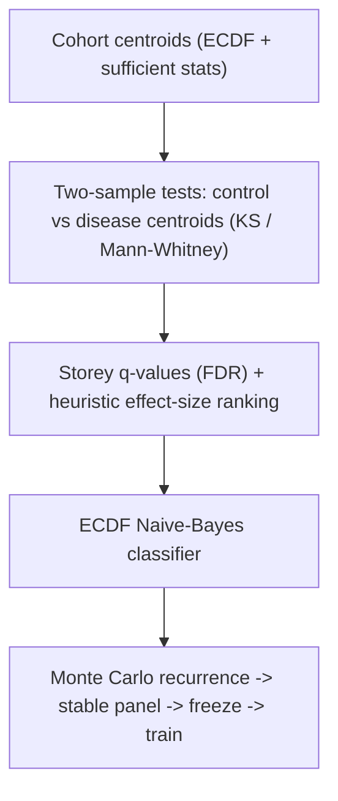
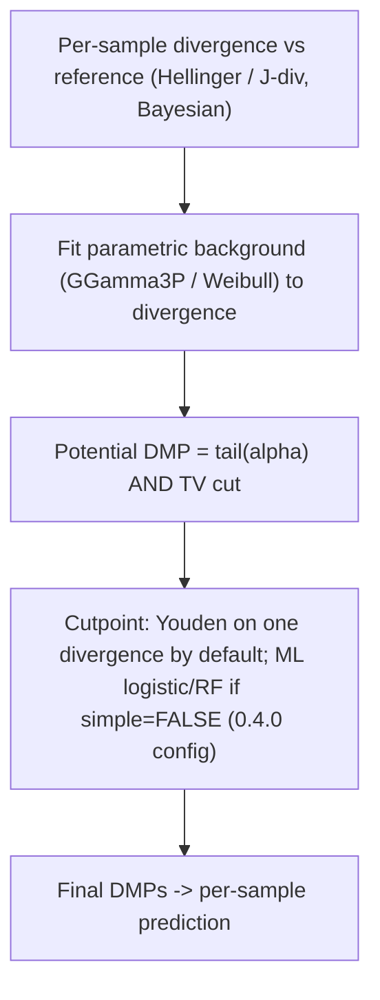

# MethylPipeline vs MethylIT_py 0.4.0 — Approach and Theory Comparison

> Informal design/research note. **Not** canonical user or operator documentation.
> Compares theoretical foundations and DMP → classification workflows of two products that
> both separate control vs disease methylomes (worked examples are often healthy vs prostate
> cancer; MethylPipeline itself is **disease-agnostic**).

**How to read this note.** Start with [Part 0](#part-0--when-to-prefer-which-product) for decision framing.
Part I (detection / prediction theory) is the durable core.
Part II (interpretation, deployment, CI) drifts as MethylPipeline’s orchestration evolves —
prefer [`docs/architecture/orchestration-paths.md`](../architecture/orchestration-paths.md)
and Usage ch.04 for *how to run* today. The [analyte appendix](#appendix--analyte-buffy-coat-vs-cfdna)
links both detectors to `cfdna` / `buffy_coat`. Empirical cells in
[Empirical tests needed](#empirical-tests-needed) remain **unfilled hypotheses**.

**Related research notes:** [`methylpipeline_informme_integration.md`](methylpipeline_informme_integration.md)
(distinct information-theoretic lineage), [`BuffyCoat_vs_cfDNA_for_Cancer_Detection.md`](BuffyCoat_vs_cfDNA_for_Cancer_Detection.md)
(analyte choice; both products can ingest WGBS from either material).

## Scope and evidence boundary

- **MethylPipeline** was read from its canonical theory book (`docs/theory/chapters/*.qmd`)
  and per-package theory/usage docs. In this repo the code is the source of truth and
  the theory book is written from the implemented behavior. Canonical orchestration is
  **`methyl-workflow-run` + DomainProgram + profile**; `methyl-validation --stability/--freeze/--model/--holdout-eval`
  remains a **legacy / transitional** CLI that still matches the statistical workflows described
  below (Workflows 1–3).
- **MethylIT_py — now read from source (`methylit` 0.4.2).** The first review pass saw only the
  installed wheel and reconstructed behavior from the release bundle (stage YAMLs, sample sheets,
  runner scripts). The **Python source tree is now available** (external checkout `EDFi/`; package
  `methylit` **0.4.2**; `methylit/pipeline/*.py`, `methylit/models/*.py`, `profiles/*.yaml`). The
  estimator description below is therefore **verified against the Python code**, not inferred. The
  section **"Cross-check against the current Python source (methylit 0.4.2)"** records what the
  port confirms and the three places where reading the code changes earlier claims — most
  importantly, the single-variable **Youden cutpoint is not implemented** in the port (it raises
  `NotImplementedError`, deferred to a later phase), and the coverage cap is a per-site
  `target_sum` (default **500**), not a downsample to ~10x. Because the package still carries the
  `0.4.x` line, "MethylIT_py 0.4.0" throughout this note should be read as the `0.4.x` Python port
  (reviewed at 0.4.2).
- **MethylIT R package (source review pass).** The original R implementation that MethylIT_py
  migrates — `MethylIT` **0.3.2.8** (Sanchez, `github.com/genomaths/MethylIT`) — was also read
  from an external checkout (`MethylIT2/R/*.R`; path may differ by machine). The section
  **"Cross-check against the original R source"** records what the R code confirms and the exact
  estimator formulas. Where the mature R defaults and the Python port differ (cutpoint default;
  gene-level layer), both are stated.

## Executive summary

Both products attack the same problem — separate control from disease methylomes and
score incoming samples — and share vocabulary (reference/centroid, train, validation/prediction;
per-chromosome; cytosine contexts CG/CHG/CHH; positive/negative class). Worked examples in both
codebases are often healthy vs prostate cancer; that is a cohort choice, not a product limit.
Their theoretical cores are nearly opposite:

- **MethylIT_py 0.4.0 = information theory + signal-detection theory.** For each sample it
  measures an *information divergence* of methylation from a common **reference** at every
  cytosine, fits a *parametric* distribution to the background divergence, calls a position a
  potential DMP when its divergence lies in the tail of that fitted noise model (plus a total-
  variation cut), then sets an optimal cutpoint separating control-like from treatment-like
  DMPs. In the R package that cutpoint is a **single-variable Youden index by default**
  (`estimateCutPoint(simple = TRUE)`), with a supervised logistic + random-forest route as the
  opt-in `simple = FALSE` alternative. The **Python port (0.4.2) ships only the ML route** —
  `simple = True` raises `NotImplementedError` — so in the current port the cutpoint is always a
  learned classifier (see both cross-check sections below).
- **MethylPipeline = nonparametric empirical distributions + resampling stability.** It
  represents each cohort as an ECDF "centroid," detects DMPs by two-sample tests
  (Kolmogorov-Smirnov / Mann-Whitney) *between two cohort centroids* with Storey FDR control,
  ranks survivors by a heuristic biological effect size, classifies via an ECDF Naive-Bayes-style
  density score, and selects a production panel by Monte Carlo recurrence (stability -> freeze ->
  train). It explicitly does **not** fit a parametric methylation model.

The deepest distinction: in MethylIT a DMP is a **per-sample** event (how far *this* sample
diverges from a reference), whereas in MethylPipeline a DMP is a **per-comparison** event (a
locus where the control-cohort distribution differs from the disease-cohort distribution).

### Fast-orientation summary

| Dimension | MethylIT_py 0.4.0 | MethylPipeline |
|-----------|-------------------|----------------|
| Unit of signal | Per-sample divergence vs a shared reference | Per-comparison difference between two cohort ECDFs |
| Signal statistic | Hellinger / J-divergence (Bayesian, coverage-weighted) | KS / Mann-Whitney on reconstructed ECDFs |
| Noise model | Parametric fit (GGamma3P / Weibull) to divergence | Distribution-free (empirical quantiles + Storey FDR) |
| Effect-size gate | Total-variation cut (`tv_cut`) | Heuristic effect size `|dmu|*(1-overlap)*exp(...)` + effect-mass trim |
| Where ML enters | Cutpoint step. In R it is **optional** (Youden index by default, logistic/RF only if `simple = FALSE`); the **Python port implements only the ML path** (`simple = True` raises `NotImplementedError`) | Downstream only (ECDF Naive-Bayes classifier) |
| Reference | Manually flagged (`is_reference`), pooled, fixed | None; control-cohort centroid rebuilt per split |
| Stability / freeze | Sidecar experiment scripts (`exp_wand.py`) | First-class Monte Carlo recurrence → freeze → train (DomainProgram or legacy `methyl-validation`) |
| Held-out evaluation | True holdout in `exp_wand.py` | Workflow 3 / hold-out DomainProgram path (legacy: `--holdout-eval`) with bootstrap CIs |
| DMP → gene interpretation | R package has count-based DMGs (`getDMGs` → GLM); 0.4.0 core ships only gene *masking* of detection, no weighted propagation | Full signed, weighted mapper → enricher stack |
| Evidence base | First-party (Sanchez & Mackenzie), no independent reproduction | Repo is source of truth; internals audited, with a per-PR regression + coverage CI gate and a designated real reference-sample test tier |
| Analyte / sample prep | WGBS inputs; reference/roles in sample sheet | `primary_analyte` (`cfdna` / `buffy_coat` / `combined`) + SamplePrepPipeline QC |

The table is a map, not a verdict; the sections below justify each row and flag which comparative
claims are established versus which are hypotheses still to be tested (see
[Empirical tests needed](#empirical-tests-needed)).

## What the two products agree on

- Same biological framing: control/reference group, training set, validation/prediction samples;
  `positive_class` vs `negative_class` (prostate sheets: `cancer` vs `healthy`).
- Organized by chromosome and cytosine context (CG/CHG/CHH).
- Both produce a reusable trained artifact and an apply-only scoring mode for unknowns —
  MethylIT `run mode: score_only` (reusing `centroid_manifest_path` + `model_dir`) mirrors
  MethylPipeline’s frozen-panel / predictor-only path (legacy CLI: `--predictor-only`).
- Both are engineered for genome-scale WGBS: per-chromosome parallelism, HDF5 outputs, coverage
  handling. Sequencing is typically on Illumina instruments; neither product is an EPIC BeadChip
  pipeline.

The disagreement is not *what* to model but *how* to define and detect the signal.

---

# Part 0 — When to prefer which product

This is a **decision frame**, not an empirical verdict. Prefer the product whose *unit of signal*
matches the scientific question; then use Part I to understand why DMP sets will not necessarily
agree.

| Situation | Prefer | Why |
|-----------|--------|-----|
| “How abnormal is **this** sample vs a fixed normal baseline?” (individual divergence / clinical-style signal detection) | **MethylIT** | Per-sample Hellinger/J-divergence vs a pooled reference; cutpoint on divergence features |
| “Which loci differ between **control and disease cohorts**, and which survive resampling?” (panel discovery for a classifier) | **MethylPipeline** | Cohort-vs-cohort ECDF tests + MC recurrence → freeze → train |
| Need a **production panel** with formal stability, freeze, hold-out, and gene/feature ranking | **MethylPipeline** | First-class DomainProgram / validation workflows + mapper → enricher → gene/feature select |
| Need a **lightweight divergence screen** against a carefully curated healthy reference, with optional Youden cutpoint | **MethylIT** (R default / simple cutpoint) | Fewer moving parts if the reference pool is trustworthy |
| Ops want **config layers, gateway workers, analyte profiles, CI gates** | **MethylPipeline** | Four-layer config, runtime-bundle, PR regression + real-sample registry |
| Ops accept a **single YAML + sample sheet** and sidecar holdout scripts | **MethylIT_py 0.4.0** | Self-contained stage config; `exp_wand.py` for true holdouts |
| Head-to-head on the **same WGBS cohort** | Run **both**, then compare | Different DMP definitions → expect incomplete overlap; use [Empirical tests needed](#empirical-tests-needed) |

**Do not** treat “MethylIT found more DMPs” or “MethylPipeline found more DMPs” as a quality score
without aligning definitions (per-sample tail event vs per-comparison FDR locus) and evaluation
(nested selection, true hold-out).

**Practical pairing (optional):** use MethylIT-style per-sample divergence as an *exploratory*
abnormality score while MethylPipeline owns the stable production panel — or the reverse for a
reference-centric lab that only needs MethylPipeline’s mapper/enricher on an imported locus list
(`fixed_dmp_panel`). That pairing is a study design choice, not a built-in bridge.

---

# Part I — Detection and prediction comparison

This first part compares how each product *detects* DMPs and *predicts* sample class: the signal
definition, the noise model, where machine learning enters, and how well the specific engineering
choices hold up against the external literature. It deliberately stops at the locus/sample level;
[Part II](#part-ii--biological-interpretation-and-deployment-comparison) picks up what happens after
detection (gene interpretation and deployment).

## MethylPipeline: the empirical-distribution / two-cohort path

Statistical pipeline: `centroid → detector → classifier → predictor`, wrapped by a
validation/stability layer. **Orchestration** today is DomainProgram-first
(`methyl-workflow-run` with profiles such as `mc_dmp` / `mc_gene_fc`); the same stages appear as
legacy `methyl-validation --stability` / `--freeze` / `--model` / `--holdout-eval`.

- **Centroid (`methylcentroid`).** A cohort is compressed into per-locus sufficient statistics
  (`N`, `Sx`, `Sx2`, count sums) **plus histogram counts** so an ECDF can be reconstructed later.
  Optional coverage capping uses **binomial thinning** (preserves the methylation fraction in
  expectation). The theory doc is explicit that this is a summary constructor for the nonparametric
  path and does **not** fit a parametric methylation model.
- **Detector (`methyldetector`).** Aligns a control centroid and a disease centroid, then per
  locus computes a two-sample test — KS on reconstructed ECDFs (grid supremum, Smirnov p-value with
  harmonic-mean effective n) or a histogram-based Mann-Whitney. All p-values get **Storey q-values**
  (FDR). Significant loci are then *separately* ranked by a heuristic **biological effect size**
  `|dmu|*(1-overlap)*exp(-lambda*(sigma1+sigma2))`, optionally trimmed by **cumulative effect-mass**
  coverage. "Statistically significant" and "biologically large" are kept as distinct axes. Supports
  dual outputs: a broad `dmps-*-discovery.csv` for biology and a smaller `dmps-*-selected.csv`
  prediction panel; a `fixed_dmp_panel` mode bypasses discovery to apply a pre-selected panel.
- **Classifier (`methylclassifier`).** ECDF Naive-Bayes-style scorer: weighted mean log-density
  across DMP loci with explicit class priors and temperature-scaled softmax, plus optional
  Platt/isotonic calibration, learned chromosome-fusion and multiclass one-vs-rest heads, and
  class-imbalance weighting.
- **Model creation as a stability problem (`methylvalidation` / DomainProgram MC loops).** Repeated
  Monte Carlo train/validation splits rerun `centroid → detector`; a locus's **recurrence frequency**
  `f_hat(d) = (1/R*) * sum_r 1[d in D_disc,r]` determines a **stable panel** (`f_hat >= tau`,
  `stability_dmp_freq`). The panel is frozen (`fixed_dmp_panel`) and the final classifier trained on
  all data restricted to it. Study-specific programs may add multiclass staging (e.g. PCa1–4), gene
  mapping, pathway enrichment, and ordered disease-progression synthesis — those layers are optional
  topology, not required by the detector theory.

Statistical spirit: frequentist two-sample testing at the cohort level plus resampling-based
feature-selection stability.

## MethylIT_py 0.4.0: the information-thermodynamics / signal-detection path

Stages run as numbered modules (`orca` = modules 1-4); the folder trail is
`06_potential_dimp -> 07_cutpoint -> 08_dmp -> 09_prediction`. The `stages:` block maps to the
classic MethylIT methodology:

- **`cap_coverage`** — coverage normalization/capping (e.g. `target_sum`, `max_sites_per_sample_chrom`).
- **`divergence`** — the theoretical heart. Computes an information divergence between each sample
  and the reference at every cytosine: `HD` (Hellinger) and/or `JD` (J-divergence), coverage-weighted
  (`weight: cov`), with **Bayesian** methylation-level correction (`Bayesian: true`, `idiv_prior`,
  `bayesian_p`). Treats methylation change as information carried relative to a reference state.
- **`gof`** (goodness of fit) — fits a **parametric distribution to the divergence values**:
  `model: GGamma3P` (three-parameter generalized gamma) with alternates `Weibull2P/3P`, `Gamma2P`,
  chosen by cross-validation (`r_cv`). This fitted distribution is the noise/background model.
- **`pDMP`** (potential DMPs) — selects positions in the **tail** of the fitted distribution
  (`alpha: 0.05`) **and** with total variation above a cut (`tv_cut`). Signal-detection: a position
  is a candidate when its divergence is improbable under the fitted distribution.
- **`cutpoint`** — optimal boundary separating treatment-like from control-like DMPs. In the R
  package this is a **Youden index on one divergence by default** (`simple = TRUE`); the 0.4.0
  Python config opts into the supervised ML route (`simple = FALSE`): features
  `hdiv, TV, jdiv.stat, bay.TV, jdiv, wprob, pos` with interactions, PCA (`n_pc: 4`), and learners
  `classifier1: logistic`, `classifier2: random_forest` (`ntree: 300`).
- **`dmp`** — final DMP calls applying the cutpoint; **`09_prediction`** classifies samples.

Statistical spirit: model the distribution of a divergence statistic, then apply detection theory
(tail probability + optimal cutpoint) and ML on divergence-derived features.

## Comparison of pipelines

### MethylPipeline: Empirical two-cohort path

### MethylIT_py 0.4.0: Information & signal detection path

## The core theoretical divergence, in depth

1. **Unit of the signal — per-sample vs per-cohort.** MethylIT computes a divergence for every
   individual sample at every cytosine relative to a shared reference; the classifier works in the
   space of these per-sample divergence statistics (well suited to "how abnormal is this one
   patient"). MethylPipeline never scores an individual against a reference during discovery — it
   asks whether the control-cohort ECDF differs from the disease-cohort ECDF at a locus, and defers
   per-sample scoring to the ECDF classifier stage.
2. **Parametric noise model vs distribution-free testing.** MethylIT's validity rests on the
   divergence population following a generalized-gamma/Weibull law (grounded in the information-
   thermodynamics view of methylation, where such laws arise as limiting distributions of the
   divergence). If the fit is good, tail probabilities are principled and powerful. MethylPipeline
   avoids the assumption: it reconstructs ECDFs and applies asymptotic KS/MWU with FDR — but its
   p-values are grid/histogram approximations and its effect-mass trimming is an explicit heuristic.
3. **Where machine learning enters.** In the **0.4.0 deployment config**, MethylIT wires supervised
   learning into *detection itself* (logistic / random forest cutpoint on divergence features, with
   PCA and interactions). The R default is simpler (Youden). MethylPipeline keeps detection
   statistical (tests + FDR + effect size) and puts learning downstream in the classifier. So
   MethylIT's DMP definition is cutpoint-dependent (Youden or ML), while MethylPipeline's is
   test-derived with a separate, later classifier.
4. **Bayesian methylation estimation vs frequentist moments.** MethylIT applies a Bayesian estimate
   of methylation levels before computing divergence (`idiv_prior`, `bayesian_p`), shrinking noisy
   low-coverage estimates. MethylPipeline uses empirical fractions and sufficient statistics with
   coverage handled by binomial thinning and floors.
5. **Total variation as a second axis (convergent instinct).** Both couple statistical improbability
   with a magnitude guard: MethylIT via a total-variation cut (`tv_cut`) on the methylation-level
   difference; MethylPipeline via the effect-size / delta-mu filter. Same instinct ("significant but
   trivial is not enough"), different formalisms.

## Deeper theoretical analysis (mathematics and statistics)

This section examines two specific complexity choices in MethylIT — the *parametric* Weibull/GGamma
distribution fitted to the divergence values, and the *multivariate ML classifier* at the cutpoint — and
argues, with the supporting mathematics, that under the regimes typical of genome-wide human WGBS
both are largely reducible to simpler, more scalable constructs. The conclusions converge on what
MethylPipeline already does (nonparametric ECDF screen + explicit effect-size gate + simple
aggregation).

### A. Does the Weibull/generalized-gamma distribution matter for the initial tail, or would the ECDF do?

**What MethylIT does.** For each individual sample it fits a cumulative distribution
$F_\theta$ to the per-cytosine Hellinger-divergence values $\{H_i\}$ — `Weibull2P/3P`, `Gamma2P`, or
`GGamma3P/4P` — chosen by cross-validated goodness-of-fit, then takes the critical value
$H_\alpha = F_\theta^{-1}(1-\alpha)$ with $\alpha=0.05$. A cytosine is a *potential* DMP when
$H_i > H_\alpha$ **and** its total-variation of methylation level exceeds a cut,
$\mathrm{TV}_i = |\hat p_{t,i}-\hat p_{c,i}| > \texttt{tv\_cut}$ (0.2 in the 0.4.0 config; the 2019
paper uses the empirical TV95 $\approx 0.28$–$0.35$).

**Why the parametric form is second-order at $\alpha=0.05$.** Reading off $H_\alpha$ is nothing more
than estimating the $0.95$ quantile of the divergence distribution. The nonparametric alternative is
the empirical quantile $\hat H_\alpha = \hat F_n^{-1}(1-\alpha)$ from the ECDF. For a moderate
(non-extreme) quantile like $0.95$ with genome-scale $n$ (covered cytosines per sample per
chromosome, $10^4$–$10^6$), the sample quantile is consistent and asymptotically normal with standard
error
$$
\operatorname{SE}(\hat q_{0.95}) \approx \frac{1}{f(q_{0.95})}\sqrt{\frac{0.95\cdot 0.05}{n}},
$$
which is minute. So the ECDF already estimates the $0.95$ cutpoint precisely; a parametric fit can
only *slightly* reduce variance, and it can *introduce* bias if the chosen family is misspecified.
Parametric tail modeling earns its keep in the **far** tail ($\alpha \to 10^{-4}$ or smaller), where
empirical quantiles are noisy or undefined and extrapolation (extreme-value / parametric) is
mandatory — not at $\alpha = 0.05$. Note also that `GGamma3P` *nests* Weibull and gamma as special
cases (Stacy 1962), so "Weibull as a simpler version" is literally a submodel; but every member of
that family is being used only to read a single $0.95$ quantile that the ECDF returns
assumption-free.

**Why the TV cut is the binding constraint.** The two gates are not independent. For a Bernoulli
methylation level the total-variation distance between control and treatment is exactly
$\mathrm{TV}=|\Delta p|$, and the Hellinger distance is
$H^2 = 1-\sqrt{p_c p_t}-\sqrt{(1-p_c)(1-p_t)}$; both are monotone in $|\Delta p|$ at fixed marginals.
More generally, Hellinger and total variation *sandwich each other* (Gibbs & Su 2002):
$$
H^2(P,Q)\;\le\;\mathrm{TV}(P,Q)\;\le\;\sqrt{2}\,H(P,Q),
$$
so they are topologically equivalent metrics and strongly correlated. Crucially, MethylIT's $H$ is
**coverage-weighted** (`weight: cov`), which is exactly why its divergence distribution looks
Weibull/gamma-like (a scaled sum of confidence-weighted terms), whereas the TV gate is an
**unweighted, bounded** $[0,1]$ effect size. Requiring $\mathrm{TV} > 0.2$ discards the large
population of high-$H$ positions that are statistically confident (deep coverage) but biologically
small ($|\Delta p|$ tiny). The identity and count of surviving pDMPs is therefore governed mostly by
the TV gate; perturbing the $H$-quantile estimator (parametric $\leftrightarrow$ ECDF) only nudges a
threshold on a variable whose gate is looser than TV's. **Predicted net effect on the pDMP set:
second-order.** This is a testable prediction, not a measured result — see
[Empirical tests needed](#empirical-tests-needed).

**Where the parametric model still matters (the honest caveats).** (i) MethylIT computes $H_\alpha$
*per individual*, so the fit provides a per-sample, coverage-aware noise calibration that a single
pooled ECDF would not; (ii) very small $\alpha$; (iii) the paper's headline advantage over Fisher's
exact test / DSS comes from *modeling the signal distribution at all*, not from Weibull-vs-ECDF
specifically (Sanchez et al. 2019). The precise statement is: **the functional form of the fitted
divergence distribution is not the load-bearing choice at $\alpha=0.05$; having an effect-size (TV)
gate is.** This is exactly
why MethylPipeline's nonparametric ECDF/KS screen plus an explicit effect-size filter is a defensible
substitute for the parametric tail — the two products converge here.

### B. Is a Random Forest justified at the cutpoint, or does single-variable Youden suffice?

**What MethylIT does.** `estimateCutPoint` classifies each pDMP as control-like vs treatment-like and
picks the optimal divergence cutpoint. The paper offers three routes: (1) the **Youden index** on a
single divergence; (2) posterior probabilities from an ML classifier (logistic/RF/QDA/kNN); (3) a
gamma-mixture posterior (Sanchez et al. 2019). The 0.4.0 config wires the ML route:
`classifier1: logistic`, `classifier2: random_forest` (`ntree: 300`) over
$\{$`hdiv, TV, jdiv.stat, bay.TV, jdiv, wprob, pos`$\}$ with interactions and `n_pc: 4` PCA.

**If the signal is essentially one monotone variable (e.g. J-divergence), the RF is unnecessary.**
For a single score $s$ with monotone $P(\text{treatment}\mid s)$, the Bayes-optimal decision rule is a
**threshold** $s > c^*$. Maximizing Youden's $J(c)=\mathrm{Se}(c)+\mathrm{Sp}(c)-1$ over $c$ returns
precisely the threshold that minimizes total misclassification under equal error weighting — Youden's
$c_J$ is provably the optimal-misclassification cutpoint for a given weighting
(Youden 1950; Perkins & Schisterman 2006). So Youden on the single variable **is** the optimal classifier for that
variable; a Random Forest cannot beat it and, as a piecewise-constant axis-aligned ensemble, can only
*approximate* the same threshold while adding variance, hyperparameters (`ntree`, `nsplit`), a
serialized version-fragile model, nondeterminism, and calibration burden.

**Scalability.** Youden is "sort the $n$ scores and sweep thresholds", $O(n\log n)$, deterministic,
one output parameter (the cutpoint), trivially portable. A 300-tree forest is
$O(\texttt{ntree}\cdot n\log n\cdot \sqrt{d})$ with bootstrap resampling per tree. On genome-scale
pDMP tables ($10^5$–$10^6$ rows per sample) the difference in constant factors is large — the
single-variable threshold scales far better, exactly as you note.

**Collinearity / effective dimension $\approx 1$.** `hdiv` (Hellinger), `jdiv` (J-divergence),
`bay.TV`, and `TV` are all monotone transforms of the same underlying $(\hat p_c, \hat p_t, \text{coverage})$; the J-divergence and Hellinger divergence are both $f$-divergences of the *same*
Bernoulli pair and are highly correlated. The nominal feature vector therefore has effective
dimension near 1 (perhaps 2 once coverage weighting is included); PCA to 4 components on collinear
inputs mostly repackages a single direction, and RF variable importance would collapse onto one
feature. In that regime a multivariate learner has almost nothing to learn beyond the single
divergence axis, and the parsimonious estimator (a threshold) dominates on bias, variance,
interpretability, and compute. Random forests excel with *many weakly informative, interacting*
features (Breiman 2001) — the opposite of a single dominant monotone score.

**When the RF is actually justified.** Only if `pos`, coverage weighting `wprob`, or genuine
interactions (`wprob:hdiv`, `wprob:jdiv`) carry non-redundant, **non-monotone** signal that materially
improves per-pDMP classification. That is an empirical question: compare held-out AUC / Youden-$J$ of
the single-variable threshold against the full RF; under the collinearity above the document predicts
a negligible delta, but this should be measured. And because the *clinical* decision aggregates
thousands of pDMPs per sample, small
per-pDMP gains wash out at the sample level — further favoring the simple threshold. This mirrors
MethylPipeline, which keeps per-locus detection as a nonparametric test plus a scalar effect score and
defers learning to a downstream *aggregate* classifier rather than a heavy per-locus model.

### C. Synthesis

The two most complex pieces of MethylIT — the parametric divergence distribution and the multivariate
per-locus ML cutpoint — are, under the conditions typical of human genome-wide WGBS, largely reducible
to (a) an ECDF/effect-size screen and (b) a single-variable optimal threshold. Their complexity is
defensible only in specific regimes — far-tail $\alpha$, per-individual noise calibration, or
genuinely multivariate non-monotone signal — which should be **measured, not assumed**. MethylPipeline's
MethylPipeline's held-out bootstrap (Workflow 3 / DomainProgram hold-out path; legacy
`--holdout-eval`) is the right instrument to settle it empirically: quantify (1) the
Jaccard overlap of pDMP sets selected by the parametric-$\alpha$ vs ECDF-$\alpha$ rule (the document
predicts high overlap), and (2) the held-out balanced-accuracy/AUC gap between a single-variable
Youden threshold and the full Random Forest (predicted within bootstrap noise). These are predictions
to be tested, not established results; the concrete protocol is in
[Empirical tests needed](#empirical-tests-needed). If those deltas turn out negligible, the simpler
constructs are not just adequate — they are preferable on reproducibility and scale.

### Additional references

Beyond Sanchez & Mackenzie, the analysis above rests on:

- **E. W. Stacy (1962).** "A Generalization of the Gamma Distribution." *Ann. Math. Statist.*
  33(3):1187–1192. — GGamma nests Weibull and gamma as special cases.
- **A. L. Gibbs & F. E. Su (2002).** "On Choosing and Bounding Probability Metrics." *Int. Stat. Rev.*
  70(3):419–435. doi:10.1111/j.1751-5823.2002.tb00178.x — the Hellinger–total-variation inequalities.
- **W. J. Youden (1950).** "Index for rating diagnostic tests." *Cancer* 3(1):32–35. — the Youden
  index / optimal single-score cutpoint.
- **N. J. Perkins & E. F. Schisterman (2006).** "The inconsistency of 'optimal' cutpoints obtained
  using two criteria based on the receiver operating characteristic curve." *Am. J. Epidemiol.*
  163(7):670–675. — $c_J$ is the optimal-misclassification cutpoint under a given weighting.
- **L. Breiman (2001).** "Random Forests." *Machine Learning* 45:5–32. — where ensembles help (many
  weak, interacting features) versus a single dominant monotone score.
- **D. M. Green & J. A. Swets (1966).** *Signal Detection Theory and Psychophysics.* Wiley. — the
  signal-detection framing shared by both products.

## Cross-check against the original R source

The two sections above were written before the estimator internals were readable; they reasoned
from the 0.4.0 stage config alone. The original R implementation (`MethylIT` 0.3.2.8,
external checkout `MethylIT2/R/*.R`) — the code that MethylIT_py migrates — has now been read directly.
It **confirms** the reconstructed pipeline and the exact statistics, and it **corrects two claims**
that the config-only view got wrong. Both corrections happen to *strengthen* the analysis in
sections A and B rather than weaken it.

### What the source confirms

- **Pipeline shape.** `estimateDivergence` → `gofReport`/`nonlinearFitDist` → `getPotentialDIMP`
  → `estimateCutPoint` → `selectDIMP` is exactly the `divergence → gof → pDMP → cutpoint → dmp`
  chain reconstructed from the `06→07→08→09` folder trail.
- **Coverage-weighted Hellinger.** `estimateHellingerDiv` (called by `estimateBayesianDivergence`)
  computes the count-based Hellinger of Basu, Mandal & Pardo (2010):
  $$
  H = \frac{2\,(n_1+1)(n_2+1)}{n_1+n_2+2}\Big[(\sqrt{p_1}-\sqrt{p_2})^2 +
  (\sqrt{1-p_1}-\sqrt{1-p_2})^2\Big],
  $$
  where $n_1, n_2$ are the control/reference and sample coverages. This *is* the coverage weighting
  the analysis attributed to `weight: cov`, and it confirms the mechanism behind section 2's
  argument: coverage enters as a **multiplicative weight on the divergence**, so deep sites inflate
  $H$ — which is exactly why a separate `cap_coverage` stage is needed in 0.4.0 (see below).
- **Bayesian methylation levels are beta-binomial.** `beta_bin_meth` fits a Beta prior per sample
  by nonlinear least squares on the ECDF of the naive levels $q = (mC+1)/(n+1)$
  (`estimateBetaDist`), then returns posteriors $\hat p = (a + mC)/(a + b + n)$
  (`.betaBinPosteriors`). This confirms the "Bayesian shrinkage of low-coverage estimates" claim and
  identifies `idiv_prior`/`bayesian_p` as the Beta hyper-parameters.
- **Potential-DMP tail test + TV gate.** `getPotentialDIMP` keeps sites with tail probability
  $p = P(\text{DIV} > \text{DIV}_k) < \alpha$ (default $\alpha = 0.05$) from the fitted CDF
  (`pweibull`/`pgamma`/`pggamma`/…), with an **optional** `tv.cut`/`hdiv.cut` magnitude filter.
  This confirms the two-gate structure (improbable **and** large).
- **J-divergence and its $\chi^2$ statistic** (`estimateJDiv`) are the symmetrised KL divergence with
  the Salicrú/Kupperman asymptotic statistic $2(n_1+1)(n_2+1)\,JD/(n_1+n_2+2)$ — as described.
- **The reference is a manual pooled centroid.** `poolFromGRlist` builds it with
  `stat = mean` (group centroid), `median`, `sum`, or `jackmean`; there is no automatic reference
  selection, confirming the "reference selection governs everything, and is not auto-chosen" section.

### What the source corrects

1. **The cutpoint is a single-variable Youden index *by default*; the ML classifier is opt-in.**
   The reconstruction (and the fast-orientation table) said MethylIT "bakes supervised learning into
   detection itself." The R signature is `estimateCutPoint(..., simple = TRUE, ...)`, and
   `simple = TRUE` calls `simpleCutPoint`, which computes the optimal cutpoint from the **Youden
   index on one divergence** (`.roc`: `which.max(sens + spec)`). The logistic/LDA/QDA/random-forest
   machinery lives in `mlCutpoint` and only runs when the caller sets `simple = FALSE`. So the
   package's *default and simplest* path is precisely the single-variable threshold that
   [section B](#b-is-a-random-forest-justified-at-the-cutpoint-or-does-single-variable-youden-suffice)
   argues for; the random forest is one of several optional classifiers (`classifier1`/`classifier2`
   ∈ {logistic, lda, qda, pca.*, random_forest}), and the 0.4.0 config's choice of `logistic` +
   `random_forest` is a *deployment* decision, not an intrinsic property of the method. This makes
   section B's conclusion stronger: the parsimonious estimator it recommends is the one the original
   author already ships as the default.
2. **The nonparametric ECDF tail is a first-class built-in, not just a hypothetical substitute.**
   `getPotentialDIMP` accepts `dist.name = "ECDF"` (and falls back to the ECDF when `nlms = NULL`),
   selecting sites by `1 - ECDF(q) < alpha`. So the "would the ECDF do?" alternative in
   [section A](#a-does-the-weibullgeneralized-gamma-distribution-matter-for-the-initial-tail-or-would-the-ecdf-do)
   is already implemented in the same function as the parametric fit — the parametric-vs-ECDF pDMP
   Jaccard comparison proposed in [Empirical tests needed](#empirical-tests-needed) can be run
   *inside MethylIT itself* by flipping one argument, with no re-implementation.
3. **The R package *does* have a DMP → gene layer; "no gene propagation" is a property of the 0.4.0
   bundle, not of the method.** The gene-mapping section states MethylIT keeps signal at the
   per-cytosine level and only *masks* detection to gene windows. That is accurate for the 0.4.0
   core (`orca` modules 1–4 + `g2dmp_m34.py`), but the R package ships **differentially methylated
   gene** detection: `getDIMPatGenes` counts DMPs per gene body, and `getDMGs` → `countTest2` fits a
   Poisson / negative-binomial GLM to those per-gene counts (with `log2FC`, Wald or LRT p-values, and
   BH adjustment), plus `dmpClusters` for region building. This is still **count-based** aggregation
   (number of DMPs per gene), not the signed, feature-resolved, effect-size-weighted propagation
   MethylPipeline uses — so the qualitative contrast in that section holds — but the sharper, correct
   statement is: *MethylIT ranks genes by DMP-count over-representation via a GLM; MethylPipeline
   ranks genes by a propagated continuous signed weight.* The claim that gene handling is only
   "reverse direction (masking)" should be scoped to the 0.4.0 release bundle, not the lineage.

### Net effect on the analysis

The source access converts the two headline arguments from "plausible under stated regimes" to
"the original code already contains the simpler construct as a supported option": Youden is the
default cutpoint, and the ECDF is a built-in tail model. It also tightens one over-broad claim
(gene-level testing exists in R, as a count GLM). None of the statistical reasoning in sections A, B,
or the independent-critique section changes; the divergence formula, the coverage-in-weight
mechanism behind the downsampling critique, the beta-binomial Bayesian levels, and the manual pooled
reference are all confirmed verbatim in the code.

## Cross-check against the current Python source (methylit 0.4.2)

The R cross-check above verified the *lineage*. The **Python port itself** is now readable
(`methylit` 0.4.2), so the claims specific to "MethylIT_py 0.4.0" can be checked against the actual
modules (`methylit/pipeline/{divergence,gof,potential_dimp,cutpoint,coverage,selection}.py`,
`methylit/models/{classifier,distributions}.py`) rather than the stage YAML alone. The port is an
explicit, function-by-function R-parity migration (its own docstrings cite the R functions), and it
confirms most of the reconstruction — but three details need correcting or sharpening, and one of
them (the missing Youden path) cuts *against* the R cross-check's conclusion.

### What the Python code confirms

- **Divergence formulas match the R source.** `divergence.py::_hellinger` computes the
  coverage-weighted Hellinger with the same `2·(n1+1)(n2+1)/(n1+n2+2)` weight (gated by
  `idiv_prior`), `_jdiv` uses the leading-factor-1 weight for the JD statistic (the port comments
  the exact R discrepancy), and `_beta_bin_meth_counts` reproduces the beta-binomial posterior
  `(a + mC)/(a + b + n)` with method-of-moments start and `scipy` least-squares/BFGS fitting. The
  `config_test6.yaml` divergence block (`weight: cov`, `Bayesian/bayesian_p: true`, `idiv_prior:
  true`, `JD/jd_stat: true`) confirms the coverage-weighted, Bayesian, J-divergence path used in
  practice.
- **The parametric tail and its ECDF fallback are both present.** `gof.py` fits `GGamma3P` with
  `alt_model = [Weibull2P, Weibull3P, Gamma2P]` and picks by `R.Cross.val` then `AIC`;
  `potential_dimp.py::_tail_prob_from_model` implements `Weibull2P/3P`, `Gamma2P/3P`, `GGamma3P/4P`
  tail probabilities **and** an ECDF branch (`dist_name in {ECDF, None, NA}` or `nlm is None`), and
  can even take `min(model_p, ecdf_p)`. So the ECDF alternative from section A is a first-class code
  path in the Python port too, not just in R.
- **pDMP is a tail-α gate plus an optional TV cut.** `get_potential_dimp(alpha=0.05, tv_col, tv_cut)`
  keeps `wprob < alpha` then filters `|TV| > tv_cut`; `config_test6.yaml` sets `alpha: 0.05`,
  `tv_cut: 0.2`, and the production/`dmp` stage uses `tv_cut: 0.3`. Two-gate structure confirmed.
- **Reference pooling is manual and configurable** (`centroid.stat` ∈ `mean/median/jackmean/sum`),
  matching the R `poolFromGRlist` behavior and the "manually chosen reference" point.

### What the Python code corrects or sharpens

1. **The Youden cutpoint is *not implemented* in the port — the ML path is the only one that runs.**
   In R, `estimateCutPoint(simple = TRUE)` (Youden) is the default. The Python
   `estimate_cutpoint(...)` **defaults to `simple = False` and raises `NotImplementedError` for
   `simple = True`** ("deferred to Phase B"). So for the current Python port the earlier
   "MethylIT bakes ML into detection" framing is *literally true today*: there is no shipped
   single-variable Youden option, only the logistic/LDA/QDA/RF/XGBoost path
   (`models/classifier.py`). This is the reverse of the R correction — and it makes section B's
   recommendation actionable: the parsimonious Youden cutpoint the R package offers by default is
   exactly the piece the Python port has not yet ported. (The port also adds an `xgboost` classifier
   not present in the R enumeration.)
2. **"Downsampling 30x → ~10x" is the wrong number; the cap is `target_sum = 500` per site.**
   `coverage.py::cap_coverage` proportionally rescales only sites with `mC+uC > target_cov` down to
   `target_cov`, preserving the methylation fraction — and both `production.yaml` and
   `config_test6.yaml` set `cap_coverage.target_sum: 500.0`. So the mechanism the critique names
   (coverage capping that discards depth) is real and confirmed, but the magnitude "~10x" is not
   what the code does; typical WGBS sites (well under 500x) are **untouched**, and only extreme-depth
   sites are rescaled. The section-2 critique should be restated as "capping at `target_sum` (500 by
   default)" rather than "downsample to 10x." The statistical-efficiency argument (coverage-in-weight
   vs coverage-in-likelihood) still stands; its quantitative sting is much smaller at 500 than at 10.
3. **Gene-level testing is explicitly out of MVP scope in the port.** The Python project plan lists
   "DMG (differentially methylated gene) calling" and "gene annotation intersection" under
   *Out of Scope for MVP*; there is no `getDMGs`/`countTest2` equivalent in `methylit/`, only the
   `g2dmp_m34.py` / `pdmp_gene_subset_module34.py` sidecars that **subset detection to gene
   coordinates** (the masking pattern). This confirms the "no weighted gene propagation in the
   Python core" claim and dates it precisely: gene-level analysis is deferred, not merely unused.

### FDA-relevant additions visible in the port

The Python port is explicitly positioned for a regulated workflow, which is new signal for the
verification/reproducibility comparison (previously the note said MethylIT_py had "no comparable
regression gate"):

- a `tests/` suite with a dedicated **parity tier** (`tests/parity/test_gof_parity.py`) plus
  per-stage tests (`test_divergence`, `test_cutpoint`, `test_potential_dimp`, …);
- named **profiles** (`smoke`, `dev`, `parity`, `production`) and a `recycle`/`strict_fingerprint`
  mechanism for run reproducibility;
- release-manager and DHF-oriented docs (`RELEASE_MANAGER_CHECKLIST.md`, LOOP change-request intake),
  and a README that frames the tool as internal pre-production validation software with run-receipt
  retention for "FDA-trial traceability."

This does not establish independent reproduction (the code is still first-party), but the
"MethylPipeline is audited / MethylIT is only inferred" asymmetry is now weaker: both sides expose a
test suite and reproducibility controls. The remaining asymmetry is scope (MethylPipeline's stability
→ freeze → holdout workflow and weighted interpretation stack have no counterpart in the port).

## Independent corroboration and open critiques

The analysis so far took MethylIT's own framing at face value. This section steps back and asks two
harder questions: *how independent is the evidence base?* and *do the specific engineering choices
(count-based modeling forcing downsampling, small low-coverage cohorts, a Random-Forest cutpoint, and
a small training fraction) hold up against the external literature?*

### 1. The evidence base is almost entirely first-party

Every foundational MethylIT reference — the 2016 information-thermodynamics paper, the 2019 clinical
signal-detection paper, the R package, and the 2023 re-analysis of public methylomes — traces to
Sanchez and Mackenzie (and close collaborators). MethylIT_py 0.4.0 is a Python migration of that same
R code, not an independent re-implementation. A literature scan for **independent** groups
reproducing or externally validating the specific Hellinger-divergence → Weibull/GGamma →
signal-detection → ML-cutpoint pipeline returns essentially nothing: adoption outside the originating
lab is not documented in peer-reviewed work. This does not make the method wrong, but it means the
pipeline's performance claims rest on self-reported analyses of a few datasets, which is exactly the
situation independent held-out evaluation (Workflow 3) exists to remedy.

Three clarifications keep this fair:

- **MethylIT's theory is itself peer-reviewed, not ad hoc.** The information-thermodynamics foundation
  is published in its own right — Sanchez & Mackenzie, "Information Thermodynamics of Cytosine DNA
  Methylation" (*PLoS ONE* 2016), with a formal thermodynamic derivation extended in "On the
  thermodynamics of DNA methylation process" (*Scientific Reports*, a Nature-portfolio journal, 2023).
  The concern here is **not** that MethylIT lacks a published theory; it is that the specific
  end-to-end *pipeline* (Hellinger/J-divergence → GGamma/Weibull fit → signal-detection tail →
  ML cutpoint) has not been independently reproduced by groups outside the originating lab.
- **Do not conflate MethylIT with other "information-theoretic" methylation work — the theories are
  different.** Despite the shared adjective, the epigenome "potential energy landscape" / `informME`
  framework of Jenkinson, Abante, Feinberg & Goutsias (*Nat. Genet.* 2017) and the
  methylation-entropy / epipolymorphism work of Landan et al. (*Nat. Genet.* 2012) model a **different
  object**: the joint distribution of co-methylation patterns across neighboring CpGs (an Ising / MRF
  and read-level entropy view). MethylIT instead models the **information divergence of a sample's
  per-cytosine methylation level from a reference** and fits a parametric law to that divergence.
  These are not the same theory, and informME/Landan therefore do **not** independently corroborate
  MethylIT's approach — they only establish that information-theoretic reasoning about methylation is
  a legitimate, active area. Signal-detection theory in diagnostics is likewise a mature, independent
  field (Green & Swets 1966; Pepe, *The Statistical Evaluation of Medical Tests*, 2003), but that too
  is a general framework MethylIT *applies*, not a reproduction of MethylIT's specific construction.
- Independent theoretical lineage for a concept is not a substitute for independent empirical
  reproduction of a tool. MethylIT has the former (its own published theory); what remains unmet is
  the latter (third-party reproduction of the pipeline's performance claims).

### 2. Counts vs methylation levels, and coverage capping (`target_sum`, default 500)

> **Corrected against the Python source.** An earlier version of this section asserted MethylIT
> "caps/downsamples 30x to ~10x." Reading `methylit/pipeline/coverage.py` shows the cap is a
> per-site `target_sum` (default **500**, in both `production.yaml` and `config_test6.yaml`), applied
> only to sites whose `mC+uC` exceeds it, by proportional rescaling that preserves the methylation
> fraction. The "~10x" figure was wrong. The structural critique below — coverage entering as a
> *weight on a divergence* rather than the *denominator of a count model* — is still valid and
> confirmed by the code (`_hellinger_weight`), but its practical bite is small at a 500x cap, since
> ordinary WGBS sites are left untouched.

The observation that MethylIT "works with counts, not levels" and applies **coverage capping** is
accurate; the external literature explains the trade-off and the standard alternative.

- **Why extreme capping would be costly (bounds the concern).** Methylation level is a proportion
  $m/(m+u)$; at depth 10 it can only take values $\{0, 0.1, \dots, 1.0\}$, so it *cannot* be within
  5% of a true value like 0.85 (BoostMe, Zou et al., BMC Genomics 2018; "Characterizing the
  properties of bisulfite sequencing data," BMC Genomics 2021). This quantization argument is why an
  aggressive cap (e.g. to ~10x) *would* be harmful — but MethylIT's default `target_sum = 500` sits
  far above the depth range where quantization matters, so in practice this cost is largely
  hypothetical for typical WGBS.
- **The field standard avoids capping entirely by modeling coverage in the likelihood.** DSS
  (Feng, Conneely & Wu, *Nucleic Acids Res.* 2014), methylSig (Park et al. 2014), methylKit
  (Akalin et al., *Genome Biol.* 2012), bsseq/BSmooth (Hansen, Langmead & Irizarry, *Genome Biol.*
  2012), and dmrseq (Korthauer et al., *Biostatistics* 2018) all model the methylated/total read
  counts with a **beta-binomial** (a per-site methylation mean plus a dispersion parameter, with
  coverage entering as the binomial denominator). Deeper sites automatically receive more weight;
  no reads are discarded and no coverage cap is needed. MethylIT does use coverage weighting and a
  Bayesian level estimate, but the reason it caps at all — to keep the coverage-weighted Hellinger
  divergence comparable across samples — is precisely the problem the beta-binomial likelihood
  solves without any cap. Capping is a symptom of putting coverage into a *weight* on a divergence
  rather than into the *denominator* of a count model.
- **Practical consequence.** Capping at `target_sum = 500` is a mild, defensible cross-sample
  normalization; it is still, on statistical-efficiency grounds, dominated by depth-aware count
  models that the rest of the field has used for a decade — but the gap is far narrower than the
  earlier "~10x" framing implied.

### 3. Few samples at low coverage: replicates, not depth, are the binding constraint

MethylIT's published results use small cohorts. The most-cited WGBS design study — Ziller, Hansen,
Meissner & Aryee, "Coverage recommendations for methylation analysis by whole-genome bisulfite
sequencing" (*Nat. Methods* 2015) — is directly relevant and, notably, **independent** of MethylIT:

- Per-sample coverage of **5–15x is sufficient** for DMR detection; sequencing deeper is "wasted
  resources that would be better spent on an increased number of biological replicates."
- **Biological replicates should be analyzed separately, not pooled**, and adding replicates raises
  power more than adding depth.

This reframes the critique constructively: a design of *many* replicates at *modest* depth is
statistically superior to *few* deep samples that are then downsampled — and it is the opposite of
what the original MethylIT demonstrations used. It also means a pooled-control **reference centroid**
(Section on reference selection) discards the very replicate-level variance Ziller says to preserve.

### 4. Small training fraction, Monte Carlo splits, and Random Forest scalability

Two ML choices deserve external scrutiny.

- **Small training fraction (e.g. ~20% train / ~80% test) driven by RF cost.** There is a narrow
  theoretical defense: for *model selection*, Monte Carlo cross-validation with a large validation
  fraction is asymptotically consistent and guards against over-large models (Shao, *JASA* 1993;
  Picard & Cook 1984). But for estimating the performance of a *fixed predictive* model, shrinking the
  training set raises bias and, in the small-$n$ regime MethylIT operates in, small-sample
  cross-validation estimates are known to be **high-variance and optimistically biased**
  (Braga-Neto & Dougherty, "Is cross-validation valid for small-sample microarray classification?",
  *Bioinformatics* 2004). A 20/80 split chosen because a 300-tree Random Forest over $10^5$–$10^6$
  per-locus rows is too slow at 80/20 is a *computational* concession with *statistical* costs, not a
  principled design.
- **Feature-selection leakage.** Selecting DMPs and then estimating classifier performance is
  vulnerable to selection bias unless selection is redone *inside* each resampling fold
  (Ambroise & McLachlan, *PNAS* 2002). This is the same hazard MethylPipeline documents for its own
  stability workflow, and it is worth checking explicitly for MethylIT's cutpoint step.
- **Random Forest is the wrong tool for a near-1-D, collinear feature set** (see the deeper-analysis
  section above): on a single dominant monotone divergence a Youden-index threshold is Bayes-optimal,
  $O(n\log n)$, and deterministic, whereas the forest adds cost and variance without new signal. The
  small-sample microarray RF literature reaches the same parsimony conclusion (smaller/simpler models
  match or beat large forests on small $n$).

### 5. What this implies

None of the above proves MethylIT is inaccurate; it shows that (a) its evidence is self-generated and
un-reproduced, and (b) several implementation choices — count-driven downsampling, few deep samples,
a heavy per-locus classifier, and a compute-driven small training fraction — run against
well-established, independent methodology (beta-binomial depth modeling; replicates-over-depth; nested
selection; parsimonious thresholds). The productive response is measurement, not rhetoric:
MethylPipeline's true held-out bootstrap (Workflow 3) plus a beta-binomial or ECDF baseline can
quantify, on the same cohort, whether the Weibull/GGamma + Random-Forest machinery buys anything over
a coverage-aware count model with a single-variable Youden cutpoint. The external literature predicts
the gap will be small; that prediction should be tested rather than assumed (see
[Empirical tests needed](#empirical-tests-needed)) — and if it holds, the simpler, depth-preserving,
replicate-rich design is the more defensible one.

### External references (independent of the MethylIT authors)

- **Ziller M. J., Hansen K. D., Meissner A., Aryee M. J. (2015).** "Coverage recommendations for
  methylation analysis by whole-genome bisulfite sequencing." *Nat. Methods* 12(3):230–232. — 5–15x
  is enough; add replicates, not depth; analyze replicates separately.
- **Feng H., Conneely K. N., Wu H. (2014).** "A Bayesian hierarchical model to detect differentially
  methylated loci from single-nucleotide-resolution sequencing data." *Nucleic Acids Res.* 42(8):e69.
  (DSS; beta-binomial with dispersion shrinkage.)
- **Korthauer K., Chakraborty S., Benjamini Y., Irizarry R. A. (2018).** "Detection and accurate false
  discovery rate control of differentially methylated regions from WGBS." *Biostatistics* 19(3):325–343.
  (dmrseq; works with as few as two per group.)
- **Akalin A. et al. (2012).** "methylKit: a comprehensive R package for the analysis of genome-wide
  DNA methylation profiles." *Genome Biol.* 13:R87.
- **Hansen K. D., Langmead B., Irizarry R. A. (2012).** "BSmooth: from whole genome bisulfite
  sequencing reads to differentially methylated regions." *Genome Biol.* 13:R83.
- **Park Y., Figueroa M. E., Rozek L. S., Sartor M. A. (2014).** "MethylSig: a whole genome DNA
  methylation analysis pipeline." *Bioinformatics* 30(17):2414–2422.
- **Zou L. S. et al. (2018).** "BoostMe accurately predicts DNA methylation values in WGBS of multiple
  human tissues." *BMC Genomics* 19:390. — low-depth quantization error.
- **"Characterizing the properties of bisulfite sequencing data…" (2021).** *BMC Genomics*
  22, s12864-021-07721-z. — read depth vs sensitivity; finite proportion values at low depth.
- **Braga-Neto U. M., Dougherty E. R. (2004).** "Is cross-validation valid for small-sample microarray
  classification?" *Bioinformatics* 20(3):374–380.
- **Ambroise C., McLachlan G. J. (2002).** "Selection bias in gene extraction on the basis of
  microarray gene-expression data." *PNAS* 99(10):6562–6566. — feature selection must be inside the
  resampling loop.
- **Shao J. (1993).** "Linear model selection by cross-validation." *J. Am. Stat. Assoc.*
  88(422):486–494. — asymptotics of leave-many-out Monte Carlo cross-validation.
- **Pepe M. S. (2003).** *The Statistical Evaluation of Medical Tests for Classification and
  Prediction.* Oxford University Press. — independent signal-detection/ROC foundation.
- **Jenkinson G., Abante J., Feinberg A. P., Goutsias J. (2017).** "Potential energy landscapes
  identify the information-theoretic nature of the epigenome." *Nat. Genet.* 49:719–729. (`informME`;
  a **distinct** information-theoretic framework — an Ising/MRF model of joint co-methylation across
  neighboring CpGs — **not** a reproduction of MethylIT's divergence-from-reference theory.)
- **Landan G. et al. (2012).** "Epigenetic polymorphism and the stochastic formation of differentially
  methylated regions in normal and cancerous tissues." *Nat. Genet.* 44:1207–1214. (Read-level
  methylation entropy / epipolymorphism — again a different object from MethylIT's per-cytosine
  divergence.)

---

# Part II — Biological interpretation and deployment comparison

Part I compared detection and prediction and stopped at the DMP set. This second part is a
deliberate expansion of the comparison beyond DMP discovery: how each product turns a frozen panel
into a deployable model (stability, reference handling) and how it projects per-locus signal onto
genes, features, and networks for biological interpretation. This is where the two products are most
asymmetric — MethylPipeline treats interpretation and deployment as first-class, while MethylIT_py
0.4.0 largely leaves them out of the core.

## Feature-selection stability and "production" model

- **MethylPipeline** has a first-class, formalized answer: Monte Carlo recurrence → stable panel →
  freeze → train, with an explicit warning that the panel was selected using the full sample set
  (internal validation, not external). Multiclass staging, calibration, and biology (mapper /
  enricher / progression) are part of the model story when the DomainProgram includes them.
  Operators run this via `methyl-workflow-run` (canonical) or legacy `methyl-validation` stage flags.
- **MethylIT_py 0.4.0** addresses the same concern through **sidecar experiment scripts**, not a
  built-in workflow:
  - `exp_wand.py` runs a training-set sensitivity study — builds many train subsets at increasing
    "levels," reuses a shared `06_potential_dimp` via symlink, reruns modules 3-4, and reports
    **holdout-only** metrics (accuracy, sensitivity, specificity, PPV, NPV, AUC) aggregated by level.
    Notably it measures performance strictly on samples excluded from training — a genuine holdout.
  - `g2dmp_m34.py` restricts detection to gene coordinates and reruns modules 3-4, with rules to
    exclude under-covered samples and skip chromosomes; it emits SHA256 provenance receipts.
  These are careful investigative harnesses around the core detector, not a codified
  stability → freeze → deploy pipeline.

On train/test separation specifically: `exp_wand.py` evaluates on true holdouts, whereas
MethylPipeline's Workflow 2 holdouts overlap the training centroid, so it is not a classical
hold-out. MethylPipeline also provides **Workflow 3** (true held-out batch evaluation): designated
batches (declared in `validation_partitions`) are excluded from production training at freeze and
scored once by the frozen model, with QC-metric distributions (balanced accuracy, sensitivity,
specificity, F1, ROC-AUC) produced by bootstrap with confidence intervals — the same bootstrap-CI
reporting philosophy MethylIT uses. Theory: `docs/theory/chapters/12-two-workflows.qmd`. Operator
entry: DomainProgram hold-out path or legacy `methyl-validation --holdout-eval`.

## Reference selection (the decision that governs everything in MethylIT)

MethylPipeline does not use a reference at all: the "reference" role is played by the control-cohort
centroid, and the framework diffuses sensitivity to *which controls* by rebuilding centroids on every
Monte Carlo split. Loci that only survive under particular control subsets fall below the stability
threshold. Production freeze then rebuilds the control centroid on all control data. The documented
caveat: Workflow 2 holdouts overlap the training centroid, so this is internal robustness, not
external validity. A related hazard is coverage mismatch — if control/detector `min_coverage`
differs from the classifier's per-locus requirement, DMP loci silently become "missing" in new
samples.

MethylIT_py, by contrast, makes the reference a first-class object — and it is **not** selected
automatically:

- **Who creates it.** The analyst authoring the sample sheet, via the `is_reference` column
  (TRUE/FALSE). Every example sheet flags healthy samples as reference; some are "reference +
  training control" (`analysis_role=train`), others "reference only" (`analysis_role=other`). There
  is no config flag for automatic reference discovery/ranking/medoid selection. The only reference-
  related knobs are guards, not selectors: `role_policy.allow_reference_train_overlap` /
  `warn_reference_train_overlap`, `role_policy.warn_class_imbalance_ratio`, and coverage floors
  `centroid.min_samples_per_site` / `centroid.min_sitecov`.
- **What "it" is.** The flagged samples are pooled into a single reference centroid at the
  `03_centroid` stage and persisted as `03_centroid/centroid_manifest.json`. That pooled centroid —
  not any individual sample — is the common baseline the `divergence` stage compares every sample
  against. `score_only` reuses the same manifest via `centroid_manifest_path`, i.e. the reference is
  frozen and reused.
- **Why it governs all calculations.** The pooled reference feeds (1) the per-sample divergence for
  all samples, (2) the goodness-of-fit distribution fitted to the divergence values, (3) the potential-DMP
  tail test, and (4) the cutpoint classifier and prediction. So the single human decision "which rows
  are `is_reference`" propagates into every downstream number.

Practical recipe (grounded in the artifacts; MethylIT provides levers but no algorithm):

- Use control/healthy samples only — the reference defines "normal."
- Pool several, not one — the `centroid` stage exists to build a stable per-position baseline;
  `min_sitecov: 4` sets the usable-position floor.
- Make it representative and batch-balanced — any systematic reference-vs-rest difference (depth,
  batch, age/sex, prep) becomes spurious divergence and biases the fitted divergence distribution.
- Keep it fixed and reuse it (`centroid_manifest_path`) for comparability; `exp_wand.py` holds the
  reference constant and forbids reference/training overlap in experiments.
- Decide on overlap deliberately — overlap is allowed (reference is used to compute a divergence, not
  as a label) but warned, since reusing healthy samples as reference and as evaluation controls
  introduces optimism. Mark reference-only samples `analysis_role=other` for cleaner separation.

The key implication: MethylIT's reference is manual, pooled, and upstream of the fitted divergence
distribution, and the tool validates it only via coverage floors and overlap warnings. If the pool is
unrepresentative or too small, nothing automatic will catch or correct it. A **reference-swap
sensitivity study** (build several reference pools from different healthy subsets; rerun
`03_centroid -> divergence -> gof -> pDMP`; compare potential-DMP sets and fitted distribution
parameters) would convert this unmeasured
assumption into a quantified one.

## DMP-to-gene mapping and weight propagation (the interpretation layer)

The sections above compare how each product *detects* DMPs. They deliberately stopped at the locus
level and did not describe what happens *after* detection: how a per-locus signal is projected onto
genes and gene features, and how the DMP's weight is carried upward so genes and features can be
**ranked**. This is a real asymmetry between the two products, so it is worth making explicit.

### MethylPipeline: a signed, feature-resolved DMP weight propagated up to genes, features, and networks

MethylPipeline has a full DMP -> gene -> feature -> network/pathway interpretation stack
(`methylmapper` -> `methylenricher`, with `methylgeneselect` / `methylgenefeatureselect` consuming
the ranked outputs). The load-bearing idea is that a **continuous, signed, feature-resolved weight**
is propagated from each DMP up to the objects being ranked, rather than a gene simply being flagged
"hit / not hit."

1. **Interval mapping (deterministic).** `methylmapper` assigns each DMP to a genomic feature by
   bedtools-style interval logic (or the external `spMapDMP2Genes` Azure SQL procedure), with an
   **exclusive** feature priority `promoter > exon > intron > gene_body > terminator`
   (`packages/methylmapper/methyl_mapper/bedtools_mapper.py`).
2. **Per-DMP weight.** The detector's biological effect size
   $e_i=|\Delta\mu_i|\,(1-\text{overlap}_i)\,e^{-\lambda(\sqrt{v_{1,i}}+\sqrt{v_{2,i}})}\cdot(\text{mean-level weight})$
   is combined with recurrence frequency and a **biology-weight matrix** $b(\text{feature},\text{hyper}\,|\,\text{hypo})$
   (e.g. promoter-hyper $=2.0$, intron-hyper $=0.5$):
   $$
   w_i = f_i \cdot b(\text{feature}_i, s_i), \qquad
   \text{abs\_term}_i = w_i\,|e_i|, \qquad
   \text{signed\_term}_i = \text{sign}(\Delta\mu_i)\,\text{abs\_term}_i .
   $$
3. **Gene- and feature-level aggregation and rank.** Over unique DMPs mapped to a gene,
   $$
   I_{\text{gene}} = \Big(\textstyle\sum_i \text{abs\_term}_i\Big)\cdot
   \underbrace{\frac{|\sum_i \text{signed\_term}_i|}{\sum_i \text{abs\_term}_i}}_{\text{direction coherence}}\cdot
   \sqrt{\bar f}\,,
   $$
   and `feature_importance_{promoter,exon,...}` uses the same construction within each feature bucket.
   Statistical significance is kept on a **separate axis**: a signed weighted **Stouffer** aggregation
   of the mapped DMP p-values gives `gene_p_value` → Storey `gene_q_value` (with the honest caveat
   that mapped DMPs in one gene are spatially correlated, so the independence assumption is only
   approximate). Spec: `packages/methylmapper/docs/BIOLOGICAL_IMPORTANCE_AUDIT.md`; theory
   [`docs/theory/chapters/07-methylmapper.qmd`](../theory/chapters/07-methylmapper.qmd).
4. **Downstream biology (summary only).** Once genes carry `gene_importance`, `methylenricher`
   can prioritize via PPI hubs (signal-weighted), CIS-BP annotate / motif_scan, and Enrichr library
   presets (`cancer-core`, …), optionally with disease-evidence boosts. Those layers **reuse** the
   propagated DMP weight rather than discarding it. Details live in theory
   [`08-methylenricher.qmd`](../theory/chapters/08-methylenricher.qmd) — not duplicated here.
5. **Weights into selection.** `methyl-gene-select` / `methyl-gene-feature-select` consume
   `gene_importance` and `feature_importance_*` so the signed, feature-resolved DMP weight orders
   the gene/feature panel that gets classified.

### MethylIT_py 0.4.0: gene-level testing is count-based (and absent from the 0.4.0 core), not a weighted propagation

> **Corrected against the R source.** An earlier version of this section claimed MethylIT has *no*
> gene layer at all and only *masks* detection to gene windows. That is true of the **0.4.0 release
> bundle** examined here, but **not** of the MethylIT lineage: the R package (`MethylIT` 0.3.2.8) has
> a real differentially-methylated-**gene** layer. See the
> [cross-check section](#cross-check-against-the-original-r-source). The distinction that survives is
> *count-based over-representation* (MethylIT) vs *signed weighted propagation* (MethylPipeline).

MethylIT_py 0.4.0's core (`orca` modules 1-4, `06_potential_dimp -> 09_prediction`) has **no**
DMP -> gene -> feature -> pathway propagation, and **no** PPI, CIS-BP, Enrichr, or disease-database
layer. Where genes appear in the 0.4.0 bundle at all, the direction of information flow is reversed:

- `scripts/g2dmp_m34.py` **restricts detection to gene coordinates** and reruns modules 3-4 (with
  rules to exclude under-covered samples and skip chromosomes, and SHA256 provenance receipts). This
  is a **gene -> DMP masking** harness — "only call DMPs inside these gene windows" — not a
  DMP -> gene ranking. It never carries a per-DMP weight up into a `gene_importance` and never ranks
  genes or gene features by an aggregated, signed effect.

What the **R package** adds (and a future MethylIT_py release could expose) is a *count-based* gene
test, which is still categorically different from MethylPipeline's weighted propagation:

- `getDIMPatGenes` counts DMPs overlapping each gene body (optionally hyper- or hypo-only via the
  sign of `TV`); `getDMGs` then feeds those per-gene counts to `countTest2`, a Poisson /
  negative-binomial **GLM** that reports `log2FC`, a Wald or LRT p-value, and BH-adjusted q-values;
  `dmpClusters` builds DMP-dense regions for the same GLM. So MethylIT *does* rank genes — by the
  **statistical over-representation of DMP counts** in a gene, not by a continuous signed effect
  carried up from each DMP.

The consequence for a direct comparison: MethylIT (R) ranks genes by a **count GLM** (how many DMPs
fall in the gene, tested against a Poisson/NB null); MethylPipeline treats gene- and feature-level
ranking as a first-class **weighted** aggregation problem — a signed, feature-resolved DMP weight
propagated into `gene_importance`, then optionally refined by PPI / CIS-BP / Enrichr (theory ch.08).
Any head-to-head that stops at the DMP set will therefore miss the interpretation stack, which in
MethylPipeline is also used as an orthogonal **biological validation** check (do top-weighted genes
recover coherent modules?), whereas in MethylIT_py 0.4.0 it is out of scope and in MethylIT (R) it
is count-based rather than weight-propagated.

## Engineering and interpretation differences

- **Discovery vs prediction outputs.** MethylPipeline emits a broad `discovery` list and a smaller
  BA-optimized `selected` panel, and warns against using discovery-on-all-samples for performance
  claims. MethylIT emits detection/prediction TSVs per sample x chromosome; gene/pathway
  interpretation is not part of the 0.4.0 core the way it is in MethylPipeline (mapper, enricher,
  disease progression).
- **Configuration philosophy.** MethylPipeline is aggressively config-not-code: four layers
  (site / profile / study / DomainProgram), no tunable science defaults in Python, schema-validated
  `actionConfig`. MethylIT_py uses a single self-contained YAML per run with all stage knobs inline.
- **Compute.** Both parallelize per chromosome and use HDF5. MethylIT_py exposes explicit GPU parity
  checks in the divergence stage and a cuPyNumeric-friendly HDF5 export, reflecting a heavy
  vectorizable divergence computation. MethylPipeline emphasizes distributed workers and gateway/DB
  orchestration (`methyl-gateway` / `methyl-worker`, runtime-bundle on `/work/epimethyl/current`).
- **Verification and reproducibility posture.** MethylPipeline runs the full monorepo test suite
  as a per-pull-request **regression gate** with coverage measurement (`ci/azure-pipelines-pr.yml`,
  `scripts/run_tests_ci.sh`), and formalizes testing as a regulatory control
  (`docs/regulatory/continuous-integration-and-regression-testing.md`). Critically for a fair
  head-to-head, it adds a typed **real reference-sample test registry**
  (`docs/reference/test-data-registry.md`): designated real extracted samples per analyte
  (`cfdna`, `buffy_coat`) plus named cohorts (`healthy`, `PCa`) that back `@pytest.mark.real_data`
  tests, with non-PHI provenance recorded in the validation-evidence index. This means the empirical
  comparisons below can be run against *real* methylomes on a self-hosted tier, not only synthetic
  fixtures. MethylIT_py 0.4.0 ships careful sidecar harnesses (`exp_wand.py`, `g2dmp_m34.py` with
  SHA256 receipts) but no comparable per-change regression gate or designated-sample registry in the
  reviewed bundle.

## Empirical tests needed

Several of this document's strongest claims are *predictions* derived from theory and the external
literature, not measurements on a shared cohort. They read as "second-order," "within bootstrap
noise," or "the gap will be small," and each is falsifiable. Turning the critique into a testable
research agenda, the following experiments would convert inferred claims into evidence. All are
runnable on the same prostate healthy-vs-PCa cohort (or any matched control/disease WGBS cohort)
using MethylPipeline's Workflow 3 held-out bootstrap as the evaluation harness.

The harness now has a concrete data path: MethylPipeline's **real reference-sample registry**
(`docs/reference/test-data-registry.md`) designates real extracted samples per analyte
(`cfdna`, `buffy_coat`) and named cohorts (`healthy`, `PCa`), so these experiments can be executed on
real methylomes (not synthetic fixtures) with the sample provenance recorded as validation evidence.
The registry's `healthy`/`PCa` groups are exactly the control/disease cohorts the experiments below
require, and per-analyte samples let the cfDNA and buffy-coat regimes be compared separately.

1. **ECDF vs GGamma/Weibull pDMP overlap.** Select potential DMPs by the parametric tail
   ($H > F_\theta^{-1}(1-\alpha)$) and by the empirical ECDF quantile ($H > \hat F_n^{-1}(1-\alpha)$)
   at matched $\alpha$ and TV cut. Report the Jaccard overlap of the two pDMP sets and how it varies
   with $\alpha$. *Prediction: high overlap at $\alpha=0.05$, decreasing as $\alpha \to 10^{-4}$.*
2. **Youden vs Random Forest cutpoint.** On identical pDMP features, compare a single-variable Youden
   threshold against the logistic and 300-tree RF cutpoints. Report held-out AUC and balanced accuracy
   with bootstrap CIs. *Prediction: differences within bootstrap noise.*
3. **Reference-swap sensitivity (MethylIT).** Build several reference pools from disjoint healthy
   subsets; rerun `03_centroid -> divergence -> gof -> pDMP`; report the variability of pDMP sets and
   fitted distribution parameters across pools. *Prediction: material sensitivity to pool composition.*
4. **Nested-resampling leakage check.** Compare performance when DMP/feature selection is redone
   inside each fold versus selected once on all data, for both products' selection steps. *Prediction:
   optimistic bias when selection is outside the loop.*
5. **Beta-binomial baseline.** Add a depth-aware count model (e.g. DSS-style beta-binomial) as a third
   detector and score it through the same harness, at full depth versus the port's `target_sum = 500`
   cap (and, as a stress test, an aggressive low cap). *Prediction: count model matches or beats the
   capped divergence pipeline, with the gap widening as the cap is lowered toward the quantization
   regime.*

Suggested comparison table to populate under one nested resampling design (same folds, same metric,
bootstrap CIs):

| Method | Detector / feature | Cutpoint | Held-out balanced acc. (CI) | Held-out AUC (CI) | Notes |
|--------|--------------------|----------|-----------------------------|-------------------|-------|
| Youden (single divergence) | Hellinger or J-div | Youden $c_J$ | TBD | TBD | Parsimony baseline |
| Logistic | pDMP features | logistic posterior | TBD | TBD | Linear multivariate |
| Random Forest | pDMP features (+PCA) | RF posterior | TBD | TBD | MethylIT 0.4.0 default |
| Beta-binomial | count model, full depth | Youden $c_J$ | TBD | TBD | Depth-aware baseline |
| ECDF / KS (MethylPipeline) | cohort ECDF + effect size | classifier score | TBD | TBD | Nonparametric two-cohort |

Until these cells are filled, the comparative conclusions below should be read as theoretically
motivated hypotheses about *where* each design should win, not as an empirical verdict.

## Bottom line

See [Part 0](#part-0--when-to-prefer-which-product) for the decision table. In one line:

- **MethylIT** — individual abnormality vs a fixed reference (signal detection on divergence).
- **MethylPipeline** — cohort DMP panel + MC stability + interpretation stack (no reference to choose).

Expanded:

- **MethylIT_py 0.4.x** = information-thermodynamics + signal detection: per-sample Hellinger/J
  divergence from a designated reference, a fitted GGamma/Weibull noise model, tail-based potential
  DMPs gated by total variation, and an optimal cutpoint separating control-like from treatment-like
  DMPs. In the mature R source that cutpoint is a **single-variable Youden index by default**; the
  **Python port (0.4.2) implements only the logistic/RF ML path** (`simple = True` raises
  `NotImplementedError`). Statistically principled *if* the parametric divergence law holds,
  individual-centric, and critically dependent on a **manually chosen reference** that is not
  auto-selected or auto-validated.
- **MethylPipeline** = nonparametric empirical distributions + resampling stability: cohort-vs-cohort
  ECDF two-sample tests with FDR, heuristic biological ranking, ECDF Naive-Bayes classification, and
  a formalized Monte-Carlo-stability → freeze → train workflow with rich biological interpretation.
  Fewer distributional assumptions, more engineering scaffolding, group-comparison-centric, no
  reference to choose.

Watch-items when comparing their DMPs directly: results need not agree, because (a) MethylIT DMPs are
per-sample tail events against a reference while MethylPipeline DMPs are per-comparison distributional
differences, and (b) MethylIT's DMP set depends on its cutpoint — a classifier in the Python port
(the Youden threshold is R-only and not yet ported) — whereas MethylPipeline's depends on
FDR-controlled tests plus a heuristic effect filter.

A fairness note on tone: MethylPipeline is described from its source code (the repo is the source of
truth). MethylIT_py was first reconstructed from release artifacts, then **verified against both the
Python source (`methylit` 0.4.2) and the original R source (`MethylIT` 0.3.2.8)** — see
[Scope and evidence boundary](#scope-and-evidence-boundary),
[Cross-check against the current Python source (methylit 0.4.2)](#cross-check-against-the-current-python-source-methylit-042),
and [Cross-check against the original R source](#cross-check-against-the-original-r-source). The
algorithm and its formulas are no longer inferred. The Python port also ships its own test suite
(including a parity tier), named profiles, and reproducibility/DHF controls, so the earlier
"MethylPipeline is audited / MethylIT is only inferred" asymmetry is now weaker; the durable
difference is **scope** (MethylPipeline's stability → freeze → holdout workflow and weighted
interpretation stack have no counterpart in the port). Where this note still reaches *performance*
conclusions (Jaccard overlap, AUC gaps), those remain predictions to be confirmed by the
[Empirical tests needed](#empirical-tests-needed), not settled findings.

## References supporting the MethylIT_py theory

> **First-party caveat.** References 1–4 below share the same authors (Sanchez & Mackenzie and close
> collaborators) and describe the *same* method and codebase (MethylIT_py 0.4.0 is a Python migration
> of the R package). They establish what the method *is* — and, importantly, that its theory is
> itself peer-reviewed (including in a Nature-portfolio journal, ref. 4) — **not** that the pipeline
> has been independently reproduced. This theory is also **specific to MethylIT**: it should not be
> conflated with the separate information-theoretic frameworks of informME (Jenkinson et al. 2017) or
> methylation-entropy work (Landan et al. 2012), which model co-methylation patterns rather than
> divergence-from-reference. For independent literature bearing on the engineering choices, see
> "Independent corroboration and open critiques" above.

The 0.4.0 `stages` config maps one-to-one onto the published MethylIT methodology:

1. Sanchez R, Mackenzie SA. "Information Thermodynamics of Cytosine DNA Methylation." *PLoS ONE*
   2016;11(3):e0150427. doi:10.1371/journal.pone.0150427 (PMID 26963711). Foundational premise:
   methylation change is information separable from a thermal-noise background (Landauer's principle,
   statistical-mechanical model) — the basis for treating a divergence value as signal vs noise.
2. Sanchez R, Yang X, Maher T, Mackenzie SA. "Discrimination of DNA Methylation Signal from
   Background Variation for Clinical Diagnostics." *Int J Mol Sci* 2019;20(21):5343.
   doi:10.3390/ijms20215343 (PMID 31717838). The methodology paper. Maps directly to the config:
   Hellinger divergence `H` computed against a **pooled control (healthy) reference**; Weibull /
   generalized-gamma fit to `H` (`gof: GGamma3P/Weibull`); potential DMPs at `H > H_alpha=0.05` plus a
   total-variation cut (`pDMP: alpha, tv_cut`); optimal cutpoint by Youden index or ML classifier
   (`cutpoint: logistic/random_forest`). It also confirms the reference is the pooled control group,
   and reports classifier performance via Monte Carlo resampling (default 999) with **bootstrap
   confidence intervals** — the precedent for MethylPipeline's Workflow 3 hold-out metric
   distributions.
3. Sanchez R. *MethylIT: Methylation Analysis Based on Signal Detection.* R package,
   github.com/genomaths/MethylIT (2018). The 0.4.0 stage/function fingerprints
   (`nonlinearFitDist`, `Weibull2P/3P`, `fitGGammaDist`, `estimateCutPoint`, `selectDIMP`) mirror this
   package's API. Source **version 0.3.2.8** was read directly for this note (see
   [Cross-check against the original R source](#cross-check-against-the-original-r-source)); the
   estimator functions (`estimateDivergence`, `estimateHellingerDiv`, `estimateBayesianDivergence`,
   `beta_bin_meth`, `getPotentialDIMP`, `estimateCutPoint`/`simpleCutPoint`/`mlCutpoint`,
   `getDMGs`/`getDIMPatGenes`/`countTest2`) confirm the reconstructed pipeline and its formulas.
4. Sanchez R, Mackenzie SA. "On the thermodynamics of DNA methylation process." *Scientific Reports*
   (Nature portfolio) 2023;13:8914. doi:10.1038/s41598-023-35166-9. Formal thermodynamic derivation of
   the divergence distribution (generalized-gamma family), channel-capacity / Gibbs-entropy /
   Helmholtz-free-energy interpretation. Peer-reviewed theoretical basis for MethylIT — distinct from
   the informME/Landan lines of work.

## Key sources reviewed

- MethylPipeline: `docs/theory/chapters/01-methylutils.qmd`, `02-methylcentroid.qmd`,
  `03-methyldetector.qmd`, `04-methylclassifier.qmd`, `05-methylpredictor-and-validation.qmd`,
  `12-two-workflows.qmd`, `15-model-creation-and-validation.qmd`; package `docs/THEORY.md` files.
- MethylIT_py Python source (`methylit` 0.4.2, external checkout e.g. `EDFi/`):
  `methylit/pipeline/{divergence,gof,potential_dimp,cutpoint,coverage,selection,predict}.py`,
  `methylit/models/{classifier,distributions}.py`, `profiles/{production,parity,smoke,dev}.yaml`,
  `examples/config_test6.yaml`, `docs/V0_4_RELEASE_NOTES.md`, `docs/methylit_python_project_plan.md`,
  `pyproject.toml`; companion scripts `scripts/{g2dmp_m34,exp_wand,pdmp_gene_subset_module34,pred_h5,prediction_tsv_to_cupy_h5}.py`.
- MethylIT R source (`MethylIT` 0.3.2.8, external checkout e.g. `MethylIT2/`): `R/estimateDivergence.R`,
  `estimateBayesianDivergence.R`, `estimateHellingerDiv.R`, `estimateJDiv.R`, `beta_bin_meth.R`,
  `betaBinPosteriors.R`, `estimateBetaDist.R`, `nonlinearFitDist.R`, `gofReport.R`,
  `getPotentialDIMP.R`, `estimateCutPoint.R`, `simpleCutPoint.R`, `mlCutpoint.R`, `selectDIMP.R`,
  `poolFromGRlist.R`, `getDMGs.R`, `getDIMPatGenes.R`, `countTest2.R`, `dmpClusters.R`,
  `helmholtz_free_energy.R`; `DESCRIPTION`.

## Suggested follow-ups (research)

1. **Fill the empirical table** — until then, keep Part I’s “second-order / within noise” language
   labeled as predictions (already done in [Empirical tests needed](#empirical-tests-needed)).
2. **Optional bridge experiment** — import a MethylIT Youden DMP list into MethylPipeline
   `fixed_dmp_panel` (or the reverse) and score the same hold-out batch under both classifiers.

---

# Appendix — Analyte (buffy coat vs cfDNA)

Both products consume **WGBS-derived methylation** (Illumina sequencing → extract → per-cytosine
levels). Neither is an Infinium MethylationEPIC BeadChip pipeline. Analyte choice is mostly
**biology and QC**, not a different detector math.

| Topic | Shared | MethylPipeline-specific | MethylIT-specific |
|-------|--------|-------------------------|-------------------|
| Inputs | Per-chromosome cytosine methylation (CG/CHG/CHH) | SamplePrepPipeline → alignment QC → extract → extraction QC | Sample sheet roles (`is_reference`, `analysis_role`) |
| Buffy coat | Abundant leukocyte DNA; host/systemic epigenome | `primary_analyte: buffy_coat` — guardrails + bisulfite; no cfDNA fragmentomics profile | Same divergence math; reference pool should be analyte-matched healthy buffy |
| cfDNA / plasma | Lower tumor fraction; fragment length structure matters | `primary_analyte: cfdna` — enables **fragmentomics** QC/features; `enforce_training_analyte_match` | Same divergence math; do not mix plasma samples into a buffy reference pool |
| Paired designs | Industry uses buffy as hematopoietic / host background beside plasma | Separate manifests or `combined`; see analyte-comparison canvas | Flag matched buffy as reference-only or train roles deliberately |

**Detector implication:** MethylIT’s fixed reference is especially sensitive to analyte mismatch
(plasma vs buffy in the same `is_reference` pool → spurious divergence). MethylPipeline rebuilds
control centroids per MC split but still requires analyte-matched training for production claims
(plasma retrain path). Depth guidance (~30× buffy often adequate; cfDNA needs tumor-fraction-aware
design) is in
[`BuffyCoat_vs_cfDNA_for_Cancer_Detection.md`](BuffyCoat_vs_cfDNA_for_Cancer_Detection.md);
config defaults in [`docs/ANALYTE_PROFILES.md`](../ANALYTE_PROFILES.md).

**Do not** expect MethylIT and MethylPipeline DMP sets to agree more on one analyte than the other
without measuring it — analyte changes the biology of the signal, not the definitional gap between
per-sample divergence and per-comparison ECDFs.
