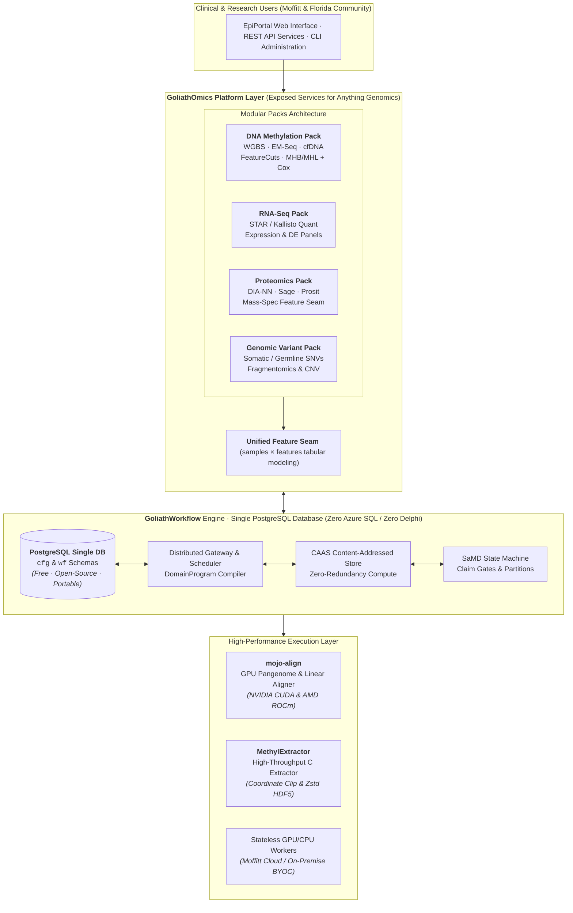
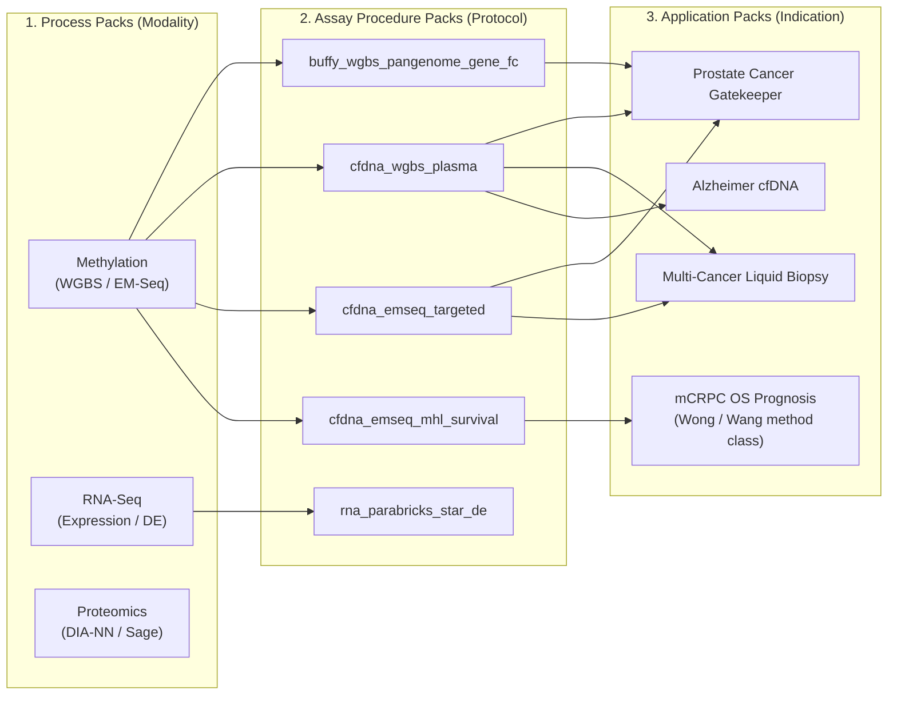
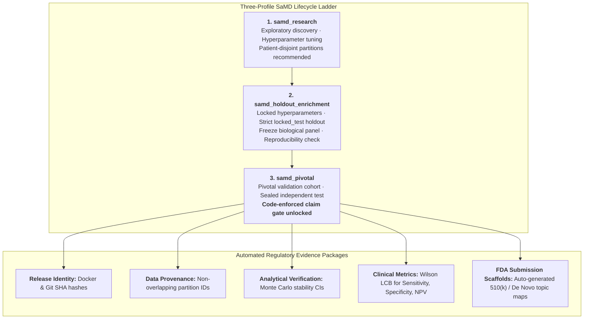

# Executive Opportunity Brief: Academic–Industrial Partnership & Community Access

**Target Institution:** H. Lee Moffitt Cancer Center & Research Institute  
**Target Stakeholders:** Office of Innovation, Computational Oncology, Early Detection / Pathology, Sponsored Research  
**Presenting Organization:** Goliath Research Inc.  
**Product Platform:** **GoliathOmics** (Powered by *GoliathWorkflow*, *mojo-align*, and *MethylExtractor*)  
**Architecture Pillar:** 100% Free & Open Toolchain Foundation (PostgreSQL Single Database · Zero Delphi/Azure SQL Lock-In)  
**Initiative:** Community-Access Non-Profit Software Partnership & Joint Florida/Federal Grant Strategy  
**Date:** September 8, 2026  
**Update:** Native support for Moffitt-published EM-Seq **MHB/MHL + overall-survival** methods (`cfdna_emseq_mhl_survival`), parallel to FeatureCuts detection.  

---

## 1. Executive Summary & Strategic Vision

### The Mission
Goliath Research Inc. is establishing a strategic partnership with the **H. Lee Moffitt Cancer Center & Research Institute** to transition our enterprise-grade cancer multiomics platform, **GoliathOmics**, into an open, community-accessible resource. By uniting Goliath’s high-performance computational platform with Moffitt’s world-class clinical oncology leadership, patient cohorts, and NCI-designated comprehensive research infrastructure, this partnership will accelerate the translation of early cancer detection biomarkers from laboratory discoveries into clinically validated, regulatory-grade diagnostic tools.

### The Problem in Cancer Genomics & Early Detection
Modern oncology diagnostics increasingly require combining multiple genomic modalities—liquid biopsy cell-free DNA (cfDNA) methylation, whole-genome bisulfite sequencing (WGBS), enzymatic methylation sequencing (EM-Seq), RNA-Seq transcriptomics, and mass-spectrometry proteomics. However, clinical translation is severely hindered by three universal bottlenecks:
1. **Computational Inefficiency & Modality Sprawl:** Each omics assay traditionally requires a bespoke software stack, multiplying compute costs and fragmenting bioinformatics workflows across disconnected pipelines.
2. **Proprietary Software Lock-In & Budget Drain:** Commercial diagnostic platforms often saddle academic medical centers with expensive proprietary database licenses (e.g., Microsoft Azure SQL) and legacy compiled runtimes (e.g., Embarcadero Delphi), diverting grant dollars away from clinical sequencing.
3. **Methodological Artifacts & Data Leakage:** Paired-end read-overlap double counting, reference bias in linear genome alignment, and accidental mixing of training and holdout patients ("data leakage") lead to irreproducible biomarker claims.
4. **The "FDA Chasm":** Academic discoveries frequently stall because research pipelines lack the auditability, configuration locking, patient-partition enforcement, and traceability needed for CLIA validation and FDA Software as a Medical Device (SaMD) regulatory clearance.

### The Solution: GoliathOmics with a 100% Free Toolchain Foundation
**GoliathOmics** is an enterprise-grade, regulatory-ready platform designed for comprehensive genomics and multiomics diagnostic development. Built on an uncompromised **free and open-source toolchain foundation**, GoliathOmics has **completely eliminated proprietary database and language lock-in**:
* **PostgreSQL as the Single, Unified Database:** All database operations (configuration, task scheduling, leases, audit logs) have transitioned exclusively to open-source **PostgreSQL**, completely retiring Microsoft Azure SQL. This guarantees zero recurring database license fees and enables effortless deployment on bare-metal institutional HPC clusters, private servers, or any cloud (AWS, GCP, Azure).
* **Modern Open Language Stack (Zero Delphi):** Legacy Delphi components have been entirely eliminated. The platform is written strictly in modern, auditable, open-source languages: **Python**, **Mojo**, native **C / HTSlib**, and **TypeScript**.
* **Packs Architecture for "Anything Genomics":** Couples generalized genomics services with modular **Process Packs** (DNA Methylation, RNA-Seq, Proteomics, Variant Calling) on a unified modeling plane.
* **Backend Database & Orchestration Engine (`GoliathWorkflow`):** The distributed execution engine managing DomainProgram compilation, task queues, lease recovery, Content-Addressed Action Store (CAAS) caching, and SaMD claim gates over PostgreSQL.
* **Proprietary Hardware Accelerators:** 
  * **`mojo-align`**: Native-Mojo multi-GPU alignment engine delivering unprecedented speed and pangenome graph alignment (eliminating reference bias across diverse Florida populations) on NVIDIA CUDA and AMD ROCm.
  * **`MethylExtractor`**: High-throughput C-optimized cytosine methylation extractor with coordinate-based paired-end mate clipping to eliminate double-counting artifacts, writing high-density chunked Zstd HDF5 storage.



---

## 2. Core Architectural Pillars: Free Toolchain & Zero Vendor Lock-In

### 1. PostgreSQL Unification: Zero License Fees, Maximum Data Sovereignty
* **Single Database Architecture:** GoliathWorkflow consolidates all system schemas (`cfg` configuration registry, `wf` workflow orchestration, worker leases, node executions, and audit records) exclusively onto **PostgreSQL**.
* **Elimination of Azure SQL:** By retiring Microsoft Azure SQL, Moffitt is completely freed from proprietary cloud-database lock-in and high monthly managed-database licensing fees.
* **True Deployment Agnosticism (BYOC):** PostgreSQL runs identically whether deployed on Moffitt’s local bare-metal Linux servers, an on-premise Kubernetes cluster, or inside Moffitt’s private cloud environment (AWS RDS PostgreSQL, Azure Database for PostgreSQL, or Google Cloud SQL). Sensitive clinical sequencing data remains strictly within Moffitt's institutional boundary.

### 2. Elimination of Delphi: 100% Modern, Open-Source Codebase
* **Zero Delphi Legacy:** Any historical Delphi dependencies have been completely removed.
* **Auditability & Community Maintenance:** The entire codebase is implemented in open, transparent, and reproducible languages:
  * **Python:** Clean Pydantic data schemas, statistical validation, and orchestration compiler.
  * **Mojo:** Next-generation systems programming language for GPU kernels and pangenome graph alignment.
  * **C / HTSlib:** High-performance cytosine calling and binary compression.
  * **TypeScript / React:** Clean, responsive clinical and laboratory operator interfaces.
* **Grant Budget Optimization:** Because the entire software stack is built on free and open-source foundations, **100% of grant funding** (from the Florida Department of Health or NIH) goes directly toward clinical personnel, biobank retrieval, wet-lab reagents, and compute—with zero budget wasted on commercial software licenses.

---

## 3. Platform Architecture: The "Packs" Ecosystem for Anything Genomics

GoliathOmics avoids the trap of single-assay monolithic software by organizing science into three decoupled layers: **Process Packs**, **Assay Procedure Packs**, and **Application Packs**.



### The Three-Layer Packs Model
1. **Process Packs (Omics Modalities):** Defines data structures, QC contracts, and typed actions for an analytical modality:
   * **DNA Methylation Pack:** FASTQ ingress, pangenome/linear bisulfite alignment, coordinate-clipped extraction, CpG/CHG/CHH methylation metrics, and read-level co-methylation pattern tiles.
   * **RNA-Seq Transcriptomics Pack:** GPU-accelerated STAR alignment (`sample.parabricks_rna_fq2bam`) or pseudo-alignment (`kallisto`), RNA QC contracts, differential expression (DE) feature selection, and tabular integration.
   * **Mass-Spectrometry Proteomics Pack:** GPU-accelerated DIA-NN, CPU Sage DDA, Prosit/Casanovo spectral prediction, and protein matrix ingestion.
   * **Multiomics Seam:** Joins disparate data streams into a standardized `samples × features` modeling layer for unified machine learning classification.
2. **Assay Procedure Packs (Protocols & Recipes):** Curated, versioned configurations that specify exactly how a sample matrix is sequenced and scored without modifying underlying code:
   * `cfdna_wgbs_plasma`: Plasma cfDNA whole-genome bisulfite sequencing with integrated fragmentomics.
   * `buffy_wgbs_pangenome_gene_fc`: Peripheral blood buffy coat WGBS using pangenome graph alignment and Houseman/HiTIMED immune cell deconvolution.
   * `cfdna_emseq_targeted`: Targeted deep enzymatic capture (2,000×–5,000× depth) using operator-supplied BED panels and coverage capping — **gene FeatureCuts / ECDF classification**.
   * `cfdna_emseq_mhl_survival`: Same EM-Seq SamplePrep; native methylation-haplotype-block (MHB) discovery or locked BED, Guo/Wong **methylation haplotype load (MHL)**, and **Cox / KM / time-AUC** (optional nomogram). Does **not** replace FeatureCuts; it is the method class in Wong et al., *npj Precis Oncol* (2026) 10:29 (Wang laboratory, Moffitt).
3. **Application Packs (Clinical Indications & Disease Overlays):** Lightweight configuration overlays applying clinical cohorts, stage hierarchies, and regulatory settings for specific diseases (e.g., Prostate Cancer Gatekeeper, **mCRPC overall-survival prognosis**, Alzheimer cfDNA, Pan-Cancer Early Detection) with **zero code changes**.

---

## 4. The Product Suite: Core Technical Attributes & Differentiators

| Product / Component | Architectural Layer | Primary Technology | Key Differentiators | Clinical & Operational Impact |
| :--- | :--- | :--- | :--- | :--- |
| **`GoliathOmics`** | **Clinical & Scientific Platform Layer** | TypeScript, Python, OpenAPI, Pydantic | • Modular Packs Architecture (Methylation, RNA-Seq, Proteomics)<br/>• Unified multiomics `samples × features` modeling seam<br/>• General-purpose genomics services with automated clinical reporting | • Eliminates modality sprawl; unifies multiomics under one roof<br/>• Deploys new cancer indications via config overlays in hours |
| **`GoliathWorkflow`** | **Backend Database & Engine** | **Single PostgreSQL Database** (`cfg` & `wf`), REST Gateway | • **100% Free / Open-source toolchain (Zero Azure SQL / Zero Delphi)**<br/>• Four-layer configuration hierarchy (Site → Profile → Study → Program)<br/>• Monte Carlo stability selection & biological FeatureCuts<br/>• Content-Addressed Action Store (CAAS) for zero-redundancy compute<br/>• Built-in FDA SaMD evidence ladder with code-enforced claim gates | • Zero database license fees; runs on any cloud or local HPC<br/>• Enforces strict reproducibility and zero data leakage<br/>• Slashes compute costs via CAAS caching across large cohorts<br/>• Auto-assembles FDA 510(k)/De Novo submission scaffolds |
| **`mojo-align`** | **Hardware-Accelerated Alignment** | Modular **Mojo**, CUDA/ROCm DeviceContext, SIMD | • Dual-graph pangenome WGBS (`MojoGiraffe` C2T ∥ G2A)<br/>• Linear WGBS `fq2bam-meth` matching/beating Clara Parabricks<br/>• Zero-dialect portability across NVIDIA CUDA & AMD ROCm | • Eliminates reference bias across diverse Florida demographics<br/>• Slashes alignment wall-clock time and cloud GPU costs by >60% |
| **`MethylExtractor`** | **High-Throughput Extraction & QC** | Native **C / HTSlib**, OpenMP, HDF5, Zstd | • Coordinate-based overlapping read pair clipping<br/>• Compact 12-byte on-disk record with Zstd chunking<br/>• Native extraction manifests & context QC sidecars | • Completely removes artificial double-counting in paired-end WGBS<br/>• Slashes storage footprint by >70% compared to bedGraph/TSV |

---

### Deep Dive 1: `mojo-align` — Next-Generation Multi-GPU Sequence Alignment
Traditional bisulfite aligners (e.g., Bismark, BWA-meth) are CPU-bound, taking 15–30 hours per 30× human genome. While proprietary accelerators exist (such as NVIDIA Clara Parabricks), they enforce vendor lock-in and cannot perform graph-aware pangenome bisulfite alignment.

* **Dual-Graph Pangenome Alignment (`MojoGiraffe`):** Implements dual C2T and G2A graph streaming alignment over GBZ pangenome reference graphs (e.g., Human Pangenome Reference Consortium). It maps bisulfite reads directly to variation graphs, emitting graph-aware GAF alignments that completely resolve structural variation bias and mapping dropouts in repetitive or hypervariable cancer loci.
* **Portable Linear Acceleration (`fq2bam-meth`):** A custom, high-speed linear WGBS aligner implemented in Mojo. It operates across NVIDIA GPUs (sm_90/GH200/H100) and AMD Instinct GPUs (MI300X) through a unified DeviceContext abstraction, streaming BAMs directly into memory-managed sorting, mate-fixing, and duplicate marking.
* **Automated Memory-Aware Tiling:** Dynamically sizes GPU allocations and uncompressed BAM buffers against available hardware High Bandwidth Memory (HBM), enabling seamless execution across varying hardware tiers without out-of-memory crashes.

### Deep Dive 2: `MethylExtractor` — Deterministic, High-Throughput Cytosine Extraction
Methylation calling from bisulfite BAM files is notoriously vulnerable to technical artifacts that distort downstream statistical classifiers.

* **Coordinate-Based Overlapping Mate Clipping:** In paired-end sequencing, paired reads frequently overlap in the middle of sequenced fragments. Standard extraction tools double-count cytosines in these overlapping segments, falsely inflating coverage and skewing methylation ratios. `MethylExtractor` implements precise coordinate-based clipping (`bases_skipped_overlap_clip`), ensuring every genomic cytosine is counted exactly once per sequenced molecule.
* **Optimized 12-Byte Binary Record & Zstd HDF5:** Instead of bloated, multi-gigabyte text bedGraph files, `MethylExtractor` structures output into chunked HDF5 containers utilizing a 12-byte binary record per site (`genomic_pos: uint32`, `mC: uint16`, `uC: uint16`, `tnc: uint8`). Integrated Zstd compression provides rapid streaming I/O for cohort-wide discovery.
* **Rigorous Quality Gate Integration:** Natively enforces MAPQ ≥ 30, Phred quality ≥ 20, coverage capping (`-C`) to counteract PCR bias, and emits comprehensive sample-level JSON manifests consumed directly by automated pipeline quality guardrails (`methylextractionqc`).

### Deep Dive 3: `GoliathWorkflow` — SaMD-Ready Distributed Workflow & Database Engine
`GoliathWorkflow` serves as the robust backend database and execution plane for GoliathOmics, built from inception around software as a medical device (SaMD) principles:

* **Single PostgreSQL Database Engine:** Eliminates the complexity and cost of multi-database setups or commercial Azure SQL instances, providing rock-solid ACID transactions, advisory locking, and clean schema migrations.
* **DomainProgram Intermediate Representation (IR):** Workflows are declared as structured JSON graphs supporting typed actions, loops (`foreach`), branching (`if/then/else`), multi-way dispatch (`switch`), and concurrent branch execution.
* **Strict Four-Layer Configuration Hierarchy:** Configuration is resolved across Site, Profile, Study Manifest, and Program layers. Tunable clinical parameters are declared strictly in configuration schemas—**never hardcoded as constants**.
* **Monte Carlo Stability Selection & Biological FeatureCuts:** Rather than selecting biomarkers from a single overfit training split, the engine runs Monte Carlo resampling cross-validation, computing recurrence frequencies and biological relevance (Storey FDR, STRING PPI, Enrichr pathways) to isolate invariant, stable biomarker signatures.
* **Content-Addressed Action Store (CAAS):** Computes cryptographic signatures of all task inputs, parameters, and container environments. When downstream machine learning models or classification thresholds are modified, CAAS instantly reuses upstream alignment and extraction artifacts, saving hundreds of compute hours across cohort studies.

---

## 5. Clinical & Cancer Focus: Early Detection & Gatekeeper Diagnostics

### Liquid Biopsy & Low-Tumor Fraction Challenges
Early-stage cancer detection in peripheral blood (cfDNA) operates at the biological limit of detection: circulating tumor fractions are frequently below 0.1% to 1.0%. GoliathOmics is specifically configured to overcome this barrier:
* **Host Immune Response & ctDNA Synergy:** Analyte-aware configurations support both whole-blood buffy coat profiling (capturing systemic immune and epigenetic remodeling) and plasma cfDNA (capturing tumor-derived hypomethylation and hypermethylated promoter marks).
* **Fragmentomics Integration:** Integrates fragment length profiles, end-motif frequencies, and copy-number variation alongside methylation signals to boost sensitivity in ultra-low ctDNA regimes.
* **EM-Seq & Targeted Deep Hybrid Capture:** Natively supports high-depth enzymatic methylation capture protocols (2,000×–5,000× depth), applying panel-specific BED filtering and coverage capping to optimize diagnostic yield.

### Method-level alignment with Moffitt (Wong / Wang 2026)

Moffitt’s published plasma cfDNA mCRPC work is **haplotype-block MHL + time-to-event modeling**, not mean-methylation FeatureCuts. GoliathOmics now runs that **method class** as a first-class procedure so a collaboration can use Moffitt’s science on Goliath’s engine without forcing a classifier bake-off.

| Wong et al. 2026 step | GoliathOmics today |
| :--- | :--- |
| EM-Seq + Twist capture BAM | Linear align (Parabricks `fq2bam_meth` or `mojo-align`); methylation BAM tags; operator `target_panel_bed` |
| mHapSuite haplotypes | Same extract pass: `{chrom}-CG.mhap.h5` (native store; not a mHapSuite wrap) |
| MHBDiscovery (window 3, \(r^2>0.3\), \(p<0.05\)) | `pipeline.mhb_mhl` with those defaults, or a **locked** Moffitt MHB BED |
| MHL lengths 1–10; ≥3 CpGs; median reads >50 | Native MHL (`mhl_max_length` 10); same filter knobs |
| Cox PH, KM, time-dependent ROC, nomogram | `backend_profiles.cox` + study `survival_path` (time, event, optional PSA/ALP/LDH/ctDNA) |
| Nested test vs labs / predicted ctDNA | Optional nested LRT when those columns are on the sidecar |

**What Moffitt still supplies (not hardcoded in product):** capture panel BED and control regions, OS/labs dictionary, optional locked 15-MHB gene list. GREAT and an in-process ctdna.org API remain optional follow-ons. InformME entropy tiles and HiTIMED tumor fraction are **not** substitutes for MHL or the paper’s clinical ctDNA predictor.

This path does **not** claim a rerun of the published 96-patient nomogram. It means a joint pilot can compare native MHL/Cox to Moffitt’s mHapSuite+R on a shared subset.

### Prostate & Solid Tumor "Gatekeeper" Paradigms
A prime translational target for Moffitt and Goliath is the development of non-invasive **"gatekeeper" rule-out diagnostics** to spare patients from unnecessary invasive biopsies:
* **High Negative Predictive Value (NPV ≥ 95%):** Configured to optimize lower confidence bounds (LCB) for NPV in intended-use screening populations, separating indolent conditions (e.g., Gleason Grade 1 / 3+3) from clinically significant disease (Gleason Grade ≥ 2 / 3+4).
* **Disease Progression & Staged Modeling:** Built-in disease progression actions trace trajectory shifts across pre-malignant, early-stage, and metastatic phenotypes rather than simplistic binary distinctions.
* **Prognosis vs detection (keep the labels distinct):** Gatekeeper NPV (FeatureCuts on `cfdna_emseq_targeted`) and mCRPC overall-survival nomograms (MHL on `cfdna_emseq_mhl_survival`) are **separate intended uses**. A Moffitt partnership can run both; they must not be scored as if they were the same study.

---

## 6. Built-in SaMD & Regulatory Rigor: Solving the "FDA Chasm"

Academic software almost universally fails regulatory review because the development history lacks verifiable traceability. GoliathOmics and its GoliathWorkflow backend satisfy FDA 21 CFR Part 820, ISO 13485, and Good Machine Learning Practice (GMLP) requirements.



### Architectural Controls & Quality Assurances
1. **Code-Enforced Claim Gates:** The platform actively blocks clinical performance claims in software output if the study configuration is set to exploratory or research stages. Clinical claim generation is permitted *only* when executed under `samd_pivotal` against declared, untouched holdout partitions.
2. **Strict Patient-Disjoint Partition Enforcement:** Enforces patient-level independence keys across all splits, mathematically preventing longitudinal or multi-sample data leakage between training and validation cohorts.
3. **Immutable Audit Trails (`.action_results`):** Every node execution outputs a cryptographic manifest capturing input hashes, tool revisions, hardware flags, random seeds, and execution durations.
4. **Automated Submission Scaffolding:** Natively generates pre-formatted documentation mapping analytical and clinical results directly into FDA 510(k), De Novo, and CLIA analytical validation topic formats.

---

## 7. Strategic Alignment & Joint Funding Roadmap

Collaborating with Moffitt Cancer Center creates an unbeatable partnership: **Moffitt** serves as the clinical lead, healthcare provider, and biobank sponsor, while **Goliath Research** serves as the computational engine and non-profit technology provider deploying **GoliathOmics**.

### Funding Target 1: Florida Cancer Innovation Fund (FCIF) — FY 2026–2027 (Immediate Priority)
* **Funding Available:** ~$70 Million total state appropriation; up to **$2,000,000** per award for a 12-month project.
* **Upcoming Deadlines:** **Period 2: October 22, 2026**; Period 3: December 18, 2026.
* **Target Categories:** *Rapid Translation Grant* or *High-Impact Pilot Grant* (Novel Technologies for Diagnosis).
* **Strategic Positioning:**
  * **Lead Applicant:** Moffitt Cancer Center (eligible licensed Florida cancer institute).
  * **Co-Applicant / Subcontractor:** Goliath Research Inc. (Florida biomedical research/technology entity).
  * **Project Concept:** *"Rapid Clinical Translation of an AI-Powered, Pangenome-Aware Liquid Biopsy Platform for Early Multi-Cancer Detection in Underserved Florida Populations"* — with an explicit **mCRPC MHL+OS concordance arm** using Moffitt’s published method class on GoliathOmics (not a FeatureCuts substitute for that arm).
  * **Zero Software Licensing Overhead:** Because GoliathOmics uses **PostgreSQL and 100% free open-source tools**, 100% of the $2M request is allocated to high-impact clinical personnel, patient cohort sequencing, and direct cloud compute—dramatically boosting application scoring.
  * **Measurable 12-Month Deliverables:** Complete GoliathOmics cloud/on-prem deployment at Moffitt; process a 500–1,000 patient retrospective cfDNA cohort across diverse demographics; establish a locked clinical model with Wilson CI performance metrics; publish validation results.

### Funding Target 2: Bankhead-Coley Cancer Research Program (FY 2026–2027)
* **Funding Available:** $600,000 to $1,500,000 over 36–48 months.
* **Target Mechanism:** *Technology Transfer Feasibility* or *Discovery Science*.
* **Focus:** Deepening clinical validation of specific early-detection markers (e.g., localized prostate cancer rule-out or lung cancer liquid biopsy) using Moffitt’s prospective biobank.

### Funding Target 3: Federal NIH / NCI Mechanisms (Parallel Pipeline)
* **NIH/NCI Academic–Industrial Partnerships (PAR-25-338):** Explicitly funds translation of diagnostic software between an industrial technology developer and an NCI Comprehensive Cancer Center.
* **NCI Informatics Technology for Cancer Research (ITCR U01/U24):** Funds cancer informatics platforms that serve the national research community under open-access models.
* **SBA SBIR / STTR Fast-Track (Phase I/II):** Non-dilutive commercialization and clinical validation funding (up to $2.4M).

---

## 8. Proposed Collaboration & Governance Model

To maximize competitiveness for Florida state grants and community benefit, Goliath Research proposes a transparent, collaborative operating model:

```text
┌────────────────────────────────────────────────────────────────────────────────────────┐
│                               COLLABORATION FRAMEWORK                                  │
├──────────────────────────────────────────┬─────────────────────────────────────────────┤
│ Moffitt Cancer Center                    │ Goliath Research Inc.                       │
│ • Lead Institutional Applicant / Co-PI   │ • Technology & Engineering Co-Investigator  │
│ • Patient Cohort Access & Biobank Data   │ • Full GoliathOmics Deployment & Support    │
│ • Clinical Protocol & IRB Governance     │ • High-Performance Cloud/GPU Architecture   │
│ • Clinical Performance Interpretation    │ • Automated SaMD Evidence & Audit Packaging │
└──────────────────────────────────────────┴─────────────────────────────────────────────┘
                                           │
                                           ▼
┌────────────────────────────────────────────────────────────────────────────────────────┐
│                                COMMUNITY BENEFIT                                       │
│ • 100% Free Toolchain Foundation: Powered by open-source PostgreSQL, Python, Mojo,     │
│   and C with ZERO proprietary software seat or database licenses.                      │
│ • Non-Profit Software Access: GoliathOmics deployed at no software license cost for   │
│   Moffitt investigators and Florida health partners.                                   │
│ • Data Sovereignty & HIPAA: All clinical genomic data remains strictly within         │
│   Moffitt's secure firewall / private cloud boundary (BYOC architecture).              │
│ • Intellectual Property: Moffitt retains full ownership of clinical discoveries,      │
│   biomarker panels, and novel clinical IP; Goliath retains underlying core software IP.│
└────────────────────────────────────────────────────────────────────────────────────────┘
```

---

## 9. Immediate Next Steps & Action Checklist

1. **Partnership Alignment Meeting (Target: Within 5 Days):**
   * Meet with Moffitt’s **Office of Innovation**, **Computational Oncology faculty**, and **Sponsored Research Office**.
   * Deliver live demonstration of **GoliathOmics** executing multiomics workflows on its unified **PostgreSQL** backend.
2. **Execute Letter of Intent (LOI) / Memorandum of Understanding (MOU):**
   * Formalize collaborative intent, IRB data pathway, and grant submission structure.
   * Designate Moffitt Corresponding Principal Investigator (PI).
3. **Assemble Florida Cancer Innovation Fund (Period 2) Application:**
   * **Deadline:** October 22, 2026.
   * Highlight the **100% free toolchain / zero license fee** advantage in the budget justification.
   * Draft Specific Aims (12-month milestones, measurable clinical endpoints, Florida community impact).
   * Prepare joint budget narrative ($1.5M–$2.0M range).
4. **System Staging & Preliminary Data Run:**
   * Stage the containerized GoliathOmics runtime bundle (`Dockerfile.mojo`, `MethylExtractor`, `GoliathWorkflow` with PostgreSQL) on Moffitt’s cluster or designated cloud environment.
   * Run pilot verification on existing de-identified control vs. cancer samples to establish baseline preliminary data for the application.
   * **MHL concordance subset (Computational Oncology / Wang lab):** exchange a hg38 capture BED + OS sidecar for a small sample set; run `cfdna_emseq_mhl_survival` and compare MHB/MHL matrices and Cox fits to mHapSuite.

---

### Contact Information

**Goliath Research Inc.**  
*Leadership & Technology Team*  
Email: partnerships@goliathresearch.com  
Web: [goliathresearch.com](https://goliathresearch.com)  
Platform: **GoliathOmics** (Powered by `GoliathWorkflow` [PostgreSQL], `MethylExtractor`, and `mojo-align`)  
