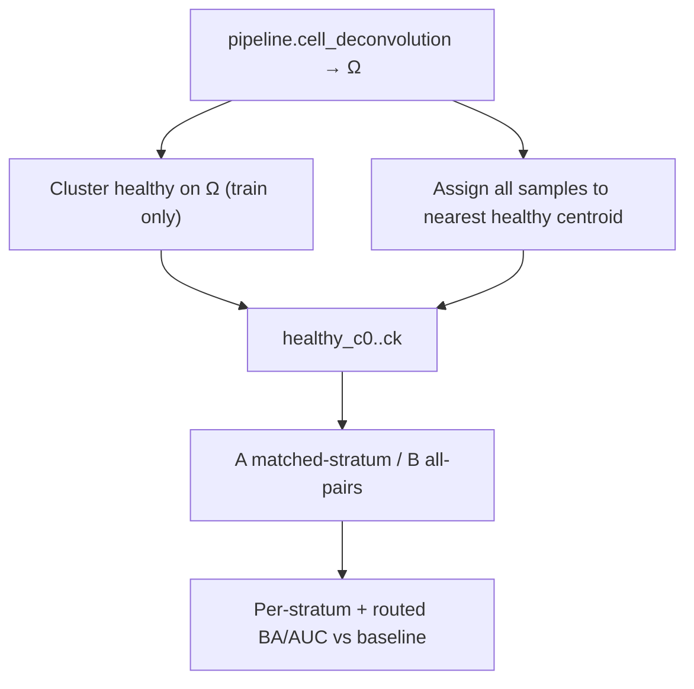

# Ω-cluster cancer detection (research)

**Status:** research analysis (not a DomainProgram node).  
**Code:** [`packages/methyldeconv/methyl_deconv/analysis/omega_cluster.py`](../../packages/methyldeconv/methyl_deconv/analysis/omega_cluster.py) · CLI `methyl-omega-cluster` / [`scripts/omega_cluster_detection.py`](../../scripts/omega_cluster_detection.py)  
**Plan:** [`docs/plans/omega-cluster-detection.plan.md`](../plans/omega-cluster-detection.plan.md)  
**Buffy analyte context:** [`BuffyCoat_vs_cfDNA_for_Cancer_Detection.md`](BuffyCoat_vs_cfDNA_for_Cancer_Detection.md)

## Hypothesis

Buffy-coat methylation is largely **host immune / leukocyte composition**. CellDeconv Ω (CD8T, CD4T, NK, Bcell, Mono, Neu) is a low-dimensional summary of that composition. If only a minority of Ω variance is disease-related, the rest is **baseline set-point** (age, inflammation, CMV-like T-cell shifts, …). A single `healthy vs PCa` model averages over those set-points and can dilute stratum-specific shifts.

**Strategy:** cluster **train healthy** Ω only (all six types), freeze centroids, assign every sample to nearest healthy centroid, then train two-group models and compare routing rules.



## Design (locked)

| Rule | Choice |
|------|--------|
| Dimensions | All 6 Ω (CLR → standardize → k-means; k by silhouette on train healthy) |
| Leakage | Subject/sample holdout **before** clustering; disease labels never choose k |
| Assignment | Nearest healthy centroid → `healthy_stratum` |
| A – matched | `healthy_c_i` vs `PCa` assigned to `c_i`; route test sample → that model |
| B – all pairs | Separate disease clusters on train disease Ω; every `healthy_c_i` × `disease_c_j` with min-n gates |
| Baseline | Single logistic on CLR Ω: healthy vs disease |
| Follow-on gate | Matched beats baseline by >0.01 BA **and** ≥2 usable strata |

This run uses **Ω-only** logits (no methylation ECDF panel) so the stratum effect is isolated. Production fusion is already available: first-stage ECDF stays methylation-only; `covariates_path` (e.g. `cell_fractions.csv`) triggers the second-stage stacker. Auto-infer **excludes** `group` / `qp_status` / marker diagnostics to avoid label leakage; pin `covariate_numeric_columns` to the six Ω columns when using deconv alone (see `cell_deconv.profile.json`).

## How to re-run (Buffy PCa)

```bash
source .venv/bin/activate
python scripts/omega_cluster_detection.py \
  --cell-fractions /work/projects/prostate-cancer/Buffy_healthy_vs_PCa_cell_deconv_good/cell_fractions/cell_fractions.csv \
  --output-dir /work/projects/prostate-cancer/Buffy_healthy_vs_PCa_cell_deconv_good/omega_cluster_analysis \
  --healthy-group all --disease-group PCa
```

Artifacts: `omega_cluster_summary.json`, `omega_stratum_assignments.csv`, `omega_stratum_sizes.csv`, `omega_pca_by_stratum.html` (interactive Plotly), optional `multi_seed_sensitivity.csv`.

## Buffy results (seed 13, min_train=8)

| Strategy | Balanced accuracy | ROC AUC | Notes |
|----------|-------------------|---------|-------|
| Baseline healthy vs PCa | 0.635 | 0.616 | Full test set (n=69) |
| Matched-stratum routed | **0.720** | **0.750** | Only **1** stratum usable; 4 skipped for `min_train` |
| All-pairs routed | 0.648 | 0.723 | 2 pair models; many pairs skipped |

Healthy k=5 (silhouette ≈0.67); disease k=6. Recommendation flags: `matched_beats_baseline=true`, `matched_strata_used=1`, **`pipeline_follow_on_justified=false`**.

### Multi-seed sensitivity (seeds 7,13,21,42,99 × min_train ∈ {5,8})

- Matched beats baseline in ~50% of cells; often only 1 stratum survives `min_train=8`.
- With softer `min_train=5`, all-pairs BA often looks strongest, but coverage is sparse and scores omit samples lacking a trained pair — treat as **optimistic / selection-biased**.
- **`pipeline_follow_on_justified` remained false** for all 10 cells (matched never simultaneously beat baseline with ≥2 usable strata under the default gate).

## Recommended pairing rule

1. **Research and any future pipeline leaves:** use **matched-stratum** (healthy set-points as baselines; disease as within-stratum shift). Do not auto-expand blind healthy×disease all-pairs in DomainPrograms.
2. **All-pairs** stays a research stress test for whether disease forms its own Ω modes; it is not the production pairing rule.
3. **DomainProgram change:** **deferred** until multi-seed matched routing wins with ≥2 stable strata (and preferably fused methylation/ECDF+Ω covariates, not Ω alone).

## Pipeline follow-on (gated)

When `pipeline_follow_on_justified` is true on a pre-registered cohort+seed protocol:

1. Emit Ω-derived leaves (`healthy_c0`, …) in the same shape as existing methylation subcluster leaves.
2. Expand comparisons with matched-stratum pairs only (`control_vs_each_disease`-style within stratum).
3. Reuse centroid / detector / ECDF+covariates MC — no new model class.

Until then: keep using global healthy vs PCa (optionally with Ω as ECDF second-stage covariates) and re-run this script after larger cohorts or softer, pre-registered min-n rules.

## Out of scope

- Changing Houseman / FlowSorted math  
- Disease–disease differential discovery as a detection claim  
- Enabling this in SaMD production profiles without the research gate  
