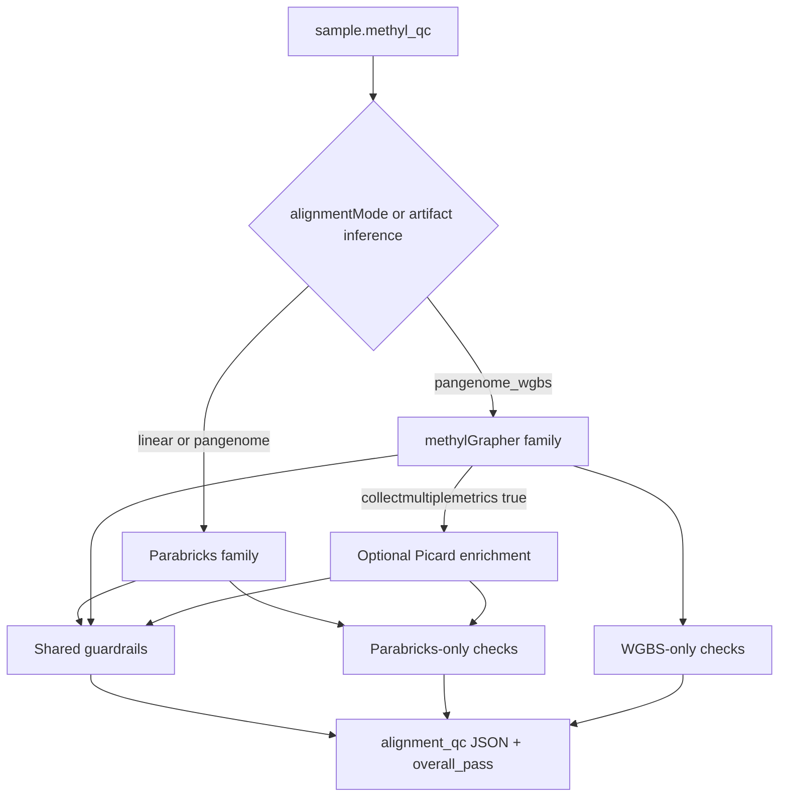

# MethylAlignmentQC {#sec-methylalignmentqc}
## Role

`methylalignmentqc` ingests **mode-aware** alignment metrics and writes normalized per-sample JSON with **guardrails** that gate SamplePrep before methylation extraction. Metrics are produced differently per aligner; the package keeps **shared** checks and adds **tool-specific** ones.

| Align mode | Metrics family | Primary producers |
|------------|----------------|-------------------|
| `linear` / `pangenome` | Parabricks | Clara Parabricks `fq2bam_meth` / `giraffe` + Picard tables |
| `pangenome_wgbs` | methylGrapher | native-Mojo methylGrapher Align provenance + QC BAM / GAF (+ optional Picard enrichment) |

Operator guide: [Usage ch.03 — Sample Prep and QC](../../usage/03-sample-prep-and-qc.md). Implementation: [Sample preparation flow](../../implementation/sample-preparation-flow.md). Family detection: `methyl_alignment_qc/core/metrics_family.py`.

The package is deterministic: parsing, normalization, threshold checks, and cycle-quality screening — not new statistical inference on methylation.

## Metrics family decision

**Inference hazard:** when `alignmentMode` is omitted and both a Picard tar and methylGrapher provenance exist, inference can prefer the Parabricks family. Prefer an explicit mode on `MethylQcTaskInput`.

## Input metrics

### Shared: Picard-style deduplication metrics

All modes emit tab-separated `*deduplicate_metrics.txt` (or `*duplication_metrics.txt`). The parser (`methyl_alignment_qc/core/parser.py`) reads columns such as `PERCENT_DUPLICATION`, read-pair counts, and unmapped reads. These populate `summary_stats` on the export JSON.

Optional config guardrails (`actionConfig.alignment_qc.optional_guardrails.duplication_rate_max`, `min_pf_reads`) can fail samples with excessive PCR duplication even when cycle quality passes.

### Parabricks family (`linear` / `pangenome`)

Each sample directory should contain `{sample_id}.json` (or a reconstructible `{sample_id}.qc-metrics.tar`) with sections including:

- `quality_yield` — PF reads, Q30 bases
- `mean_quality_by_cycle` — per-cycle mean Phred (Read 1 then Read 2)
- `gc_bias_summary`, `insert_size_metrics`
- `pre_adapter_summaries` — deamination and OxoG artifact qscores

Guardrails in `wgbs_parabricks_qc.py` evaluate PF%, Q30, mean/min cycle quality, GC/AT dropout, median insert size, and deamination/OxoG scores. Cycle screening and (for cfDNA) fragmentomics apply on this family. Per-cycle and histogram tables stay in the native Parabricks file; they are not copied into the published export.

Stock Giraffe (`pangenome`) uses the **same** Parabricks guardrail set as linear (science differs; QC family does not).

### methylGrapher family (`pangenome_wgbs`)

WGBS pangenome Align writes `{sample_id}.alignment_metrics.json` (`tool=methylGrapher`, asset fingerprints, `gaf`, `bam`) plus GAF, QC BAM, and dedup metrics. Baseline checks in `wgbs_pangenome_qc.py`:

| Key | What it checks |
|-----|----------------|
| `wgbs_provenance` | tool + non-empty asset fingerprints + path fields |
| `wgbs_gaf_present` | Non-empty science GAF |
| `wgbs_bam_present` | Non-empty QC BAM |
| `wgbs_bam_mapped_rate` | Flagstat mapped rate vs `alignment_guardrails.min_mapping_rate` when both are set |

No cycle metrics by default → screening disposition `NO_CYCLE_METRICS` / `USE_CURRENT_ALIGNMENT`. Optional `remediate_without_cycles` can still emit trim + realign without cycle tables.

**Picard enrichment:** when provenance sets `collectmultiplemetrics: true` and a real Picard tar is present, QC may merge Parabricks core + cycle screening into `guardrails.details` with `picard_enrichment: true`. A stale linear tar **without** that flag is ignored.

### Shared alignment-layer guardrails

Beyond family-specific sequencing/library checks, `alignment_derived_qc.py` derives **mapping rate**, **secondary/supplementary rate**, and **GC coverage uniformity** from Picard dedup and (when present) GC bias tables. When `alignment_guardrails.flagstat_enabled` is true, `bam_flagstat.py` runs `samtools flagstat` on the aligned BAM and gates **properly paired rate** and supplementary alignments.

Analyte profiles enable these guardrails by default for `cfdna` and `buffy_coat`. See the [sample preparation flow](../../implementation/sample-preparation-flow.md) for thresholds and operator guidance.

## Export JSON (V2.1)

The worker writes a slim guardrail-summary JSON (`export_kind: guardrail_summary`) validated against `schemas/config/alignment_qc/exported_sample_qc_v2.schema.json`. This is a disk export (`qcPath`), not `MethylQcTaskInput`. **Canonical analysis path:** `guardrails.details`. Nested `bisulfite_conversion` holds sidecar conversion rates only; deamination is `details.deamination_qscore`.

| Block | Role |
|-------|------|
| `guardrails.details` | Per-metric pass/fail, value, normal range, operator message (shared + family-specific keys) |
| `guardrails.overall_pass` | Bound to workflow `qcPass` (AND of evaluated checks) |
| `guardrails.screening` | Cycle-quality disposition and recommended trim bases (or `NO_CYCLE_METRICS` on WGBS) |
| `qc_history` | Append-only audit (initial + post-remediation retries) |
| `quality_yield` / `gc_bias_summary` / `insert_size_metrics` | Small Parabricks scalars (no cycle/insert histograms) |
| `alignment_stats` | Derived mapping and GC uniformity metrics |
| `alignment_flagstat` | samtools flagstat summary (when enabled) |

## Cycle screening and remediation

When `cycle_screening.enabled` is true **and** cycle tables exist, `cycle_quality_screening.py` inspects Read 1 and Read 2 separately. Dispositions include:

| Disposition | Meaning |
|-------------|---------|
| `USE_CURRENT_ALIGNMENT` | Pass |
| `REALIGN_TRIM` | Fixable read-end dip; fastp trim + forced realign on the **same** align mode |
| `INVESTIGATE_MULTI_REGION` | Manual review |
| `INVESTIGATE_GUARDRAIL_ONLY` | Cycles OK; check duplication/depth |
| `NOT_FIXABLE` | Terminal fail |

SamplePrep binds `remediateAlignment` from screening output; FASTQs must remain on disk until final QC disposition. Realign targets `sample.parabricks_fq2bam`, `sample.parabricks_giraffe`, or `sample.methylgrapher_wgbs_align` per `sample_prep.program.json`.

## cfDNA fragmentomics (optional)

When `primary_analyte` is `cfdna` **and** the metrics family is Parabricks (or WGBS with Picard enrichment), insert-size histogram guardrails may run via `fragmentomics.py` after alignment QC passes and before extraction. Baseline methylGrapher WGBS without enrichment skips fragmentomics.

## Summary statistics

When the package computes duplication rate, it applies straightforward algebra:

$$
\operatorname{duplication\ rate}
=
\frac{\text{duplicate reads}}{\text{total reads}}.
$$

## Publication guidance

Describe `methylalignmentqc` as:

- a QC ingestion and normalization layer,
- mode-aware across Parabricks and methylGrapher metric families,
- dependent on upstream Picard / Parabricks / methylGrapher provenance artifacts,
- deterministic in parsing and guardrail logic, and
- gating extraction via SamplePrep workflow bindings.

## Related

- Package usage: `packages/methylalignmentqc/docs/USAGE.md`
- Implementation guide (remediation, extraction filtering, cfDNA fragmentomics): [Sample preparation flow](../../implementation/sample-preparation-flow.md)
- Mode-aware QC plan: [`docs/plans/pangenome-wgbs-methyl-qc.plan.md`](../../plans/pangenome-wgbs-methyl-qc.plan.md)
- Extraction QC (downstream gate): [§ methylextractionqc](09a-methylextractionqc.md#sec-methylextractionqc)
