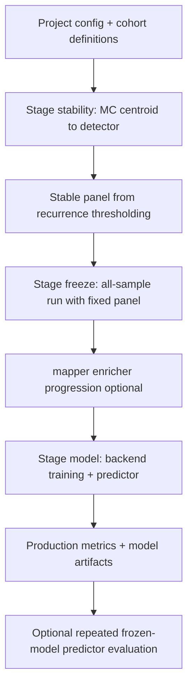

# Model Creation and Validation {#sec-model-creation-validation}

This chapter consolidates the implementation-facing view of model training and validation across the current MethylPipeline stack.

It complements:

- @sec-workflow-model-creation (workflow theory),
- @sec-workflow-prediction (predictor-only evaluation),
- **Usage manual** ch.05–08 for operator commands ([`docs/usage/`](../usage/index.qmd)).

---

## Scope

Model creation in MethylPipeline has two layers:

1. **Biology-first feature stabilization** (Monte Carlo stability + freeze), and
2. **Final model fitting and evaluation** (`--model` backend path).

The validated production sequence is:

- `--stability` (MC centroid -> detector recurrence),
- `--freeze` (single all-sample run with fixed panel + interpretation),
- `--model` (backend-specific train/predict),
- optional `--predictor-only` for repeated frozen-model performance distribution.

---

## Training and Validation Lifecycle



For CLI entry points and artifact gates, see Usage ch.05–08.

---

## Backend Roles

Current `--model` backend semantics:

- **`ecdf`**: `methyl-classifier` -> `methyl-predictor` (Bayesian/ECDF path, DMP-centric).
- **`tabular_sklearn`**: model bundle -> tabular train -> tabular predictor.
- **`generative_hybrid`**: model bundle -> latent generative train -> generative predictor.

Covariate fusion is backend-specific:

- `ecdf`: DMP-only reference path.
- `tabular_sklearn` / `generative_hybrid`: DMP features plus optional covariates.

---

## Covariate-Aware Validation Contract

When covariates are enabled for tabular/generative backends:

- join key is sample basename against `covariate_id_column`,
- numeric/ordinal/categorical role assignment is fixed at training and reused at inference,
- numeric imputation + optional standardization are frozen from training statistics,
- ordinal columns use preserved label->code mappings (`covariate_ordinal_maps`) with unknown-value fallback,
- categorical encoding uses frozen vocabulary with unknown-category handling,
- shape/schema consistency is enforced before prediction.

This contract keeps training and inference feature spaces aligned while preserving reproducibility across reruns.

---

## Outputs to Review

For model readiness decisions, review at least:

- `monte_carlo_runs/stability/stable_dmps_production.csv`,
- `monte_carlo_runs/production/production_summary.json`,
- `monte_carlo_runs/production/classifiers/*`,
- `monte_carlo_runs/production/predictors/validation_metrics.json`,
- `monte_carlo_runs/all_metrics.csv` and `metrics_summary.json` (or predictor-only equivalents).

For covariate-aware backends, also review backend metadata and preprocessing artifacts under the production classifier directory.

---

## Configuration Audit for Accuracy-First Modeling {#sec-model-config-audit}

The latest workflow (`--stability` -> `--freeze` -> `--model` with optional `--predictor-only`) is now mature enough that some configuration surfaces can be simplified without losing capability.

### Deprecation candidates (proposed)

These are practical candidates for staged deprecation in a future major release:

| Candidate key / pattern | Current status | Why deprecate | Replacement |
|---|---|---|---|
| `actionConfig.validation.run_mapper_and_enricher` | Marked legacy in config reference | Stability iterations now run centroid+detector only; mapper/enricher belong to `--freeze` | Remove flag; always run mapper/enricher in `--freeze` when enabled in project steps |
| `actionConfig.validation.skip_enricher` | Legacy companion to `run_mapper_and_enricher` | Semantics overlap with step-level enricher control and creates branchy MC behavior | Drop from validation block; control enricher directly in freeze-stage execution policy |
| `actionConfig.validator` (alias) | Deprecated alias for `actionConfig.predictor` | Duplicates predictor namespace and complicates resolver logic | Use only `actionConfig.predictor` |
| Flat cohort schema (`group1` / `group2` / top-level `groups`) | Backward-compatible path | New control/disease/comparisons schema is clearer and supports multiclass/stage workflows natively | Use `control`, `disease`, and explicit `comparisons` |

Deprecation strategy recommendation:

1. Keep warnings in the next minor release.
2. Add a migration helper command that rewrites legacy project JSON fields.
3. Remove legacy keys in the next major version after one full release cycle.

### Accuracy-first project profile

For the best downstream predictive performance, favor stable panel discovery first, then conservative production fitting:

- **Stability stage quality**: use enough iterations (`n_iterations >= 50`) and apply run filtering (`stability_min_balanced_accuracy`) only when sample count supports it.
- **Coverage consistency**: keep centroid, detector, and **MethylClassifier** `min_coverage` aligned so DMP loci visible during discovery stay observable in new samples.
- **Panel robustness over aggressiveness**: use detector FeatureCuts in stability/freeze (`classifier_dmp_selection="featurecuts_validation"`) with a minimum panel size floor (`min_selected_dmps`) so high BA does not come from brittle tiny panels.
- **Generalization-first model selection**: prioritize `optimization_validation` (held-out fold) for backend and parameter decisions; use `training_fold_validation` only as overfit diagnostic.
- **Covariate discipline**: only enable covariates when join coverage is high and schema is stable; otherwise default to pure ECDF path to avoid leakage/shift from weak sidecars.

### Reference tuning template (binary ECDF-first)

```json
"actionConfig": {
  "validation": {
    "train_fraction": 0.8,
    "n_iterations": 50,
    "seed": 42,
    "run_stability": true,
    "stability_dmp_freq": 0.7,
    "stability_min_balanced_accuracy": 0.6,
    "model_backend": "ecdf"
  },
  "detection": {
    "min_coverage": 4,
    "validation_split_ratio": 0.2,
    "validation_n_repeats": 5,
    "classifier_dmp_selection": "featurecuts_validation",
    "min_selected_dmps": 500,
    "dynamic_dmp_cutoff_enabled": true,
    "effect_size_coverage": 0.95,
    "enable_platt_calibration": true
  }
}
```

Use this as a starting point, then tune in this order:

1. stabilize panel recurrence (`stability_dmp_freq`, `n_iterations`),
2. verify holdout-vs-training gap (`optimization_validation` vs `training_fold_validation`),
3. only then tune panel size/FeatureCuts constraints for marginal BA gains.

---

## Distributed Monte Carlo on shared storage {#sec-distributed-mc-shared-storage}

Large `n_iterations` in stability discovery are often limited by **wall time** on a single host, not by statistical need. Sharded Monte Carlo requires shared read–write access to the same `output_base` tree. The queue workflow is a **plan → workers → aggregate** pattern.

**Operator documentation:** [Usage ch.13](../usage/13-distributed-methyl-validation.qmd) and [`packages/methylvalidation/docs/DISTRIBUTED_QUEUE.md`](../../../packages/methylvalidation/docs/DISTRIBUTED_QUEUE.md).

---

## Optional pipeline hyperparameter search {#sec-optional-hyperparameter-search}

The package implements a read-only **scalar objective** \(J(\theta)\) from completed runs, combining weighted validation metrics with optional panel-size terms. Discovery/stability optima and calibration metrics can **conflict**; a **two-stage** search is often safer than a single ad hoc \(J\).

**Theory and formulas:** [`packages/methylvalidation/docs/HYPERPARAMETER_SEARCH.md`](../../../packages/methylvalidation/docs/HYPERPARAMETER_SEARCH.md). **Operator steps:** [Usage ch.15](../usage/15-optional-hyperparameter-search.qmd).
