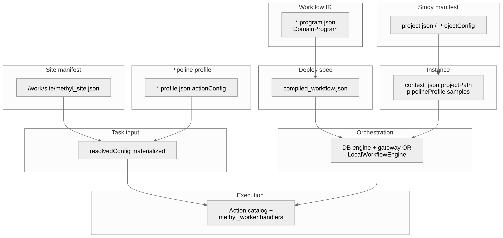

# Project Config and Layout

## Purpose

Define a **study manifest** (slim project JSON) plus reusable **profile**, **site**, and **program** artifacts so stability, freeze, model, and evaluation run without per-stage schema drift.

## Four-layer configuration

| Layer | Typical path | Owns |
|-------|----------------|------|
| Study manifest | `/work/<disease>/configs/project_*.json` | Cohorts, stages, comparisons, paths, `regulatory`, `validation_partitions`, `progression_order` |
| Pipeline profile | `workflow_engine/domain/profiles/*.profile.json` | `actionConfig` tool parameters + scope booleans (`runDmpSelection`, …) |
| Site manifest | `/work/site/methyl_site.json` (or `METHYL_SITE_CONFIG`) | Genomes, GTF, caches, cluster defaults |
| DomainProgram | repo `workflow_engine/domain/**/*.program.json` | Control flow, per-action `with` / `stepOverride` |

**Precedence** (highest wins): program/instance override → profile `actionConfig` → analyte defaults (`regulatory.primary_analyte`) → site manifest → *(no Python fallback for tunable science knobs)*.

Study manifests **must not** contain `step_config`. Legacy projects: `python scripts/migrate_project_config.py --in-place path/to/project.json`.

## Repository vs `/work` (what goes where)

| **Repository** (versioned, documented) | **`/work/<disease>/`** (study-specific) |
|----------------------------------------|----------------------------------------|
| Pipeline profiles (`workflow_engine/domain/profiles/`) | `project_*.json` — cohorts, comparisons, sample paths, `output_base`, `regulatory` |
| DomainPrograms (`*.program.json` under `workflow_engine/domain/`) | Sample list CSVs under `data/` |
| JSON schemas (`schemas/config/`) | Run outputs (`monte_carlo_runs/`, `stability/`, …) |
| Site example (`tools/methyl-config-editor/configs/site_grch38.example.json`) | `/work/site/methyl_site.json` (operator copy) |

- Point `methyl-workflow-run --program` at a **repo** DomainProgram path (see [Orchestration](04-orchestration-workflow-run.qmd)).
- Point `--context` / `projectPath` at a **study manifest on `/work`**.
- Pass **`--context-file`** with a profile from `workflow_engine/domain/profiles/`, or set `METHYL_PROFILE`.
- Set **`METHYL_SITE_CONFIG`** (or install site manifest under `/work/site/`).
- Do **not** treat repo `workflow_engine/domain/checks/*/configs/project_*.json` as production configs (CI smoke only).
- Do **not** copy `*.program.json` into `/work/<disease>/configs/`.

## Minimum study manifest

Use one slim project file containing:

- global cohort metadata (`controls`, `diseases`, `comparisons`, optional `stages[]` / `progression_order`),
- filesystem anchors (`output_base`, `samples_base_path`),
- optional `regulatory`, `validation_partitions`, `chromosomes`, `contexts`.

Tool parameters live in the **profile** `actionConfig` sections (`detection`, `validation`, `mapper`, …), not in the study manifest.

## Validation / Monte Carlo keys (profile `actionConfig.validation`)

Resolved into `MonteCarloConfig` by `methyl-validation --project` (via `METHYL_PROFILE`):

- split policy: `train_fraction`, `n_iterations`, `seed`
- stability controls:
  - `run_stability`
  - `stability_dmp_freq`
  - `stability_min_balanced_accuracy`
  - `stability_gene_freq`
  - `stability_featurecuts_enabled`
  - `dmp_featurecuts_target_ba`, `gene_featurecuts_target_ba` (split BA gates)
  - `dmp_modeling_mode`, `gene_modeling_mode` (statistical axes)
  - `stability_gene_featurecuts_max_dmps`, `stability_gene_featurecuts_max_genes` (site/profile caps)
- freeze/model paths:
  - `freeze_stable_dmp_csv` (optional)
  - `production_output_dir` (optional)
- backend/model:
  - `model_backend`
  - `feature_mode`
  - `ecdf_second_stage_enabled`
  - backend-specific `tabular_*` / `generative_*` keys

Sample prep uses profile `actionConfig.alignment_qc` and `actionConfig.extraction_qc` ([Chapter 3](03-sample-prep-and-qc.qmd)).

## Output layout

Most runs write to:

`<output_base>/<project_name>/monte_carlo_runs/`

Important subtrees:

- `run_XXXX/` (per-iteration artifacts)
- `stability/` (stable panel and summaries)
- `production/` (freeze and final model outputs)
- `model_mc/` (backend comparison runs)
- `post_model_validation/` (frozen-model descriptive evaluation)

## Handoff model

## Do not do this

- Do not embed tool parameters in the study manifest (`step_config` is rejected at load).
- Do not put blind-only predictor config into validation-driven runs.
- Do not change `samples_base_path` between stages without explicit remap.
- Do not run `--freeze` before stable panel exists.

## Success checks

- Study manifest loads via `methyl-utils` / `methyl-validation --project ...`.
- `METHYL_PROFILE` resolves `actionConfig.validation` (or pass `--config mc.json`).
- Run directories appear under expected root.

## See also

- `docs/reference/config-parameter-matrix.md`
- `docs/reference/domain-program-language.md`
- `docs/theory/chapters/11-project-configuration.qmd`
- `docs/reference/configuration-reference.qmd`
