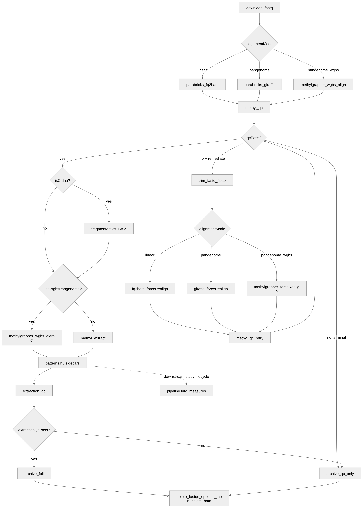

# Sample Prep and Quality Control

## Purpose

**SamplePrepPipeline** is the per-sample upstream workflow that turns raw WGBS FASTQs into methylation HDF5 files (`{chromosome}-CG.h5`) that downstream stages consume. Every sample passes through **two automated guardrails** before it enters stability, freeze, or discovery workflows:

1. **Alignment QC** (`methyl-qc`) — confirms Parabricks alignment and sequencing metrics are acceptable (or fixable via trim/realign).
2. **Extraction QC** (`methyl-extraction-qc`) — confirms MethylExtractor produced sufficient coverage and conversion-quality signal across chromosomes.

Without these gates, bad alignments would waste GPU extraction time, and under-covered or poorly converted extractions would pollute centroids, DMP discovery, and classifiers.

Each sample is aligned using **linear** (`fq2bam_meth`), **stock pangenome** (`vg giraffe` via Clara Parabricks), or **WGBS pangenome** (methylGrapher dual C2T/G2A), then passes through the same QC gates below. Extraction is MethylExtractor for linear/stock pangenome, or graph-aware methylGrapher extract for WGBS pangenome.

**Workflow source of truth:** [`workflow_engine/domain/fixtures/sample_prep.program.json`](../../workflow_engine/domain/fixtures/sample_prep.program.json)

**Full study path (prep → MC → DeConv/info → holdouts):** [`docs/architecture/end-to-end-workflow.md`](../architecture/end-to-end-workflow.md)

**Operator reference:** [`workflow_engine/sql_mssql/SamplePrepFlow.md`](../../workflow_engine/sql_mssql/SamplePrepFlow.md)

**Implementation detail (alignment modes, storage, guardrails):** [`docs/implementation/sample-preparation-flow.md`](../implementation/sample-preparation-flow.md)

**WGBS pangenome plan:** [`docs/plans/wgbs-pangenome-sample-prep.plan.md`](../plans/wgbs-pangenome-sample-prep.plan.md)

## Alignment modes (linear / stock pangenome / WGBS pangenome)

After FASTQ download, SamplePrep chooses **one alignment path** per sample (and the same path on fastp remediation realign):

| Mode | Scope flags | Worker action | Tool | Compute | Reference |
|------|-------------|---------------|------|---------|-----------|
| **Linear (default)** | `usePangenome: false`, `useWgbsPangenome: false` | `sample.parabricks_fq2bam` | `pbrun fq2bam_meth` | GPU (Parabricks) | Site `reference_genome.fasta` |
| **Stock pangenome** | `usePangenome: true`, `useWgbsPangenome: false` | `sample.parabricks_giraffe` | `pbrun giraffe` + `collectmultiplemetrics` | GPU (Parabricks) | Site `pangenome_genome` |
| **WGBS pangenome** | `usePangenome: true`, `useWgbsPangenome: true` | `sample.methylgrapher_wgbs_align` | methylGrapher Align (C2T+G2A) + `vg giraffe -o BAM` C2T pass → QC BAM | **CPU only** (no CUDA; jemalloc=off vg on 64K ARM64) | Site `actionConfig.methylgrapher_wgbs` / `pangenome_wgbs_genome` (QNAP `d9-bs/1.70`) |

: Alignment modes {tbl-colwidths="[12,18,18,18,14,20]"}

**Cost note:** `pangenome_wgbs` is dual-graph CPU giraffe plus surject/sort/markdup. On GPU workers it typically takes **much longer** wall time than linear Parabricks (~hours vs ~1 h on GH200-class hosts for full-depth WGBS). Measure CpG yield vs time with [`scripts/compare_sample_prep_linear_vs_wgbs.sh`](../../scripts/compare_sample_prep_linear_vs_wgbs.sh) before promoting procedure packs.
**How to enable:**

- Stock Giraffe: `alignmentMode: "pangenome"` (binds `usePangenome`).
- WGBS methylGrapher: `alignmentMode: "pangenome_wgbs"` (binds `useWgbsPangenome` + `usePangenome`). Procedure `buffy_wgbs_pangenome_gene_fc` selects this mode (**default buffy research** after acceptance; see [`docs/plans/wgbs-alignment-decision.plan.md`](../plans/wgbs-alignment-decision.plan.md)).
- Buffy linear alternate: `buffy_wgbs_linear_gene_fc` when lower wall-time / GPU Parabricks path is preferred.
- Default for unset modes is **`linear`** (except `libraryProtocol: wgbs_pangenome`, which defaults to `pangenome_wgbs`).

**WGBS note:** stock HPRC graphs are **not** bisulfite-aware. Do **not** silently fall back to stock Giraffe when the BS bundle is missing — pin and provision `pangenome-grch38-d9-bs-1.70`, set `METHYL_METHYLGRAPHER_IMAGE`, and gate promotion with the canary checklist under `workers/tests/test_methylgrapher_wgbs_canary.md`.

**Extraction branch:** when `useWgbsPangenome` is true, SamplePrep runs `sample.methylgrapher_wgbs_extract` (graph-aware H5 + patterns) instead of `sample.methyl_extract`. Alignment QC still consumes the QC-compatible GRCh38 BAM / metrics tar from the align step.

## End-to-end flow




| Gate | Scope variable | When | Blocks |
|------|----------------|------|--------|
| Alignment | `qcPass` | After linear / Giraffe / methylGrapher QC BAM, **before** extract | Extraction (unless remediation succeeds) |
| Extraction | `extractionQcPass` | After MethylExtractor or methylGrapher extract | Full archive and BAM deletion |

**Ordering rationale:** alignment QC runs before cfDNA fragmentomics so failed samples skip BAM scanning. Fragmentomics and extraction both need the aligned BAM (or GAF+H5 on the WGBS path). FASTQs are retained until QC is fully resolved so **fastp** can trim and the **same** alignment mode can realign on the remediation path. SamplePrep emits `{chr}-CG.patterns.h5` when read-level extraction is enabled; `pipeline.info_measures` runs later in the study lifecycle (see [end-to-end workflow §5.2](../architecture/end-to-end-workflow.md)).

## Where artifacts live

Per sample under `/work/samples/{sample_id}/`:

| Artifact | Role |
|----------|------|
| `*deduplicate_metrics.txt` | Picard-style duplication metrics from Parabricks / methylGrapher QC BAM |
| `{sample_id}.json` | Parabricks WGBS metrics JSON (sequencing + alignment) |
| `{sample_id}.qc-metrics.tar` | Optional tar of tabular metrics (used when JSON is absent) |
| `{sample_id}.alignment.gaf` | methylGrapher merged GAF (WGBS pangenome mode) |
| `{sample_id}.alignment_metrics.json` | methylGrapher align provenance + asset fingerprints |
| `{output_base}/{project}/alignment_qc/{sample_id}.json` | Normalized **V2** alignment QC export (when run project-scoped) |
| `{sample_id}.extraction_manifest.json` | Extractor / methylGrapher extract summary |
| `{sample_id}.extraction_qc.json` | Extraction guardrail report |
| `{sample_id}.sample_prep_log.jsonl` | Append-only audit of every prep action |
| `{chr}-CG.h5` | Methylation matrices consumed by `methyl-centroid` |
| `{chr}-CG.patterns.h5` | Read-level pattern sidecars for informME |

## Alignment QC: inputs and normalized JSON

`methyl-qc` (`packages/methylalignmentqc`) is **mode-aware**. It prefers task `alignmentMode` (`linear` | `pangenome` | `pangenome_wgbs`), otherwise infers the metrics family from artifacts. Soft-fail still flows through `guardrails.overall_pass` → workflow `qcPass`.

| Mode | Required artifacts (hard-fail if missing) | Votes on `overall_pass` |
|------|-------------------------------------------|-------------------------|
| `linear` / `pangenome` | Full Parabricks JSON or Picard tar with `quality_yield.txt`; post-dedup metrics | Core Parabricks + alignment-derived + optional + cycle screening |
| `pangenome_wgbs` | Non-empty BAM; dedup; `{id}.alignment_metrics.json` (`tool=methylGrapher`); GAF present | WGBS provenance / GAF / BAM(+flagstat) / dup; **skips** Parabricks core, cycle screening, fragmentomics, pre-adapter |

For `pangenome_wgbs`, QC **must not** fall back to a stale linear Picard `qc-metrics.tar` or stub `{id}.json` left from an earlier linear run.

### Picard-style duplication metrics

Parabricks (and methylGrapher QC BAM markdup) emit a tab-separated **deduplication metrics** file (names vary: `*deduplicate_metrics.txt` or `*duplication_metrics.txt`). The parser (`methyl_alignment_qc/core/parser.py`) reads Picard-compatible columns such as:

- `LIBRARY`, `UNPAIRED_READS_EXAMINED`, `READ_PAIRS_EXAMINED`
- `SECONDARY_OR_SUPPLEMENTARY_RDS`, `UNMAPPED_READS`
- `UNPAIRED_READ_DUPLICATES`, `READ_PAIR_DUPLICATES`
- **`PERCENT_DUPLICATION`**

These feed `summary_stats` on the export JSON (total reads, duplication rate, etc.). Optional config guardrails (`actionConfig.alignment_qc.optional_guardrails.duplication_rate_max`) can fail samples with excessive PCR duplication even when cycle quality looks fine.

### Parabricks metrics JSON (linear / stock pangenome)

Each linear or stock-pangenome sample directory should contain **`{sample_id}.json`**: Parabricks' structured report with sections such as:

- `quality_yield` — total/PF reads and Q30 bases
- `mean_quality_by_cycle` — per-cycle mean Phred (Read 1 then Read 2; for 151+151 cycles, Read 2 starts at cycle 152)
- `gc_bias_summary`, `insert_size_metrics`
- `pre_adapter_summaries` — deamination and OxoG artifact qscores

When this file is present, guardrails in `wgbs_parabricks_qc.py` evaluate sequencing and alignment health **before** methylation extraction.

### methylGrapher WGBS provenance (`pangenome_wgbs`)

WGBS pangenome align writes **`{sample_id}.alignment_metrics.json`** (tool=`methylGrapher`) plus GAF / QC BAM / dedup. After the QC BAM is ready, Align may run Parabricks **`collectmultiplemetrics`** (soft-fail if GPU/image unavailable) and pack real Picard tables into `{sample_id}.qc-metrics.tar`. Provenance then sets `collectmultiplemetrics: true`. Mode-aware QC keeps WGBS provenance as the hard baseline and **optionally** merges Parabricks core + cycle screening when that flag is set and tables are complete — never from a stale linear tar without the flag. BS chemistry can skew artifact/GC metrics; treat Picard enrichment as operational screening only. Guardrails: `wgbs_pangenome_qc.py` (+ optional `wgbs_parabricks_qc`).

### Our equivalent export JSON (V2)

The worker writes a normalized **V2 row-oriented** JSON per sample (schema: `schemas/config/alignment_qc/exported_sample_qc_v2.schema.json`). Key blocks:

| Block | Contents |
|-------|----------|
| `summary_stats` | Duplication rate, read counts from Picard metrics |
| `quality_yield`, `mean_quality_by_cycle`, … | Parabricks sections (embedded or referenced) |
| `guardrails.details` | Per-metric pass/fail, observed value, normal range, operator message |
| `guardrails.screening` | Cycle-quality disposition and recommended trim counts |
| `guardrails.overall_pass` | **Single boolean** bound to workflow `qcPass` |
| `qc_history` | Append-only list of evaluations (initial + post-remediation retries) |
| `fragmentomics_metrics` | cfDNA insert-size guardrails when enabled |

V1-shaped payloads are assembled internally and converted to V2 for export; standalone tools can migrate older files with `methyl-qc-migrate-guardrails`.

## Alignment guardrails: what “good alignment” means

Core WGBS guardrails are **operator-configurable** under `actionConfig.alignment_qc.core_guardrails` (site or profile layer). The acceptance window applied when a key is unset is:

| Metric | Acceptance window | Config key | Why it matters |
|--------|-------------------|------------|----------------|
| PF read percent | ≥ 90% | `min_pf_percent` | Run-level filtering quality |
| Q30 percent | ≥ 85% | `min_q30_percent` | Base-call confidence |
| Mean quality | ≥ 35 | `min_mean_quality` | Overall sequencing noise |
| Min quality after cycle 20 | ≥ 30 | `min_quality_post20` | Late-cycle degradation |
| AT / GC dropout | < 3 / < 5 | `max_at_dropout` / `max_gc_dropout` | Coverage bias across genome |
| Median insert size | 150–300 bp | `median_insert_min_bp` / `median_insert_max_bp` | Library fragmentation sanity |
| Deamination qscore | ≤ 30 | `max_deamination_qscore` | Expected WGBS conversion signal |
| OxoG qscore | ≥ 20 | `min_oxog_qscore` | Oxidative damage risk |

Widen or tighten a window per deployment rather than editing Python — for example, a cohort whose GC dropout sits just above 5 can be admitted with `"core_guardrails": {"max_gc_dropout": 6.0}`. The reported `normal_range` in the QC JSON always echoes the configured value, so a report is self-describing.

Each metric carries a **`message`** explaining the biological/operational concern. `guardrails.overall_pass` is the logical AND of all evaluated checks (including optional and analyte-specific add-ons).

### Optional and analyte-specific checks

Configure under profile or site `actionConfig.alignment_qc` (not in the study manifest):

```json
{
  "alignment_qc": {
    "core_guardrails": {
      "max_gc_dropout": 6.0
    },
    "optional_guardrails": {
      "duplication_rate_max": 0.25,
      "min_pf_reads": 1000000
    },
    "bisulfite_conversion": {
      "enabled": true,
      "source": "auto",
      "min_conversion_rate_pct": 99.0
    },
    "fragmentomics": {
      "enabled": true,
      "profile": "cfdna"
    },
    "cycle_screening": {
      "enabled": true,
      "r2_quality_threshold": 30,
      "max_trim_bases": 8
    },
    "alignment_guardrails": {
      "enabled": true,
      "min_mapping_rate": 0.98,
      "flagstat_enabled": true,
      "min_properly_paired_rate": 0.90
    }
  }
}
```

- **Core guardrails:** the sequencing/library window in the table above. Only set the keys you need to move; unset keys keep the acceptance window.
- **Alignment guardrails:** mapping rate, secondary/supplementary rate, GC uniformity (Picard-derived), and properly paired rate (`samtools flagstat` on the BAM). Enabled by default for `cfdna` and `buffy_coat` via analyte profile. See [implementation guide](../../implementation/sample-preparation-flow.md).
- **Bisulfite conversion:** reads `bisulfite_conversion.json` sidecar when present; otherwise may use deamination qscore as a qualitative proxy.
- **cfDNA fragmentomics:** when `primary_analyte` is `cfdna`, insert-size histogram guardrails can flag abnormal fragment profiles before extraction.

See [`docs/ANALYTE_PROFILES.md`](../../docs/ANALYTE_PROFILES.md) for profile defaults.

## Cycle screening and automated recovery

Historically, a single **`min(mq[20:])`** over the combined cycle series could fail fixable Read-2 start dips with a generic “do not proceed” message. **Cycle screening** (`cycle_quality_screening.py`) inspects Read 1 and Read 2 separately and assigns a **disposition**:

| Disposition | Meaning | SamplePrep action |
|-------------|---------|-------------------|
| `USE_CURRENT_ALIGNMENT` | Guardrails pass | Continue to extract |
| `REALIGN_TRIM` / `REALIGN_READ2_TRIM` | Fixable read-end quality dip | `sample.trim_fastq` → Parabricks `forceRealign` → `methyl-qc` retry |
| `INVESTIGATE_MULTI_REGION` | Multiple low-quality regions | Manual review; no auto-trim |
| `INVESTIGATE_GUARDRAIL_ONLY` | Cycles OK; duplication/depth/insert fail | Manual review |
| `NOT_FIXABLE` | No automated path | Archive QC-only artifacts, mark failed |

Screening writes `guardrails.screening` with recommended trim bases (`trim_front1`, `trim_tail1`, `trim_front2`, `trim_tail2`). SamplePrep binds `remediateAlignment` when disposition is trim-eligible and FASTQs are still on disk.

**Important:** FASTQs must **not** be deleted before final alignment QC disposition. The workflow deletes FASTQs only after pass or final reject (including post-remediation retry), and only when instance/profile **`deleteFastqs`** is true (default). Set `deleteFastqs: false` or `actionConfig.sample_prep.delete_fastqs: false` to retain them under `/work/samples/{sample_id}/`.

Offline cohort review (no re-align):

```bash
source .venv/bin/activate
python scripts/alignment_qc_cohort_screening.py \
  --qc-dir /work/projects/prostate-cancer/alignment_qc \
  --group healthy=/work/projects/prostate-cancer/data/healthy.csv \
  --group pca=/work/projects/prostate-cancer/data/pca.csv \
  --out /work/projects/prostate-cancer/alignment_qc/screening_report
```

## Extraction QC: confirming enough good reads

Alignment QC validates the **QC BAM** (linear, stock Giraffe, or methylGrapher-restored BAM). Extraction QC validates the **methylation call layer** produced by MethylExtractor (`sample.methyl_extract`) or methylGrapher (`sample.methylgrapher_wgbs_extract`).

### Input: extraction manifest

Both extractors write `{sample_id}.extraction_manifest.json` with the **canonical** blocks consumed by `methyl_extraction_qc`:

- `metadata.contexts_extracted` — contexts present in the call set
- `summary` — genome-wide CpG weighted mean coverage, optional CHH/CHG methylation levels
- `per_chromosome` — per-chromosome blocks with `CG.mean_coverage` and related stats

methylGrapher also retains provenance (`tool`, `graph_assets`, `coordinate_system`, H5/pattern paths). Read-filtering stats may be absent on the graph path; the discard-fraction guardrail then reports a skipped check rather than inventing values.

### Output: extraction QC JSON

`methyl-extraction-qc` reads the manifest and writes `{sample_id}.extraction_qc.json`. Default guardrails (`methylextractionqc/guardrails.py`):

| Guardrail | Default | Interpretation |
|-----------|---------|----------------|
| `cpg_weighted_mean_coverage` | ≥ 10× | Enough reads at CpG sites passing minimum coverage |
| `chh_methylation_level` | ≤ 0.02 | Low non-CpG methylation (conversion sanity) when CHH extracted |
| `chg_methylation_level` | ≤ 0.02 | Same for CHG |
| `chromosome_completeness` | all expected chromosomes | Every project chromosome present with CG metrics |
| `chromosome_uniformity` | autosomal min/median ≥ 0.5 | No severe localized dropout |
| `read_discard_fraction` | ≤ 0.9 | Catastrophic read loss (`1 − read_retention_rate`) from extraction-time filters |

`guardrails.overall_pass` maps to workflow **`extractionQcPass`**. Failures are **terminal** today (no automatic retry loop).

Override thresholds via profile `actionConfig.extraction_qc`. Schema: `schemas/extraction_qc_output.schema.json`.

### Why both gates matter

| Question | Answered by |
|----------|-------------|
| Did sequencing and alignment produce a usable BAM? | Alignment QC |
| Did we extract enough confident methylation signal genome-wide? | Extraction QC |

A sample can pass alignment but fail extraction (e.g., coverage collapse on certain chromosomes). Conversely, remediation after alignment QC prevents spending extract GPU time on BAMs that will never support stable downstream statistics.

## Pass, fail, and handoff

| Outcome | Alignment QC | Extraction QC | Next step |
|---------|--------------|---------------|-----------|
| Pass both | `qcPass: true` | `extractionQcPass: true` | Optional full archive → `delete_fastqs` if `deleteFastqs` (default true) → delete BAM → sample ready for DataDrivenPipeline |
| Fail alignment (not fixable) | `qcPass: false` | — | QC-only archive, mark failed, skip extract |
| Fail after remediation | `qcPass: false` (attempt 2) | — | Same as above |
| Pass alignment, fail extraction | `qcPass: true` | `extractionQcPass: false` | QC-only archive, mark failed; H5 may exist but must not enter production cohorts |

When SamplePrep instance **COMPLETED**, start stability or discovery workflows with the same `projectPath`. Downstream code resolves HDF5 via `methyl_domain.helpers.resolve_methylation_h5_path()` — do not hard-code sample paths.

Workers tag scope with **`MethylSampleRef`** including `alignmentQc`, `extractionQc`, and `methylation` refs for traceability.

## Configuration checklist

Before starting SamplePrep, confirm:

- [ ] `project.json` lists samples and `samples_base_path` / `path_remap` resolve to `/work/samples/...`
- [ ] Profile/site `actionConfig.alignment_qc` thresholds match analyte (cfDNA vs buffy coat)
- [ ] Profile `actionConfig.extraction_qc` min coverage appropriate for WGBS depth expectations
- [ ] `validation.regulatory.primary_analyte` set (drives fragmentomics profile)
- [ ] Instance `context_json` includes `fastqStorage`, `referenceFasta`, `samples[]`
- [ ] Stock pangenome: site `pangenome_genome` bundle staged, `alignmentMode: "pangenome"`
- [ ] WGBS pangenome: site `pangenome_wgbs_genome` / `actionConfig.methylgrapher_wgbs` staged (`d9-bs/1.70`), `alignmentMode: "pangenome_wgbs"`, `METHYL_METHYLGRAPHER_IMAGE` set; gate promotion with [`workers/tests/test_methylgrapher_wgbs_canary.md`](../../workers/tests/test_methylgrapher_wgbs_canary.md)

## Commands (standalone debugging)

```bash
source .venv/bin/activate

# Alignment QC for one sample directory
methyl-qc --samples /work/samples/SAMPLE_ID --output-dir /work/projects/prostate-cancer/alignment_qc

# Project-scoped (uses profile actionConfig.alignment_qc via METHYL_PROFILE)
methyl-qc --project /work/projects/prostate-cancer/configs/project_Example.json

# Extraction QC after MethylExtractor
methyl-extraction-qc --sample-dir /work/samples/SAMPLE_ID --sample-id SAMPLE_ID
```

## Related documentation

- **Implementation guide (guardrail boundaries, remediation, extraction filtering, cfDNA fragmentomics):** [`docs/implementation/sample-preparation-flow.md`](../implementation/sample-preparation-flow.md)
- Workflow operator guide: [`workflow_engine/sql_mssql/SamplePrepFlow.md`](../../workflow_engine/sql_mssql/SamplePrepFlow.md)
- Architecture §0: [`workflow_engine/docs/pipeline_architecture.md`](../../workflow_engine/docs/pipeline_architecture.md)
- Worker contract: [`workflow_engine/contract/sample_prep_capabilities.md`](../../workflow_engine/contract/sample_prep_capabilities.md)
- Alignment QC package: [`packages/methylalignmentqc/docs/USAGE.md`](../../packages/methylalignmentqc/docs/USAGE.md)
- Extraction QC package: [`packages/methylextractionqc/README.md`](../../packages/methylextractionqc/README.md)
- Historical design notes (cycle screening): [`docs/plans/alignment-qc-screening.plan.md`](../../docs/plans/alignment-qc-screening.plan.md)
