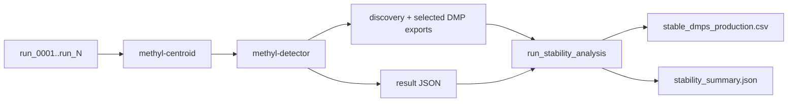

# Stage: Stability

## Purpose

Run repeated train/validation iterations to identify DMPs that recur across runs and materialize a stable production panel.

## Entry command

```bash
source .venv/bin/activate
methyl-validation --project /work/projects/prostate-cancer/configs/project_Healthy_vs_PCa1-4-CG.json --stability
```

Optional strict FeatureCuts alignment:

```bash
source .venv/bin/activate
methyl-validation --project /work/projects/prostate-cancer/configs/project_Healthy_vs_PCa1-4-CG.json \
  --stability --stability-featurecuts --stability-target-ba 0.95 --stability-min-selected-dmps 1000
```

## Required config keys

In the pipeline profile **`actionConfig.validation`** (set `METHYL_PROFILE` or pass `--context-file`):

- `n_iterations`, `train_fraction`, `seed`
- `run_stability`
- `stability_dmp_freq`
- `stability_min_balanced_accuracy`
- `stability_gene_freq`
- optional adaptive stop controls:
  - `stability_early_stop_enabled`
  - `stability_min_iterations`
  - `stability_convergence_window`
  - `stability_convergence_jaccard`
  - `stability_convergence_max_size_delta`
  - `stability_convergence_patience`
- optional FeatureCuts controls:
  - `stability_featurecuts_enabled`
  - `dmp_featurecuts_target_ba`, `gene_featurecuts_target_ba` (split BA gates)
  - `dmp_modeling_mode`, `gene_modeling_mode`
  - `stability_gene_featurecuts_max_dmps`, `stability_gene_featurecuts_max_genes` (site/profile caps)

## Statistical modeling modes (generic profiles)

Profiles are **process-agnostic**; study facts stay in the study manifest. See `docs/reference/domain-program-language.md` for the full matrix.

| Goal | Profile | Key modes |
|------|---------|-----------|
| DMP recurrence only | `mc_dmp` | `dmp_modeling_mode: raw_pool` |
| BA-gated DMP panel | `mc_dmp_fc` | `dmp_modeling_mode: featurecuts` |
| Enricher gene recurrence (PPI or Enrichr) | `mc_gene` | `stability_gene_recurrence_source: enricher`, `enricher.ppi_only` |
| Gene FeatureCuts on enricher/PPI genes | `mc_gene_fc` | `gene_modeling_mode: featurecuts` |
| Full DMP + gene FC (production) | `mc_dmp_gene_fc` | both axes featurecuts |
| Two-phase panel lock | `phase_a_dmp_stability` → `phase_b_gene_from_stable_dmps` | stable DMP panel then gene FC |

```bash
methyl-workflow-run \
  --program workflow_engine/domain/checks/buffy_healthy_vs_pca/configs/buffy_mc_stability.program.json \
  --context-file workflow_engine/domain/profiles/mc_dmp_gene_fc.profile.json \
  --context '{"projectPath":"/work/projects/prostate-cancer/configs/project_Buffy_healthy_vs_PCa.json"}'
```

Mapper CSV pattern follows modeling mode: discovery → `dmps-*-discovery.csv`; featurecuts → `dmps-*-selected.csv`. Downstream consumers should prefer **`dmps-*-selected.csv`**.

Deprecated names (`mc_dmp_discovery`, `mc_dmp_featurecuts`, `mc_gene_mapper`, `mc_gene_featurecuts`, `discovery_gene_featurecuts`, `dmp_panel_stability`, `gene_enricher_stability`, `buffy_mc_gene_fc`) alias to the canonical `mc_*` presets in `pipeline_profiles.py`.

## Process model




## Expected outputs

- `<mc_root>/stability/stable_dmps_production.csv`
- `<mc_root>/stability/stability_summary.json`
- `<mc_root>/all_metrics.csv`
- `<mc_root>/metrics_summary.json`
- `<mc_root>/baseline_manifest.json`

Where `<mc_root>` is:
`<output_base>/<project_name>/monte_carlo_runs/`

## Success checks

- `stable_dmps_production.csv` exists and is non-empty.
- `all_metrics.csv` has successful rows near expected run count.
- `stability_summary.json` reports configured thresholds.
- if adaptive stop is enabled, `stability_summary.json` includes `early_stopping` diagnostics (`triggered`, checkpoint history, and stop iteration when applicable).

## Do not do this

- Do not proceed to freeze when stable panel is missing or empty.
- Do not interpret blind outputs as stability quality evidence.

## Recovery

- **Re-run workflow after MC complete (recommended):** re-run the same DomainProgram. Each action inside the MC FOREACH loop skips independently when its `.action_results/` manifest matches; post-MC steps (stability, readiness) skip the same way once they have run successfully once.

```bash
source .venv/bin/activate
methyl-workflow-run --program workflow_engine/domain/checks/.../buffy_mc_stability.program.json \
  --context-file workflow_engine/domain/profiles/your.profile.json
```

- **Stability-only (CLI, no workflow):** when MC outputs exist but stability never succeeded:

```bash
methyl-validation --project /work/.../configs/project.json --stability --skip-detection
```

- Resume interrupted MC iteration loop:

```bash
source .venv/bin/activate
methyl-validation --project /work/projects/prostate-cancer/configs/project_Healthy_vs_PCa1-4-CG.json --stability --resume
```

- If panel is too small: lower `stability_dmp_freq` or increase `n_iterations`.
- If run quality is too low: tune detector and/or adjust `stability_min_balanced_accuracy`.

## See also

- `docs/theory/chapters/12-two-workflows.qmd`
- `docs/theory/chapters/15-model-creation-and-validation.qmd`
- If many MC iterations are split across several hosts, use shared `output_base` and the distributed queue flow: [Distributed MethylValidation on shared storage](13-distributed-methyl-validation.qmd) (Chapter 13).
