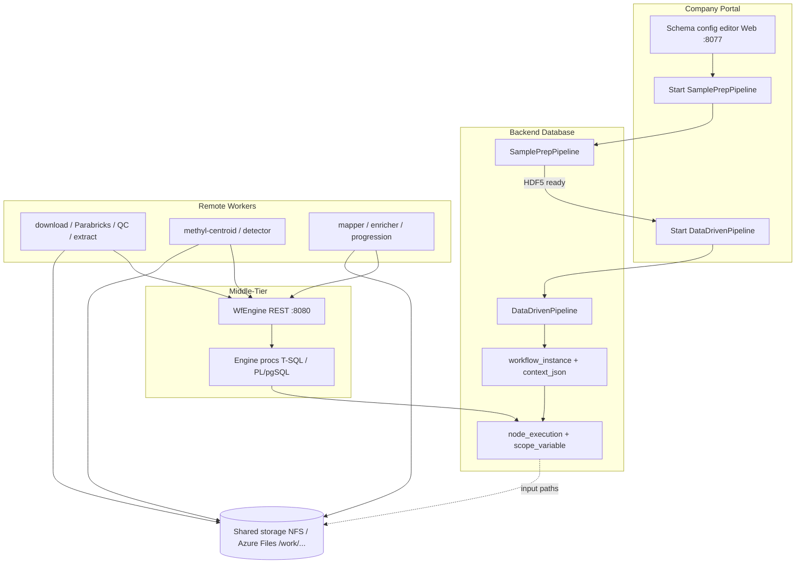

# Troubleshooting and Recovery

## Purpose

Operator recovery for **distributed** (gateway + DB + workers) and **local** (`methyl-workflow-run`) workflows.

## Failure routing



*Failure routing*


## Distributed — common problems

| Symptom | Likely cause | Recovery |
|---------|--------------|----------|
| Worker idle, nodes `READY` | Worker not registered or wrong capability | `register_worker.sh`, check `wf.worker`; restart systemd unit |
| Node `RUNNING`, stale lease | Worker crash/restart; claim only serves `READY` | Auto: claim path + `methyl-reclaim-leases.timer`. Manual: Azure SQL `EXEC portal.sp_reclaim_expired_leases …` / PostgreSQL `SELECT * FROM portal.sp_reclaim_expired_leases(…)` / CLI `methyl-reclaim-leases` ([lease doc](../architecture/workflow-idempotency-retry-lease.md)) |
| `401` on claim/submit | Token mismatch | Re-issue token via `register_worker.sh`; sync `/etc/methyl/worker-token` |
| Gateway unreachable | systemd down or wrong `WORKER_API_BASE` | `install_gateway_systemd.sh`, curl health |
| Instance `FAILED` | Negative `result_code` from action | Inspect Task detail (`portal.sp_get_node_execution_detail`: `engine_error_*`, `source_uri`). If the baked URI/knobs are still correct, **Retry** (`portal.sp_retry_failed_node`: `FAILED` → `READY`). If `actionConfig` / procedure / sample list was wrong, start a **new instance**. To abort remaining work, **Cancel / Fail this run** (`portal.sp_cancel_instance` / `sp_fail_instance`) — not fleet Drain |
| Missing FASTQ at source | Object not at the baked `fastqSource` URI | Portal does **not** upload. Place the file on the same source path shown in Task detail, then Retry. Do not treat this as a config change |
| Smoke fails immediately | DB env, missing `workflow_versions.json`, no worker | `bootstrap_distributed_workers.sh --verify`; deploy workflows; start worker |

## Local / legacy — common problems

| Symptom | Likely cause | Recovery |
|---------|--------------|----------|
| `command not found: methyl-workflow-run` | `.venv` inactive | `source .venv/bin/activate`; `bash scripts/setup_host.sh --with-deps` |
| freeze fails for missing stable panel | stability not run | Re-run stability stage or set `freeze_stable_dmp_csv` in manifest paths |
| path file-not-found across hosts | path drift | `path_remap` / consistent `/work/projects/...` layout |

## Safe recovery sequence (distributed)

1. Confirm release: `bash scripts/verify_setup.sh --runtime-bundle`
2. Query instance + nodes in DB (`wf.workflow_instance`, `wf.node_execution`)
3. Check worker logs: `journalctl -u methyl-worker -f`
4. Do **not** assume automatic retry of `FAILED` nodes — use **Retry** (`portal.sp_retry_failed_node`) only when the same `input_json` is still correct after an external fix (missing FASTQ now on source, transient GPU/network). Prefer a new instance when `actionConfig` changed
5. Record `workflow_instance_id` and overrides for traceability

## Safe recovery sequence (local)

1. Validate `.venv` and CLI availability
2. Confirm previous-stage artifacts exist under project output dir
3. Re-run failed stage only (`methyl-workflow-run` with scoped program node or legacy `--resume`)

## Resume examples (legacy transitional)

```bash
source .venv/bin/activate
methyl-validation --project /work/projects/prostate-cancer/configs/project_Healthy_vs_PCa1-4-CG.json --stability --resume
```

Prefer DomainProgram reruns for new studies.

## Operational guardrails

- Keep original run directories and DB instance rows for traceability
- Prefer **Retry** (`FAILED` → `READY`) when inputs are unchanged after an external fix; prefer a new `workflow_instance` when knobs or URIs changed. Do not expose a free-form `node_execution` status editor
- **Fail this queued action** (`portal.sp_fail_node`) is only for `READY`/`PENDING`. **Stop this task** (`portal.sp_stop_node`) is only for `RUNNING` when catalog `can_stop`. **Cancel / fail this run** drains queued work; it is not fleet Drain (`portal.sp_set_worker_desired_state`)
- Document `resolvedConfig` overrides in operator notes

## See also

- [Portal information architecture](../architecture/portal-ia.md) — instance monitor, Retry, missing FASTQ
- [Logging and observability](../reference/logging-observability.md)
- [Traceability](../reference/traceability-provenance.md)
- [Operator journey](../deployment/operator-journey.md)
- [Config parameter matrix](../reference/config-parameter-matrix.md)
