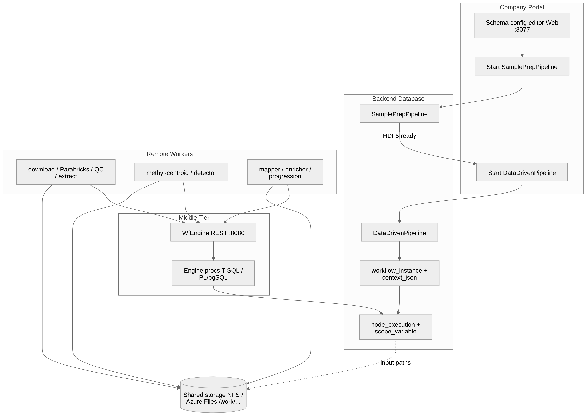

# Deployment and Distributed Workflow

## Purpose

Deploy the **control plane** (database, REST gateway) and **GPU workers** that execute SamplePrep and validation workflows. This chapter consolidates the dual-backend story (Azure SQL and PostgreSQL) and links to detailed runbooks.

**Deep dive:** [`docs/deployment/production_runbook.md`](../../deployment/production_runbook.md)  
**Operator journey (day-1 → day-N):** [`docs/deployment/operator-journey.md`](../../deployment/operator-journey.md)  
**Worker protocol:** [`workers/WORKER_PROTOCOL.md`](../../workers/WORKER_PROTOCOL.md)  
**REST contract:** [`contracts/openapi.yaml`](../../contracts/openapi.yaml)

## Architecture




| Component | Role |
|-----------|------|
| **Database** | Stores workflow definitions, instances, scope, task queue |
| **Portal SQL** (`portal.sp_*`) | Middle-tier orchestration; starts instances from study metadata |
| **Gateway** (`methyl-gateway`) | REST API for workers (poll/submit) and admin (deploy definitions) |
| **Workers** (`methyl-worker`) | Execute capabilities (Parabricks, methyl-qc, detector, …) |
| **`/work` storage** | Shared FASTQs, BAMs, HDF5, MC outputs |

The portal does **not** call the gateway for routine worker dispatch in production; workers poll the gateway directly. Operator/admin routes may require Entra ID JWT when `GATEWAY_REQUIRE_ENTRA=1`.

## Greenfield checklist

Use this ordered checklist once per environment:

1. [ ] Mount shared storage at `/work/epimethyl` (or study-specific `/work/<disease>/`)
2. [ ] Deploy database schema (PostgreSQL **or** Azure SQL — see below)
3. [ ] Run portal SQL scripts (`portal_resource_profile.sql`, `portal_workflow_api.sql`, cluster security if used)
4. [ ] Seed action catalog: `methyl-export-task-schemas && methyl-export-action-catalog && python workflow_engine/sql_mssql/seed_action_catalog.py`
5. [ ] Deploy workflow definitions: `bash scripts/deploy_workflow_definitions.sh`
6. [ ] Install and configure gateway (`deploy/env/gateway.postgres.env.example` or `gateway.mssql.env.example` → `/work/epimethyl/env/gateway.env`)
7. [ ] Enable `methyl-gateway` systemd + nginx TLS (see [`production_runbook.md`](../../deployment/production_runbook.md))
8. [ ] Provision GPU workers: [`worker_provision.md`](../../deployment/worker_provision.md), [`gpu_worker_runbook.md`](../../deployment/gpu_worker_runbook.md)
9. [ ] Register workers: `scripts/register_worker.sh`
10. [ ] Smoke test: `scripts/smoke_sample_prep.sh`, `scripts/smoke_study_lifecycle.sh`

## Database deploy (dual-backend)

Both backends implement the same **`wf`** schema contract. Choose one primary backend per environment; CI and local dev often use PostgreSQL.

### PostgreSQL (recommended for new deployments)

| Step | Command / doc |
|------|----------------|
| Schema scripts | [`workflow_engine/sql_pg/README.md`](../../workflow_engine/sql_pg/README.md) |
| Automated deploy | `./workflow_engine/sql_pg/deploy_azure.sh` (core engine + portal DDL) |
| Cluster IP binding | Optional: `wf_cluster_security_columns.sql` (run manually when using IP-bound clusters) |
| FOREACH support | Included in `08_foreach_support.sql` |

```bash
export PGHOST=your-server.postgres.database.azure.com
export PGDATABASE=postgres
export PGUSER=dba
export PGPASSWORD='...'
export PGSSLMODE=require
./workflow_engine/sql_pg/deploy_azure.sh

# Optional: cluster IP binding columns (when using wf.cluster security features)
psql -f workflow_engine/sql_pg/wf_cluster_security_columns.sql
```

### Azure SQL (legacy / phase-1)

| Step | Command / doc |
|------|----------------|
| Script order | [`workflow_engine/README.md`](../../workflow_engine/README.md) |
| Bundled schema | `workflow_engine/sql_mssql/MethylPipeline.sql` |
| FOREACH | `wf_sql_foreach_support.sql` (both backends) |

```bash
# Example: sqlcmd against Azure SQL with scripts 1–18 from workflow_engine/README.md
```

**Note:** `deploy_azure.sh` applies core engine scripts plus portal DDL (`portal_resource_profile.sql`, `portal_workflow_api.sql`, `wf_drop_platform_sample_storage.sql`). Run `wf_cluster_security_columns.sql` separately when enabling cluster IP binding.

## Action catalog and workflow definitions

After schema deploy:

```bash
source .venv/bin/activate
methyl-export-task-schemas
methyl-export-action-catalog
python workflow_engine/sql_mssql/seed_action_catalog.py

# Deploy SamplePrep + StudyValidation DomainPrograms (direct DB):
export BACKEND_DB=mssql   # or postgres
# AZURE_SQL_* or POSTGRES_*
bash scripts/deploy_workflow_definitions.sh
```

Output: `workflow_versions.json` with `workflow_version_id` values for portal / CI start.

Canonical programs (repo):

- SamplePrep: [`workflow_engine/domain/fixtures/sample_prep.program.json`](../../workflow_engine/domain/fixtures/sample_prep.program.json)
- Study validation: check-specific `*.program.json` under `workflow_engine/domain/checks/`

Authoring language: [`docs/reference/domain-program-language.md`](../../reference/domain-program-language.md)

## Gateway configuration

Install from repo root:

```bash
source .venv/bin/activate
pip install -e workflow_engine/
```

Copy and edit an example env file:

| Backend | Template |
|---------|----------|
| PostgreSQL | [`deploy/env/gateway.postgres.env.example`](../../deploy/env/gateway.postgres.env.example) |
| Azure SQL | [`deploy/env/gateway.mssql.env.example`](../../deploy/env/gateway.mssql.env.example) |

Install systemd unit [`deploy/systemd/methyl-gateway.service`](../../deploy/systemd/methyl-gateway.service) and nginx config [`deploy/nginx/methyl-gateway.conf`](../../deploy/nginx/methyl-gateway.conf).

Key variables (see `workflow_engine/rest/connection.py`):

- `BACKEND_DB` — `postgres` or `mssql`
- `POSTGRES_*` or `AZURE_SQL_*` — connection targets
- `WF_USE_MANAGED_IDENTITY` — Azure Entra token auth for DB
- Worker auth is `worker_id` + `worker_token` on `/v1/workers/*` (gateway is worker-only)

## Worker configuration

Each GPU worker runs one or more `methyl-worker` systemd units (see [`deploy/systemd/methyl-worker@.service`](../../deploy/systemd/methyl-worker@.service)).

| Variable | Purpose |
|----------|---------|
| `WORKER_ID` | Unique worker name |
| `WORKER_TOKEN` | Auth token from registration |
| `WORKER_CAPABILITY` | e.g. `parabricks.fq2bam`, `methyl-qc`, `pipeline.detector` |
| `WORKER_API_BASE` | Gateway URL (`https://gateway.example.com`) |

Registration and provisioning:

- [`docs/deployment/worker_provision.md`](../../deployment/worker_provision.md)
- [`docs/deployment/worker_node.md`](../../deployment/worker_node.md)
- `scripts/register_worker.sh`, `scripts/provision_worker_node.sh`

Worker poll/submit contract: [`workers/WORKER_PROTOCOL.md`](../../workers/WORKER_PROTOCOL.md)

## End-to-end operator flow

### 1. SamplePrepPipeline

Prefer portal SQL (`portal.sp_create_and_start_instance`) after planning context. For CI:

```bash
methyl-study-start sample-prep-start request.json
```

See [Sample Prep and Quality Control](03-sample-prep-and-qc.qmd) for QC gates.

### 2. Study validation / MC

After SamplePrep **COMPLETED**, start validation via portal SQL or:

```bash
methyl-workflow-run \
  --program workflow_engine/domain/checks/.../configs/your_mc.program.json \
  --context-file workflow_engine/domain/profiles/your.profile.json \
  --context '{"projectPath":"/work/.../configs/project.json"}'
```

Or legacy CLI recovery: [Stage: Stability](05-stage-stability.qmd) (transitional `methyl-validation` flags).

### 3. Local workflow (no gateway)

For development without database:

```bash
methyl-workflow-run --program path/to/program.json \
  --context-file profile.json \
  --context '{"projectPath":"/work/.../project.json"}' \
  --stub-external
```

## Related documentation

- Production runbook: [`docs/deployment/production_runbook.md`](../../deployment/production_runbook.md)
- Release layout: [`docs/deployment/production_release.md`](../../deployment/production_release.md)
- Portal lifecycle: [`workflow_engine/docs/portal_study_lifecycle.md`](../../workflow_engine/docs/portal_study_lifecycle.md)
- SamplePrep operator guide: [`workflow_engine/sql_mssql/SamplePrepFlow.md`](../../workflow_engine/sql_mssql/SamplePrepFlow.md)
- Documentation audit: [`docs/DOCUMENTATION_AUDIT.md`](../../DOCUMENTATION_AUDIT.md)
