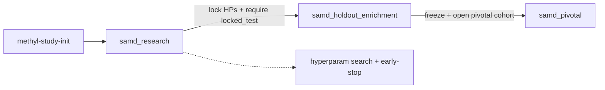

# SaMD study lifecycle (research → holdout enrichment → pivotal)

## What this chapter is

The **recommended path** for creating new healthy-vs-disease studies when you intend FDA-style SaMD evidence controls: real holdouts, locked hyperparameters before claims, and a small profile ladder.

This is **not** an FDA submission package. Architecture and profiles do not equal regulatory approval. See [`docs/regulatory/`](../regulatory/README.md).

For a first binary or multi-stage walkthrough without the SaMD ladder, use [Tutorial ch.16](16-tutorial-healthy-vs-cancer-stages.md). For hyperparameter search mechanics, see [ch.15](15-optional-hyperparameter-search.md) and [`packages/methylvalidation/docs/HYPERPARAMETER_SEARCH.md`](../../packages/methylvalidation/docs/HYPERPARAMETER_SEARCH.md).

## Mental model

| Layer | Owns | SaMD rule |
|-------|------|-----------|
| Study manifest `project_*.json` | Cohorts, stages, `validation_partitions`, `regulatory` | Who is train vs holdout; claim stage |
| Profile `samd_*.profile.json` | Iterations, BA gates, caps, holdout eval flags | How hard the science gates are |
| DomainProgram | Topology (MC → stability → freeze → model) | What runs |
| Site | Cluster caps (max DMPs/genes), genomes | Deployment bounds |

**Never** put tool knobs in the study manifest (`step_config` is rejected). **Never** move `locked_test` / `pivotal_validation` patients back into training.



*SaMD study lifecycle*


## Three profiles

| Profile | Default `regulatory.stage` | Holdouts | Hyperparameters |
|---------|---------------------------|----------|----------------|
| `samd_research` | `expanded_development` | `locked_test` recommended | Early-stop on; exploratory BA; `fail_if_below_target: false`; Tier A/B search OK |
| `samd_holdout_enrichment` | `internal_validation` | **Required** non-empty `locked_test`; excluded from training | Lock BA/caps/`n_iterations` from research; freeze readiness before model |
| `samd_pivotal` | `pivotal_validation` | **Required** non-empty `pivotal_validation` (never used in research/enrichment training) | Fully locked; hard BA fail; biological review required |

Existing `mc_*` profile names remain as **deprecated aliases** that fold into `samd_research` + a `researchMode` overlay (`dmp_raw`, `dmp_fc`, `gene_enricher`, `gene_fc`, `dual_fc`). Prefer `pipelineProfile: samd_research` with an explicit `researchMode` for research axes; keep the three-profile SaMD ladder (`samd_research` → `samd_holdout_enrichment` → `samd_pivotal`) for claim-bound studies—do not fold holdout/pivotal into research modes.

Clinical performance claims (`allow_clinical_performance_claims: true`) are **code-blocked** before `pivotal_validation` stage.

## Step 0 — Scaffold a study

```bash
source .venv/bin/activate
methyl-study-init \
  --study-id my-disease \
  --name Healthy_vs_Disease \
  --analyte buffy_coat \
  --binary \
  --output-root /work/projects
# or: --stages 3
```

Creates:

```text
/work/projects/my-disease/
  data/healthy.csv
  data/disease.csv          # or stage_1.csv …
  configs/project_Healthy_vs_Disease.json
  configs/README.md
```

Add `--modality rnaseq` for an RNA-Seq study (see [ch.20](20-rnaseq-process-pack.md)); the default is `methylation`. Config overlays on an existing process are **application packs** — see the generic pattern in [ch.24](24-methylation-application-packs.md). Worked methylation instances: [Alzheimer cfDNA](21-alzheimer-cfdna-pack.md) (disease — staged Control -> MCI -> AD, cfDNA, `neuro-core`), [Plant abiotic stress](23-plant-abiotic-stress-pack.md) (trait — Arabidopsis Control vs Drought, `plant_tissue`, CG/CHG/CHH), and [prostate cancer options](25-prostate-cancer-pack.md) (multi-path catalog).

Fill CSVs with sample IDs (patient-disjoint). Assign holdouts **early**:

- Put never-to-be-trained patients in `validation_partitions.locked_test`.
- Leave `pivotal_validation` empty until the clinical-trial / pivotal cohort is opened.
- Use `independence_keys` (`sample_id`, `patient_id`, …) so the same patient cannot appear in train and holdout.

Validate before enrichment or pivotal runs:

```bash
methyl-study-validate-manifest \
  --project /work/projects/my-disease/configs/project_Healthy_vs_Disease.json \
  --profile samd_holdout_enrichment
```

## Step 1 — Research (unknown hyperparameters)

1. Set study `regulatory.stage` to `feasibility` or `expanded_development`.
2. Keep `allow_clinical_performance_claims: false`.
3. Run MC stability with `samd_research`:

**Binary:**

```bash
methyl-workflow-run \
  --program workflow_engine/domain/fixtures/mc_stability.program.json \
  --context-file workflow_engine/domain/profiles/samd_research.profile.json \
  --context '{"projectPath":"/work/projects/my-disease/configs/project_Healthy_vs_Disease.json","pipelineProfile":"samd_research"}' \
  --parallel-workers 1
```

**Multi-stage:**

```bash
methyl-workflow-run \
  --program workflow_engine/domain/fixtures/mc_stability_staged.program.json \
  --context-file workflow_engine/domain/profiles/samd_research.profile.json \
  --context '{"projectPath":"/work/projects/my-disease/configs/project_Healthy_vs_Disease.json","pipelineProfile":"samd_research"}' \
  --parallel-workers 1
```

4. Discover knobs with early-stop and optional `methyl-hyperparam-search` (Tier A/B only at this tier).
5. Record winning `n_iterations`, FeatureCuts BA targets, and DMP/gene caps in a **study-local overlay** under `/work` (not in git), e.g. `/work/projects/my-disease/configs/overlay_locked_hps.json`, for the next tier.

## Step 2 — Holdout enrichment (add samples, real holdouts)

1. Add new patients **only** to development cohort CSVs (or `development_train` lists).
2. **Never** move `locked_test` samples into training. Grow `locked_test` only with **new** never-trained patients if needed.
3. Set `regulatory.stage` to `internal_validation` (then `model_freeze` after freeze readiness).
4. Apply locked HPs via `--context-file` overlay + `samd_holdout_enrichment`.
5. Require non-empty `locked_test`; run validate-manifest.
6. Run enrichment MC / lifecycle; pass `methyl-stability-freeze-readiness` (go or go_with_risks) before model.
7. Run true holdout eval (WF3): profile sets `holdout_eval` / `holdout_partition: locked_test`.

### Partition promotion example

| Action | Train CSVs | `locked_test` | `pivotal_validation` |
|--------|------------|---------------|----------------------|
| After research | 40H + 40D | 10H + 10D reserved | empty |
| Add 10 patients | 45H + 45D (new only) | unchanged 10+10 | empty |
| Open pivotal | unchanged | unchanged | 20H + 20D **new** trial patients |

## Step 3 — Pivotal / clinical trial

1. Populate `validation_partitions.pivotal_validation` with trial patients **disjoint** from all prior train and `locked_test` IDs.
2. Set `regulatory.stage` to `pivotal_validation`.
3. Only then consider `allow_clinical_performance_claims: true` (still requires human review of intended use).
4. Run with `samd_pivotal` (holdout partition = `pivotal_validation`; early-stop off; hard BA fail).
5. Prefer full lifecycle program for freeze + model + post-model:

```bash
methyl-workflow-run \
  --program workflow_engine/domain/fixtures/study_validation_lifecycle.program.json \
  --context-file workflow_engine/domain/profiles/samd_pivotal.profile.json \
  --context '{"projectPath":"/work/projects/my-disease/configs/project_Healthy_vs_Disease.json","pipelineProfile":"samd_pivotal"}' \
  --parallel-workers 1
```

6. Fill an evidence package in [`docs/regulatory/validation-evidence-index.md`](../regulatory/validation-evidence-index.md) (release SHA, profile, partitions, metrics paths). Submission topic map: [`docs/regulatory/samd-submission-scaffold.md`](../regulatory/samd-submission-scaffold.md) (scaffold only — not FDA clearance).

## Program pairing

| Tier | Binary DomainProgram | Staged DomainProgram |
|------|----------------------|----------------------|
| research / enrichment MC | `buffy_healthy_vs_pca/.../mc_stability.program.json` | `pca1_5_cg/.../mc_stability_staged.program.json` |
| freeze + model + post-model | `pca1_5_cg/.../study_validation_lifecycle.program.json` | same |
| Presets | `scripts/workflow_presets.sh show samd_research_binary` (etc.) | `samd_research_staged` |

## Admin CLI (distributed)

```bash
# After deploy_workflow_definitions.sh — start validation with SaMD profile in context
methyl-study-start validation-start request.json
```

Request context must include `projectPath` and `pipelineProfile` (`samd_research` | `samd_holdout_enrichment` | `samd_pivotal`). See [Admin CLI](../reference/admin-cli-methyl-study-start.md).

## Anti-patterns

- Using enrichment/pivotal profiles with empty required partitions
- Tuning BA/caps on pivotal data
- Claiming clinical performance before `pivotal_validation` stage
- Putting hyperparameters in `project_*.json`
- Reusing research random MC splits as if they were classical holdouts (see theory ch.12 WF2 vs WF3)
