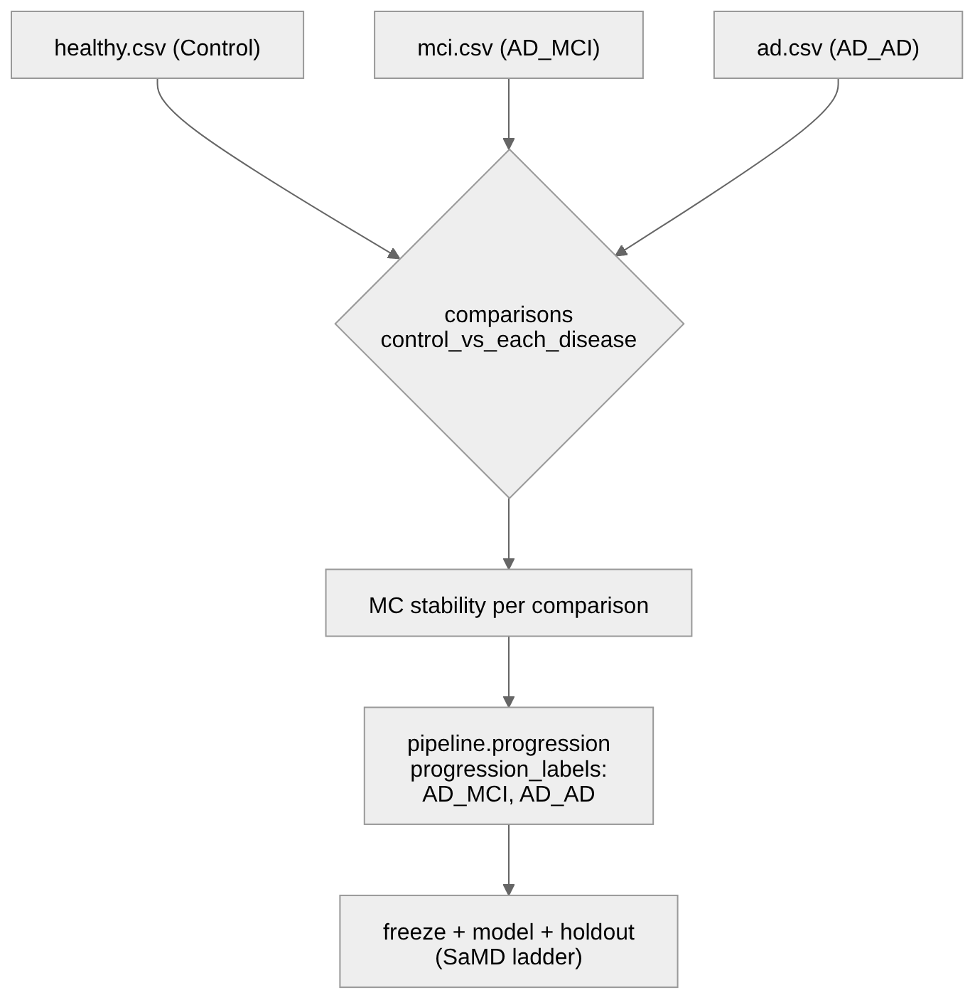

Alzheimer detection ships as an **application pack** (disease) on the existing
DNA-methylation **process pack**, not a new omics modality. The generic pattern—
manifest, overlay, partitions, optional enrichment preset—is documented in
[Methylation application packs](24-methylation-application-packs.qmd). This instance
reuses SamplePrep and the study-lifecycle DomainPrograms, the `samd_*` profile ladder,
and the cfDNA analyte profile; the Alzheimer-specific parts are cohorts,
patient-disjoint partitions, and a small config overlay. There is no new aligner,
action, or program.

For the shared per-sample and Monte Carlo topology, see the DNA methylation
[end-to-end workflow](../architecture/end-to-end-workflow.md). This chapter covers only
what is Alzheimer-specific.

Committed example: [`docs/examples/samd/alzheimer-cfdna/`](../examples/samd/alzheimer-cfdna/README.md).

## Cohort design (staged Control -> MCI -> AD)

The study manifest expresses two ordered disease stages under one group, giving two
comparisons plus progression:



Manifest essentials (`project_Healthy_vs_AD_Stages.json`):

```json
{
  "diseases": {
    "label": "AD",
    "groups": [{
      "label": "AD",
      "stages": [
        {"label": "MCI", "sample_paths": ["data/mci.csv"]},
        {"label": "AD",  "sample_paths": ["data/ad.csv"]}
      ]
    }]
  },
  "comparisons": "control_vs_each_disease",
  "progression_order": "explicit",
  "progression_labels": ["AD_MCI", "AD_AD"],
  "regulatory": { "primary_modality": "methylation", "primary_analyte": "cfdna" }
}
```

`regulatory.primary_modality: methylation` keeps this on the methylation process;
`primary_analyte: cfdna` selects the cfDNA analyte profile (fragmentomics + alignment
guardrails). For a binary study instead, use a single `disease` group and drop the
progression block.

## Disease overlay

Alzheimer biology is expressed as an instance/context overlay merged onto the `samd_*`
profile (`context_alzheimer_cfdna.json`):

| Key | Value | Why |
|-----|-------|-----|
| `actionConfig.mapper.disease_term` | `"Alzheimer's disease"` | OpenTargets disease prior; writes `disease_associated` columns. Overrides the mapper's prostate CLI default. |
| `actionConfig.mapper.enrich_disease` | `true` | Enable the disease-gene annotation. |
| `actionConfig.enricher.library_preset` | `"neuro-core"` | Brain/CNS gene sets; overrides the cfDNA analyte default `cancer-core`. |
| `runProgressionAnalysis` | `true` | Ordered MCI -> AD progression scoring. |
| `actionConfig.validation.backend_profiles.ecdf.params.covariates_path` | optional | Blood-immune fractions as covariates (Houseman/HiTIMED are blood-only; no CNS cell types). |

### neuro-core enrichment preset

`neuro-core` is a committed enrichment **library preset** in the preset registry
(`packages/methylenricher/methyl_enricher/data/library_presets.json`), synced into the
`cfg` registry like the action catalog:

```bash
methyl-cfg sync-library-presets      # registry -> cfg (kind enrichment_library_preset)
methyl-cfg materialize               # -> /work/site/enrichment/*.json
```

It keeps the pathway/TF/disease-prior libraries and adds brain/CNS and aging gene sets
(e.g. `Allen_Brain_Atlas_up/down`, `Descartes_Cell_Types_and_Tissue_2021`,
`Aging_Perturbations_from_GEO_*`) while dropping oncology-only drug libraries. See
[enrichment library presets](../architecture/config-registry.md#enrichment-library-presets).

## SaMD ladder

The pack climbs the same claim ladder as any methylation study
([SaMD study lifecycle](18-samd-study-lifecycle.qmd)):

| Tier | Profile | Required partition |
|------|---------|--------------------|
| Research | `samd_research` | `locked_test` recommended |
| Enrichment | `samd_holdout_enrichment` | non-empty `locked_test` |
| Pivotal | `samd_pivotal` | non-empty `pivotal_validation` |

```bash
methyl-study-validate-manifest \
  --project /work/projects/alzheimer-cfdna/configs/project_Healthy_vs_AD_Stages.json \
  --profile samd_holdout_enrichment

methyl-workflow-run \
  --program workflow_engine/domain/fixtures/study_validation_lifecycle.program.json \
  --context-file /work/projects/alzheimer-cfdna/configs/context_alzheimer_cfdna.json
```

Clinical-performance claims stay blocked until `regulatory.stage = pivotal_validation`
with a non-empty pivotal cohort.

## What this pack does not add

- No brain/CNS cell-type deconvolution basis (shipped bases are blood-only). Cell
  deconvolution, if run, yields blood-immune fractions as covariates.
- No new DomainProgram, action, or aligner. Only cohorts, partitions, the overlay, and
  the `neuro-core` preset.
