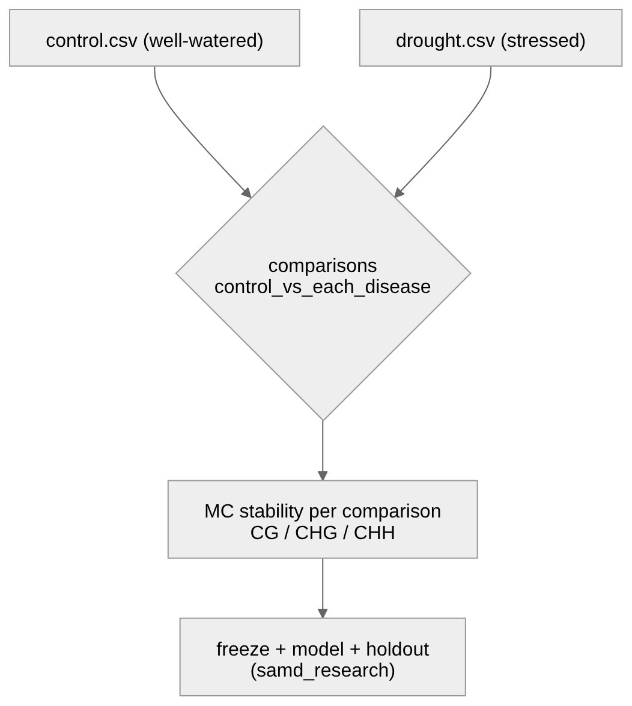

Plant abiotic stress detection ships as an **application pack** (trait) on the existing
DNA-methylation **process pack**, demonstrating that the platform is species-agnostic.
The generic pattern is documented in
[Methylation application packs](24-methylation-application-packs.qmd). This instance
declares assay procedure `plant_wgbs_gene_fc` and extends the pattern with plant
**platform unblockers** because human blood/cfDNA defaults are biologically wrong for
plant WGBS: a `plant_tissue` analyte, a non-human site reference, a lifecycle program
without blood cell deconvolution, and a plant enrichment preset. It reuses SamplePrep,
the centroid → detector → mapper → Monte Carlo stability science, and `samd_research`.
There is no new aligner or workflow action.

For the shared per-sample and Monte Carlo topology, see the DNA methylation
[end-to-end workflow](../architecture/end-to-end-workflow.md). Plant epigenomics
background (CG/CHG/CHH contexts, stress biology, MSH1) is in
[Plant Research](../research/Plant%20Research.md). This chapter covers only what is
plant-specific.

Committed example: [`docs/examples/samd/plant-abiotic-stress/`](../examples/samd/plant-abiotic-stress/README.md).

## Why plants are different

Plant genomes methylate cytosines in three sequence contexts, each with distinct biology,
so the pack runs all three and treats non-CG methylation as signal rather than a
bisulfite-conversion artifact:

| Context | Maintained by | Meaning |
|---------|---------------|---------|
| CG | MET1 | Often stable, heritable epialleles |
| CHG | CMT3 | Chromatin / TE silencing |
| CHH | RdDM (24-nt siRNA) | Dynamic environmental (e.g. drought) response |

This is why the human WGBS defaults (which treat CHG/CHH methylation above ~2% as a
conversion failure) must be lifted for plants.

## Cohort design (binary Control vs Drought)

The study manifest expresses one control group and one stress group, giving a single
comparison. Grafting / trait-introgression is a separate later pack, not this one.



Manifest essentials (`project_Control_vs_Drought.json`):

```json
{
  "diseases": {
    "label": "stress",
    "groups": [{ "label": "drought", "sample_paths": ["data/drought.csv"] }]
  },
  "comparisons": "control_vs_each_disease",
  "chromosomes": ["1", "2", "3", "4", "5"],
  "contexts": ["CG", "CHG", "CHH"],
  "regulatory": { "primary_modality": "methylation", "primary_analyte": "plant_tissue" }
}
```

`primary_modality: methylation` keeps this on the methylation process; `primary_analyte:
plant_tissue` selects the plant analyte profile (plant-safe QC, no cfDNA fragmentomics).
Arabidopsis chromosomes are `1..5`; swap the list for other species.

## Site reference (plant genome gate)

Plants align **linear only** (no HPRC pangenome). Pin a non-human genome + GTF in a site
manifest and provision the assets once per cluster:

```bash
scripts/download_arabidopsis_tair10.sh
export METHYL_SITE_CONFIG=workflow_engine/domain/profiles/site_tair10.example.json
```

The committed example [`site_tair10.example.json`](../../workflow_engine/domain/profiles/site_tair10.example.json)
pins `Arabidopsis_thaliana.TAIR10.dna.toplevel.fa` and
`Arabidopsis_thaliana.TAIR10.58.gtf` under `/work/genomes` and omits the pangenome, RNA
and proteomics reference blocks. The genome site reference is the real deployment gate for
this pack, not new Python science.

## Plant analyte overlay

Plant biology is expressed through the `plant_tissue` analyte defaults plus a small
instance/context overlay (`context_plant_abiotic_stress.json`):

| Key | Value | Why |
|-----|-------|-----|
| `regulatory.primary_analyte` | `plant_tissue` | Plant-safe QC: lifts CHG/CHH extraction caps, opens the bisulfite non-CpG cap, disables cfDNA fragmentomics (see [ANALYTE_PROFILES](../ANALYTE_PROFILES.md)) |
| `actionConfig.mapper.enrich_disease` | `true` | Offline plant gene↔trait prior (`enrich_source: plant_traits`); not Open Targets |
| `actionConfig.mapper.enrich_source` | `plant_traits` | Human Open Targets / DisGeNET stay off; join an operator TSV |
| `actionConfig.mapper.plant_traits_path` | demo drought TSV | Seed table under the example pack; replace with SoyBase / MaizeGDB / Gramene extracts for crops |
| `actionConfig.enricher.library_preset` | `"plant-stress-core"` | Organism-general GO terms; drops human oncology/CNS libraries |
| `actionConfig.enricher.organism` | `"Arabidopsis_thaliana"` | Enrichr organism |
| `actionConfig.enricher.string_species` | `3702` | STRING PPI taxon (Arabidopsis; 3847 soybean) |
| `runProgressionAnalysis` | `false` | Binary study, no ordered stages |

Human-symbol Enrichr libraries do not map to Arabidopsis AGI locus IDs, so for true
Arabidopsis/crop term enrichment supply a custom plant GMT via
`actionConfig.enricher.libraries`; `plant-stress-core` is the discovery default. The
preset is a committed enrichment library preset synced like the action catalog:

```bash
methyl-cfg sync-library-presets      # registry -> cfg (kind enrichment_library_preset)
methyl-cfg materialize               # -> /work/site/enrichment/*.json
```

## Lifecycle program without cell deconvolution

The pack runs
[`plant_stress_study_lifecycle.program.json`](../../workflow_engine/domain/fixtures/plant_stress_study_lifecycle.program.json),
identical to the human `study_validation_lifecycle` except the `pipeline.cell_deconvolution`
node is removed (shipped deconvolution bases are human-blood only). Progression is
config-gated off for the binary study.

```bash
methyl-study-validate-manifest \
  --project /work/projects/plant-abiotic-stress/configs/project_Control_vs_Drought.json \
  --profile samd_research

methyl-workflow-run \
  --program workflow_engine/domain/fixtures/plant_stress_study_lifecycle.program.json \
  --context-file /work/projects/plant-abiotic-stress/configs/context_plant_abiotic_stress.json
```

## Other crops (soybean, maize, wheat)

Committed site recipes and study stubs ship alongside Arabidopsis (same application pack,
same lifecycle program):

| Crop | Site example | Download script | Manifest / overlay | STRING |
|------|--------------|-----------------|--------------------|--------|
| Soybean Wm82 | `site_glycine_max_wm82.example.json` | `scripts/download_glycine_max_wm82.sh` | `project_Control_vs_Drought_soybean.json` + `context_soybean_drought.json` | 3847 |
| Maize B73 | `site_zea_mays_b73.example.json` | `scripts/download_zea_mays_b73.sh` | `project_Control_vs_Drought_maize.json` + `context_maize_drought.json` | 4577 |
| Wheat IWGSC | `site_triticum_aestivum_iwgsc.example.json` | `scripts/download_triticum_aestivum_iwgsc.sh` | `project_Control_vs_Drought_wheat.json` + `context_wheat_drought.json` | 4565 |

```bash
scripts/download_glycine_max_wm82.sh
export METHYL_SITE_CONFIG=workflow_engine/domain/profiles/site_glycine_max_wm82.example.json
methyl-workflow-run \
  --program workflow_engine/domain/fixtures/plant_stress_study_lifecycle.program.json \
  --context-file docs/examples/samd/plant-abiotic-stress/context_soybean_drought.json
```

Wheat assembly is large; operators may set a chromosome subset (e.g. `["1A"]`) for research
runs. Pattern checklist: [ch.24](24-methylation-application-packs.qmd).

## Plant cell-type deconvolution (optional)

Default lifecycle omits blood deconvolution. When a plant atlas is available:

1. Provision Houseman or HiTIMED JSON under `/work` (cfg roles `houseman_seed_basis` /
   `hitimed_hierarchy_basis`; compose HiTIMED with `scripts/build_plant_hitimed_basis.py`).
2. Set site `actionConfig.cell_deconvolution` (`seed_basis_path` or `hierarchy_basis_path`,
   multi-context list). `plant_tissue` never falls back to packaged blood atlases.
3. Run [`plant_stress_study_lifecycle_with_deconv.program.json`](../../workflow_engine/domain/fixtures/plant_stress_study_lifecycle_with_deconv.program.json).

## epi-GBS SamplePrep (optional)

WGBS stays on Parabricks [`sample_prep.program.json`](../../workflow_engine/domain/fixtures/sample_prep.program.json).
For epi-GBS set `libraryProtocol: epi_gbs` (see [`epi_gbs.profile.json`](../../workflow_engine/domain/profiles/epi_gbs.profile.json)) and run
[`sample_prep_epigbs.program.json`](../../workflow_engine/domain/fixtures/sample_prep_epigbs.program.json):
optional `sample.demultiplex` → `sample.docker_align` → methyl QC/extract. Pin the Docker
image + argv in `actionConfig.docker_align`. Demux offline and set `demultiplex.skip: true`
when barcodes were already split. Details: [plant-deconv-epigbs-seams plan](../plans/plant-deconv-epigbs-seams.plan.md).

## What this pack does not add

- No Open Targets / DisGeNET priors (human therapeutic databases). Arabidopsis overlay
  uses `enrich_source: plant_traits` with
  `data/arabidopsis_drought_gene_traits.tsv`; crop overlays leave disease enrichment
  off until operators supply a crop gene↔trait table (SoyBase / MaizeGDB / WheatIS /
  Gramene / literature).
- No grafting / trait-introgression design — that is a planned separate pack.
- No SaMD pivotal / clinical-performance claim ladder — an agricultural research pack
  stays on `samd_research`.
- No biologically validated plant atlas in the wheel — operators supply atlas JSON.
