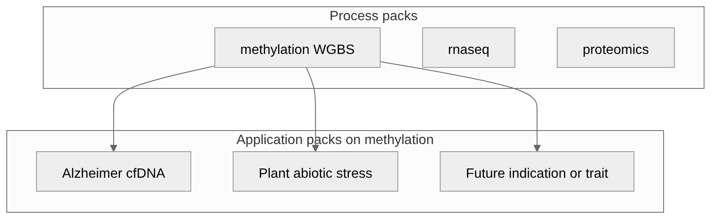

An **application pack** is a study configuration on an existing omics **process pack**
(cohorts, partitions, and a small config overlay)—not a new modality. Between process
and application sits an **assay procedure pack**: a named recipe for *how* the matrix
is sequenced and scored (library protocol, SamplePrep, covariates, FeatureCuts axis).

This chapter is the generic pattern. Worked instances:

| Instance | Kind | Guide |
|----------|------|-------|
| Alzheimer cfDNA (Control → MCI → AD) | Disease application | [ch.21](21-alzheimer-cfdna-pack.qmd) |
| Plant abiotic stress (Arabidopsis + crop sites) | Trait application | [ch.23](23-plant-abiotic-stress-pack.qmd) |



## Process vs procedure vs application

| | **Process pack** | **Assay procedure pack** | **Application pack** |
|--|------------------|--------------------------|----------------------|
| What it adds | Omics modality: DomainPrograms, typed actions, QC | Library protocol + SamplePrep/lifecycle pointers + science defaults (aligner, informME, deconv, FeatureCuts) | Indication/trait: cohorts, partitions, disease/trait overlay, enrichment preset |
| Typical change | New aligner / feature contract | New `*.procedure.json` (rarely a thin program fork) | New `project_*.json` + `context_*.json` |
| Examples | Methylation WGBS, [RNA-Seq](20-rnaseq-process-pack.qmd), [proteomics](22-proteomics-process-pack.qmd) | `buffy_wgbs_pangenome_gene_fc`, `cfdna_wgbs_plasma`, `cfdna_emseq_targeted` | Alzheimer cfDNA, plant drought stress |
| Operator surface | `regulatory.primary_modality` | `pipelineProcedure` | Same modality + procedure + overlay / analyte |

Informal subtypes (**disease application**, **trait application**) are fine in prose;
checklists and hub docs use **application pack**.

## Shipped methylation assay procedures

Committed under
[`workflow_engine/domain/profiles/procedures/`](../../workflow_engine/domain/profiles/procedures/):

| Procedure | Analyte | Defaults |
|-----------|---------|----------|
| `buffy_wgbs_pangenome_gene_fc` | `buffy_coat` | **Default** WGBS pangenome (native-Mojo methylGrapher on NVIDIA or AMD, `alignmentMode: pangenome_wgbs`); requires `hprc-d9-bs.wl.gfa` |
| `buffy_wgbs_linear_gene_fc` | `buffy_coat` | Linear WGBS baseline via **explicit** Clara Parabricks (or MojoFq2bamMeth); same science knobs |
| `cfdna_wgbs_plasma` | `cfdna` | Linear WGBS + fragmentomics (analyte merge), gene FeatureCuts, **no** cell deconv lifecycle |
| `cfdna_emseq_targeted` | `cfdna` | `libraryProtocol: emseq_targeted`, `sample_prep_emseq`, panel BED + elevated `min_cov`, no deconv |
| `plant_wgbs_gene_fc` | `plant_tissue` | Linear WGBS, gene FeatureCuts, plant lifecycle (no blood deconv) |

```bash
methyl-workflow-run \
  --program workflow_engine/domain/fixtures/study_validation_lifecycle.program.json \
  --context '{
    "projectPath":"/work/projects/my-buffy/configs/project_….json",
    "pipelineProcedure":"buffy_wgbs_pangenome_gene_fc",
    "pipelineProfile":"samd_research"
  }'
```

Accepted for production buffy research after linear-vs-wgbs gates
([`docs/plans/wgbs-alignment-decision.plan.md`](../plans/wgbs-alignment-decision.plan.md)).
Use `buffy_wgbs_linear_gene_fc` when the explicit NVIDIA Clara (or linear Mojo) path is preferred for wall-time or linear BAM workflows.

Prefer the procedure’s `lifecycleProgram` / `samplePrepProgram` hints (especially
`study_validation_lifecycle_no_deconv` for cfDNA plasma and EM-Seq). Schema:
[`schemas/config/procedure.schema.json`](../../schemas/config/procedure.schema.json).

**EM-Seq note.** Set `actionConfig.methyl_extract.target_panel_bed` to an operator-
supplied panel BED (cancer-specific panels belong in the application pack or study,
not in Python). Extract restricts the BAM with `samtools view -L` before MethylExtractor.

## Required artifacts (application pack)

| Artifact | Role |
|----------|------|
| Study manifest (`project_*.json`) | Groups/comparisons (or stages), chromosomes, contexts, `regulatory`, `validation_partitions` |
| Context overlay (`context_*.json`) | `pipelineProcedure` + disease/trait `actionConfig` + `pipelineProfile` |
| Cohort CSVs | Sample ID lists under `data/` (plant- or patient-disjoint as appropriate) |
| Enrichment preset (optional) | Named entry in `library_presets.json` when human `cancer-core` is wrong |
| Analyte / site (as needed) | e.g. `cfdna` vs `plant_tissue`; non-human genomes via site pins |
| Lifecycle program | Taken from the procedure when possible; thin forks only when biology differs |
| CI smoke + test | `workflow_engine/domain/checks/<pack>/` + procedure tests |
| Usage guide | `docs/usage/*-pack.qmd` describing only what is instance-specific |
| Regulatory roadmap row | Status under [Regulatory-Ready Platform](../regulatory/Regulatory-Ready%20Platform%20for%20Multiomics%20Diagnostics.md) |

Committed stubs and examples live under [`docs/examples/samd/`](../examples/samd/README.md).

## Reused programs and profiles

Default methylation path with a procedure:

```
sample_prep*.program.json          ← procedure.samplePrepProgram
  → study_validation_lifecycle*.program.json  ← procedure.lifecycleProgram
  → samd_research (+ researchMode from procedure) → holdout → pivotal
```

When a lifecycle node is biologically wrong (for example Houseman/HiTIMED on plant
tissue or default cfDNA plasma), the procedure points at a **thin program fork** that
drops that node—still not a new process pack. See [plant abiotic stress](23-plant-abiotic-stress-pack.qmd)
and `study_validation_lifecycle_no_deconv.program.json`.

SaMD ladder SOP: [ch.18](18-samd-study-lifecycle.qmd). Agricultural or other
non-clinical packs may stay on `samd_research` without climbing pivotal claim tiers.

## Overlay knobs

| Key | Typical use |
|-----|-------------|
| `pipelineProcedure` | Assay recipe (`buffy_wgbs_pangenome_gene_fc`, `cfdna_wgbs_plasma`, …) |
| `regulatory.primary_modality` | Keep `methylation` for these packs |
| `regulatory.primary_analyte` | Must match procedure `analyteExpectation` — see [ANALYTE_PROFILES](../ANALYTE_PROFILES.md) |
| `actionConfig.mapper.disease_term` / `enrich_disease` | Human disease priors (OpenTargets); set `enrich_disease: false` for non-disease traits |
| `actionConfig.enricher.library_preset` | e.g. `neuro-core`, `plant-stress-core` (overrides analyte default such as `cancer-core`) |
| `actionConfig.enricher.organism` / `string_species` | Non-human Enrichr / STRING taxon |
| `runProgressionAnalysis` / `actionConfig.progression` | Staged indications only |
| `actionConfig.validation.holdout_*` | Locked holdout partition for SaMD enrichment / pivotal |
| `actionConfig.methyl_extract.target_panel_bed` | EM-Seq / hybrid-capture panel BED (study or site asset) |

Merge precedence (highest wins first): **instance → procedure → profile/mode → analyte → site**
([config-not-code](../../.cursor/rules/config-not-code.mdc)).

## Checklist for a new application pack

1. Choose a **procedure** (`pipelineProcedure`) that matches analyte and assay recipe.
2. Choose binary vs staged comparisons; set chromosomes / contexts for the species.
3. Scaffold on `/work` with `methyl-study-init` (or copy an example under `docs/examples/samd/`).
4. Author the context overlay (procedure id + preset + disease/trait knobs + progression).
5. Add or reuse an enrichment preset via `methyl-cfg sync-library-presets` when needed.
6. Confirm analyte + site: human GRCh38 vs plant/other linear genome pins; for EM-Seq
   set `target_panel_bed`. For epi-GBS use `libraryProtocol: epi_gbs` +
   `sample_prep_epigbs.program.json` (or a future epi-GBS procedure).
7. Point `methyl-workflow-run` at the procedure’s lifecycle program + overlay.
8. After a baseline succeeds, tune Tier-A validation knobs with hyperparameter search
   **on that same procedure** — do not put `pipelineProcedure` in the grid
   ([ch.15](15-optional-hyperparameter-search.qmd)).
9. Add CI smoke fixture + pack regression test (mirror Alzheimer / plant tests).
10. Write a short usage chapter (instance-only deltas) and add a regulatory roadmap row.
11. Validate: `methyl-study-validate-manifest --profile samd_research` (or higher ladder tier).

## What an application pack does not add

- A new omics modality or aligner (that is a **process pack**).
- A full SamplePrep/covariate recipe (that is an **assay procedure pack**).
- Hard-coded disease or crop names in Python — stay in manifests, overlays, and site pins.
- Clinical-performance claims without the SaMD partition ladder
  ([ch.18](18-samd-study-lifecycle.qmd)).
