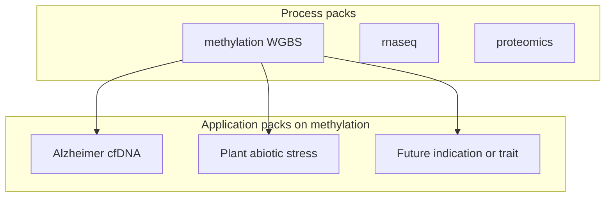

An **application pack** is a study configuration on an existing omics **process pack**
(cohorts, partitions, and a small config overlay)—not a new modality. Process packs
add aligners, actions, and QC; application packs reuse that control plane for a
specific indication or trait.

This chapter is the generic pattern. Worked instances:

| Instance | Kind | Guide |
|----------|------|-------|
| Alzheimer cfDNA (Control → MCI → AD) | Disease application | [ch.21](21-alzheimer-cfdna-pack.qmd) |
| Plant abiotic stress (Arabidopsis drought) | Trait application | [ch.23](23-plant-abiotic-stress-pack.qmd) |



## Process pack vs application pack

| | **Process pack** | **Application pack** |
|--|------------------|----------------------|
| What it adds | Modality: DomainPrograms, typed actions, QC gates, analyte/matrix defaults | Study: cohorts, partitions, context overlay, optional enrichment preset |
| Typical change | New aligner / feature contract / classifier seam | New `project_*.json` + overlay; rarely a thin program fork |
| Examples | Methylation WGBS, [RNA-Seq](20-rnaseq-process-pack.qmd), [proteomics](22-proteomics-process-pack.qmd) | Alzheimer cfDNA, plant drought stress |
| Operator surface | `regulatory.primary_modality` | Same modality + overlay / analyte / partitions |

Informal subtypes (**disease application**, **trait application**) are fine in prose;
checklists and hub docs use **application pack**.

## Required artifacts

| Artifact | Role |
|----------|------|
| Study manifest (`project_*.json`) | Groups/comparisons (or stages), chromosomes, contexts, `regulatory`, `validation_partitions` |
| Context overlay (`context_*.json`) | Instance `actionConfig` (mapper / enricher / progression / holdout) + `pipelineProfile` |
| Cohort CSVs | Sample ID lists under `data/` (plant- or patient-disjoint as appropriate) |
| Enrichment preset (optional) | Named entry in `library_presets.json` when human `cancer-core` is wrong |
| Analyte / site (as needed) | e.g. `cfdna` vs `plant_tissue`; non-human genomes via site pins |
| Lifecycle program | Reuse `study_validation_lifecycle.program.json`, or a thin sibling when a node must be omitted (e.g. no blood cell deconvolution) |
| CI smoke + test | `workflow_engine/domain/checks/<pack>/` + `workflow_engine/tests/test_<pack>_pack.py` |
| Usage guide | `docs/usage/*-pack.qmd` describing only what is instance-specific |
| Regulatory roadmap row | Status under [Regulatory-Ready Platform](../regulatory/Regulatory-Ready%20Platform%20for%20Multiomics%20Diagnostics.md) |

Committed stubs and examples live under [`docs/examples/samd/`](../examples/samd/README.md).

## Reused programs and profiles

Default methylation path (human blood / cfDNA applications):

```
sample_prep.program.json
  → study_validation_lifecycle.program.json
  → samd_research → samd_holdout_enrichment → samd_pivotal
```

When a lifecycle node is biologically wrong (for example Houseman/HiTIMED on plant
tissue), ship a **thin program fork** that drops that node—still an application pack,
not a new process pack. See [plant abiotic stress](23-plant-abiotic-stress-pack.qmd)
(`plant_stress_study_lifecycle.program.json`).

SaMD ladder SOP: [ch.18](18-samd-study-lifecycle.qmd). Agricultural or other
non-clinical packs may stay on `samd_research` without climbing pivotal claim tiers.

## Overlay knobs

| Key | Typical use |
|-----|-------------|
| `regulatory.primary_modality` | Keep `methylation` for these packs |
| `regulatory.primary_analyte` | Matrix defaults (`cfdna`, `buffy_coat`, `plant_tissue`, …) — see [ANALYTE_PROFILES](../ANALYTE_PROFILES.md) |
| `actionConfig.mapper.disease_term` / `enrich_disease` | Human disease priors (OpenTargets); set `enrich_disease: false` for non-disease traits |
| `actionConfig.enricher.library_preset` | e.g. `neuro-core`, `plant-stress-core` (overrides analyte default such as `cancer-core`) |
| `actionConfig.enricher.organism` / `string_species` | Non-human Enrichr / STRING taxon |
| `runProgressionAnalysis` / `actionConfig.progression` | Staged indications only |
| `actionConfig.validation.holdout_*` | Locked holdout partition for SaMD enrichment / pivotal |

Merge precedence remains: program/instance overlay → profile → analyte → site
([config-not-code](../../.cursor/rules/config-not-code.mdc)).

## Checklist for a new application pack

1. Choose binary vs staged comparisons; set chromosomes / contexts for the species.
2. Scaffold on `/work` with `methyl-study-init` (or copy an example under `docs/examples/samd/`).
3. Author the context overlay (preset, disease/trait knobs, progression on/off).
4. Add or reuse an enrichment preset via `methyl-cfg sync-library-presets` when needed.
5. Confirm analyte + site: human GRCh38 vs plant/other linear genome pins; omit blood
   deconvolution when bases do not apply.
6. Point `methyl-workflow-run` at the appropriate lifecycle program + overlay.
7. Add CI smoke fixture + pack regression test (mirror Alzheimer / plant tests).
8. Write a short usage chapter (instance-only deltas) and add a regulatory roadmap row.
9. Validate: `methyl-study-validate-manifest --profile samd_research` (or higher ladder tier).

## What an application pack does not add

- A new omics modality or aligner (that is a **process pack**).
- Hard-coded disease or crop names in Python — stay in manifests, overlays, and site pins.
- Clinical-performance claims without the SaMD partition ladder
  ([ch.18](18-samd-study-lifecycle.qmd)).
