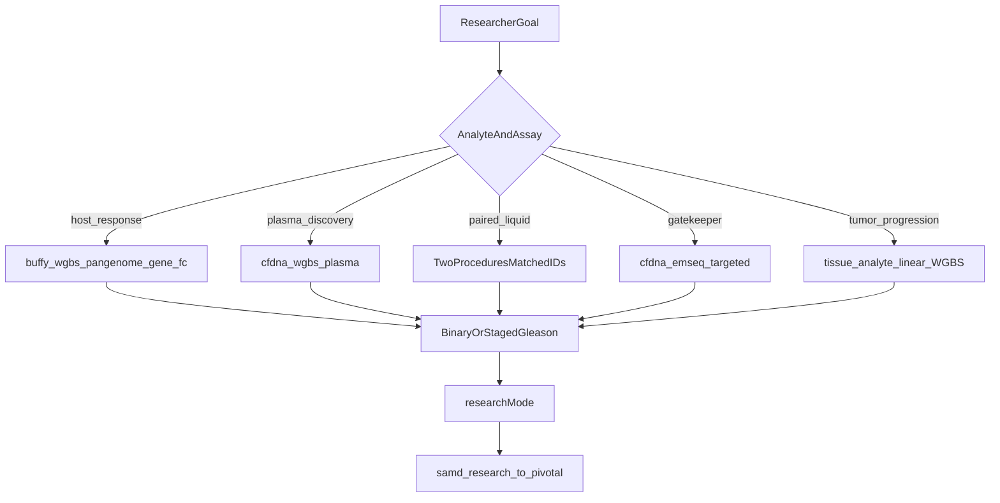

# Prostate cancer options catalog

MethylPipeline is **disease-agnostic**. Prostate cancer is the primary worked
example—not a separate PRAD pipeline. This chapter lists **what researchers can
choose** (analyte, assay, alignment, extraction, cohort design, statistical
axis, SaMD tier) and where each choice is set.

For *why* those choices matter to physicians and payers, see
[Prostate Cancer Application Deep-Dive](../research/Prostate_Cancer_Application_Deep_Dive.md).
The generic application-pack pattern is [ch.24](24-methylation-application-packs.md).
Alzheimer ([ch.21](21-alzheimer-cfdna-pack.md)) documents **one** procedure; this
chapter is a **multi-path catalog**.

**Claim boundary.** Architecture, profiles, and filled feasibility packages are
not FDA clearance, CLIA validation, or coverage-ready clinical performance.
Registered packages `EV-PCA-PLASMA-2026-06`, `EV-PCA-HGOOD-2026-06`, and
`EV-PCA-BUFFY-2026-07` are **feasibility / engineering** evidence. They lack
patient-disjoint `locked_test` / `pivotal_validation` partitions and must not be
cited for gatekeeper NPV, biopsy deferral, or payer medical-necessity claims.
See [validation-evidence-index](../regulatory/validation-evidence-index.md) and
[SaMD lifecycle (ch.18)](18-samd-study-lifecycle.md).



*Prostate research and diagnostic option tree*


## 1. Start here — pick a research or diagnostic goal

| Intent | Analyte | Procedure / run recipe | Typical profile | Do not claim from this alone |
|--------|---------|------------------------|-----------------|------------------------------|
| Host / immune / aggression research | `buffy_coat` | `buffy_wgbs_pangenome_gene_fc` (linear / Mojo / residual alternates below) | `samd_research` + `researchMode: gene_fc` | Buffy as tumor-shed NPV / biopsy deferral |
| Genome-wide plasma discovery | `cfdna` | `cfdna_wgbs_plasma` | `samd_research` + `gene_fc` | Discovery BA as a gatekeeper operating point |
| Paired buffy + plasma | both | Two studies, matched `patient_id` | Same ladder per study | Unpaired buffy-trained → plasma-deployed without retrain |
| Pre-biopsy GG≥2 **geometry** | `cfdna` | `cfdna_emseq_targeted` + operator `target_panel_bed` | Climb to `samd_pivotal` with partitions | Feasibility WGBS healthy-vs-pooled-PCa BA |
| Tumor / adjacent-normal for **progression and panel anchoring** | `tissue` | No shipped procedure — `primary_analyte: tissue` + linear WGBS SamplePrep (see [§5b](#5b-tumor-tissue-when-analyzing-disease-progression)) | `samd_research`; optional `cell_deconv_hitimed` | Tissue-only as a liquid-biopsy intended use |

Set `regulatory.primary_analyte` on the study manifest so it matches the
procedure `analyteExpectation`. Do **not** mix tumor DNA into a buffy or cfDNA
primary-analyte cohort. Tool knobs stay on site / procedure / profile /
instance overlay — never in `project_*.json` (`step_config` is rejected).

Merge order (highest wins): instance → program `with` / `stepOverride` →
procedure → profile / mode → analyte fill-missing → site. See
[config-parameter-matrix](../reference/config-parameter-matrix.md).


## 2. Assay procedure options

Shipped packs live under
[`workflow_engine/domain/profiles/procedures/`](../../workflow_engine/domain/profiles/procedures/).
All default to `pipelineProfile: samd_research` and `researchMode: gene_fc`.

| Procedure | Analyte | Align / protocol | Lifecycle | When to use | When not |
|-----------|---------|------------------|-----------|-------------|----------|
| `buffy_wgbs_pangenome_gene_fc` | `buffy_coat` | `pangenome_wgbs` / `wgbs_pangenome` | `study_validation_lifecycle` (Houseman) | Default buffy ~30× WGBS research | Tumor-shed rule-out; missing HPRC d9-bs assets |
| `buffy_wgbs_linear_gene_fc` | `buffy_coat` | `linear` (Clara `parabricks`) / `wgbs_linear` | same | Faster / cheaper linear baseline; NVIDIA Clara path | When pangenome_wgbs is already accepted and graph assets are up |
| `buffy_wgbs_linear_mojo_gene_fc` | `buffy_coat` | `linear` (Mojo) / `wgbs_linear` | same | Portable NVIDIA / AMD / CPU linear | Clara-only sites that want the explicit Parabricks image |
| `buffy_wgbs_mvalue_residual_gene_fc` | `buffy_coat` | `pangenome_wgbs` | `study_validation_lifecycle_residual` | Confounder-adjusted host DMPs (Ω ALR + smoking / age / BMI / CRP) | Default buffy path; residualization is opt-in |
| `cfdna_wgbs_plasma` | `cfdna` | `linear` / `wgbs_linear` | `study_validation_lifecycle_no_deconv` | Plasma discovery + fragmentomics | Buffy host biology; EM-Seq gatekeeper geometry |
| `cfdna_emseq_targeted` | `cfdna` | `linear` / `emseq_targeted` | no_deconv + `sample_prep_emseq` | Locked panel, elevated `min_cov`, no genome-wide DMP hunt | Genome-wide discovery; missing `target_panel_bed` |
| `cfdna_emseq_mhl_survival` | `cfdna` | `linear` / `emseq_targeted` | `study_validation_mhl_survival` + `sample_prep_emseq` | Wong-style MHB/MHL + Cox OS (operator `target_panel_bed` + `survival_path`) | FeatureCuts/ECDF classification; missing haplotype sidecars |

**Tumor tissue — no shipped procedure.** The catalog analyte
[`tissue.analyte.json`](../../workflow_engine/domain/analytes/tissue.analyte.json)
exists (`family: analyte`, visibility `advanced`). Set
`regulatory.primary_analyte: tissue` and reuse
`sample_prep.program.json` + `study_validation_lifecycle.program.json` (or the
no-deconv fork if you skip HiTIMED). Prefer **linear** WGBS for FFPE /
fresh-frozen tumor BAMs. A future `tumor_wgbs_linear_gene_fc` procedure is a
follow-on — do not invent that ID in run context today.

Linear vs `pangenome_wgbs` is decided by the compare harness
([sample_prep_test_bed](../../workflow_engine/docs/sample_prep_test_bed.md),
`scripts/compare_sample_prep_linear_vs_wgbs.sh`), not by classifier BA alone.
Until a report shows both arms through extraction QC, keep both buffy
procedures available. Stock `pangenome` / Giraffe is an **engineering
comparator only** — no WGBS methylation parity.


## 3. Alignment options

Details: [alignment-engines](alignment-engines.md),
[Sample prep and QC (ch.03)](03-sample-prep-and-qc.md).

| Choice | Values | Where set | PCa note |
|--------|--------|-----------|----------|
| `alignmentMode` | `linear`, `pangenome_wgbs`, stock `pangenome` | Procedure (`alignmentMode`) | Plasma and EM-Seq default linear; buffy research default `pangenome_wgbs` |
| Linear engine | `parabricks` (Clara) or `mojo` | `actionConfig.parabricks.engine` | `buffy_wgbs_linear_gene_fc` vs `buffy_wgbs_linear_mojo_gene_fc` |
| WGBS graph engine | `gpu_giraffe` / `mojo_giraffe`, `cpu_vg` | `actionConfig.methylgrapher_wgbs.align_engine` | Production GPU path vs `vg giraffe` rollback |
| GPU fallback | `mojo` \| `vg` \| `error` | `gpu_giraffe_fallback` | Unknown vendor or explicit fail-closed |
| Linear reference | GRCh38 FASTA | Site `reference_genome` / `linear_genome_key` | Human PCa studies |
| WGBS pangenome | HPRC d9-bs C2T+G2A | Site `methylgrapher_wgbs` / `pangenome_wgbs_key` | Required for buffy pangenome procedure |
| Library protocol | `wgbs_linear`, `wgbs_pangenome`, `emseq_targeted` | Procedure `libraryProtocol` | EM-Seq is assay design, not an aligner bake-off |

Site-published **core guardrails** (`alignment_qc.core_guardrails`) gate
eligibility: PF / Q30 / mean quality, AT/GC dropout, insert-size window,
deamination / OxoG. Sparse overlays belong on profile / procedure / study via
`sample_prep_guardrails_overlay`. cfDNA adds fragmentomics QC when the analyte
profile fills it. EM-Seq emphasizes on-target depth against the locked BED.


## 4. Extraction options

Backend follows alignment: `sample.methyl_extract` (MethylExtractor) for
`linear` / stock `pangenome`; `sample.methylgrapher_wgbs_extract` for
`pangenome_wgbs`. Schema:
[`methyl_extract.schema.json`](../../schemas/config/methyl_extract.schema.json).
CLI mirror: MethylExtractor README.

| Option | Typical PCa setting | Where set |
|--------|---------------------|-----------|
| Contexts | CG always; CHG/CHH optional for discovery | Study `contexts` + profile `extract_contexts` |
| Min coverage | WGBS site/profile default; **EM-Seq `min_cov: 20`** in the procedure | Procedure / site `actionConfig.methyl_extract` |
| MAPQ / Phred | Site or profile (`-q` / `-p`) | Same |
| Cap coverage | Off unless PCR-bias correction is wanted | Same |
| Read-level patterns | On for WGBS informME (`tile_size` 4 in buffy/plasma procedures); **off for EM-Seq** | Procedure `methyl_extract.read_level` |
| Target panel BED | Required for EM-Seq | Study / application overlay `target_panel_bed` — not Python |
| Output | Per-chr `{ctx}.h5` (+ optional `.patterns.h5`, TSV) | `output_format` |

Extraction QC (`extraction_qc.guardrails`) is site-published: CpG weighted
mean coverage, mammalian CHG/CHH caps, autosomal uniformity, discard fraction.
The extractor sidecar contract lives in the sibling MethylExtractor repo
(`docs/extraction_qc_contract.md`).


## 5. Study-design options

Production manifests live under `/work/projects/prostate-cancer/configs/`.
Repo `project_*.json` files under `workflow_engine/domain/checks/` and
`tools/methyl-config-editor/configs/` are **CI / editor smoke mirrors**, not
the production source of truth.

| Design | Example tree | Comparisons | Notes |
|--------|--------------|-------------|-------|
| Binary buffy | `Buffy_healthy_vs_PCa`, `H_PCa_good` | Healthy vs PCa | CI: `checks/buffy_healthy_vs_pca`, `checks/h_pca_good` |
| Binary plasma | `Plasma_healthy_vs_PCa` | Healthy vs PCa | cfDNA analyte + fragmentomics |
| Staged Gleason | `Healthy_vs_PCa1-5-CG` | `control_vs_each_disease` or explicit pairs | CI: `checks/pca1_5_cg`; profile `staged_ovr_mc` when running multi-class OvR |
| Progression | any staged manifest | `progression_order` + `progression_labels` | `runProgressionAnalysis: true` |

**Prostate overlay knobs** (instance / `context_*.json`, not the study
manifest science block):

| Key | Typical PCa value |
|-----|-------------------|
| `pipelineProcedure` | One of the shipped IDs in §2 |
| `actionConfig.mapper.disease_term` | `"Prostate Cancer"` |
| `actionConfig.mapper.enrich_disease` | `true` for human disease priors |
| `actionConfig.enricher.library_preset` | `cancer-core` (cfDNA analyte default) or `cancer-extended` (staged profiles) |
| `actionConfig.progression.enabled` / `runProgressionAnalysis` | `true` on staged studies |
| `actionConfig.progression.disease_context` | `prostate_cancer` — bundled AR / DNA-repair / replication / metabolic gene sets in [`profiles/prostate_cancer.json`](../../packages/methyldiseaseprogression/methyl_disease_progression/profiles/prostate_cancer.json) |

Scaffold:

```bash
source .venv/bin/activate
methyl-study-init \
  --study-id prostate-cancer \
  --name Buffy_healthy_vs_PCa \
  --analyte buffy_coat \
  --binary \
  --output-root /work/projects
# or: --analyte cfdna|tissue   --stages 5
```

`--analyte` for methylation is `cfdna` | `buffy_coat` | `tissue` |
`plant_tissue`. Fill CSVs with sample IDs; assign `validation_partitions`
early ([ch.18](18-samd-study-lifecycle.md)).


## 5b. Tumor tissue when analyzing disease progression

Progression scoring is **comparison/stage-driven** (mapper combined CSVs per
Gleason / stage label), not analyte-aware. Tumor DNA is the natural matrix for
**grade-ordered** progression; liquid and buffy remain complementary host /
shed layers.

| Design | Manifest shape | Why for PCa progression |
|--------|----------------|-------------------------|
| **Tissue-only staged** | `primary_analyte: tissue`; `diseases.stages[]` = adjacent-normal (optional control) + GG1…GG≥2 / PCa1–5 from RP or targeted biopsy | Direct tumor epigenome vs grade; best input to `disease_context: prostate_cancer` |
| **Adjacent-normal vs tumor** | Binary or two-stage tissue study (benign / uninvolved vs index lesion) | Field-effect vs tumor-specific DMPs. Historical `packages/methylcentroid/configs/tissue_benign_config.json` / `tissue_malignant_config.json` are **legacy package configs**, not production manifests |
| **Tissue-anchored then liquid transfer** | Discover / freeze on tissue; lock `target_panel_bed` or FeatureCuts panel; retrain on matched plasma (optional buffy) with `enforce_training_analyte_match` | GSTP1-style tissue markers → cfDNA / EM-Seq gatekeeper. Do **not** deploy a tissue-trained classifier on plasma without retrain |
| **Matched trio** | Three studies, same `patient_id` / `independence_keys`: tissue + `buffy_coat` + `cfdna` | Tumor = grade ground truth and purity; buffy = hematopoietic / CHIP analogue; plasma = shed signal. `combined` is **not** a substitute — it only fills bisulfite defaults and mixes QC poorly |
| **Tissue + HiTIMED purity** | Overlay `cell_deconv_hitimed` (`method: hitimed`, `analyte: tissue`) + operator `hierarchy_basis_path` | Tumor / stroma as ECDF covariates so progression is not purity-confounded. Blood immune subtree ships in-wheel; **prostate tumor/stromal atlas does not** — provision offline ([ANALYTE_PROFILES](../ANALYTE_PROFILES.md), [HiTIMED plan](../plans/hitimed-hierarchical-deconvolution.plan.md)) |

Honesty:

- `normalize_primary_analyte("tissue")` passes through;
  [`analyte_profiles.py`](../../packages/methylutils/methyl_utils/analyte_profiles.py)
  has **no** `tissue` branch — fill-missing is bisulfite-only (same as
  `combined`). Set fragmentomics **off**, mammalian CHG/CHH caps, and HiTIMED
  on the profile / instance overlay.
- FFPE vs fresh-frozen is a **preanalytics / QC overlay** (insert size,
  deamination, coverage uniformity), not a new analyte. Do not invent an
  `ffpe` token.
- Tissue progression does **not** make EV-PCA packages diagnostic. A
  tissue-anchored panel still needs liquid-biopsy holdout / pivotal partitions
  for a pre-biopsy claim.
- Do not put tumor and buffy samples in one `primary_analyte` cohort.


## 6. Statistical axis and modeling options

| `researchMode` | DMP axis | Gene axis | Typical PCa use |
|----------------|----------|-----------|-----------------|
| `dmp_raw` | `raw_pool` | none | DMP recurrence only |
| `dmp_fc` | `featurecuts` | none | BA-gated DMP panel |
| `gene_enricher` | `raw_pool` | mapper / enricher recurrence | Pathway gene stability |
| `gene_fc` | `raw_pool` | `featurecuts` | **Default** on all shipped PCa procedures |
| `dual_fc` | `featurecuts` | `featurecuts` | Full DMP + gene panels |

Modes live under
[`workflow_engine/domain/profiles/modes/`](../../workflow_engine/domain/profiles/modes/).
Deprecated `mc_*` profile names fold into `samd_research` + a mode — prefer
the explicit pair.

**Deconvolution**

| Method | Analyte tree | PCa default |
|--------|--------------|-------------|
| Houseman | 6-cell Ω (buffy) | Buffy procedures |
| HiTIMED | Buffy immune subtree; cfDNA `tumor_fraction` leaf; **tissue full tumor/immune/stromal** | Overlay `cell_deconv_hitimed`; cfDNA/tissue tumor leaves need operator atlases |
| None | — | Plasma WGBS and EM-Seq lifecycles |

**Also choose (site / profile, not Python defaults):** FeatureCuts BA targets
and gene-selection caps (`gene_selection.max_dmps` / `max_genes`); informME
and `derived_measures` as ECDF second-stage covariates; model backends ECDF
(preferred regulated path), `tabular_sklearn`, optional hybrids. Hyperparameter
search ([ch.15](15-optional-hyperparameter-search.md)) runs **on a fixed
procedure** — do not grid `pipelineProcedure`.

Stability / freeze / model: [ch.05](05-stage-stability.md)–[ch.08](08-stage-post-model-validation.md).


## 7. Research vs diagnostic (SaMD ladder)

| Intent | Profile | Required partitions | Allowed narrative |
|--------|---------|---------------------|-------------------|
| Feasibility / method | `samd_research` | `locked_test` recommended | Engineering, panel stability, method development |
| Internal validation | `samd_holdout_enrichment` | non-empty `locked_test` | Locked-HP enrichment |
| Claim-oriented | `samd_pivotal` | non-empty `pivotal_validation` | Clinical performance only when evidence is filled |

Clinical-performance claims (`allow_clinical_performance_claims: true`) are
code-blocked before `pivotal_validation`. SOP: [ch.18](18-samd-study-lifecycle.md).

**Current EV-PCA status** ([validation-evidence-index](../regulatory/validation-evidence-index.md)):

| Package | Study tree | Analyte | Status |
|---------|------------|---------|--------|
| `EV-PCA-PLASMA-2026-06` | `Plasma_healthy_vs_PCa` | cfDNA | Draft feasibility |
| `EV-PCA-HGOOD-2026-06` | `H_PCa_good` | buffy | Draft feasibility; gene-stable-at-threshold gaps reported |
| `EV-PCA-BUFFY-2026-07` | `Buffy_healthy_vs_PCa` | buffy | Draft; incomplete model chain for gatekeeper claims |

The diagnostic path for a pre-biopsy claim is **EM-Seq (or proven plasma
WGBS) + partitions + pivotal** — not buffy-only NPV, and **not tissue-only**.
Tissue informs panel and grade biology; the gatekeeper intended use remains a
liquid biopsy.


## 8. Worked commands

Activate the repo venv first. Prefer `samd_research` + `pipelineProcedure`
over deprecated `mc_*` profiles. Use `staged_ovr_mc` only for Gleason
multi-class OvR.

**Buffy pangenome research (binary)**

```bash
source .venv/bin/activate
methyl-workflow-run \
  --program workflow_engine/domain/fixtures/study_validation_lifecycle.program.json \
  --context '{
    "projectPath":"/work/projects/prostate-cancer/configs/project_Buffy_healthy_vs_PCa.json",
    "pipelineProcedure":"buffy_wgbs_pangenome_gene_fc",
    "pipelineProfile":"samd_research",
    "researchMode":"gene_fc"
  }' \
  --parallel-workers 1
```

**Plasma WGBS discovery**

```bash
methyl-workflow-run \
  --program workflow_engine/domain/fixtures/study_validation_lifecycle_no_deconv.program.json \
  --context '{
    "projectPath":"/work/projects/prostate-cancer/configs/project_Plasma_healthy_vs_PCa.json",
    "pipelineProcedure":"cfdna_wgbs_plasma",
    "pipelineProfile":"samd_research",
    "researchMode":"gene_fc"
  }' \
  --parallel-workers 1
```

**Staged Gleason OvR (buffy)**

```bash
methyl-workflow-run \
  --program workflow_engine/domain/fixtures/mc_stability_staged.program.json \
  --context '{
    "projectPath":"/work/projects/prostate-cancer/configs/project_Healthy_vs_PCa1-5-CG.json",
    "pipelineProfile":"staged_ovr_mc"
  }' \
  --parallel-workers 1
```

**EM-Seq gatekeeper geometry** (set `target_panel_bed` on the overlay first)

```bash
methyl-workflow-run \
  --program workflow_engine/domain/fixtures/study_validation_lifecycle_no_deconv.program.json \
  --context '{
    "projectPath":"/work/projects/prostate-cancer/configs/project_Plasma_healthy_vs_PCa.json",
    "pipelineProcedure":"cfdna_emseq_targeted",
    "pipelineProfile":"samd_research",
    "researchMode":"gene_fc"
  }' \
  --parallel-workers 1
```

**Tissue staged progression** (no shipped procedure — analyte + programs)

```bash
methyl-study-init \
  --study-id pca-tissue \
  --name Adjacent_vs_PCa_stages \
  --analyte tissue \
  --stages 5 \
  --output-root /work/projects

methyl-workflow-run \
  --program workflow_engine/domain/fixtures/study_validation_lifecycle.program.json \
  --context '{
    "projectPath":"/work/projects/pca-tissue/configs/project_Adjacent_vs_PCa_stages.json",
    "pipelineProfile":"samd_research",
    "researchMode":"gene_fc",
    "runProgressionAnalysis": true,
    "actionConfig": {
      "progression": {"enabled": true, "disease_context": "prostate_cancer"},
      "mapper": {"disease_term": "Prostate Cancer", "enrich_disease": true},
      "enricher": {"library_preset": "cancer-extended"},
      "fragmentomics": {"enabled": false}
    }
  }' \
  --parallel-workers 1
```

Add a `cell_deconv_hitimed` overlay (`method: hitimed`, `analyte: tissue`,
operator `hierarchy_basis_path`) when purity covariates are required.

Validate before enrichment or pivotal:

```bash
methyl-study-validate-manifest \
  --project /work/projects/prostate-cancer/configs/project_Buffy_healthy_vs_PCa.json \
  --profile samd_research
```


## 9. Existing fixtures and `/work` tree

| Location | Role |
|----------|------|
| `/work/projects/prostate-cancer/` | Production study tree (manifests, cohort CSVs, MC outputs) |
| `/work/projects/prostate-cancer/configs/project_*.json` | Operator-edited study manifests |
| `workflow_engine/domain/checks/buffy_healthy_vs_pca/` | CI smoke: binary buffy |
| `workflow_engine/domain/checks/pca1_5_cg/` | CI smoke: staged PCa1–5 |
| `workflow_engine/domain/checks/h_pca_good/` | CI smoke: H_PCa_good |
| `workflow_engine/domain/fixtures/*.program.json` | Topology (sample prep, MC, lifecycle) |
| `tools/methyl-config-editor/configs/` | Editor copies — not production SoT |

Edit cohorts on `/work`. Programs and profiles stay in the repo or the
promoted runtime-bundle. See
[work layout](../deployment/work_layout_migration.md) and
[config registry (ch.19)](19-config-registry.md).

**Not shipped in this pass:** `docs/examples/samd/prostate-*` stubs and a
dedicated tumor-tissue procedure. Follow [ch.24](24-methylation-application-packs.md)
if you add those later.


## Further reading

- Physician / payer narrative: [Prostate Cancer Application Deep-Dive](../research/Prostate_Cancer_Application_Deep_Dive.md)
- Analyte biology: [BuffyCoat vs cfDNA](../research/BuffyCoat_vs_cfDNA_for_Cancer_Detection.md), [ANALYTE_PROFILES](../ANALYTE_PROFILES.md)
- Gatekeeper clinical SOW: [Prostate Cancer Detection](../research/Prostate%20Cancer%20Detection.md)
- Fitness vs that SOW: [Prostate_Cancer_Detection_MethylPipeline_Fitness](../research/Prostate_Cancer_Detection_MethylPipeline_Fitness.md)
- Wong et al. 2026 EM-Seq mCRPC prognosis (MHB/MHL + OS nomogram): use procedure `cfdna_emseq_mhl_survival` + study `survival_path`. Gap note (implemented / remaining): [Wong2026_EMSeq_mCRPC_MethylPipeline_Gaps](../research/Wong2026_EMSeq_mCRPC_MethylPipeline_Gaps.md). Florida community-access framing: [partnership brief](../research/moffitt_partnership_opportunity_brief.md)
- Tutorial (healthy vs stages): [ch.16](16-tutorial-healthy-vs-cancer-stages.md)
- Command cookbook: [ch.12](12-command-cookbook.md)
