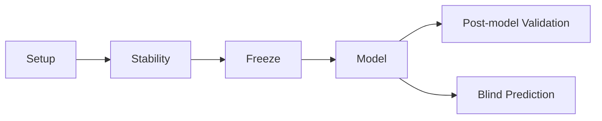

# MethylPipeline Usage Manual

## What this manual is

This is the operational companion to the theory book. It is designed for execution teams who need:

- exact commands,
- required config keys,
- expected output artifacts,
- stage handoff checks,
- recovery actions when a run fails.

For statistical background, use [`docs/theory/`](../theory/index.qmd). For compiler and worker internals, use [`docs/implementation/`](../implementation/index.md). Start with [Relationship to Theory and Implementation](00-relationship-to-theory-and-implementation.qmd).

## Reading paths

- **Sample prep (FASTQ → HDF5):** Chapter `03` (`03-sample-prep-and-qc.qmd`).
- **Fast path (stage execution):** Chapters `05` to `09` (stability through blind prediction).
- **New project setup:** Chapters `01`, `02`, `03`, then `05`.
- **Daily operations:** Chapters `10` to `12`.
- **Scaling MC across machines:** Chapter `13` — shared `/work` storage and queue subcommands.
- **Deployment (DB + gateway + workers):** Chapter `14`.
- **Optional hyperparameter tuning:** Chapter `15` — `methyl-hyperparam-search` grid driver.
- **Standalone package usage:** Chapter `04`.

## End-to-end workflow map

## Scope boundaries

- **SamplePrepPipeline** (FASTQ → aligned BAM → methylation HDF5) runs before staged validation; see Chapter 3.
- **Canonical orchestration:** `methyl-workflow-run` with repo DomainPrograms; legacy `methyl-validation --stability/--freeze/--model` documented where still used.
- Blind-only prediction is documented as a standalone `methyl-predictor` operation.
- Package behavior is documented from implementation in `packages/*`.

## Canonical references

- Sample prep workflow: [`workflow_engine/sql/SamplePrepFlow.md`](../../workflow_engine/sql/SamplePrepFlow.md)
- DomainProgram language: [`docs/reference/domain-program-language.md`](../reference/domain-program-language.md)
- Pipeline stages diagram: [`docs/architecture/pipeline-stages.md`](../architecture/pipeline-stages.md)
- Validation orchestration: `packages/methylvalidation/docs/USAGE.md`
- Distributed queue: `packages/methylvalidation/docs/DISTRIBUTED_QUEUE.md`
- Hyperparameter search: `packages/methylvalidation/docs/HYPERPARAMETER_SEARCH.md`
