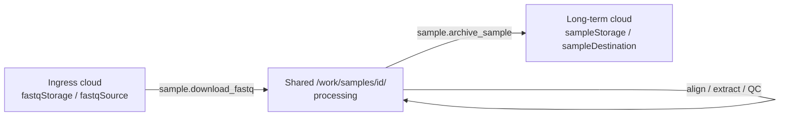

A sample is an **ID + directory on shared storage**. Sample **identity** is imported into **`portal.Samples`** (from Institutions / Labs); the **study** enrolls those samples into analysis groups in **`cfg`**. CSV list files under `/work` are a **materialization** for workers — not the source of truth.

### Layers

| Layer | Owns |
|-------|------|
| **`portal.Samples`** (+ `LabSamples`) | Import registry from institutions/labs; clinical metadata; lab run id (`LabSamples.Sample` → processing key) |
| **`cfg.study` / `cfg.study_group` / `cfg.study_group_member`** | Which portal samples belong to which analysis arm (`control` / `disease`) |
| **CSV lists** (`data/*.csv`) | Worker-facing lists written by `methyl-cfg materialize` |
| **`portal.Groups` / `GroupSamples`** | Customer UI cohorts — **not** study science arms |

```text
Institutions/Labs
       │ import
       ▼
portal.Samples ──► portal.LabSamples.Sample (= BC-H-001)
       │
       │ enroll (cfg)
       ▼
cfg.study_group_member
       │ materialize
       ▼
/work/projects/<study>/data/*.csv  →  /work/samples/{id}/
```

### Study → groups → samples

```text
project_*.json  (materialized from cfg.study)
  controls / diseases
    groups[]
      label
      sample_paths: [ ".../data/healthy.csv" ]   ← derived from cfg membership
  samples_base_path: "/work/samples"             ← default
```

Each CSV is typically:

```csv
sample
BC-H-001
BC-H-002
```

That resolves to processing dirs:

`/work/samples/BC-H-001/`, `/work/samples/BC-H-002/`, …

**Processing key resolution** (when enrolling a member):

1. `portal.LabSamples.Sample` if a lab run is linked  
2. Else explicit `processingSampleKey`  
3. Else `portal.Samples.ParticipantID`  
4. Else fail (do not invent IDs)

### Enroll via cfg (CLI)

```bash
source .venv/bin/activate
export METHYL_CFG_STORE=/work/epimethyl/cfg-store
export PYTHONPATH=workflow_engine:$PYTHONPATH

methyl-cfg set-study-group Buffy_healthy_vs_PCa \
  --role control --label all --list-filename healthy_b.csv

methyl-cfg set-study-group-members Buffy_healthy_vs_PCa \
  --role control --label all --file members_healthy.json

# members_healthy.json:
# [
#   {"portalSampleId": 1, "labSampleId": 10},
#   {"portalSampleId": 2, "processingSampleKey": "BC-H-002"}
# ]

methyl-cfg materialize --work-root /work
```

Portal procs: `portal.sp_set_study_group`, `sp_set_study_group_members`, `sp_list_samples_for_study_enrollment` (MSSQL picker over `portal.Samples` / `LabSamples`).

### Three locations (same samples, different roles)



| Phase | Config object | Typical content |
|-------|---------------|-----------------|
| **Ingress** (lab FASTQ) | Study/instance `fastqStorage` → per-sample `fastqSource` | S3/Azure/GCS/file + credentials + `prefix` |
| **Processing** | `sampleDir` = `/work/samples/{sampleId}/` | FASTQ, BAM (transient), `*.h5`, QC JSON, logs |
| **Archive** (long-term) | `sampleStorage` / `h5Storage` → `sampleDestination` | Upload QC ± FASTQ ± H5 after disposition |

Workers never invent paths from env; they get typed JSON on the task.

### Group-level same location, per-sample prefix

Usually **one endpoint per role for the whole study** (or lab), not per group:

- `fastqStorage`: e.g. `s3://lab-bucket/` with `prefixBase: "plasma/"`
- Planner builds each sample as `prefix = prefixBase + sampleId` → `plasma/BC-H-001/`
- Same pattern for archive `sampleStorage`

Overrides are allowed per sample (`fastqSource` already set), but the common case is: **shared endpoint + sampleId as folder**.

### How this maps to `cfg`

| Registry | Role |
|----------|------|
| `cfg.storage_endpoint` | Named location (bucket/account/…), no secrets on `/work` |
| `cfg.credential` | Keys / SAS / etc. |
| `cfg.storage_profile` | Pairs endpoints: `fastqStorageEndpoint` + `sampleStorageEndpoint` |
| `cfg.study` | Manifest; references a storage profile by name |
| `cfg.study_group` | Analysis arm (`control`/`disease`) + CSV filename |
| `cfg.study_group_member` | FK to `portal.Samples` (+ optional `LabSamples`) + `processing_sample_key` |

At schedule time: `expand_storage_profile` / `expand_storage_endpoint` → today’s `fastqStorage` / `sampleStorage` wire format → planner stamps every sample in `context_json.samples[]`.

### What lives under `/work/samples/{id}/`

Processing workspace for that ID: staged FASTQs, alignment products, chromosome `*.h5`, extraction/QC JSON, prep log. Science workflows (centroid/detector/…) read those H5s via the study’s resolved sample dirs.

**Short version:** import samples into **portal**; enroll them into study arms in **cfg**; materialize **CSVs** for workers; each ID has one **processing home** on shared storage; ingress/archive are **named cloud endpoints** with per-sample prefixes.
