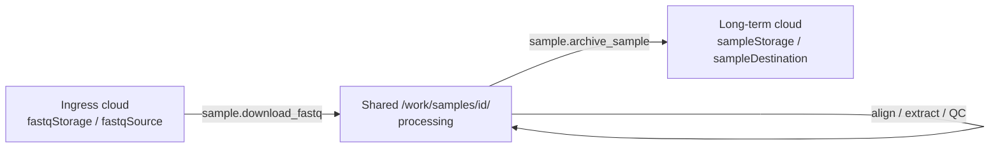

A sample is **not** a blob row in `cfg`/`wf`. It is an **ID + directory on shared storage**, referenced by study groups through CSV lists. Cloud locations are **group/study-level defaults** that expand into per-sample prefixes.

### Study → groups → samples

```text
project_*.json
  controls / diseases
    groups[]
      label
      sample_paths: [ ".../data/healthy.csv" ]   ← list files, not cloud URIs
  samples_base_path: "/work/samples"             ← default
```

Each CSV is typically:

```csv
sample
BC-H-001
BC-H-002
```

That resolves to processing dirs:

`/work/samples/BC-H-001/`, `/work/samples/BC-H-002/`, …

So the study owns **which samples belong to which group**; membership is the CSV, not `portal.Samples` (that table is portal/clinical UI only).

### Three locations (same samples, different roles)



| Phase | Config object | Typical content |
|-------|---------------|-----------------|
| **Ingress** (lab FASTQ) | Study/instance `fastqStorage` → per-sample `fastqSource` | S3/Azure/GCS/file + credentials + `prefix` |
| **Processing** | `sampleDir` = `/work/samples/{sampleId}/` | FASTQ, BAM (transient), `*.h5`, QC JSON, logs |
| **Archive** (long-term) | `sampleStorage` / `h5Storage` → `sampleDestination` | Upload QC ± FASTQ ± H5 after disposition |

Workers never invent paths from env; they get typed JSON on the task.

### Group-level same location, per-sample prefix

Usually **one endpoint per role for the whole study** (or lab), not per group:

- `fastqStorage`: e.g. `s3://lab-bucket/` with `prefixBase: "plasma/"`
- Planner builds each sample as `prefix = prefixBase + sampleId` → `plasma/BC-H-001/`
- Same pattern for archive `sampleStorage`

Overrides are allowed per sample (`fastqSource` already set), but the common case is: **shared endpoint + sampleId as folder**.

### How this maps to `cfg`

| Registry | Role |
|----------|------|
| `cfg.storage_endpoint` | Named location (bucket/account/…), no secrets on `/work` |
| `cfg.credential` | Keys / SAS / etc. |
| `cfg.storage_profile` | Pairs endpoints: `fastqStorageEndpoint` + `sampleStorageEndpoint` |
| `cfg.study` | Manifest with groups + CSV paths; references a storage profile by name |

At schedule time: `expand_storage_profile` / `expand_storage_endpoint` → today’s `fastqStorage` / `sampleStorage` wire format → planner stamps every sample in `context_json.samples[]`.

### What lives under `/work/samples/{id}/`

Processing workspace for that ID: staged FASTQs, alignment products, chromosome `*.h5`, extraction/QC JSON, prep log. Science workflows (centroid/detector/…) read those H5s via the study’s resolved sample dirs.

**Short version:** groups hold **lists of sample IDs**; each ID has one **processing home** on shared storage; ingress and archive are **named cloud endpoints** (usually one per study/lab) with per-sample prefixes—not separate DB sample blobs.