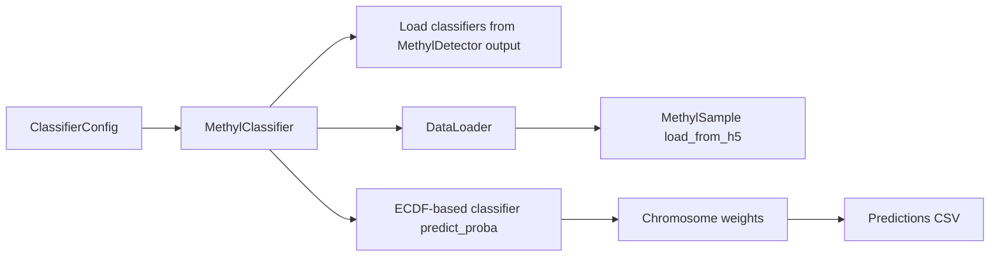

# MethylClassifier Implementation (MethylUtils)

This document describes how MethylClassifier is implemented: it loads models produced by **MethylDetector** (which uses MethylUtils for ECDF-based training) and uses MethylUtils for data loading and, internally, for the classifier objects stored in those models.

## Architecture Overview

- **MethylDetector** (with MethylUtils) trains per-chromosome **ECDF-based** classifiers (using centroid binned_stats and ECDF view), saves them as pickle files (e.g. `classifier-1.pkl`, `classifier-2.pkl`), and stores metadata (contexts, DMP positions, chromosome weights).
- **MethylClassifier** loads those pickles, collects DMP positions, loads sample methylation at those positions (via MethylUtils and its own DataLoader), and runs prediction by calling the stored classifier(s) and combining per-chromosome probabilities with chromosome weights.

## Loading Models

- **Single file** (`model_path`): One pickle file (e.g. `classifier-1-CG.pkl`) containing a classifier bundle. MethylClassifier loads it and uses a single ECDF-based classifier (from MethylUtils) for that chromosome/context.
- **Directory** (`model_dir`): Multi-chromosome mode. MethylClassifier loads all `classifier-{chrom}.pkl` files from the directory, builds a map of chromosome → classifier, and computes **chromosome weights**:
  - **effect_size** (default): Trimmed mean of effect_size per chromosome from the saved DMP metadata.
  - **config**: Predefined weights from config (`chromosome_weights`).
  - **linear_fitted** / **logistic_fitted** / **elasticnet_fitted**: Weights fitted from validation data (per-chromosome probabilities and labels) when centroid validation is used.

The classifier objects inside the pickle use **ECDF-based prediction** (MethylUtils ECDF view / log_probability_sample_given_centroid with mode=ecdf); MethylClassifier calls their `.predict_proba()`, `.predict()`, and optionally `.predict_proba_calibrated()` or `.predict_with_threshold()`.

## MethylUtils Usage

| Component | Use in MethylClassifier |
|-----------|--------------------------|
| **Classifier (in pickle)** | ECDF-based; stored by MethylDetector. MethylClassifier loads and calls `.predict_proba()`, `.predict()`, `.predict_proba_calibrated()`, `.predict_with_threshold()`. |
| **MethylSample / load_from_h5** | DataLoader uses these to load sample HDF5 files and extract methylation at DMP positions. |
| **Multi-class builder** | The multiclass builder currently remains a legacy compatibility path and is separate from the canonical ECDF binary-comparison workflow documented here. |
| **load_project** | Used when resolving config from a pipeline project (e.g. CLI `--project`). |

## Context Handling

Contexts (CG, CHG, CHH) are **not** set in MethylClassifier config; they are determined by the **model** that was trained by MethylDetector.

- MethylDetector’s config has **contexts** (e.g. `["CG"]` or `["CG","CHG","CHH"]`). The detector trains on DMPs from those contexts and stores `contexts` in the saved model metadata.
- MethylClassifier reads **model_contexts** from the loaded model(s) (see `model_contexts` property in [classifier.py](packages/methylclassifier/methyl_classifier/core/classifier.py)) and passes **contexts_to_load** to the DataLoader.
- **CG-only model**: `contexts_to_load = ['CG']` → only `{chrom}-CG.h5` files are loaded; CHG/CHH are skipped.
- **Multi-context model**: `contexts_to_load = ['CG','CHG','CHH']` → all three context files are loaded per chromosome and merged (union of positions, with context-specific DMPs). Sample directories must contain the corresponding `{chrom}-CG.h5`, `{chrom}-CHG.h5`, `{chrom}-CHH.h5` for each chromosome.

This ensures that inference uses the same contexts as training.

## Data Flow

1. **Config**: `model_dir` or `model_path`, `input_path` or `samples`, and optional validation/weight/calibration options.
2. **Load classifiers**: From directory or single file; build DMP position list (and optional DataFrame) from saved metadata.
3. **Chromosome weights**: Compute or load from config (effect_size, config, or fitted).
4. **Load samples**: For each sample path, DataLoader loads HDF5 per chromosome and context (according to `contexts_to_load`), merges contexts when multiple, and extracts methylation at the DMP positions required by each chromosome’s classifier.
5. **Predict**:
   - Single-file / single-chromosome models call the stored classifier directly.
   - Multi-chromosome models build one feature matrix per chromosome, run `predict_proba` once per chromosome (`_compute_per_chromosome_probas`, tqdm when >1 chromosome), then combine with `_combine_chromosome_probabilities(..., cached_per_chrom_probas=...)` so weight-fitting does not re-run ECDF. Sample HDF5 data is loaded once in `load_samples_from_list`; only inference was previously duplicated.
   - Direct `MethylClassifier.predict_proba()` in multi-chromosome mode now expects a concatenated feature matrix in sorted chromosome order and slices it back into chromosome-specific blocks internally.
6. **Output**: Predictions and probabilities written to CSV (and optional validation report if centroid validation paths are provided). For multi-chromosome runs, `dmps_used` / `dmps_total` reflect the full concatenated DMP set across all chromosomes.

## Sample Skips And Validation Labels

`DataLoader.load_samples_from_list()` can skip invalid samples (missing chromosomes, empty merged samples, unreadable input). The classifier CLI now keeps the original input indices for successfully loaded samples and realigns `expected_classes` to that filtered set before writing `predictions.csv`. This prevents downstream metrics from drifting when one or more inputs are skipped.

## Summary

| Layer | Component | Role |
|-------|-----------|------|
| MethylDetector | Trains and saves classifiers | Produces classifier-{chrom}.pkl and metadata (contexts, DMPs, effect_size); ECDF-based. |
| MethylUtils | ECDF-based classifier | Stored in pickle; used for predict_proba / predict (ECDF likelihoods). |
| MethylUtils | MethylSample, load_from_h5 | DataLoader loads sample data at DMP positions. |
| MethylClassifier | MethylClassifier (class) | Loads models, manages chromosome weights, orchestrates DataLoader and per-chromosome prediction, combines and writes results. |

For theoretical background, see [THEORY.md](THEORY.md) and the canonical theory book at [../../../docs/theory/README.md](../../../docs/theory/README.md). For running with Docker/venv, contexts, and improving balanced accuracy, see [USAGE.md](USAGE.md).
