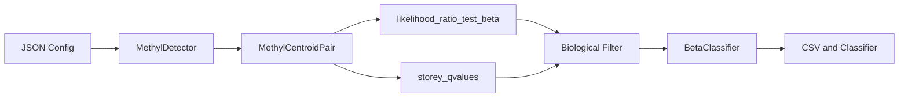

# MethylDetector Implementation (MethylUtils)

This document describes how MethylDetector is implemented on top of **MethylUtils**: centroid comparison, statistics, filtering, and classifier training.

## Architecture Overview

- **MethylUtils** provides centroid comparison (MethylCentroidPair), LRT and q-values (statistical_tests), Bhattacharyya metrics, GPU/memory utilities, and classifier training (BetaClassifier, BetaBinomialClassifier).
- **MethylDetector** provides the pipeline: config, per-chromosome/per-context orchestration, filtering, validation, and exports; it delegates all centroid math and statistics to MethylUtils.

## MethylCentroidPair (methyl_utils)

MethylDetector uses **MethylCentroidPair** for all centroid-to-centroid comparison and derived metrics.

### load_and_align

- **Signature**: `MethylCentroidPair.load_and_align(centroid1_path, centroid2_path, min_coverage=...)`
- **Returns**: `(centroid1, centroid2, common_positions)` — aligned centroids and the common position set.
- **Role**: Loads centroid HDF5 files (e.g. from MethylCentroid output), aligns to common positions, and applies minimum coverage. MethylDetector calls this per context before comparison.

### compare_centroids

- **Signature**: `centroid_pair.compare_centroids(centroid1, centroid2)` where `centroid_pair = MethylCentroidPair(min_coverage=..., delta_mean_mode=..., overlap_mode=..., distribution=...)`.
- **Returns**: Structured array / DataFrame with per-position columns: `p_value`, `q_value`, `alpha1`, `beta1`, `alpha2`, `beta2`, `mean1`, `mean2`, `delta_mean`, `bhattacharyya`, `effect_size`, `n1`, `n2`, `variance1`, `variance2`, etc.
- **Implementation**: Uses MethylUtils `likelihood_ratio_test_beta` for p-values and `storey_qvalues` for q-values. Computes Bhattacharyya distance (and thus overlap BC = exp(-BD)), effect_size, and other metrics inside MethylCentroidPair. MethylDetector does **not** recompute effect_size or overlap; it uses the columns from this comparison.

### validate_centroid_parameters

- **Signature**: `MethylCentroidPair.validate_centroid_parameters(centroid1, centroid2)`.
- **Role**: Pre-check that centroid parameters (e.g. Beta MLEs) are valid before running the full pipeline. MethylDetector calls this at the start of a run.

### extract_methylation_fractions

- **Signature**: `MethylCentroidPair.extract_methylation_fractions(...)` (with validation sample paths and centroid alignment).
- **Role**: Extracts methylation fractions for validation samples at centroid positions. Used when validation_mode is "real" and real sample paths are provided.

### Other MethylCentroidPair usage

- **load_binned_counts_from_centroids**: Used when binned counts are needed (e.g. for refinement).
- **resolve_validation_samples**: Resolves which samples to use for validation from config or centroid metadata.
- **compute_effect_sizes**: Fallback if effect_size is missing on a chunk; MethylDetector prefers using the effect_size column from compare_centroids.

## MethylUtils Modules Used

| Module / symbol | Use in MethylDetector |
|-----------------|------------------------|
| `methyl_centroid_pair` (MethylCentroidPair) | load_and_align, compare_centroids, validate_centroid_parameters, extract_methylation_fractions, effect_size, bhattacharyya |
| `statistical_tests` | `likelihood_ratio_test_beta`, `storey_qvalues` (via MethylCentroidPair) |
| `metrics_core` | `compute_bhattacharyya_distance` (used where needed) |
| `gpu_detection` | GPU availability and device selection |
| `memory_manager` | GPUConfig for memory management and cleanup |
| `core.methyl_frame` | MethylSample (validation samples) |
| `core.methyl_mixture_centroid` | MethylBetaMixtureCentroid (BMM refinement when enabled) |
| Optional | `compute_eat_T` (EAT transformation when enabled) |
| Classifiers | BetaClassifier, BetaBinomialClassifier for training and validation |

## Data Flow

1. **Config** — Chromosome(s), contexts, centroid1_dir, centroid2_dir, output_dir, alpha, biological filters (min_delta_mean, max_bc, min_effect_size), validation and classifier options.
2. **Per context** — For each (chromosome, context), build paths to `{chrom}-{context}.h5` for both centroids.
3. **Load and align** — `MethylCentroidPair.load_and_align(c1_path, c2_path, min_coverage)`.
4. **Compare** — `MethylCentroidPair(..., delta_mean_mode, overlap_mode, distribution).compare_centroids(centroid1, centroid2)` → table with p_value, q_value, effect_size, overlap, etc.
5. **Statistical filter** — Keep rows with `q_value <= alpha`.
6. **Biological filter** — Apply min_delta_mean, max_overlap (BC), min_effect_size (AND). effect_size and overlap come from MethylCentroidPair; MethylDetector does not recompute them.
7. **DMP selection** — Optional binary search / ranking by effect_size to meet target_balanced_accuracy; export DMP list (e.g. dmps-{chrom}-biological-sorted.csv).
8. **Classifier training** — MethylDetector uses MethylUtils **BetaClassifier** and **BetaBinomialClassifier** to train on selected DMPs and validate (real or synthetic samples).
9. **Outputs** — CSV(s), summary, classifier artifact path, optional BMM centroid files when BMM refinement is enabled.

## Classifier Training

MethylDetector does not implement classifier math; it uses MethylUtils:

- **BetaClassifier**: Training and prediction on DMP positions; comparison and overlap use **ECDF only** (centroids must have binned_stats).
- Validation metrics (e.g. Balanced Accuracy) are computed from classifier predictions on validation samples whose methylation fractions are extracted via MethylCentroidPair.

## Summary

| Layer | Component | Role |
|-------|-----------|------|
| MethylUtils | MethylCentroidPair | load_and_align, compare_centroids (LRT, q-values, effect_size, overlap), validate_centroid_parameters, extract_methylation_fractions |
| MethylUtils | statistical_tests | likelihood_ratio_test_beta, storey_qvalues |
| MethylUtils | BetaClassifier / BetaBinomialClassifier | Train and validate classifier on DMPs |
| MethylUtils | GPUConfig, gpu_detection, memory_manager | GPU and memory handling |
| MethylDetector | MethylDetector (class) | Config, per-chromosome/per-context loop, filtering, DMP selection, classifier invocation, exports |

For theoretical background (distributions, LRT, q-values, effect_size, overlap), see [MethylDetector_Theoretical_Foundation.md](MethylDetector_Theoretical_Foundation.md).
