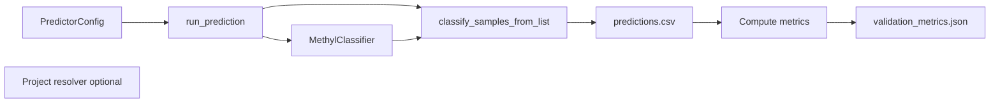

# MethylPredictor Implementation (MethylClassifier and MethylUtils)

This document describes how MethylPredictor is implemented: it uses **MethylClassifier** to run prediction on test sample sets, then either **evaluates** predictions against known labels (**labeled** mode) or reports **blind** probabilities and summaries when no labels are provided (**blind** mode via `predictor.blind` / `test_blind_paths`).

## Architecture Overview

- **MethylPredictor** does not train or implement a classifier. It loads a **MethylClassifier**, runs it on labeled cohorts (control + disease, multiclass groups, or CLI lists) or on **blind** paths only, then writes **prediction_report.json** with **`mode": "labeled"`** or **`"blind"`**.
- **MethylClassifier** (and its dependency MethylUtils) handles model loading, DMP-based feature extraction, and prediction. MethylPredictor only orchestrates the run and post-processes the results.

## Data Flow

1. **Config**: PredictorConfig with `model_path` or `model_dir`, `output_dir`, and either **labeled** cohorts (nested **`controls` / `diseases`**, flat paths, or `test_group_paths`) or **`blind`** / **`test_blind_paths`** only (mutually exclusive). Project resolution merges predictor sides with top-level project cohorts when groups are empty; **`predictor.blind`** is handled before labeled paths and, on comparison projects, yields a single run under **`predictors/blind/`** with an explicit model path or multiclass PKL.
2. **Path resolution once**: **`_prepare_predictor_paths_and_mode`** expands either blind nested JSON into **`test_blind_paths`** + lineage, or labeled nested/flat paths—never both in one run—and returns **`labeled`** vs **`blind`**. That mode threads through sample-list construction, reporting, and console output; it does not trigger a second classification pass.
3. **Load classifier**: MethylPredictor builds a ClassifierConfig (model_path/model_dir, temperature, calibration, etc.) and instantiates **MethylClassifier**. So the same multi-chromosome or single-file model loading as in MethylClassifier is used.
4. **Test sample list**: From resolved paths: labeled binary: `samples_list = test_control_paths + test_disease_paths`, `expected_classes = [0]*n_control + [1]*n_disease`. **Blind**: `samples_list = test_blind_paths`, `expected_classes = None`. Multiclass labeled: paths from `test_group_paths` with class index expectations. **`sample_lineage`** uses `side` ∈ `{control, disease, blind, multiclass}` for **`prediction_report.json`** grouping.
5. **Classification** (single pass): **classify_samples_from_list** with `expected_classes` or `None`, same DMP-based loading as elsewhere. Skipped samples are dropped from the CSV; labeled runs realign expected classes to loaded rows.
6. **Post-process by mode**: If `expected_class` is in the CSV, compute sklearn metrics and write **validation_metrics.json**. **Blind** runs skip metrics and build **`blind_summary`** (predicted class counts, mean probability per class, mean entropy) for **prediction_report.json**.
7. **Output**: **prediction_report.json** always includes **`mode`**, **`class_names`**, and cohort-specific blocks; blind runs add per-sample **`probabilities`**, **`predicted_subgroup`**, **`max_probability`**, **`entropy`**. Return the metrics dict when labeled, else a small summary dict.

## MethylClassifier and MethylUtils Usage

| Component | Use in MethylPredictor |
|-----------|-------------------------|
| **MethylClassifier** | Loaded from model_dir or model_path; used only for prediction on the test sample list. |
| **ClassifierConfig** | Built with model_path/model_dir, temperature, calibration, trimmed percentiles; no input_path (samples come from test_control_paths + test_disease_paths). |
| **classify_samples_from_list** | Called with classifier, samples_list, output_file=predictions_csv, required_chromosomes, dmp_positions_by_chrom, expected_classes. This is the same entry point MethylClassifier CLI uses for batch classification. |
| **methyl_utils.load_project** | Used with --project to resolve `step_config.predictor.controls` / `.diseases` / `.blind`, merge labeled sides with root cohorts, and resolve blind-only comparison runs. |

MethylPredictor does not call MethylUtils for metrics; it uses **sklearn.metrics** for all classification metrics.

## Output Files

- **validation_metrics.json**: Present only for **labeled** runs; same schema as before (sklearn-based).
- **predictions.csv**: One row per scored sample; **`expected_class`** only when labels were passed to the classifier helper.
- **prediction_report.json**: **`mode": "labeled"`** or **`"blind"`**; blind branch includes **`blind_summary`** and rich per-sample probability fields under **`blind.groups[].samples`**.

## Accuracy Metrics (Summary)

For **binary** (control vs disease):

- **accuracy**, **balanced_accuracy**
- **sensitivity** (recall class 1, disease)
- **specificity** (recall class 0, control)
- **precision_binary**, **recall_binary**, **f1_binary** (positive class = disease)
- **confusion_matrix** (2×2)
- **per_class**: for each class, precision, recall, f1, support

For **multiclass**, the same structure with more classes; sensitivity/specificity are not defined; macro and weighted F1 are reported.

### Multiclass OvR ECDF (`classifier_type: ecdf_one_vs_rest`)

Some multiclass models are stored as **K binary ECDF** sub-models (one-vs-rest), not as a single K-way softmax head. **MethylClassifier** loads these bundles, builds a **union DMP table** (unique `(chromosome, position)` rows, stable sort), loads each sample **once** against that union, slices columns per binary model, runs each `ECDFClassifier.predict_proba` → `(n, 2)`, then fuses to `(n, K)` with **logits** `log P(class‑k positive) − log P(class‑k negative)` and a **softmax** over the K logits (see `methyl_classifier.core.multiclass_ovr.fuse_ovr_binary_probas`). MethylPredictor behavior is unchanged aside from console messaging (sub-model count, union DMP count, note that HDF5 is touched only during sample loading).

**Evaluation with distinct control arms:** for K > 2 with multiple labeled cohorts, use **`test_group_paths`** (list of `{label, paths}`) so each subgroup gets a distinct `expected_class` index aligned with training class order / `class_names`. Flat `test_control_paths` + `test_disease_paths` is a **binary** contract and does not encode more than two buckets.

For the full list and how to run MethylPredictor (Docker, venv, test sets), see [USAGE.md](USAGE.md).
