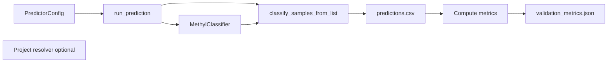

# MethylPredictor Implementation (MethylClassifier and MethylUtils)

This document describes how MethylPredictor is implemented: it uses **MethylClassifier** to run prediction on test sample sets, then either **evaluates** predictions against known labels (**labeled** mode) or reports **blind** probabilities and summaries when no labels are provided (**blind** mode via `predictor.blind` / `test_blind_paths`).

## Architecture Overview

- **MethylPredictor** does not train or implement a classifier. It loads a **MethylClassifier**, runs it on labeled cohorts (control + disease, multiclass groups, or CLI lists) or on **blind** paths only, then writes **prediction_report.json** with **`mode": "labeled"`** or **`"blind"`**.
- **MethylClassifier** (and its dependency MethylUtils) handles model loading and posterior scoring. For classic ECDF/tabular flows prediction is DMP-loader based; for `classifier_type: ecdf_aggregated_one_vs_rest`, Predictor builds observed-hybrid aggregated features before scoring.
- Aggregated observed-hybrid feature construction is shared with methylvalidation (`methyl_validation.observed_feature_builder`) to keep training/inference feature parity for `feature_family_set` contracts.

## Data Flow

1. **Config**: PredictorConfig with `model_path` or `model_dir`, `output_dir`, and either **labeled** cohorts (nested **`controls` / `diseases`**, flat paths, or `test_group_paths`) or **`blind`** / **`test_blind_paths`** only (mutually exclusive). Project resolution merges predictor sides with top-level project cohorts when groups are empty; **`predictor.blind`** is handled before labeled paths and, on comparison projects, yields a single run under **`predictors/blind/`** with an explicit model path or multiclass PKL.
2. **Path resolution once**: **`_prepare_predictor_paths_and_mode`** expands either blind nested JSON into **`test_blind_paths`** + lineage, or labeled nested/flat paths—never both in one run—and returns **`labeled`** vs **`blind`**. That mode threads through sample-list construction, reporting, and console output; it does not trigger a second classification pass.
3. **Load classifier**: MethylPredictor builds a **ClassifierConfig** from `model_path`/`model_dir` and merges **`classifier_step_snapshot`** (copied from profile `actionConfig.classifier` by the project resolver): `temperature`, `use_isotonic_calibration`, `weight_method`, stacking flags, etc., so inference matches the training project. **`model_path`** to a **saved** PKL (post–MethylClassifier `save` / `--export-ovr-pkl`) loads **one** aggregated artifact (OvR dict or pickled multi-chromosome bundle). **`model_dir`** reloads **every** per-chromosome detector pickle each run — correct but heavier; prefer **`model_path`** when the classifier step has already written **`save_classifier_path`**.
4. **Test sample list**: From resolved paths: labeled binary: `samples_list = test_control_paths + test_disease_paths`, `expected_classes = [0]*n_control + [1]*n_disease`, unless **train/holdout** lists are set (`train_*` + `holdout_*` paths), in which case samples and parallel **`evaluation_split`** tags are concatenated in train-then-holdout order. **Blind**: `samples_list = test_blind_paths`, `expected_classes = None`. Multiclass labeled: paths from `test_group_paths`, or from **`train_group_paths` + `holdout_group_paths`** when holdout groups are configured. **`sample_lineage`** uses `side` ∈ `{control, disease, blind, multiclass}` and may add **`evaluation_split`** ∈ `{training, holdout}`.
5. **Classification** (single pass): either **classify_samples_from_list** (DMP-based models) or the aggregated-feature branch for `ecdf_aggregated_one_vs_rest` (observed-hybrid feature build + OvR scoring). Skipped samples are dropped from the CSV for DMP loaders; aggregated mode writes one row per input sample.
6. **Post-process by mode**: If `expected_class` is in the CSV, compute sklearn metrics and write **validation_metrics.json** with **`evaluation_semantics`** (`undifferentiated` vs `train_holdout`) and optional nested **`training_metrics` / `holdout_metrics`**. Undifferentiated labeled runs emit a **UserWarning**. **Blind** runs skip metrics and build **`blind_summary`** (predicted class counts, mean probability per class, mean entropy) for **prediction_report.json**.
7. **Output**: **prediction_report.json** always includes **`mode`**, **`class_names`**, and cohort-specific blocks; blind runs add per-sample **`probabilities`**, **`predicted_subgroup`**, **`max_probability`**, **`entropy`**. When the project defines **`cohort_hierarchy`** (e.g. disease type → stages), **`hierarchy_summary`** adds mean probabilities by class, pooled controls, and by disease family. Return the metrics dict when labeled, else a small summary dict.

## MethylClassifier and MethylUtils Usage

| Component | Use in MethylPredictor |
|-----------|-------------------------|
| **MethylClassifier** | Loaded from **`model_path`** (one saved PKL, recommended) or **`model_dir`** (folder of per-chromosome pickles); used only for prediction on the test sample list. |
| **ClassifierConfig** | Built with model_path/model_dir plus optional **classifier_step_snapshot** fields merged from profile `actionConfig.classifier` when resolving from `--project`. |
| **classify_samples_from_list** | Called with classifier, samples_list, output_file=predictions_csv, required_chromosomes, dmp_positions_by_chrom, expected_classes. This is the same entry point MethylClassifier CLI uses for batch classification. |
| **methyl_utils.load_project** | Used with --project to resolve profile `actionConfig.predictor.controls` / `.diseases` / `.blind`, merge labeled sides with root cohorts, and resolve blind-only comparison runs. |

MethylPredictor does not call MethylUtils for metrics; it uses **sklearn.metrics** for all classification metrics.

## Output Files

- **validation_metrics.json**: Present only for **labeled** runs; same schema as before (sklearn-based).
- **predictions.csv**: One row per scored sample; **`expected_class`** only when labels were passed to the classifier helper.
- **prediction_report.json**: **`mode": "labeled"`** or **`"blind"`**; blind branch includes **`blind_summary`** and rich per-sample probability fields under **`blind.groups[].samples`**.
- Aggregated ECDF runs also include `evidence_class*` columns in `predictions.csv` for interpretability diagnostics.
- `evidence_class*` values are pre-softmax OvR evidence diagnostics and are not calibrated probabilities or p-values.

## Accuracy Metrics (Summary)

For **binary** (control vs disease):

- **accuracy**, **balanced_accuracy**
- **sensitivity** (recall class 1, disease)
- **specificity** (recall class 0, control)
- **precision_binary**, **recall_binary**, **f1_binary** (positive class = disease)
- **confusion_matrix** (2×2)
- **per_class**: for each class, precision, recall, f1, support
- **proper-score diagnostics** (when probability columns are present): `nll`, `brier_score`, and `ece` (15-bin expected calibration error)

For **multiclass**, the same structure with more classes; sensitivity/specificity are not defined; macro and weighted F1 are reported.

### Probability Semantics and Calibration Governance

- `validation_metrics.json` now includes a `probability_semantics` block documenting whether Platt/isotonic calibration flags were enabled during inference.
- Proper-score diagnostics (`nll`, `brier_score`, `ece`) are computed from exported `prob_class*` columns, so reliability can be monitored alongside discrimination.
- Calibration remains an optional post-hoc layer; core posterior semantics are preserved in classifier metadata and output reporting.
- Aggregated ECDF `evidence_class*` columns are pre-softmax OvR evidence diagnostics and should not be interpreted as p-values.

### Multiclass OvR ECDF (`classifier_type: ecdf_one_vs_rest`)

Some multiclass models are stored as **K** one-vs-rest **heads** (not a single K-way softmax). Each head is either a single `ECDFClassifier`, a **multi-chromosome** expert (`chrom_classifiers`), or a **control aggregate** marker (`control_pairwise_geometric`) that combines several pairwise control-vs-disease heads’ P(control) before fusion. **MethylClassifier** builds a **union DMP table** (unique `(chromosome, position)` rows, stable sort), loads each sample **once** against that union, slices columns per head, obtains `(n, 2)` per head, then fuses to `(n, K)` (see `methyl_classifier.core.multiclass_ovr.fuse_ovr_binary_probas`). **Default** for bundles with a control aggregate: **pairwise max-contrast** — disease logits come from pairwises only; the control logit is `−max` of those logits so the aggregate head is not softmaxed alongside the same pairwises (which double-counted control and biased toward class 0). Package metadata **`ovr_fuse_mode`**: `"pairwise_max_contrast"` (default when the first head is the aggregate) or `"flat"` for the legacy single-softmax over all heads. Heads with **no usable features** for a sample emit **NaN** probas (not `(0.5, 0.5)`); fusion **drops** those heads. If **every** head lacks evidence, fused probabilities are the **uniform** `1/K` — the honest blind outcome — rather than an arbitrary argmax tie on fake logits. MethylPredictor behavior is unchanged aside from console messaging (union DMP count, HDF5 only during sample loading).

**Evaluation with distinct control arms:** for K > 2 with multiple labeled cohorts, use **`test_group_paths`** (list of `{label, paths}`) so each subgroup gets a distinct `expected_class` index aligned with training class order / `class_names`. Flat `test_control_paths` + `test_disease_paths` is a **binary** contract and does not encode more than two buckets.

For the full list and how to run MethylPredictor (Docker, venv, test sets), see [USAGE.md](USAGE.md).
