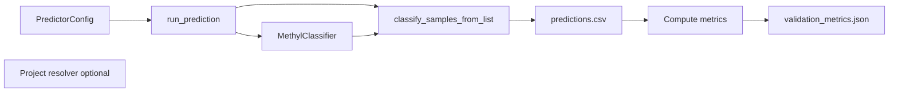

# MethylPredictor Implementation (MethylClassifier and MethylUtils)

This document describes how MethylPredictor is implemented: it uses **MethylClassifier** to run prediction on test sample sets and then computes metrics from the predictions and known labels.

## Architecture Overview

- **MethylPredictor** does not train or implement a classifier. It loads a **MethylClassifier** (from model_dir or model_path), runs it on two lists of sample paths (control and disease), and compares predictions to the expected labels (control → 0, disease → 1).
- **MethylClassifier** (and its dependency MethylUtils) handles model loading, DMP-based feature extraction, and prediction. MethylPredictor only orchestrates the run and post-processes the results.

## Data Flow

1. **Config**: PredictorConfig with `model_path` or `model_dir`, `output_dir`, `test_control_paths`, `test_disease_paths` (and optional path_remap, debug). Config can come from CLI, a JSON config file, or project resolution (step_config.predictor).
2. **Load classifier**: MethylPredictor builds a ClassifierConfig (model_path/model_dir, temperature, calibration, etc.) and instantiates **MethylClassifier**. So the same multi-chromosome or single-file model loading as in MethylClassifier is used.
3. **Test sample list**: `samples_list = test_control_paths + test_disease_paths`, with `expected_classes = [0]*len(test_control_paths) + [1]*len(test_disease_paths)`.
4. **Classification**: MethylPredictor calls MethylClassifier’s **classify_samples_from_list** with that list and expected_classes, using the same DMP-based loading (required_chromosomes, dmp_positions_by_chrom) so only classifier chromosomes and DMP positions are read. Output is written to **predictions.csv** (with columns including expected_class and prediction).
5. **Metrics**: Read predictions.csv, extract y_true (expected_class) and y_pred (prediction). Compute metrics via **sklearn.metrics**: accuracy_score, balanced_accuracy_score, confusion_matrix, precision_recall_fscore_support. Build a dict with accuracy, balanced_accuracy, confusion_matrix, per_class (precision, recall, f1, support), macro_precision/recall/f1, weighted_f1, and for binary: sensitivity, specificity, precision_binary, recall_binary, f1_binary.
6. **Output**: Print a short summary to console, write **validation_metrics.json** and keep **predictions.csv** in output_dir. Return the metrics dict for programmatic use (e.g. Monte Carlo aggregation).

## MethylClassifier and MethylUtils Usage

| Component | Use in MethylPredictor |
|-----------|-------------------------|
| **MethylClassifier** | Loaded from model_dir or model_path; used only for prediction on the test sample list. |
| **ClassifierConfig** | Built with model_path/model_dir, temperature, calibration, trimmed percentiles; no input_path (samples come from test_control_paths + test_disease_paths). |
| **classify_samples_from_list** | Called with classifier, samples_list, output_file=predictions_csv, required_chromosomes, dmp_positions_by_chrom, expected_classes. This is the same entry point MethylClassifier CLI uses for batch classification. |
| **methyl_utils.load_project** | Used when running with --project to resolve project and step_config.predictor (test_control_paths, test_disease_paths, model_dir, output_dir). |

MethylPredictor does not call MethylUtils for metrics; it uses **sklearn.metrics** for all classification metrics.

## Output Files

- **validation_metrics.json**: JSON-serializable dict with all metrics (accuracy, balanced_accuracy, confusion_matrix, n_samples, n_classes, class_names, per_class, macro_*, weighted_f1, and for binary sensitivity, specificity, etc.).
- **predictions.csv**: One row per test sample; columns include sample identifier, expected_class (0 or 1), prediction, probabilities, and any other columns produced by MethylClassifier’s classification output.

## Accuracy Metrics (Summary)

For **binary** (control vs disease):

- **accuracy**, **balanced_accuracy**
- **sensitivity** (recall class 1, disease)
- **specificity** (recall class 0, control)
- **precision_binary**, **recall_binary**, **f1_binary** (positive class = disease)
- **confusion_matrix** (2×2)
- **per_class**: for each class, precision, recall, f1, support

For **multiclass**, the same structure with more classes; sensitivity/specificity are not defined; macro and weighted F1 are reported.

For the full list and how to run MethylPredictor (Docker, venv, test sets), see [USAGE.md](USAGE.md).
