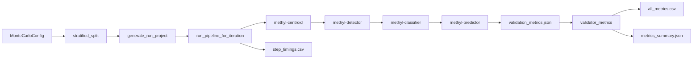

# MethylValidation Implementation

**Related documentation:** [MethylValidation Theoretical Foundation](MethylValidation_Theoretical_Foundation.md), [Usage (Docker and venv)](USAGE.md), [MethylPredictor USAGE](../../methylpredictor/docs/USAGE.md) (metric definitions).

This document describes how MethylValidation is implemented: it orchestrates stratified splits, per-iteration project generation, subprocess pipeline runs, and aggregation of MethylPredictor metrics and step timings.

## Architecture overview

MethylValidation does not run centroid, detection, classification, or prediction logic itself. It:

1. Loads a Monte Carlo config and resolves sample paths from healthy/disease CSVs.
2. For each iteration: performs a stratified train/val split, generates a run-specific project and CSVs, runs the four pipeline steps via subprocess, reads `validation_metrics.json` from the predictor output, and records step timings (with n_train_samples, n_val_samples).
3. Aggregates all collected metrics into `all_metrics.csv` and `metrics_summary.json`, and writes `step_timings.csv` (and optionally `resource_summary.json`).

## MethylUtils usage

MethylValidation uses **MethylUtils** only for project loading:

- **load_project(base_project)** — To read `project_name` and project structure so that run directories are created under `output_base/project_name/monte_carlo_runs/run_0001`, etc.
- **load_project(project_path)** — Per run, to resolve the predictor output directory (e.g. from comparisons: `run_dir/predictors/control_group/disease_group`).

Sample path resolution is done locally in MethylValidation ([split.py](../methyl_validation/split.py): `load_and_resolve_sample_paths`). The actual validation metrics are produced by **MethylPredictor** (which uses MethylClassifier and MethylUtils internally); MethylValidation only reads the written `validation_metrics.json`.

## Modules

| Module | Role |
|--------|------|
| **config.py** | `MonteCarloConfig` — samples_base_path, healthy_csv, disease_csv, train_fraction, n_iterations, seed, base_project, output_base, path_remap, abort_on_step_failure. |
| **split.py** | `load_and_resolve_sample_paths(csv_path, base_path)` — load sample names from CSV, resolve with base path; `stratified_split(control_paths, disease_paths, train_fraction, seed)` — stratified train/val split. |
| **project_gen.py** | `generate_run_project(...)` — write train_control.csv, train_disease.csv, val_control.csv, val_disease.csv and run-specific project.json (override output_base, project_name, control/disease sample_paths to train CSVs, comparisons). |
| **pipeline_runner.py** | `run_centroid`, `run_detector`, `run_classifier`, `run_predictor` — subprocess calls to CLI tools; `run_pipeline_for_iteration(...)` — run all four in order, capture stdout/stderr to logs, return step timings (step_name, duration_seconds, return_code). |
| **validator_metrics.py** | `load_metrics_from_json`, `_scalar_metrics_from_dict` (SCALAR_KEYS), `build_metrics_table`, `write_all_metrics_csv`, `compute_summary` (mean, std, min, max, percentiles), `write_summary_json`, `write_step_timings_csv`, and optionally `compute_resource_summary` / `write_resource_summary_json`. |

Current scope note: the validation package is wired for binary Monte Carlo only. Multi-class evaluation is handled by MethylPredictor itself, but Monte Carlo split/project generation in this package still assumes one control CSV and one disease CSV.

## Data flow (CLI)

1. Load config; resolve `project_name` from base project via `load_project(base_project)`.
2. Create `output_base/project_name/monte_carlo_runs/`.
3. Load and resolve control and disease sample paths from CSVs.
4. For i = 1..n_iterations:
   - Stratified split → train_control, train_disease, val_control, val_disease.
   - Generate run project and CSVs in `run_dir = monte_carlo_runs/run_000i`.
   - Run pipeline (centroid → detector → classifier → predictor) with logs and step timings; append timings with run_id, run_dir, n_train_samples, n_val_samples.
   - On success: read `predictor_output_dir/validation_metrics.json`, extract scalar metrics, append row (iteration, run_id, run_dir, …metrics).
5. Build DataFrame from rows → write `all_metrics.csv`.
6. Compute summary (per-metric mean, std, min, max, percentiles) → write `metrics_summary.json`.
7. Write `step_timings.csv` from all timings; optionally compute and write `resource_summary.json`.

## Output files

| File | Description |
|------|-------------|
| **all_metrics.csv** | One row per successful iteration: iteration, run_id, run_dir, accuracy, balanced_accuracy, sensitivity, specificity, macro_f1, etc. |
| **metrics_summary.json** | Per-metric empirical distribution: mean, std, min, max, count, percentiles (p5, p25, p50, p75, p95). |
| **step_timings.csv** | Per step per run: step_name, duration_seconds, return_code, run_id, run_dir, n_train_samples, n_val_samples. |
| **resource_summary.json** | (Optional) Mean/std duration per step, mean total time per iteration, min/max/mean n_train_samples and n_val_samples. |

For setup (Docker, venv), config reference, and how to use these outputs for metric distributions and processing/storage estimation, see [USAGE.md](USAGE.md).
