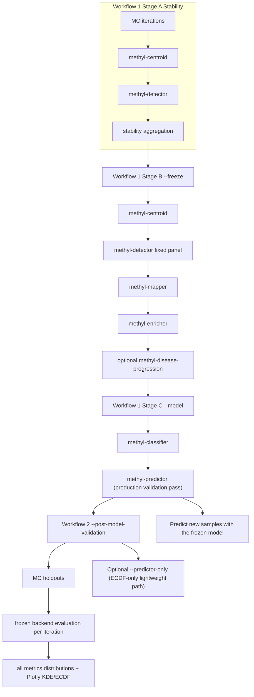

# MethylValidation Usage Guide

## Overview

MethylValidation orchestrates repeated train/validation splits, **methyl-centroid + methyl-detector** per iteration, backend model training/evaluation loops, and production freeze/model build. It supports the staged workflow below:

1. **Stability discovery** (`--stability`) — Identify stable DMPs across many random splits.
2. **Production freeze** (`--freeze`) — Build fixed-panel biological outputs on all data.
3. **Model-selection Monte Carlo** (`--model-mc`) — Full retrain+test MC per backend with isolated backend outputs.
4. **Final model training** (`--select-best-model`) — Select best backend from model-MC summaries and train final production model on all data.
5. **On-demand evaluation/prediction** (`--post-model-validation` / `--predictor-only`) — Optional frozen-model descriptive holdouts or direct prediction use.

Both workflows are controlled by the project configuration file. See the full Quarto documentation at `docs/theory/` for theoretical background and the complete configuration reference.
For production migration policy, see [`ROLLOUT.md`](ROLLOUT.md).

**Distributed / queue workers:** to pre-generate per-iteration task JSON, run `methyl-validation` subcommands `plan-runs` → `export-queue` → `run-task` (per worker) → `aggregate-results`, see [`DISTRIBUTED_QUEUE.md`](DISTRIBUTED_QUEUE.md).

**Hyperparameter search:** objective function over `metrics_summary.json` / optional stability outputs, small-grid driver `methyl-hyperparam-search`, see [`HYPERPARAMETER_SEARCH.md`](HYPERPARAMETER_SEARCH.md).

**Config JSON Schemas:** Pydantic models are the source of truth; committed artifacts live under [`schemas/config/`](../../../schemas/config/) at the repo root. Regenerate after changing any pipeline config model:

```bash
source .venv/bin/activate
methyl-export-config-schemas              # write/update schemas/config/*.json
methyl-export-config-schemas --check      # CI drift gate (exit non-zero if stale)
# or: ./scripts/export_config_schemas.sh
```

Registry and exporter: `methyl_validation.config_schema_registry`, `methyl_validation.schema_export`. Drift is enforced by `packages/methylvalidation/tests/test_config_schema_export.py` (included in `./scripts/run_tests.sh`).

---

## Two Workflows

### Workflow 1: Model Creation

**Purpose:** Build a robust, production-ready classifier by identifying consistently recurring DMPs across random data partitions.

**Steps:**

```bash
# Step 1: Monte Carlo + stability (n_iterations: centroid + detector per split)
methyl-validation --project configs/my_project.json --stability

# Step 2: Production freeze (full pipeline on all data up to mapper/enricher)
methyl-validation --project configs/my_project.json --freeze

# Step 3: Full model-selection MC retraining loop
methyl-validation --project configs/my_project.json --model-mc --model-mc-all

# Step 4: Select best backend and train final production model on all data
methyl-validation --project configs/my_project.json --select-best-model --model-mc-all
```

**Why this workflow?**

- Monte Carlo splits refit centroids and detection on training fractions; **balanced_accuracy** in `all_metrics.csv` comes from **MethylDetector** validation (mean over `result*.json`) unless you use **`--predictor-only`** with a frozen model.
- Stability analysis identifies DMPs that recur in ≥ `stability_dmp_freq` fraction of runs.
- The freeze step prepares the final data using only the stable positions (`fixed_dmp_panel`), bypassing re-discovery, and extracting the valid pathway families (genes).
- **Before `--model`:** run the readiness audit on the directory that contains `monte_carlo_runs/` — see [`STABILITY_FREEZE_READINESS.md`](STABILITY_FREEZE_READINESS.md) (`methyl-stability-freeze-readiness` after `pip install -e packages/methylvalidation`, or `python -m methyl_validation.stability_freeze_readiness` with `PYTHONPATH` set to that package root). Reports are written under **`<project>/readiness/readiness.{json,md}`** by default (use **`--stdout-only`** to skip files). The CLI enables an optional **Grok (xAI)** advisory commentary step by default (credentials via **`GROK_API_KEY`** / MethylMapper’s resolver); opt out with **`--no-grok-review`**, tune **`--grok-*`**, share-safe exports with **`--redact-paths`** — details in that doc.
- **Recommended gate command:** `methyl-validation biological-readiness <project_root>` chains `methyl-enricher verify-complete` -> `methyl-disease-progression --strict-missing` -> `methyl-stability-freeze-readiness`. In this chain, Grok commentary is **off by default** and enabled with `--grok-review`.
- The model-MC step retrains each backend on each split and produces backend-specific metric distributions.
- Final model training uses the selected best backend on all production data.
- Every MC output root now writes `baseline_manifest.json` with split policy, seed policy, cohort sample digests, and metric schema version for reproducibility locking.

**Output:** `monte_carlo_runs/production/classifiers/multiclass-classifier.pkl` is the final production model (created after `--model`).

### Workflow mental model



### Workflow 2: Optional Frozen-Model Evaluation

**Purpose:** Measure descriptive frozen-model performance distributions after final model build (no retraining).

**Prerequisites:** Workflow 1 must have been completed (`production/project.json` must exist).

```bash
methyl-validation --project configs/my_project.json --post-model-validation
```

**Why this workflow?**

- Uses frozen artifacts only (no retraining).
- Supports all model backends.
- Provides empirical distributions for multiple metrics (`balanced_accuracy`, `macro_f1`, `macro_recall`, `screening_sensitivity` / `screening_specificity` for multiclass, etc.).
- Includes proper-score diagnostics when probabilities are available (`nll`, `brier_score`, `ece`) in `validation_metrics.json` and MC aggregates.
- Exports `metrics_distributions_plotly.html` with KDE and ECDF for each metric.
- Uses the same stratified splitting logic as Workflow 1 for consistency.

### Accuracy confirmation vs blind inference

Use this order to keep model-quality evidence valid:

1. Train/evaluate with labeled splits (for example 80% train, 20% test) and Monte Carlo iterations.
2. Select the best backend by labeled metrics (`balanced_accuracy` default).
3. Retrain final production model on all available labeled data (`--select-best-model` -> final production build).
4. Use blind cohorts only after that final build for real-world inference.

Blind predictions are intentionally not used to claim accuracy because they do not include ground-truth labels.

### Recommended backend-selection defaults (PCa)

For prostate cancer stage workflows similar to `Healthy_vs_PCa1-4-CG`, use:

- `--selection-metric balanced_accuracy`
- `--selection-stat median`

Why:

- `balanced_accuracy` is robust to class imbalance across stages/cohorts.
- `median` (p50) is less sensitive to outlier runs than `mean`, so backend ranking is usually more stable in Monte Carlo experiments.

Example:

```bash
methyl-validation --project /work/prostate-cancer/configs/project_Healthy_vs_PCa1-4-CG.json \
  --select-best-model --model-mc-all \
  --selection-metric balanced_accuracy --selection-stat median
```

When to change defaults:

- Use `--selection-stat mean` if you explicitly want to reward occasional high-performing runs and accept higher variance.
- Use `--selection-metric macro_f1` when your primary objective is balanced precision/recall behavior across all classes rather than rank-balanced accuracy.

---

## CLI Flags

### Which steps run (CLI package mapping)

| Mode / Flag | Main steps that run |
|---|---|
| Monte Carlo loop (`methyl-validation` default, optional `--stability`) | Per iteration: `methyl-centroid` + `methyl-detector` |
| `--stability` | Uses the same Monte Carlo loop above, then runs stability aggregation over discovery DMP outputs (`run_stability_analysis`) |
| `--freeze` | `methyl-centroid` + `methyl-detector` (fixed panel) + `methyl-mapper` + `methyl-enricher` + optional `methyl-disease-progression` |
| `--model` (`backend_profiles.ecdf.enabled=true`) | `methyl-classifier` + `methyl-predictor` on frozen `production/project.json`. For aggregated observed-hybrid ECDF, runs `ecdf-aggregated-train` + `ecdf-aggregated-predictor` and skips `ecdf-second-stage`. |
| `--model` (`backend_profiles.tabular_sklearn/generative_hybrid enabled`) | In-process backend flow: model bundle -> train -> predict (consumes freeze outputs; does not re-run `methyl-detector`) |
| `--model-mc` | Full MC retraining per split: centroid -> detector -> backend train/predict; writes isolated results under `model_mc/<backend>/`. With `--model-mc-all`, centroid+detector runs are built once and reused by all backends; reusable runs are linked into shared/backend roots. |
| `--post-model-validation` | MC holdout evaluation on frozen production artifacts (no retraining): `ecdf` uses predictor-only runs, tabular/generative use frozen model inference |
| `--predictor-only` | Monte Carlo iterations where each iteration runs only `methyl-predictor` with frozen artifacts |

| Flag | Description | Main subprocesses / backend path |
|------|-------------|----------------------------------|
| `--project PATH` | Path to the project JSON (preferred; reads `step_config.validation` from the project). | Controls whichever path you select (`--stability`, `--freeze`, `--model-mc`, `--select-best-model`, `--model`, `--post-model-validation`, or `--predictor-only`). |
| `--config PATH` | Path to a standalone Monte Carlo config JSON (alternative to `--project`). | Same as above, but from MC config file mode. |
| `--stability` | Run stability analysis after the MC loop (Workflow 1, Step 1). | MC loop (`methyl-centroid` + `methyl-detector`) then in-process stability aggregation. |
| `--stability-featurecuts` | Enable detector FeatureCuts during MC (`classifier_dmp_selection=featurecuts_validation`) and compute stability from classifier-panel DMP exports. | Detector step override per run + classifier-panel stability aggregation. |
| `--stability-target-ba BA` | In FeatureCuts mode, target balanced accuracy used to pick minimum top-k DMPs by effect size. | Detector FeatureCuts target-BA selection (`target_balanced_accuracy`). |
| `--stability-min-selected-dmps N` | Deprecated alias for `--stability-min-core-dmps` when that flag is unset. | Small guardrail on core classifier panel (`min_core_dmps`). |
| `--stability-min-core-dmps N` | Optional small guardrail on detector k_core after FeatureCuts. | Passed to detector `min_core_dmps`. |
| `--stability-classifier-export-margin-pct P` | Fractional margin above k_core for extended classifier CSV. | Detector `classifier_export_margin_pct` override. |
| `--stability-classifier-export-margin-abs N` | Absolute margin above k_core for extended classifier CSV. | Detector `classifier_export_margin_abs` override. |
| `--stability-classifier-export-max-dmps N` | Per-chromosome cap on extended classifier CSV. | Detector `classifier_export_max_dmps` override. |
| `--stability-gene-featurecuts` | Run methyl-mapper + gene FeatureCuts after detector in each MC iteration; aggregate stable genes from `genes-classifier.csv`. | Optional gene stability path (requires mapper per iteration; no enricher). |
| `--stability-min-selected-genes N` | In gene FeatureCuts mode, enforce minimum selected gene count per run. | Gene FeatureCuts lower bound after k-search. |
| `--skip-centroid` | Reuse existing centroid artifacts and skip centroid recomputation. Works in MC iteration mode and in `--freeze` (detector→mapper→enricher only). | MC loop detector-only on `run_XXXX` artifacts, or freeze runs without `methyl-centroid`. |
| `--skip-detection` | Recompute only stability artifacts from existing `run_XXXX/detections/.../dmps-*.csv` outputs. Requires `--stability`. | Skips MC iteration execution; runs in-process stability aggregation only. |
| `--resume [RUN]` | Resume interrupted MC runs for `--stability` / default MC mode. Without `RUN`, repeats the last existing run and continues to `n_iterations`; with `RUN` (1-based), restarts from that run. | MC loop resume control (run directories `run_0001`, `run_0002`, ...). |
| `--freeze` | Run production freeze using the stable DMP panel, up to enricher (Workflow 1, Step 2). If `step_config.progression.enabled=true`, this also runs `methyl-disease-progression` after enricher. | `methyl-centroid` -> `methyl-detector` (fixed panel) -> `methyl-mapper` -> `methyl-enricher` (+ optional progression). |
| `--model` | Run production model builder after freeze (Workflow 1, Step 3). | `ecdf`: `methyl-classifier` -> `methyl-predictor`; other backends: bundle -> train -> predict. |
| `--model-mc` | Run full backend MC retraining+evaluation loop for model selection. | Per iteration: centroid -> detector -> backend train -> backend predict. |
| `--model-mc-all` | With `--model-mc`, run only enabled backend profiles with isolated outputs while reusing one shared MC run set. | Creates `model_mc/shared/run_XXXX` plus per-enabled-backend folders. |
| `--select-best-model` | Rank backend model-MC summaries and train final production model on all data. | Reads `model_mc/*/metrics_summary.json`, picks best by `--selection-metric`/`--selection-stat`, then runs production model build. |
| `--rollout-compare` + `--baseline-summary` + `--candidate-summary` | Compare dual-run summaries and emit promote/hold recommendation JSON using rollout thresholds from `step_config.validation`. | In-process comparison (no training/inference run). |
| `--selection-metric METRIC` | Metric for backend ranking in `--select-best-model`. | Default: `balanced_accuracy`. |
| `--selection-stat {mean,median}` | Statistic for backend ranking in `--select-best-model`. | Default: `median` (p50). |
| `--post-model-validation` | Run descriptive MC holdout evaluation with frozen production artifacts (no retraining). | `ecdf`: predictor-only evaluation; tabular/generative: in-process frozen model predict. Outputs to `monte_carlo_runs/post_model_validation/`. |
| `--model-backend` / `--post-model-backend` | Override backend used by `--model`, `--model-mc`, or `--post-model-validation`. Backend must be enabled in `step_config.validation.backend_profiles`. | `ecdf` \| `tabular_sklearn` \| `generative_hybrid` |
| `--predictor-only` | Run only `methyl-predictor` per iteration using the frozen model (Workflow 2). | Monte Carlo iterations, predictor only. |
| `--skip-enricher` | Skip the enricher inside MC iterations even when `run_mapper_and_enricher: true`. | Also short-circuits enricher (and therefore progression) in `--freeze`. |
| `--iterations N` | Override `n_iterations` from config. | Affects MC loop count (`--stability` and `--predictor-only`). |
| `--seed S` | Override `seed` from config. | Affects MC split reproducibility. |
| `--output-base DIR` | Override `output_base` from config. | Affects all output roots. |

---

## Setup

### Option 1: Virtual environment (recommended for development)

```bash
cd /path/to/MethylPipeline
source .venv/bin/activate
methyl-validation --project configs/my_project.json --stability
```

### Option 2: Docker container

```bash
cd /path/to/MethylPipeline/docker
docker compose up -d
docker exec -w /workspace methylpipeline \
  methyl-validation --project /workspace/configs/my_project.json --stability
```

Paths in the config must be valid **inside** the container.

---

## Project Config: `step_config.validation`

Rather than a separate Monte Carlo config file, embed the validation settings directly in the project file. Only MC-specific fields are needed here; `samples_base_path`, `output_base`, and the cohort structure are inherited from the top-level project fields.

```json
"step_config": {
  "validation": {
    "train_fraction": 0.8,
    "n_iterations": 50,
    "seed": 42,
    "run_stability": true,
    "stability_dmp_freq": 0.7,
    "stability_early_stop_enabled": false,
    "stability_min_iterations": 20,
    "stability_convergence_window": 5,
    "stability_convergence_jaccard": 0.98,
    "stability_convergence_max_size_delta": 0.02,
    "stability_convergence_patience": 3,
    "stability_min_balanced_accuracy": null,
    "abort_on_step_failure": false
  }
}
```

All `step_config.validation` fields are documented in the configuration reference (see `docs/theory/chapters/13-configuration-reference.qmd` or the Quarto book at `docs/theory/`).

### Stability + freeze controls (operationally important)

Common fields for production staging:

- `run_stability`: enable stability aggregation after MC iterations.
- `stability_dmp_freq`: recurrence threshold for stable DMP selection.
- `stability_min_balanced_accuracy`: optional run-quality gate; only qualifying runs contribute to stability counts.
- `stability_early_stop_enabled`: opt-in adaptive stopping during `--stability` Monte Carlo loops.
- `stability_min_iterations`: minimum qualifying runs before convergence checks can stop the loop.
- `stability_convergence_window`: compare stable set at `k` vs `k-window` qualifying runs.
- `stability_convergence_jaccard`: required Jaccard overlap between the two stable sets.
- `stability_convergence_max_size_delta`: max allowed relative panel-size change across checkpoints.
- `stability_convergence_patience`: consecutive passing checkpoints required before early stop triggers.
- `stability_gene_freq`: recurrence threshold for stable genes (classifier gene panels when `stability_gene_featurecuts_enabled`, else enricher outputs).
- `stability_gene_featurecuts_enabled`: run methyl-mapper + gene FeatureCuts per MC iteration and aggregate stable genes.
- `stability_min_selected_genes`: optional lower bound for gene FeatureCuts selected gene count.
- `freeze_stable_gene_csv`: optional override for stable gene panel path (default: `monte_carlo_runs/stability/stable_genes_production.csv` when present).
- `stability_featurecuts_enabled`: force detector FeatureCuts policy in MC (`classifier_dmp_selection=featurecuts_validation`).
- `stability_target_balanced_accuracy` / `stability_min_selected_dmps`: optional FeatureCuts constraints used in MC detector overrides.
- `stability_dual_cutoff_enabled`: enable dual strict/relaxed post-MC panels using `combined_score = effect_size * sqrt(frequency)`.
- `stability_relaxed_cutoff_mode`: relaxed cutoff rule: `elbow_log_score` (tail elbow) or `strict_multiplier`.
- `stability_relaxed_multiplier`: multiplier used when `stability_relaxed_cutoff_mode = strict_multiplier`.
- `stability_score_eps`: epsilon used in `log(score + eps)` elbow detection.
- `stability_tiers_enabled`: emit three tiered panel directories from one stability pass.
- `stability_tier_core_freq`: core threshold (default `0.85`).
- `stability_tier_extended_freq`: extended threshold (default `0.80`).
- `stability_tier_exploratory_freq`: exploratory threshold (default `0.70`).
- `stability_default_freeze_tier`: which tier aliases root `stable_dmps_production.csv` for `--freeze` (default `extended`).
- `freeze_stable_dmp_csv`: optional override for freeze input panel path (default: `monte_carlo_runs/stability/stable_dmps_production.csv`).
- `production_output_dir`: optional freeze/model output root (default: `monte_carlo_runs/production`).
- `ecdf_aggregated_enabled`: when true, enable aggregated observed-hybrid ECDF OvR (experimental). When null/false, disabled.
- `ecdf_aggregated_n_bins`: histogram bin count for aggregated ECDF OvR package training (default `100`).

`--freeze` fails fast if the stable panel path is missing, so run `--stability` first or set `freeze_stable_dmp_csv`.

### Gene stability with FeatureCuts

Optional gene stability runs in the same MC loop when `stability_gene_featurecuts_enabled` is true:

```json
"validation": {
  "stability_featurecuts_enabled": true,
  "stability_gene_featurecuts_enabled": true,
  "stability_target_balanced_accuracy": 0.95,
  "stability_min_core_dmps": 50,
  "stability_classifier_export_margin_pct": 0.10,
  "stability_classifier_export_margin_abs": 10,
  "stability_classifier_export_max_dmps": 200,
  "stability_min_selected_genes": 50,
  "stability_gene_featurecuts_max_dmps": 500,
  "stability_dmp_freq": 0.8,
  "stability_gene_freq": 0.7,
  "backend_profiles": {
    "ecdf": {
      "params": {
        "feature_mode": "raw_gene",
        "feature_family_set": "gene"
      }
    }
  }
}
```

CLI: `--stability --stability-featurecuts --stability-gene-featurecuts`.

Per iteration: centroid → detector (DMP FeatureCuts) → methyl-mapper on **extended classifier** DMP CSVs (`dmps-*-classifier-extended.csv`, via `mapper_step_override.json`) → gene FeatureCuts (ECDF OvR k-search on validation BA). Outputs `run_XXXX/gene_stability/genes-classifier.csv`; aggregation writes `stability/stable_genes_production.csv`. `--freeze` copies the stable gene panel into production and wires `raw_gene` for `--model`.

Detector exports three DMP branches per chromosome: `dmps-{chr}-discovery.csv` (broad), `dmps-{chr}-classifier.csv` (core model panel), and `dmps-{chr}-classifier-extended.csv` (k_core plus margin for mapper/gene work). DMP stability uses the core classifier CSV; mapper/gene FeatureCuts use extended. Set `stability_classifier_export_margin_pct` / `_abs` / `_max_dmps` to control extended size; `stability_gene_featurecuts_max_dmps` caps genome-wide extended loci after deduplication.

If gene FeatureCuts is enabled without DMP FeatureCuts, the CLI warns; iterations fail at gene FeatureCuts unless classifier exports exist from a prior detector run.

### Strict stability profile example

Use this profile when you want conservative run filtering and classifier-panel-aligned stability:

```json
"validation": {
  "n_iterations": 30,
  "run_stability": true,
  "stability_dmp_freq": 0.6,
  "stability_min_balanced_accuracy": 0.9,
  "stability_gene_freq": 0.5,
  "stability_featurecuts_enabled": true,
  "stability_target_balanced_accuracy": 0.95,
  "stability_min_selected_dmps": 1000
}
```

This keeps runtime mostly bounded while enforcing high per-run detector quality and explicit classifier-panel constraints.

### Covariate contract for `tabular_sklearn` / `generative_hybrid`

Covariates are backend-specific and are **not** used by the ECDF Bayesian path.

- **Join key:** `covariate_id_column` must match sample folder basename (for example `S123` from `/path/to/S123`).
- **Input formats:** `.csv` / `.tsv` or `.h5`/`.hdf5` sidecar (`sample_id`, `values`, optional `columns`).
- **Column roles:** inferred by default, or fixed via `covariate_numeric_columns`, `covariate_ordinal_columns`, and `covariate_categorical_columns`.
- **Numeric preprocessing:** impute via `covariate_missing_numeric_strategy` (`mean`, `median`, `zero`) then optional z-score (`covariate_standardize_numeric`).
- **Ordinal preprocessing:** mapped to ordered numeric codes (single feature per column) using `covariate_ordinal_maps`; if omitted, known label sets like `low/medium/high` are auto-mapped; unknown/missing values use `covariate_ordinal_unknown_value`.
- **Categorical preprocessing:** one-hot with frozen vocab and `__UNKNOWN__` bucket at inference.
- **Strictness:** `covariates_strict_join` (tabular) and `generative_covariates_strict` (generative) enforce one-to-one sample id coverage.

Example (`step_config.validation`) using all covariate types:

```json
"validation": {
  "model_backend": "generative_hybrid",
  "covariates_path": "/data/covariates.csv",
  "covariate_id_column": "sample_id",
  "covariate_numeric_columns": ["age", "bmi", "visceral_fat_pct"],
  "covariate_ordinal_columns": ["risk_band"],
  "covariate_ordinal_maps": {
    "risk_band": {
      "low": 1,
      "medium": 2,
      "high": 3
    }
  },
  "covariate_ordinal_unknown_value": 0,
  "covariate_categorical_columns": ["ethnicity", "center"],
  "covariate_missing_numeric_strategy": "median",
  "covariate_standardize_numeric": true
}
```

### Disease-feature controls for `observed_hybrid`

When `step_config.validation.backend_profiles.<backend>.params.feature_mode` is `observed_hybrid`, feature schema is controlled by:

- `feature_family_set` (applies only when `feature_mode=observed_hybrid`; ignored for `raw_dmp` / `raw_gene`):
  - `dmp_scored`: aggregated DMP-family observed metrics (`max_weighted_directional_score`, etc.), including per-class `weighted_cosine_distance_to_centroid__{class}` columns from methyl-centroid H5 profiles at classifier-panel DMP loci (`dmps-*-classifier.csv`). Legacy alias: `dmp`.
  - `gene`: one feature per mapped gene (`gene::<GENE>`)
  - `structural`: one feature per mapped gene-annotation key (`struct::<GENE>::<FEATURE>`)
  - `gene_scored`: comparison-level features from frozen gene panels: `gene_directional_score__{comparison}`, `gene_panel_obs_fraction__{comparison}`, `gene_directional_iqr__{comparison}`
  - `dmp_scored+gene_scored`: DMP-family metrics plus gene-directional scores (legacy alias: `dmp+gene_scored`)
  - `dmp_scored+gene`, `dmp_scored+structural`, `hybrid-all`: deterministic concatenation of families (legacy aliases: `dmp+gene`, `dmp+structural`)

| Legacy alias | Canonical token |
|--------------|-----------------|
| `dmp` | `dmp_scored` |
| `dmp+gene` | `dmp_scored+gene` |
| `dmp+structural` | `dmp_scored+structural` |
| `dmp+gene_scored` | `dmp_scored+gene_scored` |

Project JSON may still use legacy tokens; validators and `methyl-validation-migrate-backend-config` rewrite them to canonical names on load.

For `gene`/`structural` families, per-sample mapped features are computed as signed weighted centered methylation over observed loci:

- `sum(sign(effect_size) * abs(effect_size) * (beta - 0.5)) / sum(abs(effect_size))`

Operational notes:

- For non-`dmp_scored`-only families, model build requires mapper annotations from freeze (`mapper_annotation_csv`); this is enforced in trainer flows.
- Freeze-time mapper cache can also carry per-gene mapper aggregates from `all-gene_name-combined.csv` through `step_config.model_bundle.mapper_gene_columns` (fallback `step_config.mapper.mapper_gene_columns`), defaulting to `["gene_importance", "gene_effect_signed_wsum", "gene_direction", "gene_effect_abs_wsum", "gene_support_n", "gene_score", "mean_effect_size", "gene_effect_compound", "gene_feature_effect_compound"]`; set `[]` to disable.
- Freeze now also writes and wires:
  - `step_config.model_bundle.fixed_gene_panel` -> `production/model_bundle/frozen_genes_production.csv`
  - `step_config.model_bundle.fixed_gene_features` -> `production/model_bundle/frozen_gene_features.csv`
- `gene_feature_loading` controls gene-family locus selection in observed-hybrid mode:
  - `frozen` (default): only frozen DMP loci are used.
  - `range`: expand to all observed loci inside frozen gene-feature ranges from `fixed_gene_features`.
- Train/predict schema parity is enforced via stored feature names/fingerprints and fill metadata.
- Legacy `observed_feature_include_*` toggles are no longer the canonical feature-family contract.

### Production ECDF feature modes (`model_backend=ecdf`)

Production `--model` supports three ECDF modes via `step_config.validation.backend_profiles.ecdf.params.feature_mode`:

| `feature_mode` | Description | Artifact |
|----------------|-------------|----------|
| `raw_dmp` (default) | Classic OvR on frozen stable DMP loci via methyl-classifier → methyl-predictor | `classifiers/<control>/classifier_*_production.pkl` |
| `raw_gene` | One ECDF feature per stable gene (weighted mean methylation at gene DMP loci) | `classifiers/ecdf_gene_ovr.pkl` |
| `observed_hybrid` | Engineered hybrid families (experimental; requires explicit flag) | `classifiers/ecdf_aggregated_ovr.pkl` |

Set `feature_mode: raw_gene` with `feature_family_set: gene` to use the simple gene axis. Freeze must produce `frozen_genes_production.csv` and mapper annotations.

### ECDF aggregated observed-hybrid mode (opt-in)

Aggregated observed-hybrid ECDF OvR runs only when `ecdf_aggregated_enabled: true` (typically for `--model-mc` experiments):

- package artifacts:
  - `production/classifiers/ecdf_aggregated_ovr.pkl`
  - `production/classifiers/ecdf_aggregated_ovr.meta.json`
- predictor outputs include `evidence_class*` diagnostics (pre-softmax OvR evidence, not p-values)
- second-stage ECDF refinement is intentionally skipped in this mode
- production freeze normalizes `ecdf_aggregated_enabled: false` unless explicitly set in the source project

### Tabular method configs (`tabular_sklearn`)

`step_config.validation.backend_profiles.tabular_sklearn.params` supports canonical nested method configs:

- `tabular_methods`: ordered list of one or more entries
- each entry uses a `method` discriminator and method-specific `params`
- supported `method` values: `random_forest`, `hist_gradient_boosting`, `logistic_regression`, `xgboost`
- when multiple methods are provided, the run evaluates all in order and promotes the top method to canonical tabular artifacts

Method selection controls:

- `tabular_method_selection_metric` (default `balanced_accuracy`)
- `tabular_method_selection_stat` (default `mean`, stored as ranking metadata label)
- training-time method selection evaluation runs only when `tabular_methods` has 2+ entries
- single-method runs skip training-time `selection_eval` and are evaluated in the `tabular-predictor` step

Bundle-size control shared by tabular and generative backends:

- `tabular_max_dmps`: `null` or `0` keeps all stable DMP loci from the bundle index
- positive values apply an effect-size-ranked cap

Canonical nested JSON example:

```json
"validation": {
  "backend_profiles": {
    "ecdf": {"enabled": false, "params": {"ecdf_second_stage_enabled": false}},
    "tabular_sklearn": {
      "enabled": true,
      "params": {
        "tabular_methods": [
          {"method": "random_forest", "params": {"n_estimators": 500, "min_samples_leaf": 2, "class_weight": "balanced_subsample"}},
          {"method": "xgboost", "params": {"n_estimators": 500, "max_depth": 6, "learning_rate": 0.05, "subsample": 0.9}}
        ],
        "tabular_method_selection_metric": "balanced_accuracy",
        "tabular_method_selection_stat": "mean"
      }
    },
    "generative_hybrid": {"enabled": false, "params": {}}
  }
}
```

Legacy backend keys are rejected at config validation time. Use:

`methyl-validation-migrate-backend-config /path/to/project.json --in-place`

After upgrading, run migration to canonicalize legacy `feature_family_set` tokens (`dmp` → `dmp_scored`, etc.) in `backend_profiles.*.params`.

### Optional: `step_config.progression`

`methyl-validation` reads progression settings from `step_config.progression` in the project JSON when running `--freeze`:

```json
"step_config": {
  "progression": {
    "enabled": true,
    "ordered_comparison_labels": ["pca_pca1", "pca_pca2", "pca_pca3", "pca_pca4"],
    "strict_missing": false,
    "report_md": true
  }
}
```

- `enabled`: run `methyl-disease-progression` after `methyl-enricher` in freeze.
- `ordered_comparison_labels`: explicit stage order (optional; defaults to project comparison order).
- `strict_missing`: fail progression if any expected stage file is missing.
- `report_md`: emit `progression/report.md` in addition to CSV/JSON outputs.

### Canonical vs legacy config keys

Prefer these canonical keys in project files:

- `step_config.predictor` (legacy alias `step_config.validator` is deprecated)
- `step_config.enricher.input_file` / `step_config.enricher.output_dir` (legacy `input` / `outdir` are deprecated)
- `step_config.detection.ecdf_grid_size` (only canonical key; `ecdf_overlap_grid_size` / `ecdf_ks_grid_size` are rejected)

### De-duplicated panel, progression, and MC predictor wiring

- **`comparisons`** is the canonical source for which disease leaves exist and in what order.
- **Classifier / predictor `panel`**: you may omit both `step_config.classifier.panel` and `step_config.predictor.panel`. Classifier and predictor then use a panel derived from comparisons (disease leaves grouped under each disease **parent** label). If you set only `classifier.panel`, predictor inherits it unless `predictor.panel` is set explicitly.
- **`step_config.progression.ordered_comparison_labels`**: optional. When omitted, disease-progression uses the same order as **`get_comparisons()`** / `get_ordered_comparison_labels()` on `ProjectConfig`.
- **Monte Carlo hierarchical runs**: the template project does **not** need nested `step_config.predictor.controls` / `diseases` mirroring the top-level cohorts, and does **not** need `train_group_paths` / `holdout_group_paths` for split wiring. Run `project.json` generation copies top-level cohort shape into the predictor step and points leaves at per-run `testing_*.csv` files (see `methyl_validation.project_gen`).

### Rollout comparison thresholds

`--rollout-compare` uses thresholds from `step_config.validation`:

- `rollout_balanced_accuracy_drop_max`
- `rollout_macro_f1_drop_max`
- `rollout_nll_improvement_min_frac`
- `rollout_brier_improvement_min_frac`
- `rollout_ece_improvement_min_frac`

If not set, package defaults in `MonteCarloConfig` are used.

---

## Outputs

All outputs are under `output_base/project_name/monte_carlo_runs/`:

| File / Directory | Description |
|-----------------|-------------|
| `run_000N/` | Per-iteration directory: `project.json`, train/val CSVs, pipeline outputs, `logs/` (binary centroid runs write `methyl-centroid-group1.log` and `methyl-centroid-group2.log`), `predictors/validation_metrics.json`. |
| `all_metrics.csv` | One row per successful iteration: `iteration`, `run_id`, `accuracy`, `balanced_accuracy`, `macro_f1`, `n_samples`, `n_classes`, etc. When **validation_metrics.json** uses train/holdout mode, extra columns may include **`evaluation_semantics`**, **`training_balanced_accuracy`**, **`holdout_balanced_accuracy`**, and other **`training_*` / `holdout_*`** scalars. |
| `metrics_summary.json` | Per-metric empirical distribution: `mean`, `std`, `min`, `max`, `count`, `p5`, `p25`, `p50`, `p75`, `p95`. |
| `step_timings.csv` | Per step per run: `step_name`, `duration_seconds`, `return_code`, `run_id`, `n_train_samples`, `n_val_samples`, optional `n_processed_samples` for centroid rows. Binary MC runs include separate `methyl-centroid-group1` and `methyl-centroid-group2` rows. |
| `resource_summary.json` | Mean/std duration per step and range summaries for train/val sizes; includes `n_processed_samples` when present. |
| `stability/stable_dmps_production.csv` | Stable DMP panel (created by `--stability`) with recurrence/effect columns plus aggregated `p_value`/`q_value` for freeze-mode mapper statistics. |
| `stability/stable_dmps_strict.csv` | Strict dual-cutoff panel (high-confidence subset for modeling) when `stability_dual_cutoff_enabled=true`. |
| `stability/stable_dmps_relaxed.csv` | Relaxed dual-cutoff panel (broader biology set for mapping/enrichment) when `stability_dual_cutoff_enabled=true`. |
| `stability/stable_dmps_scored.csv` | Frequency-filtered DMPs ranked by `combined_score = effect_size * sqrt(frequency)`. |
| `stability/stable_dmps_score_diagnostics.json` / `.csv` | Strict/relaxed cutoff diagnostics (indices, thresholds, retained counts, cutoff mode). |
| `stability/tier_core/`, `stability/tier_extended/`, `stability/tier_exploratory/` | Tiered dual-cutoff outputs when `stability_tiers_enabled=true`; each folder contains strict/relaxed/scored panels plus diagnostics and a tier-local `stable_dmps_production.csv`. |
| `stability/stable_dmps_production.csv` (tiered mode) | Root alias copied from `stability_default_freeze_tier` (default: `tier_extended`) so `--freeze` works without extra path overrides. |
| `stability/stable_genes_production.csv` | Stable gene panel when `stability_gene_featurecuts_enabled` (from classifier gene panels). |
| `stability/gene_frequency.csv` | Gene recurrence table across qualifying MC runs. |
| `stability/dmp_frequency_chr_<chrom>.html` | Per-chromosome Plotly chart files, each showing `all` vs `selected` DMP count distributions over frequency (%). |
| `stability/stability_summary.json` | Stability run summary for DMP/gene frequency plus detector parameter extraction. Includes `detector_parameters.per_run` and `detector_parameters.aggregates` built from `detections/**/results-*.json` (minimal fields: exported/statistical/biological DMP totals, `effect_size_coverage`, `delta_mean_reduction`, `classifier_dmp_selection`, `dynamic_dmp_cutoff_enabled`), plus `early_stopping` diagnostics (`triggered`, stop iteration, per-checkpoint history). |
| `production/project.json` | Frozen production project with `fixed_dmp_panel` in `step_config.detection`. |
| `production/model_bundle/mapper_dmp_annotations.csv` | Mapper-derived DMP annotation cache used by non-`dmp` observed-hybrid feature families. |
| `production/production_summary.json` | Production freeze summary including `mapper_annotation_cache` metadata when mapper annotations are prepared for model bundle flows. |
| `model_mc/shared/run_000N/` | Shared per-iteration artifacts (split projects + centroid/detector outputs) reused by all backends in `--model-mc --model-mc-all`. |
| `model_mc/shared/run_000N/centroids`, `model_mc/shared/run_000N/detections` | When runs are reused from primary MC artifacts, these are linked from the source run to avoid detector recompute. |
| `model_mc/<backend>/run_000N/` | Per-iteration backend model outputs (predictor/model artifacts and logs) produced from shared runs. |
| `model_mc/<backend>/all_metrics.csv` | One row per successful model-MC iteration for that backend. |
| `model_mc/<backend>/metrics_summary.json` | Per-backend empirical distribution summary. |
| `model_mc/<backend>/run_000N/predictors/feature_family_ablation.json` | Feature-family ablation scaffold with current balanced accuracy and recommended matrix (`baseline`, `+DMP`, `+DMR`, `+gene`, `all`). |
| `model_mc/backend_ranking.csv` | Cross-backend ranking by `--selection-metric` and `--selection-stat`. |
| `production/selected_backend.json` | Selected backend metadata and ranking used for final all-data training. |
| `post_model_validation/run_000N/` | Per-iteration post-model holdout evaluation outputs and logs. |
| `post_model_validation/all_metrics.csv` | One row per successful post-model iteration with scalar metrics. |
| `post_model_validation/metrics_summary.json` | Empirical distribution summary of post-model metrics. |
| `post_model_validation/metrics_distributions_plotly.html` | Plotly chart with KDE and ECDF for all numeric metrics. |
| `production/progression/` | Disease progression synthesis outputs (`genes_long.csv`, `pathways_long.csv`, `modules_long.csv`, `entities_progression_labels.csv`, `summary.json`, optional `report.md`). |
| `production/classifiers/training_metrics.json` | Training metrics for the selected production model backend (`ecdf`, `tabular_sklearn`, `generative_hybrid`). For tabular multi-method runs, this mirrors the selected method's training metrics. |
| `production/classifiers/multiclass-classifier.pkl` | **Final production model.** |
| `production/production_summary.json` | Production freeze summary. |

---

## Three Key Diagnostics

### 1. Low DMP coverage (`dmps_used_fraction_median` < 0.5)

**Cause:** MethylClassifier `min_coverage` (or equivalent) for new samples is higher than centroid `min_coverage` in `step_config.centroid.base_config`, so many DMP loci are missing in the feature matrix.

**Fix:** Align classifier inference `min_coverage` with centroid training `min_coverage` (see MethylClassifier config / docs).

```json
"centroid": { "base_config": { "min_coverage": 4 } }
```

### 2. Class imbalance (majority class recall ≈ 1.0, others ≈ 0)

**Cause:** Imbalanced cohort (e.g. 2–4× more healthy than disease samples).

**Fix:**
```json
"detection": {
  "multiclass_train_learned_head": true,
  "multiclass_learned_class_weight": "balanced"
}
```

### 3. sklearn version mismatch (`InconsistentVersionWarning`)

**Cause:** Model was trained with a different sklearn version than the one currently installed.

**Fix:** Re-run `--freeze`. The new model PKL will record `sklearn_version` in its metadata.

---

## Troubleshooting

| Problem | Fix |
|---------|-----|
| `command not found: methyl-validation` | Activate the venv: `source .venv/bin/activate` |
| `Monte Carlo config needs at least two cohorts` | Use `--project` not `--config` when passing a project file |
| `step_config.validation not found` | Add the `validation` block to your project's `step_config` |
| `FileNotFoundError: fixed_dmp_panel not found` | Run `--stability` before `--freeze` |
| `Blind predictor: blind mode rejected` | Remove `blind` from `step_config.predictor` |
| Stability panel is empty | Lower `stability_dmp_freq` or increase `n_iterations` |

---

## Related Documentation

- **Theory and algorithms:** `docs/theory/` (Quarto book)
- **Two workflows in depth:** `docs/theory/chapters/12-two-workflows.qmd`
- **Full configuration reference:** `docs/theory/chapters/13-configuration-reference.qmd`
- **User guide:** `docs/theory/chapters/14-user-guide.qmd`
- **Implementation notes:** `packages/methylvalidation/docs/IMPLEMENTATION.md`
